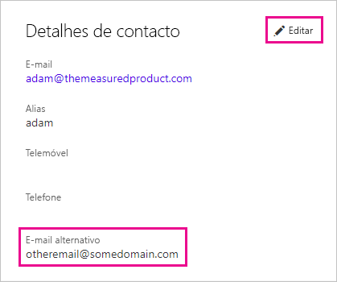

# <a name="using-an-alternate-email-address"></a>Utilizar um Endereço de E-mail alternativo
Por predefinição, o endereço de e-mail utilizado na inscrição no Power BI é usado para enviar atualizações sobre a atividade no Power BI.  Por exemplo, um convite de partilha é enviado para este endereço.

Por vezes, pode querer que estes e-mails sejam entregues num endereço de e-mail alternativo em vez do utilizado originalmente para se inscrever no Power BI.

## <a name="updating-through-office-365-personal-info-page"></a>Atualizar através da página de informações pessoais do Office 365
1. Aceda à sua [página de informações pessoais do Office 365](https://portal.office.com/account/#personalinfo).  Se lhe for pedido, inicie sessão com o endereço de e-mail e a palavra-passe que utiliza no Power BI.
2. Clique na ligação de edição na secção Detalhes de contacto.  
   
   > [!NOTE]
   > Se não vir uma ligação Editar, significa que o endereço de e-mail é gerido pelo administrador do Office 365 e tem de contactá-lo para atualizar o seu endereço de e-mail.
   > 
   > 
   
   
3. No campo E-mail Alternativo, introduza o endereço de e-mail para o qual quer que sejam enviadas as atualizações do Power BI.

> [!NOTE]
> A alteração desta definição não afetará o endereço de e-mail utilizado para enviar atualizações do serviço, newsletters e outras comunicações promocionais.  Estas serão sempre enviadas para o endereço de e-mail utilizado originalmente no registo no Power BI.
> 
> 

## <a name="updating-through-azure-active-directory"></a>Atualizar através do Azure Active Directory
Ao capturar um token incorporado do Active Azure Directory (AAD) para o Power BI, pode utilizar três tipos de e-mails diferentes. Os três tipos diferentes são:

* O endereço de e-mail principal associado à conta do AAD de um utilizador
* O endereço de e-mail UPN (UserPrincipalName)
* O atributo de matriz "outro" do endereço de e-mail

O Power BI seleciona o endereço de e-mail a utilizar com base nos seguintes critérios:
1.  Se o atributo de correio estiver presente no objeto de utilizador do AAD, o Power BI irá utilizar esse atributo de correio para o endereço de e-mail
2.  Se o e-mail UPN *não* for um endereço de e-mail com o domínio **\*.onmicrosoft.com** (a informação apresentada após o símbolo "\@"), o Power BI irá utilizar esse atributo de correio para o endereço de e-mail
3.  Se o atributo de matriz de e-mail "outro" estiver presente no objeto de utilizador do AAD, o primeiro e-mail que surgir nessa lista (dado que pode existir uma lista de e-mails neste atributo) será utilizado
4. Caso não se verifique nenhuma das condições mencionadas acima, será utilizado o endereço UPN

## <a name="updating-with-powershell"></a>Atualizar com o PowerShell
Em alternativa, pode atualizar o endereço de e-mail alternativo através do PowerShell para o Azure Active Directory. Deve fazê-lo com o comando [Set-AzureADUser](https://docs.microsoft.com/powershell/module/azuread/set-azureaduser).

```
Set-AzureADUser -ObjectId john@contoso.com -OtherMails "otheremail@somedomain.com"
```

Para obter mais informações, consulte [Azure Active Directory PowerShell Versão 2](https://docs.microsoft.com/powershell/azure/active-directory/install-adv2).

Mais perguntas? [Pergunte à Comunidade do Power BI](http://community.powerbi.com/)

