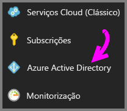
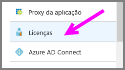
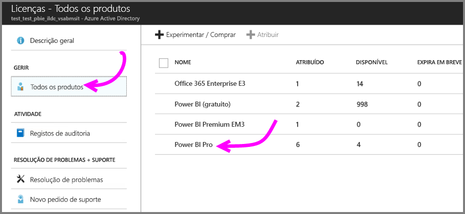
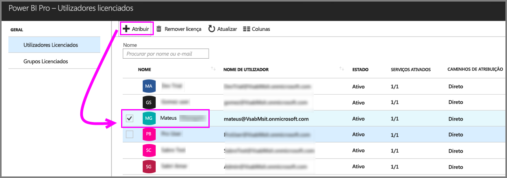

# Início Rápido: atribuir licenças do Power BI Pro no Azure

O Power BI Pro é uma licença individual que permite o acesso a todos os conteúdos e capacidades no serviço Power BI, incluindo a capacidade de partilhar conteúdo e colaborar com outros utilizadores Pro. Apenas os utilizadores Pro podem publicar e consumir conteúdo a partir de áreas de trabalho de aplicações, partilhar dashboards e subscrever dashboards e relatórios. Este artigo explica como atribuir licenças Power BI Pro no Azure. Também pode [atribuir licenças no Office 365](service-admin-assigning-power-bi-pro-licenses.md).

## Pré-requisitos

Tem de ser um proprietário da subscrição do Azure que o Power BI utiliza para pesquisas do Active Directory.

Tem de [comprar pelo menos uma licença](service-admin-purchasing-power-bi-pro.md) antes de começar.

## Atribuir licenças a contas de utilizador individuais

Siga estes passos para atribuir licenças do Power BI Pro a contas de utilizador individuais:

1. Abra o [portal do Azure](https://ms.portal.azure.com/#@microsoft.onmicrosoft.com/dashboard/private/39bc3cf7-31a4-43f6-954c-f2d69ca2f0). 

2. Na barra de navegação esquerda, selecione **Azure Active Directory**.

    

3. Em **Azure Active Directory**, selecione **Licenças**.

    

4. Em **Licenças**, clique em **Todos os produtos** e, em seguida, selecione **Power BI Pro** para apresentar a lista de utilizadores com licenças.

    

5. Selecione **Atribuir** para adicionar uma licença do Power BI Pro a uma conta de utilizador adicional.

    

## Próximos passos

Agora que já atribuiu licenças, saiba mais sobre o Power BI Pro.

[Power BI Pro in your organization](service-admin-power-bi-pro-in-your-organization.md) (Power BI Pro na sua organização)

[Encontrar utilizadores do Power BI que iniciaram sessão](service-admin-access-usage.md)

Mais perguntas? [Experimente perguntar à Comunidade do Power BI](https://community.powerbi.com/)