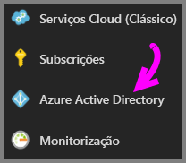
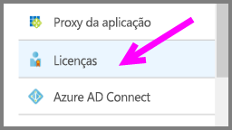
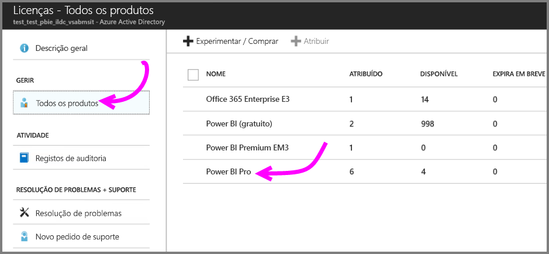
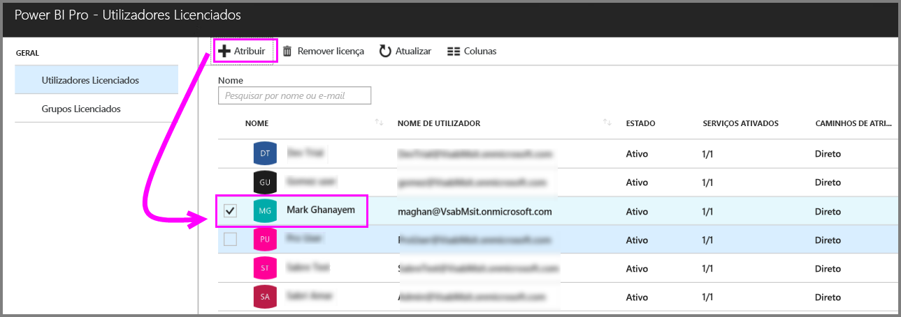
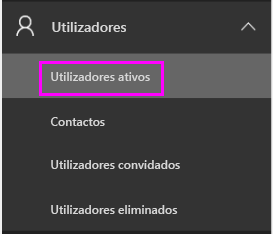
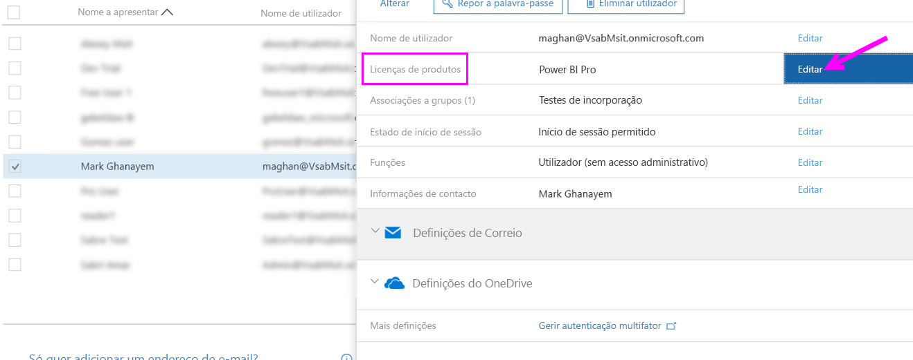
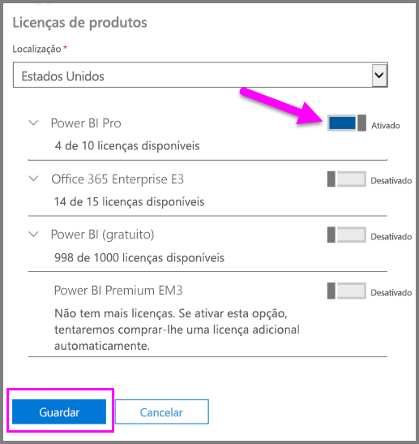
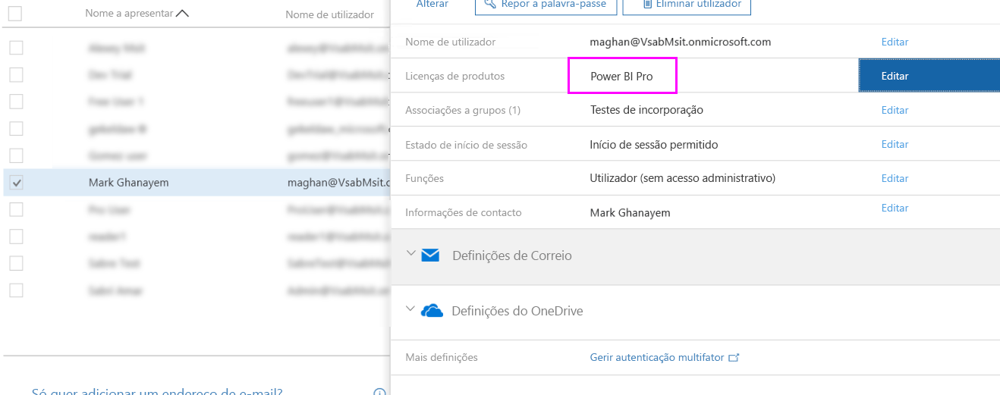

# Atribuir licenças do Power BI Pro

Os administradores podem escolher a partir de vários portais de gestão e cmdlets do PowerShell para atribuírem licenças do Power BI Pro a utilizadores. A gestão de licenças do Power BI é apoiada pelo Azure Active Directory (Azure AD).

* Os proprietários de subscrições do Azure podem utilizar o painel Azure Active Directory no [Portal do Azure](https://ms.portal.azure.com/#@microsoft.onmicrosoft.com/dashboard/private/39bc3cf7-31a4-43f6-954c-f2d69ca2f0). 

* Os administradores globais e os administradores de contas de utilizador podem utilizar o [Centro de Administração do Office 365](https://portal.office.com/AdminPortal/Home#/homepage).

## Gerir licenças do Power BI Pro no Portal do Azure

O Power BI utiliza o Azure AD como um serviço fundamental. O Azure AD armazena contas e grupos de utilizador, assim como outras definições, tais como informações sobre os produtos adquiridos.

### Atribuir licenças a contas de utilizador individuais

Se for o proprietário de uma subscrição do Azure, siga estes passos para atribuir licenças do Power BI Pro a contas de utilizador individuais:

1. Navegue até ao [Portal do Azure](https://ms.portal.azure.com/#@microsoft.onmicrosoft.com/dashboard/private/39bc3cf7-31a4-43f6-954c-f2d69ca2f0). 

2. Na barra de navegação esquerda, clique em Azure Active Directory.

    

3. No painel Azure Active Directory, clique em Licenças.

    

4. No painel Licenças, clique em Todos os produtos e, em seguida, clique em Power BI Pro para apresentar a lista de utilizadores com licenças.

    

5. Clique em Atribuir para adicionar uma licença do Power BI Pro a uma conta de utilizador adicional.

    

> [!NOTE]
> Embora possa gerir a maioria dos aspetos de licenciamento, não é possível comprar licenças do Power BI Pro no Portal do Azure. Utilize o Centro de Administração do Office 365 para comprar uma subscrição do Power BI Pro. Para obter mais informações, veja [Purchasing Power BI Pro (Comprar o Power BI Pro)](https://docs.microsoft.com/en-us/power-bi/service-admin-purchasing-power-bi-pro).
>

## Gerir licenças do Power BI Pro no Centro de Administração do Office 365

Se for um administrador global, então o Centro de Administração do Office 365 é o local onde irá comprar uma subscrição do Power BI Pro e gerir as licenças associadas para a sua organização.

Se for um administrador do Office 365, siga estes passos para atribuir licenças do Power BI Pro a contas de utilizador individuais:

1. Navegue até ao centro de administração do Office 365.

2. No painel de navegação à esquerda, expanda Utilizadores e, em seguida, clique em Utilizadores ativos.

    

3. Selecione um ou múltiplos utilizadores e, em seguida, clique em Editar relativo a Licenças de produtos.

    

4. Em Power BI Pro, altere a definição para Ativado e clique em Guardar.

    

5. Para as contas selecionadas, verifique em Estado se a licença do Power BI Pro foi atribuída com êxito.

    

> [!NOTE]
> Se a sua subscrição ficar sem licenças, adicione mais ao expandir Faturação no painel de navegação à esquerda e, em seguida, clique em Subscrições. Na página Subscrições, selecione a subscrição do Power BI Pro e, em seguida, clique em Adicionar/Remover licenças.
>

## Próximos passos
[Power BI Pro in your organization](service-admin-power-bi-pro-in-your-organization.md) (Power BI Pro na sua organização)
 
[Ativação da Versão de Avaliação Pro alargada](service-extended-pro-trial.md)
 
[Contrato de serviço do Power BI para utilizadores individuais](https://powerbi.microsoft.com/terms-of-service/)
 
[Anúncio do Power BI Premium](https://aka.ms/pbipremium-announcement)
 
[Encontrar utilizadores do Power BI que iniciaram sessão](service-admin-access-usage.md)

Mais perguntas? [Experimente perguntar à Comunidade do Power BI](https://community.powerbi.com/)