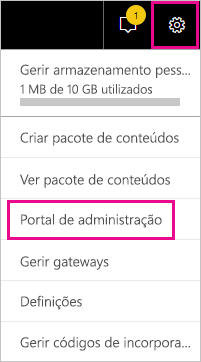
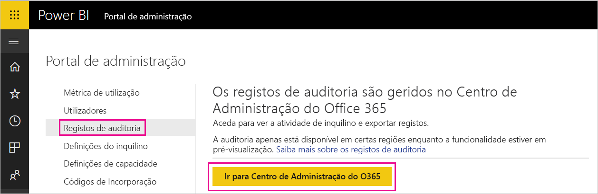
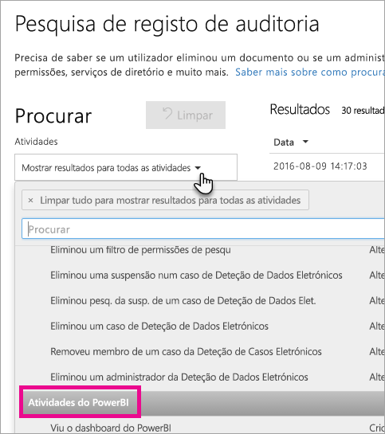
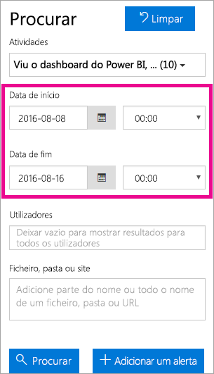
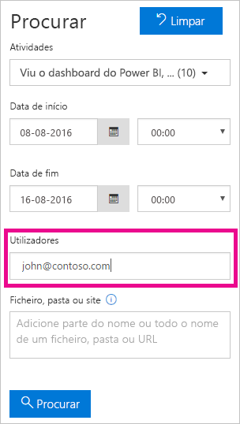
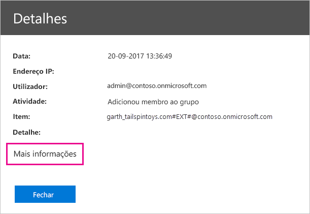
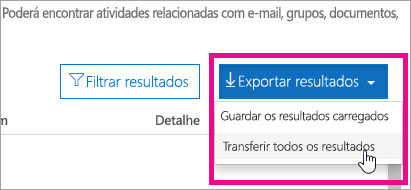

# <a name="use-auditing-within-your-organization"></a>Utilizar a auditoria na sua organização

Saber quem está a realizar ações em que item no inquilino Power BI pode ser fundamental para ajudar a sua organização a satisfazer os requisitos, como a conformidade regulamentar e a gestão de registos. Utilize as auditorias do Power BI para auditar ações efetuadas por utilizadores, como “Ver Relatório” e “Ver Dashboard”. Não pode utilizar a auditoria para auditar permissões.

Vai trabalhar com a auditoria no Centro de Conformidade e Segurança do Office 365 ou utilizar o PowerShell. A auditoria depende da funcionalidade no Exchange Online, que é aprovisionada automaticamente para suportar o Power BI.

Pode filtrar os dados de auditoria por intervalo de datas, utilizador, dashboard, tipo de relatório, conjunto de dados e tipo de atividade. Também pode transferir as atividades num ficheiro csv (valores separados por vírgulas) para analisar offline.

## <a name="requirements"></a>Requirements

Tem de cumprir estes requisitos para aceder aos registos de auditoria:

* Para aceder ao registo de auditoria, tem de ser administrador global ou ter a função Registos de Auditoria ou Ver Apenas Registos de Auditoria no Exchange Online. Por predefinição, os grupos de funções de Gestão de Conformidade e Gestão da Organização têm estas funções atribuídas na página **Permissões** do centro de administração do Exchange.

    Para dar acesso a contas de utilizadores não administradores ao registo de auditoria, tem de adicionar esses utilizadores como membros de um daqueles grupos de funções. Se quiser fazê-lo de outra forma, pode criar um grupo de funções personalizado no centro de administração do Exchange, atribuir a função Registos de Auditoria ou Ver Apenas Registos de Auditoria ao mesmo e, depois, adicionar a conta do utilizador não administrador ao grupo novo. Para obter mais informações, veja [Manage role groups in Exchange Online](/Exchange/permissions-exo/role-groups) (Gerir grupos de funções no Exchange Online).

    Se não conseguir aceder ao centro de administração do Exchange a partir do centro de administração do Microsoft 365, aceda a https://outlook.office365.com/ecp e inicie sessão com as suas credenciais.

* Se tiver acesso ao registo de auditoria, mas não for um administrador global ou um administrador de Serviço do Power BI, não terá acesso ao portal de Administrador do Power BI. Neste caso, tem de utilizar uma ligação direta para o [Centro de Conformidade e Segurança do Office 365](https://sip.protection.office.com/#/unifiedauditlog).

## <a name="access-your-audit-logs"></a>Aceder aos seus registos de auditoria

Para aceder aos registos, confirme primeiro que ativa o registo no Power BI. Para obter mais informações, veja [Registos de auditoria](service-admin-portal.md#audit-logs) na documentação do portal de administração. Pode existir um intervalo de 48 horas entre a altura em que ativa a auditoria e o momento em que pode ver os dados de auditoria. Se não vir logo os seus dados, consulte os registos de auditoria mais tarde. Pode existir um intervalo de tempo semelhante entre obter a permissão para ver os registos de auditoria e ter acesso aos mesmos.

Os registos de auditoria do Power BI estão disponíveis diretamente através do [Centro de Conformidade e Segurança do Office 365](https://sip.protection.office.com/#/unifiedauditlog). Também existe uma ligação no portal de administração do Power BI:

1. No Power BI, selecione o **ícone de engrenagem** no canto superior direito e, em seguida, selecione **Portal de administração**.

   

1. Selecione **Registos de auditoria**.

1. Selecione **Aceder ao Centro de Administração do Office 365**.

   

## <a name="search-only-power-bi-activities"></a>Procurar apenas atividades do Power BI

Restrinja os resultados só para atividades do Power BI. Para tal, siga estes passos. Para obter uma lista de atividades, veja a [lista de atividades auditadas pelo Power BI](#activities-audited-by-power-bi) mais adiante neste artigo.

1. Na página **Pesquisa de registo de auditoria**, em **Pesquisa**, selecione a lista pendente de **Atividades**.

2. Selecione **Atividades do Power BI**.

   

3. Selecione em qualquer lugar fora da caixa de seleção para fechá-lo.

As suas pesquisas apenas vão devolver atividades do Power BI.

## <a name="search-the-audit-logs-by-date"></a>Procurar os registos de auditoria por data

Pode procurar os registos por intervalo de datas com o campo **Data de início** e **Data de fim**. A seleção predefinida é os últimos sete dias. O ecrã apresenta a data e hora no formato Hora Universal Coordenada (UTC). O intervalo de data máximo que pode especificar é 90 dias. 

Receberá um erro se o intervalo de datas selecionadas for superior a 90 dias. Se estiver a utilizar o intervalo de datas máximo de 90 dias, selecione a hora atual para a **Data de início**. Caso contrário, vai receber uma mensagem de erro a informar que a data de início é anterior à data de fim. Se tiver ativado a auditoria para os últimos 90 dias, não poderá iniciar o intervalo de datas antes da data de auditoria ser ativada.



## <a name="search-the-audit-logs-by-users"></a>Procurar os registos de auditoria por utilizador

Pode procurar entradas de registo de auditoria relativas a atividades efetuadas por utilizadores específicos. Introduza um ou mais nomes de utilizador no campo **Utilizadores**. O nome do utilizador tem o aspeto de um endereço de e-mail. É a conta com a qual os utilizadores iniciam sessão no Power BI. Deixe esta caixa em branco para apresentar as entradas de todos os utilizadores (e as contas de serviço) na sua organização.



## <a name="view-search-results"></a>Ver resultados da pesquisa

Depois de selecionar **Pesquisar**, os resultados da pesquisa são carregados. Após alguns instantes, são apresentados em **Resultados**. Quando a pesquisa terminar, o ecrã apresenta o número de resultados encontrado. A **Pesquisa de registo de auditoria** apresenta um máximo de 1000 eventos. Se mais de 1000 eventos cumprirem os critérios de pesquisa, a aplicação apresenta os 1000 eventos mais recentes.

### <a name="view-the-main-results"></a>Ver os resultados principais

A área **Resultados** tem as seguintes informações para cada evento devolvido pela pesquisa. Selecione um cabeçalho de coluna em **Resultados** para ordenar os resultados.

| **Coluna** | **Definição** |
| --- | --- |
| Data |A data e a hora (no formato UTC) em que ocorreu o evento. |
| Endereço IP |O endereço IP do dispositivo usado para a atividade registada. A aplicação apresenta o endereço IP no formato de endereço IPv4 ou IPv6. |
| Utilizador |O utilizador (ou a conta de serviço) que efetuou a ação que, por sua vez, acionou o evento. |
| Atividade |A atividade efetuada pelo utilizador. Este valor corresponde às atividades que selecionou na lista pendente **Atividades**. Para um evento do registo de auditoria de administrador do Exchange, o valor nesta coluna é um cmdlet do Exchange. |
| Item |O objeto criado ou modificado devido à atividade correspondente. Por exemplo, o ficheiro visto ou modificado, ou a conta de utilizador atualizada. Nem todas as atividades têm um valor nesta coluna. |
| Detalhe |Detalhe adicional sobre uma atividade. Nem todas as atividades têm um valor. |

### <a name="view-the-details-for-an-event"></a>Ver os detalhes de um evento

Para ver mais detalhes sobre um evento, selecione o registo de eventos na lista de resultados da pesquisa. Aparece uma página **Detalhes** que contém as propriedades detalhadas do registo de eventos. A página **Detalhes** apresenta propriedades consoante o serviço do Office 365 em que decorre o evento.

Para apresentar estes detalhes, selecione **Mais informações**. Todas as entradas do Power BI têm um valor de 20 para a propriedade RecordType. Para obter informações acerca de outras propriedades, veja [Propriedades detalhadas no registo de auditoria](/office365/securitycompliance/detailed-properties-in-the-office-365-audit-log/).

   

## <a name="export-search-results"></a>Exportar resultados da pesquisa

Para exportar o registo de auditoria do Power BI para um ficheiro CSV, siga estes passos.

1. Selecione **Exportar resultados**.

1. Selecione **Guardar resultados carregados** ou **Transferir todos os resultados**.

    

## <a name="use-powershell-to-search-audit-logs"></a>Utilize o PowerShell para pesquisar registos de auditoria

Também pode utilizar o PowerShell para aceder aos registos de auditoria com base no início de sessão. O exemplo seguinte mostra como ligar ao PowerShell do Exchange Online e utilizar, depois, o comando [Search-UnifiedAuditLog](/powershell/module/exchange/policy-and-compliance-audit/search-unifiedauditlog?view=exchange-ps/) para obter entradas do registo de auditoria do Power BI. Para executar o script, um administrador tem de atribuir-lhe as permissões adequadas, conforme descrito na secção [Requisitos](#requirements).

```powershell
Set-ExecutionPolicy RemoteSigned

$UserCredential = Get-Credential

$Session = New-PSSession -ConfigurationName Microsoft.Exchange -ConnectionUri https://outlook.office365.com/powershell-liveid/ -Credential $UserCredential -Authentication Basic -AllowRedirection

Import-PSSession $Session
Search-UnifiedAuditLog -StartDate 9/11/2018 -EndDate 9/15/2018 -RecordType PowerBI -ResultSize 1000 | Format-Table | More
```

## <a name="use-powershell-to-export-audit-logs"></a>Utilizar o PowerShell para exportar registos de auditoria

Também pode utilizar o PowerShell para exportar os resultados da sua pesquisa de registos de auditoria. O exemplo seguinte mostra como enviar a partir do comando [Search-UnifiedAuditLog](/powershell/module/exchange/policy-and-compliance-audit/search-unifiedauditlog?view=exchange-ps/) e exportar os resultados através do cmdlet [Export-Csv](/powershell/module/microsoft.powershell.utility/export-csv). Para executar o script, um administrador tem de atribuir-lhe as permissões adequadas, conforme descrito na secção [Requisitos](#requirements).

```powershell
$UserCredential = Get-Credential

$Session = New-PSSession -ConfigurationName Microsoft.Exchange -ConnectionUri https://outlook.office365.com/powershell-liveid/ -Credential $UserCredential -Authentication Basic -AllowRedirection

Import-PSSession $Session
Search-UnifiedAuditLog -StartDate 9/11/2019 -EndDate 9/15/2019 -RecordType PowerBI -ResultSize 5000 |
Export-Csv -Path "c:\temp\PowerBIAuditLog.csv" -NoTypeInformation

Remove-PSSession $Session
```

Para obter mais informações sobre a ligação ao Exchange Online, consulte [Ligar ao PowerShell do Exchange Online](/powershell/exchange/exchange-online/connect-to-exchange-online-powershell/connect-to-exchange-online-powershell/). Para obter outro exemplo de utilização do PowerShell com registos de auditoria, veja [Using Power BI audit log and PowerShell to assign Power BI Pro licenses](https://powerbi.microsoft.com/blog/using-power-bi-audit-log-and-powershell-to-assign-power-bi-pro-licenses/) (Utilizar o registo de auditoria do Power BI e o PowerShell para atribuir licenças do Power BI Pro).

## <a name="activities-audited-by-power-bi"></a>Atividades auditadas pelo Power BI

As seguintes atividades são auditadas pelo Power BI:

| Nome amigável                                     | Nome da operação                              | Notas                                  |
|---------------------------------------------------|---------------------------------------------|------------------------------------------|
| Origem de dados adicionada ao gateway do Power BI             | AddDatasourceToGateway                      |                                          |
| Acesso à pasta do Power BI adicionado                      | AddFolderAccess                             | Não é atualmente utilizado                       |
| Membros do grupo do Power BI adicionados                      | AddGroupMembers                             |                                          |
| Conta de armazenamento do fluxo de dados anexada ao inquilino pelo administrador | AdminAttachedDataflowStorageAccountToTenant | Não é atualmente utilizado                       |
| Conjunto de dados analisado do Power BI                         | AnalyzedByExternalApplication               |                                          |
| Relatório do Power BI analisado                          | AnalyzeInExcel                              |                                          |
| Conta de armazenamento do fluxo de dados anexada                 | AttachedDataflowStorageAccount              |                                          |
| Conjunto de dados do Power BI vinculado ao gateway                | BindToGateway                               |                                          |
| Atualização do fluxo de dados cancelada                        | CancelDataflowRefresh                       |                                          |
| Estado de capacidade alterado                            | ChangeCapacityState                         |                                          |
| Atribuição de utilizador da capacidade alterada                  | UpdateCapacityUsersAssignment               |                                          |
| Ligações de dados do Power BI alteradas              | SetAllConnections                           |                                          |
| Administradores do gateway do Power BI alterados                   | ChangeGatewayAdministrators                 |                                          |
| Utilizadores da origem de dados do gateway do Power BI alterados        | ChangeGatewayDatasourceUsers                |                                          |
| Pacote de conteúdos organizacional do Power BI criado      | CreateOrgApp                                |                                          |
| Aplicação do Power BI criada                              | CreateApp                                   |                                          |
| Dashboard do Power BI criado                        | CreateDashboard                             |                                          |
| Fluxo de dados do Power BI criado                         | CreateDataflow                              |                                          |
| Conjunto de dados do Power BI criado                          | CreateDataset                               |                                          |
| Subscrição de e-mail do Power BI criada               | CreateEmailSubscription                     |                                          |
| Pasta do Power BI criada                           | CreateFolder                                |                                          |
| Gateway do Power BI criado                          | CreateGateway                               |                                          |
| Grupo do Power BI criado                            | CreateGroup                                 |                                          |
| Relatório do Power BI criado                           | CreateReport                                |                                          |
| Fluxo de dados migrado para a conta de armazenamento externa     | DataflowMigratedToExternalStorageAccount    | Não é atualmente utilizado                       |
| Permissões do fluxo de dados adicionadas                        | DataflowPermissionsAdded                    | Não é atualmente utilizado                       |
| Permissões do fluxo de dados removidas                      | DataflowPermissionsRemoved                  | Não é atualmente utilizado                       |
| Pacote de conteúdos organizacional do Power BI criado      | DeleteOrgApp                                |                                          |
| Comentário do Power BI eliminado                          | DeleteComment                               |                                          |
| Dashboard do Power BI eliminado                        | DeleteDashboard                             | Não é atualmente utilizado                       |
| Fluxo de dados do Power BI eliminado                         | DeleteDataflow                              | Não é atualmente utilizado                       |
| Conjunto de dados do Power BI eliminado                          | DeleteDataset                               |                                          |
| Subscrição de e-mail do Power BI eliminada               | DeleteEmailSubscription                     |                                          |
| Pasta do Power BI eliminada                           | DeleteFolder                                |                                          |
| Acesso à pasta do Power BI eliminado                    | DeleteFolderAccess                          | Não é atualmente utilizado                       |
| Gateway do Power BI eliminado                          | DeleteGateway                               |                                          |
| Grupo do Power BI eliminado                            | DeleteGroup                                 |                                          |
| Relatório do Power BI eliminado                           | DeleteReport                                |                                          |
| Origens de dados do conjunto de dados do Power BI detetadas          | GetDatasources                              |                                          |
| Relatório do Power BI transferido                        | DownloadReport                              |                                          |
| Propriedades do fluxo de dados editadas                        | EditDataflowProperties                      |                                          |
| Permissão de certificação do Power BI editada          | EditCertificationPermission                 | Não é atualmente utilizado                       |
| Dashboard do Power BI editado                         | EditDashboard                               | Não é atualmente utilizado                       |
| Conjunto de dados do Power BI editado                           | EditDataset                                 |                                          |
| Propriedades do conjunto de dados do Power BI editadas                | EditDatasetProperties                       | Não é atualmente utilizado                       |
| Relatório do Power BI editado                            | EditReport                                  |                                          |
| Fluxo de dados do Power BI exportado                        | ExportDataflow                              |                                          |
| Dados visuais do relatório do Power BI exportados              | ExportReport                                |                                          |
| Dados do mosaico do Power BI exportados                       | ExportTile                                  |                                          |
| Falha ao adicionar permissões de fluxo de dados                | FailedToAddDataflowPermissions              | Não é atualmente utilizado                       |
| Falha ao remover permissões de fluxo de dados             | FailedToRemoveDataflowPermissions           | Não é atualmente utilizado                       |
| Token de SAS de fluxo de dados do Power BI gerado             | GenerateDataflowSasToken                    |                                          |
| Token de Incorporação do Power BI gerado                    | GenerateEmbedToken                          |                                          |
| Ficheiro importado para o Power BI                         | Importar                                      |                                          |
| Aplicação do Power BI instalada                            | InstallApp                                  |                                          |
| Área de trabalho migrada para uma capacidade                  | MigrateWorkspaceIntoCapacity                |                                          |
| Comentário do Power BI publicado                           | PostComment                                 |                                          |
| Dashboard do Power BI impresso                        | PrintDashboard                              |                                          |
| Página de relatório do Power BI impressa                      | PrintReport                                 |                                          |
| Relatório do Power BI publicado na Web                  | PublishToWebReport                          |                                          |
| Segredo do fluxo de dados do Power BI recebido do Key Vault  | ReceiveDataflowSecretFromKeyVault           |                                          |
| Origem de dados removida do gateway do Power BI         | RemoveDatasourceFromGateway                 |                                          |
| Membros do grupo do Power BI removidos                    | DeleteGroupMembers                          |                                          |
| Área de trabalho removida de uma capacidade                 | RemoveWorkspacesFromCapacity                |                                          |
| Nome de dashboard do Power BI mudado                        | RenameDashboard                             |                                          |
| Atualização do fluxo de dados do Power BI pedida               | RequestDataflowRefresh                      | Não é atualmente utilizado                       |
| Atualização do conjunto de dados do Power BI pedida                | RefreshDataset                              |                                          |
| Áreas de trabalho do Power BI obtidas                     | GetWorkspaces                               |                                          |
| Definir o local de armazenamento do fluxo de dados para uma área de trabalho     | SetDataflowStorageLocationForWorkspace      |                                          |
| Configurar atualização agendada no fluxo de dados do Power BI        | SetScheduledRefreshOnDataflow               |                                          |
| Atualização agendada do conjunto de dados do Power BI configurada         | SetScheduledRefresh                         |                                          |
| Dashboard do Power BI partilhado                         | ShareDashboard                              |                                          |
| Relatório do Power BI partilhado                            | ShareReport                                 |                                          |
| Avaliação expandida do Power BI iniciada                   | OptInForExtendedProTrial                    | Não é atualmente utilizado                       |
| Versão de avaliação do Power BI iniciada                            | OptInForProTrial                            |                                          |
| Controlou uma origem de dados do Power BI                   | TakeOverDatasource                          |                                          |
| Controlou um conjunto de dados do Power BI                        | TakeOverDataset                             |                                          |
| Controlou um fluxo de dados do Power BI                     | TookOverDataflow                             |                                          |
| Aplicação do Power BI não publicada                          | UnpublishApp                                |                                          |
| Atualizar definições de governação do recurso da capacidade      | UpdateCapacityResourceGovernanceSettings    | Não está atualmente no centro de administração do Microsoft 365 |
| Administrador de capacidade atualizado                            | UpdateCapacityAdmins                        |                                          |
| Nome a apresentar da capacidade atualizado                     | UpdateCapacityDisplayName                   |                                          |
| Permissões de atribuição de armazenamento do fluxo de dados atualizadas   | UpdatedDataflowStorageAssignmentPermissions |                                          |
| Definições do Power BI da organização atualizadas          | UpdatedAdminFeatureSwitch                   |                                          |
| Aplicação do Power BI atualizada                              | UpdateApp                                   |                                          |
| Fluxo de dados do Power BI atualizado                         | UpdateDataflow                              |                                          |
| Origens de dados do conjunto de dados do Power BI atualizadas             | UpdateDatasources                           |                                          |
| Parâmetros do conjunto de dados do Power BI atualizados               | UpdateDatasetParameters                     |                                          |
| Subscrição de e-mail do Power BI atualizada               | UpdateEmailSubscription                     |                                          |
| Pasta do Power BI atualizada                           | UpdateFolder                                |                                          |
| Acesso à pasta do Power BI atualizado                    | UpdateFolderAccess                          |                                          |
| Credenciais da origem de dados do gateway do Power BI atualizadas  | UpdateDatasourceCredentials                 |                                          |
| Dashboard do Power BI visualizado                         | ViewDashboard                               |                                          |
| Fluxo de dados do Power BI visualizado                          | ViewDataflow                                |                                          |
| Relatório do Power BI visualizado                            | ViewReport                                  |                                          |
| Mosaico do Power BI visualizado                              | ViewTile                                    |                                          |
| Métricas de utilização do Power BI visualizadas                     | ViewUsageMetrics                            |                                          |
|                                                   |                                             |                                          |

## <a name="next-steps"></a>Próximos passos

[O que é a administração do Power BI?](service-admin-administering-power-bi-in-your-organization.md)  

[Portal de Administração do Power BI](service-admin-portal.md)  

Mais perguntas? [Experimente perguntar à Comunidade do Power BI](https://community.powerbi.com/)
