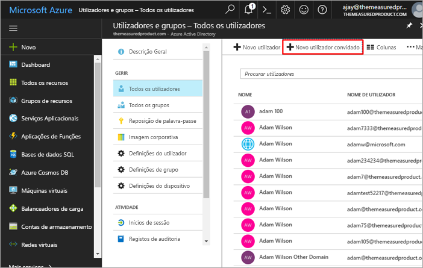
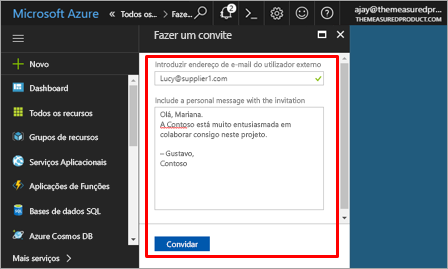
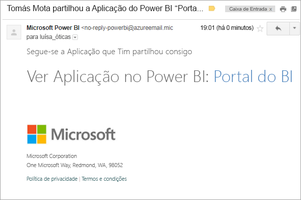
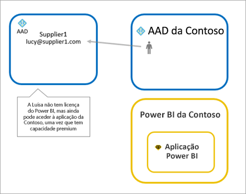
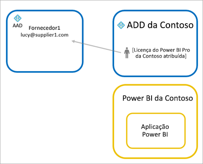
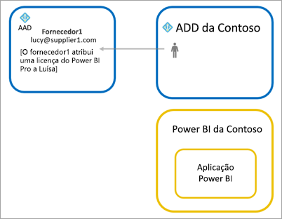

# Distribuir conteúdos do Power BI para utilizadores convidados externos com o Azure AD B2B

O Power BI integra-se no Azure Active Directory business-to-business (Azure AD B2B) para permitir uma distribuição segura de conteúdos do Power BI para utilizadores convidados fora da sua organização, enquanto mantém o controlo sobre os dados internos.

## Ativar acesso

Confirme que a funcionalidade [definições de exportação e partilha](service-admin-portal.md#export-and-sharing-settings) está ativada no portal de administração do Power BI antes de enviar convites para utilizadores convidados.

## Quem pode convidar?

Pode enviar convites para utilizadores convidados com qualquer endereço de e-mail, incluindo contas pessoais, como gmail.com, outlook.com ou hotmail.com. No Azure AD B2B, estes endereços são denominados *identidades sociais*.

## Convidar utilizadores

Os convites só são necessários da primeira vez que um utilizador convidado externo for convidado para a sua organização. Existem duas formas de convidar utilizadores: convites planeados e convites ad hoc.

### Convites planeados

Utilize um convite planeado caso saiba quais os utilizadores a convidar. Pode enviar o convite através do portal do Azure ou do PowerShell. Tem de ser um administrador de inquilinos para convidar pessoas.

Siga estes passos para enviar um convite no portal do Azure.

1. No [portal do Azure](https://portal.azure.com), selecione **Azure Active Directory**.

1. Em **Gerir**, aceda a **Utilizadores** > **Todos os utilizadores** > **Novo utilizador convidado**.

    

1. Introduza um **endereço de e-mail** e uma **mensagem pessoal**.

    

1. Selecione **Convidar**.

Para convidar mais do que um utilizador convidado, utilize o PowerShell. Para obter mais informações, veja [Exemplos do PowerShell e de código de colaboração do Azure AD B2B](/azure/active-directory/b2b/code-samples/).

O utilizador convidado tem de selecionar **Começar** no convite por e-mail que receber. Ao fazê-lo, o utilizador convidado é adicionado ao inquilino.

### Convites ad-hoc

Para enviar um convite em qualquer altura, adicione o utilizador externo ao seu dashboard ou relatório através da IU de partilha ou à sua aplicação através da página de acesso. Eis um exemplo do que deve fazer ao convidar um utilizador externo para utilizar uma aplicação.

O utilizador convidado receberá um e-mail a indicar que a aplicação foi partilhada com ele.

O utilizador convidado terá de iniciar sessão com o respetivo endereço de e-mail da organização. Ser-lhe-á pedido que aceite o convite após iniciar sessão. Após iniciar sessão, o utilizador convidado é redirecionado para o conteúdo da aplicação. Para regressar à aplicação, o utilizador convidado adicionar a ligação aos marcadores ou guardar o e-mail.

## Licensing

O utilizador convidado tem de ter as devidas licenças para ver a aplicação que foi partilhada. Existem três opções para o efeito: utilizar o Power BI Premium; atribuir uma licença do Power BI Pro; ou utilizar a licença do Power BI Pro do convidado.

### Utilizar o Power BI Premium

Atribuir a área de trabalho de aplicação à [capacidade Premium do Power BI](service-premium.md) permite que o utilizador convidado utilize a aplicação sem precisar de uma licença do Power BI Pro. O Power BI Premium também permite que as aplicações tirem partido de outras capacidades, como um aumento nas taxas de atualização, capacidade dedicada e tamanhos de modelos grandes.

### Atribuir uma licença do Power BI Pro ao utilizador convidado

Atribuir uma licença do Power BI Pro ao utilizador convidado, no seu inquilino, permite que esse utilizador convidado veja o conteúdo no inquilino.

### O utilizador convidado traz a sua própria licença do Power BI Pro

O utilizador convidado já tem uma licença do Power BI Pro atribuída no respetivo inquilino.

## Considerações e Limitações

* Os convidados B2B externos estão limitados apenas ao consumo de conteúdos. Os convidados B2B externos podem ver aplicações, dashboards, relatórios, exportar dados e criar subscrições de e-mail para dashboards e relatórios. Não podem aceder a áreas de trabalho nem publicar os seus próprios conteúdos.

* Esta funcionalidade não está atualmente disponível com as aplicações móveis do Power BI. Num dispositivo móvel, poderá ver o conteúdo partilhado do Power BI com o Azure AD B2B num browser.

* Esta funcionalidade não está atualmente disponível com a peça Web de relatórios do Power BI para SharePoint Online.

## Próximos passos

Para obter informações mais detalhadas, incluindo sobre o funcionamento da segurança ao nível de linha, veja o documento técnico: [Distribute Power BI content to external guest users using Azure AD B2B](https://aka.ms/powerbi-b2b-whitepaper) (Distribuir conteúdos do Power BI para utilizadores convidados externos com o Azure AD B2B).

Para obter informações relativas ao Azure AD B2B, veja [O que é a colaboração do Azure AD B2B?](/azure/active-directory/active-directory-b2b-what-is-azure-ad-b2b/).
