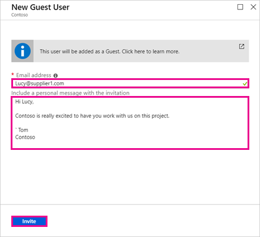
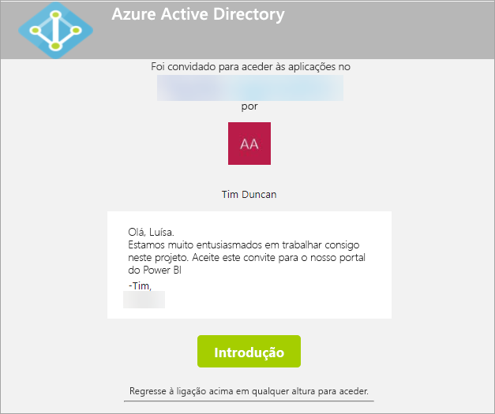
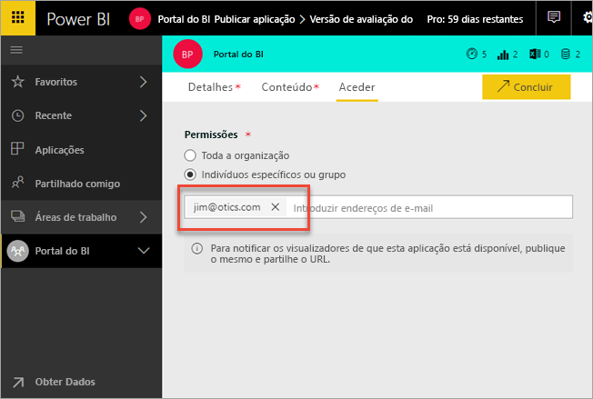
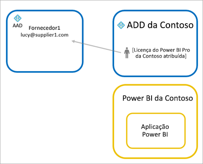
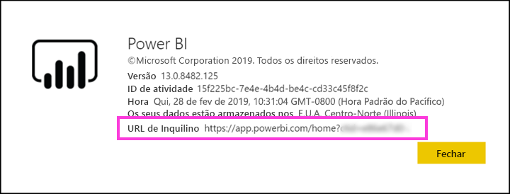

# Distribuir conteúdos do Power BI para utilizadores convidados externos com o Azure AD B2B

O Power BI integra-se no Azure Active Directory business-to-business (Azure AD B2B) para permitir uma distribuição segura de conteúdos do Power BI para utilizadores convidados fora da sua organização, enquanto mantém o controlo sobre os dados internos.  

Além disso, pode permitir que os utilizadores convidados fora da sua organização editem e façam a gestão de conteúdos na sua organização.

## Ativar acesso

Assegure-se de que ativa a funcionalidade [Partilhar conteúdo com utilizadores externos](service-admin-portal.md#export-and-sharing-settings) no portal de administração do Power BI antes de enviar convites para utilizadores.

Também pode utilizar a funcionalidade [Permitir aos utilizadores externos convidados editarem e gerirem conteúdo na organização](service-admin-portal.md#allow-external-guest-users-to-edit-and-manage-content-in-the-organization). Permite-lhe selecionar que utilizador convidado poderá ver e criar conteúdo em áreas de trabalho, incluindo navegar no Power BI da sua organização.

## Quem pode convidar?

Pode enviar convites para utilizadores convidados com praticamente qualquer endereço de e-mail, incluindo contas pessoais, como gmail.com, outlook.com ou hotmail.com. No Azure AD B2B, estes endereços são denominados *identidades sociais*.

Não pode convidar utilizadores associados a uma cloud governamental, como o [Power BI for US Government](service-govus-overview.md) (Power BI para a Administração Pública dos EUA).

## Convidar utilizadores

Os utilizadores convidados precisam de convites apenas da primeira vez que são convidados para a sua organização. Existem duas formas de convidar utilizadores: convites planeados e convites ad hoc.

### Convites planeados

Utilize um convite planeado caso saiba quais os utilizadores a convidar. Pode enviar o convite através do portal do Azure ou do PowerShell. Tem de ser um administrador de inquilinos para convidar pessoas.

Siga estes passos para enviar um convite no portal do Azure.

1. No [portal do Azure](https://portal.azure.com), selecione **Azure Active Directory**.

1. Em **Gerir**, selecione **Utilizadores** > **Todos os utilizadores** > **Novo utilizador convidado**.

    

1. Introduza um **endereço de e-mail** e uma **mensagem pessoal**.

    

1. Selecione **Convidar**.

Para convidar mais do que um utilizador convidado, utilize o PowerShell. Para obter mais informações, veja [Exemplos do PowerShell e de código de colaboração do Azure AD B2B](/azure/active-directory/b2b/code-samples/).

O utilizador convidado tem de selecionar **Começar** no convite por e-mail que receber. Ao fazê-lo, o utilizador convidado é adicionado ao inquilino.

### Convites ad hoc

Para convidar um utilizador externo em qualquer altura, adicione-o ao seu dashboard ou relatório através da IU de partilha ou à sua aplicação através da página de acesso. Eis um exemplo do que deve fazer ao convidar um utilizador externo para utilizar uma aplicação.

O utilizador convidado irá receber um e-mail a indicar que partilhou a aplicação com ele.

O utilizador convidado terá de iniciar sessão com o respetivo endereço de e-mail da organização. Ser-lhe-á pedido que aceite o convite após iniciar sessão. Após iniciar sessão, a aplicação abre para o utilizador convidado. Para regressar à aplicação, o utilizador convidado adicionar a ligação aos marcadores ou guardar o e-mail.

## Licensing

O utilizador convidado tem de ter as devidas licenças para ver o conteúdo que partilhou. Existem três opções para garantir que o utilizador possui a devida licença: utilizar o Power BI Premium, atribuir uma licença do Power BI Pro ou utilizar a licença do Power BI Pro do convidado.

Ao utilizar a funcionalidade [Permitir aos utilizadores externos convidados editarem e gerirem conteúdo na organização](service-admin-portal.md#allow-external-guest-users-to-edit-and-manage-content-in-the-organization), os utilizadores convidados que contribuem com conteúdo para as áreas de trabalho ou partilham conteúdo com outros utilizadores têm de ter uma licença do Power BI Pro.

### Utilizar o Power BI Premium

Atribuir a área de trabalho à [capacidade do Power BI Premium](service-premium-what-is.md) permite que o utilizador convidado utilize a aplicação sem precisar de uma licença do Power BI Pro. O Power BI Premium também permite que as aplicações tirem partido de outras capacidades, como um aumento nas taxas de atualização, capacidade dedicada e tamanhos de modelos grandes.

### Atribuir uma licença do Power BI Pro ao utilizador convidado

Atribuir uma licença do Power BI Pro ao utilizador convidado, no seu inquilino, permite que esse utilizador convidado veja o conteúdo no inquilino.

### O utilizador convidado traz a sua própria licença do Power BI Pro

O utilizador convidado já tem uma licença do Power BI Pro atribuída no respetivo inquilino.

## Utilizadores convidados que podem editar e gerir conteúdo 

Ao utilizar a funcionalidade [Permitir aos utilizadores externos convidados editarem e gerirem conteúdo na organização](service-admin-portal.md#allow-external-guest-users-to-edit-and-manage-content-in-the-organization), os utilizadores convidados especificados obtêm acesso ao Power BI da sua organização. Estes podem ver qualquer conteúdo para o qual tenham permissão. Podem aceder à Home Page, navegar em áreas de trabalho, instalar aplicações, ver onde estão na lista de acesso e contribuir com conteúdos para áreas de trabalho. Podem criar ou ter o cargo de Administrador de áreas de trabalho que utilizem a nova experiência de área de trabalho. Aplicam-se algumas limitações. A secção Considerações e Limitações apresenta uma lista dessas restrições.
 
Para ajudar estes utilizadores a iniciar sessão no Power BI, forneça-lhes o URL de Inquilino. Para encontrar o URL de inquilino, siga estes passos:

1. No serviço Power BI, no menu superior, selecione ajuda ( **?** ) e, em seguida, **Acerca do Power BI**.

2. Procure o valor junto a **URL de Inquilino**. O valor é o URL de inquilino que pode partilhar com os utilizadores convidados.

    

## Considerações e Limitações

* Por predefinição, os convidados B2B Azure AD externos estão limitados apenas ao consumo de conteúdos. Os convidados B2B Azure AD externos podem ver aplicações, dashboards, relatórios, exportar dados e criar subscrições de e-mail para dashboards e relatórios. Não podem aceder a áreas de trabalho nem publicar os seus próprios conteúdos. No entanto, estas restrições não se aplicam a utilizadores convidados que obtêm acesso através da definição de inquilino [Permitir aos utilizadores externos convidados editarem e gerirem conteúdo na organização](service-admin-portal.md#allow-external-guest-users-to-edit-and-manage-content-in-the-organization).

* Para convidar utilizadores, é necessária uma licença do Power BI Pro. Os utilizadores da Versão de Avaliação Pro não podem convidar utilizadores no Power BI.

* Algumas experiências não estão disponíveis para os utilizadores convidados ativados através da funcionalidade [Permitir aos utilizadores externos convidados editarem e gerirem conteúdo na organização](service-admin-portal.md#allow-external-guest-users-to-edit-and-manage-content-in-the-organization). Para atualizar ou publicar relatórios, precisam de utilizar a IU da Web do serviço Power BI, incluindo Obter Dados para carregar ficheiros do Power BI Desktop.  As seguintes experiências não são suportadas:
    * A publicação direta do Power BI Desktop para o serviço Power BI
    * Os utilizadores convidados não podem utilizar o Power BI Desktop para ligar a conjuntos de dados de serviço no serviço Power BI
    * Áreas de trabalho clássicas associadas a Grupos do Office 365:
        * O utilizador convidado não pode criar ou ter a função de Administrador destas áreas de trabalho
        * Os utilizadores convidados podem ser membros
    * O envio de convites ad hoc não é suportado para listas de acesso de áreas de trabalho
    * O Power BI Publisher para Excel não é suportado para utilizadores convidados
    * Os utilizadores convidados não podem instalar o Power BI Gateway e ligá-lo à sua organização
    * Os utilizadores convidados não podem instalar aplicações de publicações para toda a organização
    * Os utilizadores convidados não podem utilizar, criar, atualizar ou instalar pacotes de conteúdos organizacionais
    * Os utilizadores convidados não podem utilizar a funcionalidade Analisar no Excel
    * Os utilizadores convidados não podem ser @mentioned em comentários
    * Os utilizadores convidados não podem utilizar subscrições
    * Os utilizadores convidados que utilizem esta funcionalidade devem ter uma conta escolar ou profissional. 
    
* Os utilizadores convidados que utilizem contas pessoais terão mais limitações devido a restrições de início de sessão.
    * Podem utilizar experiências de consumo no serviço Power BI através de um browser
    * Não podem utilizar as aplicações do Power BI Mobile.
    * Não poderão iniciar sessão para fornecer credenciais quando for necessária uma conta escolar ou profissional.

* Esta funcionalidade não está atualmente disponível com a peça Web de relatórios do Power BI para SharePoint Online.

* Existem Definições do Active Directory Domain Services que podem limitar as ações que os utilizadores externos convidados podem realizar em toda a sua organização. Tal também se aplica ao seu ambiente do Power BI. A seguinte documentação aborda as definições:
    * [Gerir Definições de Colaboração Externa](/azure/active-directory/b2b/delegate-invitations#configure-b2b-external-collaboration-settings)
    * [Permitir ou bloquear convites para utilizadores B2B de organizações específicas](https://docs.microsoft.com/azure/active-directory/b2b/allow-deny-list)  

## Próximos passos

Para obter informações mais detalhadas, incluindo sobre o funcionamento da segurança ao nível de linha, veja o documento técnico: [Distribute Power BI content to external guest users using Azure AD B2B](https://aka.ms/powerbi-b2b-whitepaper) (Distribuir conteúdos do Power BI para utilizadores convidados externos com o Azure AD B2B).

Para obter informações sobre o Azure AD B2B, veja [O que é a colaboração do Azure AD B2B?](/azure/active-directory/active-directory-b2b-what-is-azure-ad-b2b/).
