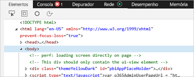
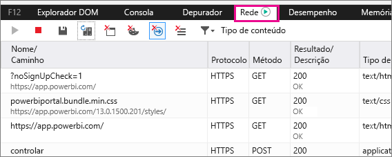
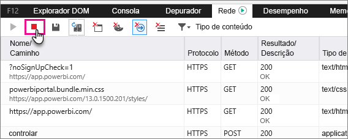
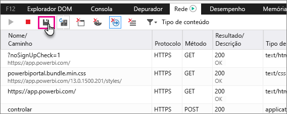

# Capturar informações de diagnóstico adicionais para o Power BI

Este artigo fornece instruções para recolher manualmente informações de diagnóstico adicionais do cliente de web do Power BI.

1. Navegue até [do Power BI](https://app.powerbi.com) com o Microsoft Edge ou o Internet Explorer.

1. Prima **F12** para abrir as ferramentas de desenvolvimento do Microsoft Edge.

   

1. Selecione o separador **Network** (Rede). Este irá listar o tráfego já capturado.

   

    Pode:

    * Procurar dentro da janela e reproduzir qualquer problema que pode encontrar.

    * Ocultar e mostrar a janela de ferramentas de desenvolvedor em qualquer altura durante a sessão, premindo F12.

1. Para parar a sessão de criação de perfis, pode selecionar o quadrado vermelho na **rede** Guia do programador da área de ferramentas.

   

1. Selecione o ícone de disquete, exportar os dados como um ficheiro de arquivo (HAR de HTTP).

   

1. Escreva um nome de ficheiro e guarde o ficheiro HAR.

    O ficheiro HAR conterá todas as informações sobre pedidos de rede entre a janela do browser e o Power BI, incluindo:

    * Os IDs de atividade para cada solicitação.

    * O período de tempo preciso para cada solicitação.

    * Qualquer informação de erro devolvida ao cliente.

    Este rastreio também conterá os dados utilizados para povoar os elementos visuais mostrados no ecrã.

1. Pode enviar o ficheiro HAR para o suporte para revisão.

Mais perguntas? [Experimente perguntar à Comunidade do Power BI](http://community.powerbi.com/)
