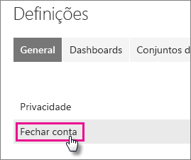
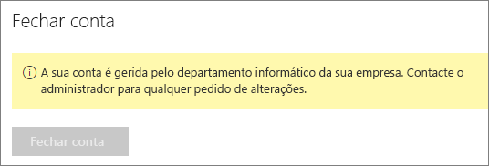

# Fechar a sua conta do Power BI

Se não quiser mais utilizar o Power BI, poderá fechar sua conta do Power BI.  Depois de a sua conta estar fechada, não poderá mais entrar no Power BI. Todos os dados do cliente carregados ou criados no Power BI são eliminados, de acordo com a política de retenção de dados nos Termos de Serviço do Power BI.

## Utilizadores individuais do Power BI

Se se inscreveu no Power BI como um indivíduo, poderá fechar a sua conta no ecrã **Definições**.

1. No Power BI, selecione o ícone de engrenagem no canto superior direito e, em seguida, selecione **Definições**.

    

1. No separador **Geral**, selecione **Fechar Conta**.

    

1. Selecione um motivo para fechar a conta (1). Também pode fornecer outras informações (2). Em seguida, selecione **Fechar conta**.

    

1. Confirme que deseja fechar a sua conta.

    

    Deve ver uma confirmação de que a sua conta foi fechada. Pode reabrir a conta neste ecrã, se necessário.

    

## Utilizadores de inquilino gerido

Se a sua organização o tiver inscrito no Power BI, contacte o administrador de inquilinos e peça-lhe que remova a atribuição de licença da sua conta.

Mais perguntas? [Experimente perguntar à Comunidade do Power BI](http://community.powerbi.com/)