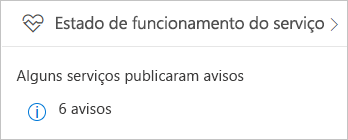
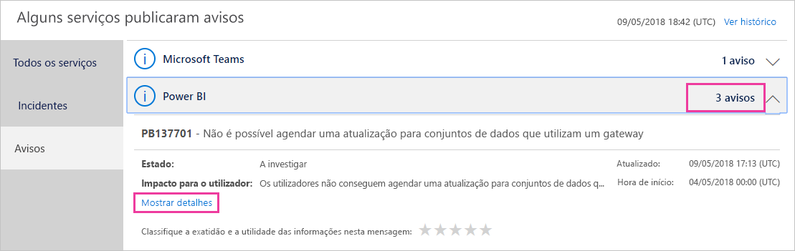
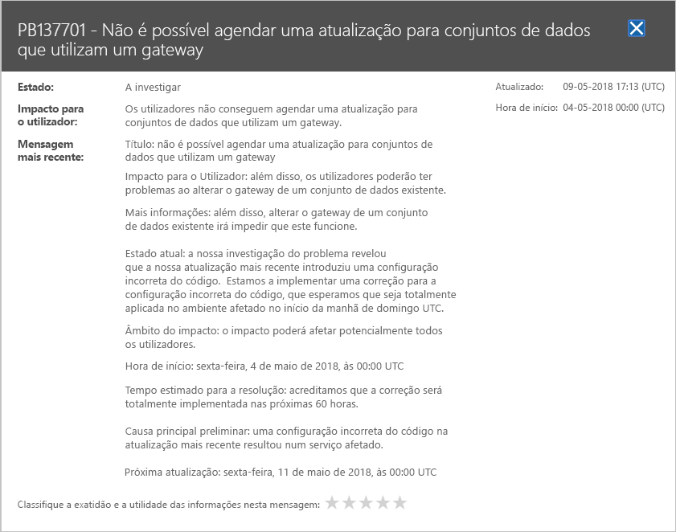

# Controlar o estado de funcionamento do serviço Power BI no Office 365

O centro de administração do Office 365 fornece ferramentas importantes aos administradores do Power BI, incluindo informações atuais e históricas sobre o estado de funcionamento do serviço. Para aceder a estas informações, tem de assumir uma das seguintes funções: Administrador de Serviço Power BI ou Administrador Global do Office 365. Para obter mais informações sobre as funções, veja [Funções de administrador relacionadas com o Power BI](service-admin-administering-power-bi-in-your-organization.md#administrator-roles-related-to-power-bi).

1. Inicie sessão no [Centro de administração do Office 365](https://portal.office.com/adminportal).

2. Selecione o mosaico **Service Health**.

    

3. Na lista atual, selecione **Aconselhamentos N** ou **Incidentes N** e reveja os resultados. No gráfico abaixo, é visível um dos três aconselhamentos ativos.

    

4. Para obter mais informações, selecione **Mostrar detalhes** de um item. No gráfico abaixo, pode ver detalhes adicionais, incluindo atualizações de estado recentes.

    

    Desloque-se para baixo para ver mais informações e, em seguida, feche o painel quando tiver terminado.

5. Para ver informações históricas em todos os serviços, no canto superior direito da lista de principal, selecione **Ver histórico**. Em seguida, selecione **Últimos 7 dias** ou **Últimos 30 dias**. Para voltar ao Service Health atual, selecione **Ver estado atual**.