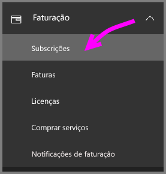
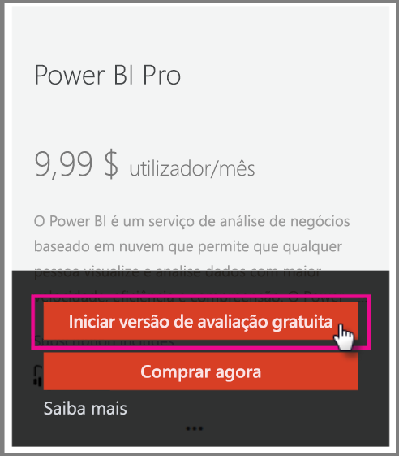
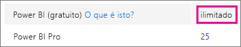
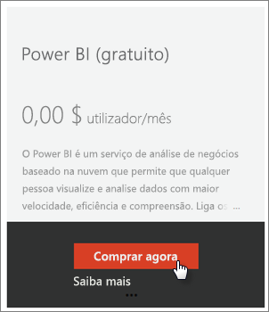
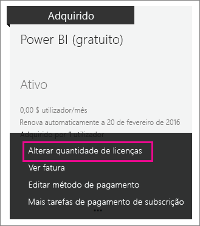

# <a name="power-bi-licensing-in-your-organization"></a>Licenciamento do Power BI na sua organização

[!INCLUDE [license-capabilities](includes/license-capabilities.md)]

Este artigo concentra-se no licenciamento por utilizador numa perspetiva de administrador.

## <a name="manage-power-bi-pro-licenses"></a>Gerir licenças do Power BI Pro

Como administrador, pode comprar e atribuir licenças do Power BI Pro; e pode inscrever-se numa versão de avaliação do Power BI Pro para a sua organização. Os particulares também podem inscrever-se para a versão de avaliação do Power BI Pro.

### <a name="purchase-power-bi-pro-licenses"></a>Comprar licenças do Power BI Pro

Como administrador, compra licenças do Power BI Pro através do Microsoft 365 ou de um parceiro Microsoft certificado. Depois de comprar as licenças, atribui-as a utilizadores individuais. Para obter mais informações, veja [Comprar e atribuir licenças Power BI Pro](service-admin-purchasing-power-bi-pro.md).

### <a name="power-bi-pro-license-expiration"></a>Expiração da licença do Power BI Pro

Após a licença do Power BI Pro expirar, existe um período de tolerância. Para licenças que façam parte da compra de licenciamento de volume, o período de tolerância é de 90 dias. Se comprar diretamente a licença, o período de tolerância é de 30 dias.

O Power BI Pro tem o mesmo ciclo de vida de subscrição que o Office 365. Para obter mais informações, veja [O que acontece aos meus dados e acesso quando a minha subscrição do Office 365 para empresas termina?](https://support.office.com/article/What-happens-to-my-data-and-access-when-my-Office-365-for-business-subscription-ends-4436582f-211a-45ec-b72e-33647f97d8a3)

### <a name="power-bi-pro-trial-for-individuals"></a>Versão de avaliação do Power BI Pro para particulares

As pessoas particulares na sua organização podem inscrever-se numa versão de avaliação do Power BI Pro. Para obter mais informações, veja [Inscrever-se no Power BI como um indivíduo](service-self-service-signup-for-power-bi.md).

Os utilizadores que tiram partido da versão de avaliação do Power BI Pro para particulares no produto não aparecem no centro de administração do Microsoft 365 como utilizadores da versão de avaliação do Power BI Pro (aparecem como utilizadores da versão gratuita do Power BI). No entanto, aparecem como utilizadores da Versão de Avaliação do Power BI Pro na página Gerir armazenamento do Power BI.

### <a name="power-bi-pro-trial-for-organizations"></a>Versão de avaliação do Power BI Pro para organizações

Se quiser comprar e implementar licenças de avaliação do Power BI para vários utilizadores na sua organização sem que estes tenham de aceitar os termos da avaliação individualmente, inscreva-se para obter uma versão de avaliação do Power BI Pro para a sua organização.

Tenha em atenção o seguinte antes de seguir os passos para se inscrever:

* Para se inscrever, tem de ser um membro da função de [**Administrador global** ou **Administrador de faturação**](https://support.office.com/article/about-office-365-admin-roles-da585eea-f576-4f55-a1e0-87090b6aaa9d) no Microsoft 365.

* Não existe um limite de uma versão de avaliação organizacional por inquilino. Isto significa que, se alguém já tiver aplicado a Versão de avaliação do Power BI Pro ao inquilino, não pode fazê-lo novamente. Se precisar de assistência, contacte o [suporte de Faturação do Office 365](https://support.office.microsoft.com/article/contact-support-for-business-products-admin-help-32a17ca7-6fa0-4870-8a8d-e25ba4ccfd4b?CorrelationId=552bbf37-214f-4202-80cb-b94240dcd671).

1. Navegue para o [centro de administração do Microsoft 365](https://portal.office.com/adminportal/home#/homepage).

1. No painel de navegação esquerdo, selecione **Faturação** e, em seguida, **Subscrições**.

   

1. No lado direito, selecione **Adicionar subscrições**.

   

1. Em **Outros Planos**, paire sobre a elipse (**. . .**) do Power BI Pro e selecione **Iniciar avaliação gratuita**.

    

1. No ecrã de confirmação do pedido, selecione **Experimente agora**.

1. No recibo do pedido, selecione **Continuar**.

Agora, pode [atribuir licenças no Office 365](https://support.office.com/article/assign-licenses-to-users-in-office-365-for-business-997596b5-4173-4627-b915-36abac6786dc).

## <a name="manage-power-bi-free-licenses"></a>Gerir licenças gratuitas do Power BI

Os utilizadores da sua organização podem obter acesso a licenças gratuitas do Power BI de duas maneiras diferentes:

* Pode atribuir uma licença do Power BI aos mesmos no centro de administração do Microsoft 365.

* Se um utilizador se [inscrever para uma conta do Power BI](service-self-service-signup-for-power-bi.md), receberá uma licença gratuita.

### <a name="requesting-and-assigning-free-licenses"></a>Pedir e atribuir licenças gratuitas

Se quiser gerir pedidos de licença e atribuições de forma centralizada, verifique primeiro se já tem o bloco de licenças ilimitado do Power BI (gratuito) no seu inquilino.

Este bloco de licenças está disponível após a primeira vez que alguém se inscreve no Power BI como um indivíduo. Durante esse processo, este bloco de licenças é associado à sua organização e é atribuída uma licença ao utilizador que está a inscrever-se.

1. No centro de administração do Microsoft 365, em **Faturação** > **Licenças**, verifique a existência de **ilimitado**.

    

1. Se o bloco estiver disponível, poderá agora [atribuir licenças no Office 365](https://support.office.com/article/assign-licenses-to-users-in-office-365-for-business-997596b5-4173-4627-b915-36abac6786dc). Se o bloco não estiver disponível, terá duas opções:

    * Fazer com que um membro da sua organização se inscreva individualmente, o que aciona a criação do bloco ilimitado.

    * Vá para o procedimento a seguir, onde pode inscrever-se para um número fixo de licenças.

Se o bloco de licenças ilimitado do Power BI (gratuito) não está disponível e não pretender efetuar uma inscrição individual, siga este procedimento.

1. Navegue para o [centro de administração do Microsoft 365](https://portal.office.com/admin/default.aspx).

1. No painel de navegação esquerdo, selecione **Faturação** > **Subscrições**.

1. No lado direito, selecione **Adicionar subscrições +**.

1. Em **Outros Planos**, passe o rato sobre a (**. . .**) para o Power BI (gratuito) e selecione **Comprar agora**.

    

1. Insira o número de licenças que pretende adicionar e selecione **Finalizar a compra agora** ou **Adicionar ao carrinho**.

1. Insira as informações necessárias no processo de finalização de compra.

    Não há qualquer compra nesta abordagem, embora tenha de inserir os seus dados do cartão de crédito para efeitos de faturação ou para optar por faturação.

1. Agora, pode [atribuir licenças no Office 365](https://support.office.com/article/assign-licenses-to-users-in-office-365-for-business-997596b5-4173-4627-b915-36abac6786dc).

1. Se decidir que, posteriormente, deseja adicionar mais licenças, pode voltar para **Adicionar subscrições** e selecionar **Alterar a quantidade de licenças** para o Power BI (gratuito).

    

### <a name="enable-or-disable-individual-user-sign-up-in-azure-active-directory"></a>Ativar ou desativar a inscrição de utilizador individual no Azure Active Directory

Como administrador, pode optar por ativar ou desativar as inscrições de utilizador individuais através do AAD (Azure Active Directory). Esta secção do artigo mostra-lhe como gerir inscrições com comandos do PowerShell. Para obter mais informações sobre o Azure PowerShell, veja [Descrição geral do Azure PowerShell](/powershell/azure/overview).

A definição do Azure Active Directory que controla a inscrição é **AllowAdHocSubscriptions**. Na maioria dos inquilinos, esta definição está como *true*, o que significa que está ativada. Se adquiriu o Power BI através de um parceiro, pode estar definida como *false*, o que significa que está desativada. Se alterar a definição de *true* para *false*, os novos utilizadores na sua organização serão impedidos de inscreverem-se individualmente. Os utilizadores inscritos para o Power BI antes da alteração da definição mantêm as suas licenças. Note que, com uma definição de *falso*, os utilizadores com uma licença do Power BI (gratuito) ainda se podem inscrever numa avaliação individual do Power BI Pro.

1. Inicie sessão no Azure Active Directory com as suas credenciais do Microsoft 365. A primeira linha do seguinte script do PowerShell pede-lhe as suas credenciais. Na segunda linha, será ligado ao Azure Active Directory.

    ```powershell
     $msolcred = get-credential
     connect-msolservice -credential $msolcred
    ```

   

1. Uma vez ligado, execute o comando a seguir de modo a ver como é que o seu inquilino está atualmente configurado. (Repare que “fl” abaixo utiliza a letra “l” e não o número 1.)

    ```powershell
     Get-MsolCompanyInformation | fl AllowAdHocSubscriptions 
    ```
1. Execute o seguinte comando para ativar ($true) ou desativar ($false) o **AllowAdHocSubscriptions**.

    ```powershell
     Set-MsolCompanySettings -AllowAdHocSubscriptions $true
    ```

> [!NOTE]
> O sinalizador AllowAdHocSubscriptions é utilizado para controlar várias capacidades dos utilizadores na organização, incluindo a inscrição no Azure Rights Management Service. A alteração deste sinalizador afeta todas estas capacidades.

## <a name="next-steps"></a>Próximos passos

[Inscrição personalizada no Power BI](service-self-service-signup-for-power-bi.md)  

[Comprar e atribuir licenças Power BI Pro](service-admin-purchasing-power-bi-pro.md)

Mais perguntas? [Experimente perguntar à Comunidade do Power BI](http://community.powerbi.com/)
