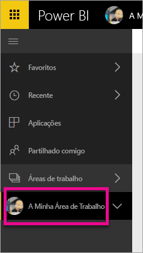
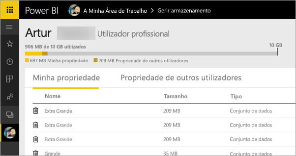
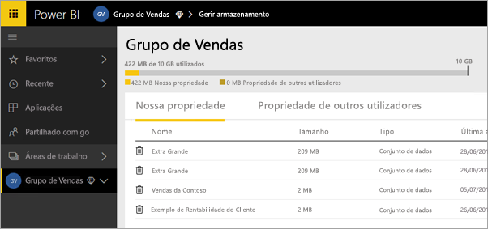
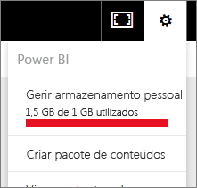
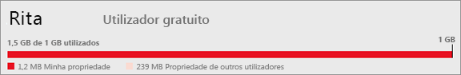

# Gerir o armazenamento de dados
Saiba como pode gerir o seu armazenamento de dados individual, ou área de trabalho de aplicação, para assegurar que pode continuar a publicar relatórios e conjuntos de dados.

Os utilizadores e as áreas de trabalho de aplicação têm as suas próprias capacidades de dados

* Os utilizadores das versões Gratuita e Pro têm um máximo de 10 GB de armazenamento de dados.
* Os utilizadores Pro podem criar áreas de trabalho de aplicação com um máximo de 10 GB de armazenamento de dados em cada uma.

Ao nível do inquilino, a utilização total não pode exceder 10 GB por utilizador Pro em todos os utilizadores e áreas de trabalho de aplicação Pro no inquilino.

Leia sobre outras funcionalidades do [modelo de preços do Power BI](https://powerbi.microsoft.com/pricing).

Estão incluídos no armazenamento de dados os seus próprios conjuntos de dados e relatórios do Excel e os que foram partilhados consigo. Conjuntos de dados são qualquer uma das origens de dados que carregou ou com as quais está ligado, incluindo os ficheiros do Power BI Desktop e os livros do Excel que está a utilizar. O exemplo seguinte também está incluído na capacidade de dados.

* Intervalos do Excel afixados ao dashboard.
* Visualizações locais dos Reporting Services afixadas a um dashboard do Power BI.
* Imagens carregadas.

O tamanho de um dashboard que partilha irá variar consoante o que está afixado ao mesmo. Por exemplo, se afixar itens de dois relatórios que fazem parte de dois conjuntos de dados diferentes, o tamanho incluirá ambos os conjuntos de dados.

<a name="manage"/>

## Gerir itens que lhe pertencem
Veja a quantidade de armazenamento de dados que está a utilizar na sua conta do Power BI e faça a gestão da sua conta.

1. Para gerir o seu próprio armazenamento, aceda a **A Minha Área de Trabalho** no painel de navegação à esquerda.
   
    
2. Selecione o ícone de engrenagem  no canto superior direito \> **Gerir armazenamento pessoal**.
   
    A barra superior mostra o limite de armazenamento utilizado.
   
    
   
    Os conjuntos de dados e os relatórios são separados em dois separadores:
   
    **Minha Propriedade:** são relatórios e conjuntos de dados que carregou para a sua conta do Power BI, incluindo conjuntos de dados de serviço, como Salesforce e Dynamics CRM.  
    **Propriedade de Outros Utilizadores:** outras pessoas partilharam os relatórios e conjuntos de dados consigo.
3. Para eliminar um conjunto de dados ou um relatório, selecione o ícone do caixote do lixo .

Tenha em atenção que tanto o utilizador como outra pessoa podem ter relatórios e dashboards com base num conjunto de dados. Se eliminar o conjunto de dados, os relatórios e dashboards deixarão de funcionar.

## Gerir a área de trabalho de aplicação
1. Selecione a seta junto a **Áreas de Trabalho** \> selecione o nome da área de trabalho de aplicação.
   
    
2. Selecione o ícone de engrenagem  no canto superior direito \> **Gerir armazenamento do grupo**.
   
    A barra superior mostra o limite de armazenamento de grupo utilizado.
   
    
   
    Os conjuntos de dados e os relatórios são separados em dois separadores:
   
    **Nossa Propriedade:** são relatórios e conjuntos de dados carregados por si ou por outra pessoa para a conta do Power BI do grupo, incluindo conjuntos de dados de serviço, como Salesforce e Dynamics CRM.
    **Propriedade de Outros Utilizadores:** outras pessoas partilharam os relatórios e conjuntos de dados com o seu grupo.
3. Para eliminar um conjunto de dados ou um relatório, selecione o ícone do caixote do lixo .
   
   > [!NOTE]
   > Qualquer membro, com permissões de edição, de uma área de trabalho de aplicação tem permissões para eliminar conjuntos de dados e relatórios da área de trabalho de aplicação.
   > 
   > 

Tenha em mente que você ou outra pessoa do grupo pode ter relatórios e dashboards com base em um conjunto de dados. Se eliminar o conjunto de dados, os relatórios e dashboards deixarão de funcionar.

## Limites do conjunto de dados
Existe um limite de 1 GB por conjunto de dados importado para o Power BI. Se tiver optado por manter a experiência do Excel, em vez de importar os dados, estará limitado a 250 MB para o conjunto de dados.

## O que acontece ao atingir um limite
Ao atingir o limite da capacidade de dados do que é possível fazer, serão apresentados avisos dentro do serviço. 

Ao selecionar o ícone de engrenagem , verá uma barra vermelha que indica que está acima do limite da capacidade de dados.

Também verá isto indicado em **Gerir armazenamento pessoal**.

 

 Ao tentar executar uma ação que atingirá um dos limites, será apresentado um aviso que indica que está acima do limite. Poderá [gerir](#manage) o armazenamento para reduzir a quantidade de armazenamento e ultrapassar o limite.

 

 Mais perguntas? [Experimente perguntar à Comunidade do Power BI](http://community.powerbi.com/)

