# Configurar aplicações móveis do Power BI com o Microsoft Intune

O Microsoft Intune permite às organizações gerir dispositivos e aplicações. As aplicações móveis do Power BI para iOS e Android podem ser integradas com o Intune. Esta integração permite-lhe gerir a aplicação nos seus dispositivos e controlar a segurança. Através de políticas de configuração, pode controlar itens como pedir um PIN de acesso, como os dados são processados pela aplicação e até mesmo encriptar dados de aplicação quando esta não estiver a ser utilizada.

## Configuração geral da gestão de dispositivos móveis

Este artigo pressupõe que o Intune está configurado corretamente e tem dispositivos registados no Intune. Este artigo não serve como guia de configuração completo para o Microsoft Intune. Para obter mais informações sobre o Intune, veja [O que é o Intune?](/intune/introduction-intune/)

O Microsoft Intune pode coexistir com a Gestão de Dispositivos Móveis (MDM) no Office 365. Se estiver a utilizar o MDM, o dispositivo será mostrado como inscrito no MDM, mas estará disponível para gestão no Intune.

> [!NOTE]
> Depois de configurar o Intune, a atualização de dados em segundo plano é desativada para a aplicação móvel do Power BI no dispositivo iOS ou Android. O Power BI atualiza os dados do serviço Power BI na Web quando entra na aplicação.

## Passo 1: Obter o URL da aplicação

Antes de criar a aplicação no Intune, tem de obter os URLs das aplicações. Para iOS, serão obtidos pelo iTunes. Para Android, pode obtê-los na página de aplicações móveis do Power BI.

Guarde o URL, uma vez que vai precisar dele durante a criação da aplicação.

### Obter o URL para iOS

Para obter o URL da aplicação para iOS, temos de utilizar o iTunes.

1. Abra o iTunes.

1. Procure *Power BI*.

1. Deverá ver **Microsoft Power BI** apresentado em **Aplicações para iPhone** e **Aplicações para iPad**. Pode utilizar qualquer uma das opções, visto que vai obter o mesmo URL.

1. Selecione o menu pendente **Obter** e **Copiar Ligação**.

    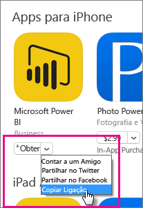

Deve ser semelhante ao seguinte: *https://itunes.apple.com/us/app/microsoft-power-bi/id929738808?mt=8* .

### Obter o URL para Android

Pode obter o URL para o Google Play na [página de aplicações móveis do Power BI](https://powerbi.microsoft.com/mobile/). Selecione **Transferir do Google Play** para avançar para a página da aplicação. Pode copiar o URL da barra de endereços do browser. Deve ser semelhante ao seguinte: *https://play.google.com/store/apps/details?id=com.microsoft.powerbim* .

## Passo 2: Criar uma política de gestão de aplicações móveis

A política de gestão de aplicações móveis permite-lhe impor itens, como um PIN de acesso. Pode criar um no portal do Intune.

Pode criar a aplicação ou a política primeiro. Não importa a ordem com que são adicionados. Têm apenas de existir para o passo de implementação.

1. No portal do Intune, selecione **Política** > **Políticas de Configuração**.

    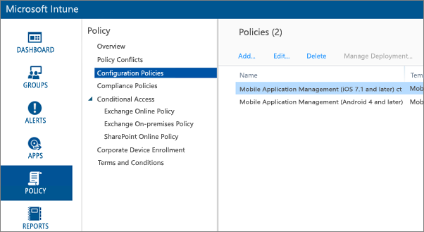

1. Selecione **Adicionar...** .

1. Em **Software**, pode selecionar a Gestão de Aplicações Móveis para Android ou iOS. Para começar rapidamente, pode selecionar **Criar uma política com as definições recomendadas** ou criar uma política personalizada.

1. Edite a política para configurar as restrições que quer na aplicação.

## Passo 3: Criar a aplicação

A aplicação é uma referência, ou pacote, guardada no Intune para implementação. Temos de criar uma aplicação e fazer referência ao URL da aplicação que obtivemos do Google Play ou do iTunes.

Pode criar a aplicação ou a política primeiro. Não importa a ordem com que são adicionados. Têm apenas de existir para o passo de implementação.

1. Aceda ao portal do Intune e selecione **Aplicações** no menu à esquerda.

1. Selecione **Adicionar Aplicação**. Isto inicializará a aplicação **Adicionar Software**.

### Criar para iOS

1. Selecione **Aplicação iOS gerida a partir da App Store** no menu pendente.

1. Introduza o URL da aplicação obtido no [Passo 1](#step-1-get-the-url-for-the-application) e selecione **Seguinte**.

    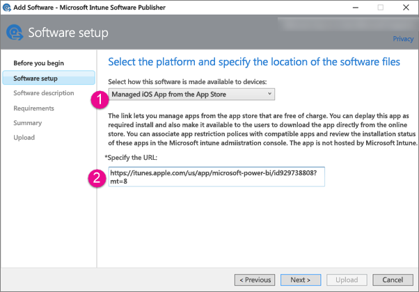

1. Forneça um **Editor**, um **Nome** e uma **Descrição**. Como alternativa, pode fornecer um **Ícone**. A **Categoria** refere-se à aplicação do Portal da Empresa. Quando terminar, selecione **Seguinte**.

1. Pode decidir se quer publicar a aplicação como **Qualquer** (predefinição), **iPad** ou **iPhone**. Por predefinição, será mostrado **Qualquer** e funcionará para ambos os tipos de dispositivo. A aplicação Power BI utiliza o mesmo URL para iPhone e iPad. Selecione **Seguinte**.

1. Selecione **Carregar**.

1. Se não vir a aplicação na lista, atualize a página: aceda a **Descrição geral** e, em seguida, volte para **Aplicações**.

    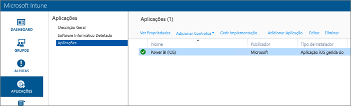

### Criar para Android

1. Selecione **Ligação Externa** no menu pendente.

1. Introduza o URL da aplicação obtido no [Passo 1](#step-1-get-the-url-for-the-application) e selecione **Seguinte**.

    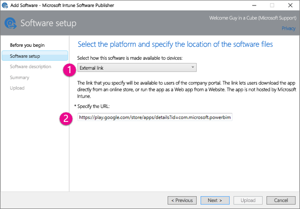

1. Forneça um **Editor**, um **Nome** e uma **Descrição**. Como alternativa, pode fornecer um **Ícone**. A **Categoria** refere-se à aplicação do Portal da Empresa. Quando terminar, selecione **Seguinte**.

1. Selecione **Carregar**.

1. Se não vir a aplicação na lista, atualize a página: aceda a **Descrição geral** e, em seguida, volte para **Aplicações**.

    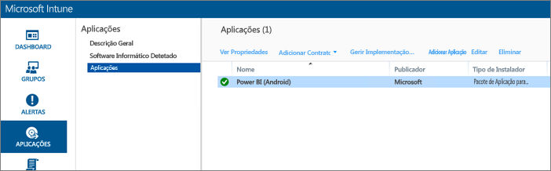

## Passo 4: Implementar a aplicação

Depois de ter adicionado a aplicação, tem de implementá-la para que fique disponível para os utilizadores finais. Este é o passo em que associará a política criada com a aplicação.

### Implementar para iOS

1. No ecrã de aplicações, selecione a aplicação que criou. Selecione a ligação **Gerir Implementação…** .

    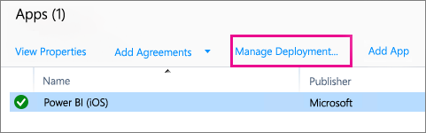

1. No ecrã **Selecionar Grupos**, pode escolher os grupos nos quais quer implementar a aplicação. Selecione **Seguinte**.

1. No ecrã **Ação de Implementação**, pode escolher como quer implementar a aplicação. Ao selecionar **Instalação Disponível** ou **Instalação Obrigatória**, a aplicação será disponibilizada no Portal da Empresa para que os utilizadores a instalem a pedido. Quando terminar a sua seleção, selecione **Seguinte**.

    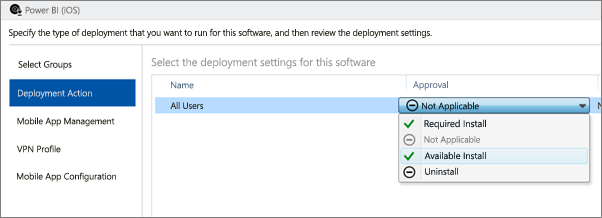

1. No ecrã **Gestão de Aplicações Móveis**, pode selecionar a política de Gestão de Aplicações Móveis criada no [Passo 2](#step-2-create-a-mobile-application-management-policy). A predefinição será a política que criou, se for a única política iOS disponível. Selecione **Seguinte**.

    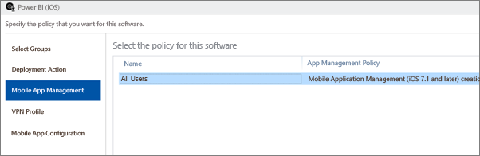

1. No ecrã **Perfil de VPN**, pode selecionar uma política, se tiver uma para a sua organização. A predefinição é **Nenhum**. Selecione **Seguinte**.

1. No ecrã **Configuração de Aplicação Móvel**, pode selecionar uma **Política de Configuração da Aplicação**, se tiver criado uma. A predefinição é **Nenhum**. Isto não é necessário. Selecione **Concluir**.

Depois de implementar a aplicação, deverá ser mostrado **Sim** para implementado, na página de aplicações.

### Implementar para Android

1. No ecrã de aplicações, selecione a aplicação que criou. Selecione a ligação **Gerir Implementação…** .

    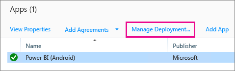
1. No ecrã **Selecionar Grupos**, pode escolher os grupos nos quais quer implementar a aplicação. Selecione **Seguinte**.

1. No ecrã **Ação de Implementação**, pode escolher como quer implementar a aplicação. Ao selecionar **Instalação Disponível** ou **Instalação Obrigatória**, a aplicação será disponibilizada no Portal da Empresa para que os utilizadores a instalem a pedido. Quando terminar a sua seleção, selecione **Seguinte**.

    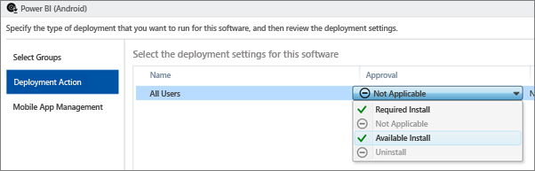

1. No ecrã **Gestão de Aplicações Móveis**, pode selecionar a política de Gestão de Aplicações Móveis criada no [Passo 2](#step-2-create-a-mobile-application-management-policy). A predefinição será a política que criou, se for a única política Android disponível. Selecione **Concluir**.

    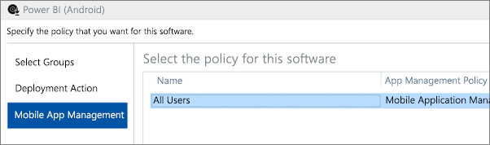

Depois de implementar a aplicação, deverá ser mostrado **Sim** para implementado, na página de aplicações.

## Passo 5: Instalar a aplicação num dispositivo

Instale a aplicação através da aplicação *Portal da Empresa*. Se ainda não instalou o Portal da Empresa, pode obtê-lo na loja de aplicações nas plataformas iOS ou Android. Iniciará sessão no Portal da Empresa com o início de sessão empresarial.

1. Abra a aplicação Portal da Empresa.

1. Se não vir a aplicação Power BI listada como uma aplicação em destaque, selecione **Aplicações da Empresa**.

    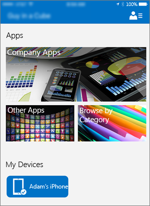

1. Selecione a aplicação Power BI que implementou.

    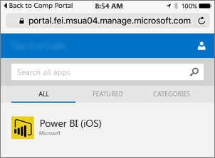

1. Selecione **Instalar**.

    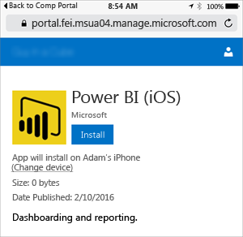

1. Se estiver no iOS, a aplicação será enviada por push para si. Selecione **Instalar** na caixa de diálogo de envio por push.

    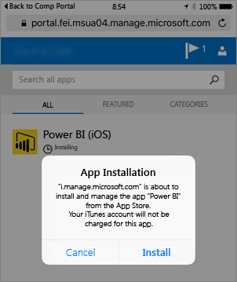

1. Após a instalação da aplicação, pode ver que é **Gerida pela sua empresa**. Se tiver ativado o acesso através de um PIN, na política, verá o seguinte.

    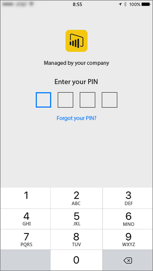

## Próximos passos

[Configurar e implementar políticas de gestão de aplicações móveis na consola do Microsoft Intune](/intune/app-protection-policies/)  

[Power BI apps for mobile devices (Aplicações do Power BI para dispositivos móveis)](consumer/mobile/mobile-apps-for-mobile-devices.md)  

Mais perguntas? [Experimente perguntar à Comunidade do Power BI](http://community.powerbi.com/)  
