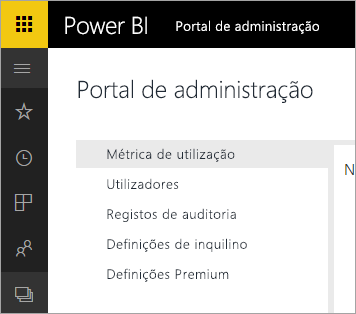

# O Power BI para Office 365 foi extinto
O Power BI para Office 365, uma versão anterior do Power BI, transitou para a versão atual do [Power BI](https://powerbi.microsoft.com). Os utilizadores que utilizaram o **Power BI para Office 365** podem utilizar a versão atual do Power BI. Pode [obter mais informações sobre o Power BI](service-get-started.md).

## Portal de administração
O acesso ao portal de administração do **Power BI para Office 365** já não está disponível. Os administradores podem utilizar o novo [portal de administração](https://app.powerbi.com/admin-portal) para gerir a subscrição do Power BI da sua organização.

Para obter mais informações, veja o [portal de administração do Power BI](service-admin-portal.md).

## Próximos passos
[Introdução ao Power BI](service-get-started.md)

[Introdução ao Power BI Desktop](desktop-getting-started.md)

[Administrar o Power BI na sua Organização](service-admin-administering-power-bi-in-your-organization.md)