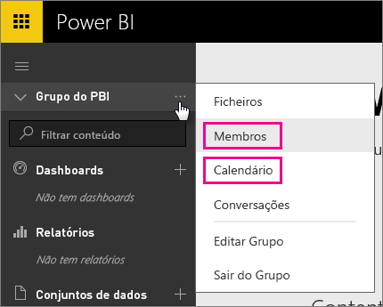
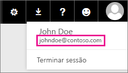

# Clientes dedicados do Office 365 - problemas conhecidos
Agora há suporte para o Power BI para clientes do Office 365 Dedicado.  Se for um cliente do O365 Dedicado, pode entrar com uma conta de inquilino e utilizar o Power BI. Há dois problemas conhecidos no momento.

## Grupos
Ao selecionar **Membros** ou **Calendário** no menu de contexto de Grupo, é redirecionado para a aplicação Correio.  Os **Ficheiros** e **Conversas** funcionam como esperado.

## Aplicação do iPhone - entrar com domínio banido causa erros
Quando se liga na aplicaçao do iPhone, com um início de sessão com um domínio banido, pode encontrar um erro.

*Erro no Início de Sessão*  
*ocorreu um erro interno inesperado. Tente novamente.*

Para contornar o problema, inicie a sessão com o endereço de e-mail listado quando clica no ícone do utilizador no serviço Power BI, em vez de com o domínio intuitivo.

Mais perguntas? [Pergunte à Comunidade do Power BI](http://community.powerbi.com/)

