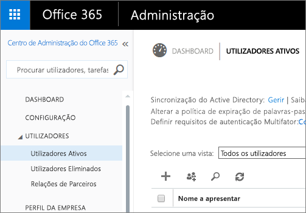
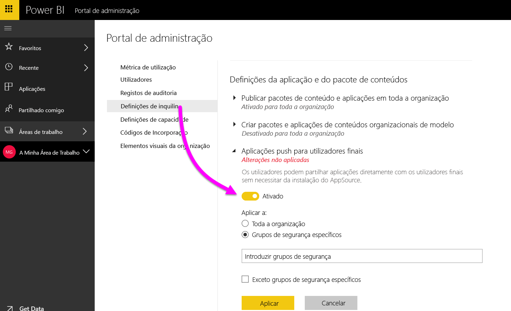

# Portal de administração do Power BI

O portal de administração permite a gestão de inquilinos do Power BI na sua organização. Inclui itens, como métricas de utilização, acesso ao centro de administração do Office 365 e definições.

A gestão de inquilinos do Power BI para a sua empresa é efetuada através do portal de administração do Power BI. O portal de administração está acessível a todos os utilizadores que sejam Administradores Globais no Office 365 ou a quem tenha sido atribuída a função de administrador do serviço Power BI. Para obter mais informações sobre a função de administrador do serviço Power BI, veja [Noções básicas sobre a função de administrador do Power BI](service-admin-role.md).

Todos os utilizadores verão o **Portal de administração** por baixo do ícone de engrenagem. Se não forem um administrador, apenas verão a secção **Definições Premium** e as capacidades para as quais têm direitos de gestão.

## Como aceder ao portal de administração

A conta tem de estar marcada como **Administrador Global**, no Office 365 ou no Azure Active Directory, ou ter sido atribuída a função de administrador do serviço Power BI, para obter acesso ao portal de administração do Power BI. Para obter mais informações sobre a função de administrador do serviço Power BI, veja [Noções básicas sobre a função de administrador do Power BI](service-admin-role.md). Para aceder ao portal de administração do Power BI, efetue o seguinte procedimento.

1. Selecione a engrenagem de definições na parte superior direita do serviço Power BI.
2. Selecione **Portal de Administração**.

No portal, existem seis separadores. Estão descritos abaixo.

* [Métricas de utilização](#usage-metrics)
* [Utilizadores](#users)
* [Registos de auditoria](#audit-logs)
* [Definições de inquilino](#tenant-settings)
* [Definições Premium](#premium-settings)
* [Códigos de incorporação](#embed-codes)
* [Elementos visuais da organização](#Organization-visuals)

## Métricas de utilização
O primeiro separador no portal de administração é **Métricas de utilização**. O relatório de métricas de utilização permite monitorizar a utilização no Power BI relativamente à sua organização. Permite também ver quais os utilizadores e os grupos mais ativos no Power BI para a sua organização.

> [!NOTE]
> Quando aceder ao dashboard pela primeira vez ou depois de voltar após um período longo em que não visualizou o dashboard, provavelmente verá um ecrã de carregamento enquanto carregamos o dashboard.

Após o carregamento do dashboard, verá duas secções de mosaicos. A primeira secção inclui os dados de utilização para utilizadores individuais e a segunda secção tem informações semelhantes para grupos na sua organização.

Segue-se uma análise detalhada do que verá em cada mosaico:

* Contagem distinta de todos os dashboards, relatórios e conjuntos de dados na área de trabalho do utilizador
  
    

* O dashboard mais consumido pelo número de utilizadores que podem aceder ao mesmo. Por exemplo, se tiver um dashboard partilhado com 3 utilizadores e também o tiver adicionado a um pacote de conteúdos com dois utilizadores diferentes ligados, a contagem será 6 (1 + 3 + 2)
  
    

* Os utilizadores de conteúdo mais populares ligados ao mesmo. Isto será qualquer item a que os utilizadores possam aceder através do processo Obter Dados, como pacotes de conteúdos SaaS, pacotes de conteúdos Organizacionais, ficheiros ou bases de dados.
  
    

* Uma vista dos principais utilizadores com base no número de dashboards que têm, tanto os dashboards que criaram como os dashboards partilhados com eles.
  
    

* Uma vista dos principais utilizadores com base no número de relatórios que têm.
  
    

A segunda secção apresenta o mesmo tipo de informação, mas com base em grupos. Isto permitirá ver quais os grupos mais ativos na sua organização e o tipo de informação que estão a utilizar.

Com esta informação, conseguirá obter dados reais relativamente à forma como as pessoas estão a utilizar o Power BI na sua organização e reconhecer os utilizadores e grupos que são muito ativos na sua organização.

## Utilizadores

O segundo separador no portal de administração é **Gerir Utilizadores**. A gestão de utilizadores, para o Power BI, é efetuada no centro de administração do Office 365, pelo que esta secção permite aceder rapidamente à área para gerir utilizadores, administradores e grupos no Office 365.

Ao clicar em **Ir para o Centro de Administração do O365**, acede diretamente à página de destino do centro de administração do Office 365 para gerir os utilizadores do seu inquilino.

## Registos de auditoria

O terceiro separador no portal de administração é **Registos de auditoria**. Os registos estão localizados no Centro de Conformidade e Segurança do Office 365. Esta secção permite aceder rapidamente a essa área no Office 365.

Para obter mais informações sobre registos de auditoria, veja [Auditoria do Power BI na sua organização](service-admin-auditing.md)

## Definições de inquilino

O quarto separador no portal de administração é **Definições de inquilino**. As definições de inquilino dão-lhe mais controlo sobre as funcionalidades disponibilizadas para a sua organização. Se tiver problemas com dados confidenciais, algumas das nossas funcionalidades podem não ser adequadas para a sua organização ou pode querer apenas uma determinada funcionalidade disponível para um grupo específico. Se for este o caso, pode desativar a definição no inquilino.

> [!NOTE]
> Pode demorar até 10 minutos para a definição ter efeito para todos os utilizadores no inquilino.

As definições podem ter três estados:

* **Desativado para toda a organização**: pode desativar uma funcionalidade para que os utilizadores não a possam utilizar.

    

* **Ativado para toda a organização**: pode ativar uma funcionalidade para toda a organização, o que permitirá que todos os utilizadores tenham acesso à mesma.

    

* **Ativado para um subconjunto da organização**: também pode ativar uma funcionalidade para uma parte da sua organização. Isto pode acontecer de formas diferentes. Pode ativá-la para toda a organização, exceto para um grupo específico de utilizadores.

    

    Pode também ativar a funcionalidade apenas para um grupo específico de utilizadores ou desativá-la para um grupo de utilizadores. Isto assegura que determinados utilizadores não tenham acesso à funcionalidade mesmo que estejam no grupo permitido.

    

As próximas secções fornecem uma descrição geral dos diferentes tipos de definições de inquilino.

## Definições de área de trabalho

### Criar áreas de trabalho (pré-visualização)
Os utilizadores na organização podem criar áreas de trabalho de aplicações para colaborar em dashboards, relatórios e noutros conteúdos.

Para obter mais informações, veja [Criar as novas áreas de trabalho](service-create-the-new-workspaces.md).

## Definições de exportação e partilha

### Partilhar conteúdo com utilizadores externos

Os utilizadores na organização podem partilhar dashboards com utilizadores fora da organização.

Aqui está a mensagem que vai aparecer quando partilha com um utilizador externo.

### Publicar na Web

Os utilizadores na organização podem publicar os relatórios na Web. [Saiba mais](service-publish-to-web.md)

Os utilizadores verão opções diferentes na IU consoante a definição da funcionalidade Publicar na Web.

|Destaque |Ativada para toda a organização |Desativada para toda a organização |Grupos de segurança específicos   |
|---------|---------|---------|---------|
|**Publicar na Web**, no menu **Ficheiro** do relatório.|Ativada para todos|Não visível para todos|Visível apenas para utilizadores ou grupos autorizados.|
|**Gerir códigos de incorporação**, em **Definições**|Ativada para todos|Ativada para todos|Ativada para todos  * A opção **Eliminar** está ativada apenas para utilizadores e grupos autorizados. * A opção **Obter códigos** está ativada para todos.|
|**Incorporar códigos** no portal de administração|O estado será um dos seguintes: * Ativo * Não suportado * Bloqueado|O estado apresentado será **Desativado**|O estado será um dos seguintes: * Ativo * Não suportado * Bloqueado  Se um utilizador não estiver autorizado com base na definição do inquilino, o estado apresentado será **Em violação**.|
|Relatórios publicados existentes|Todos ativados|Todos desativados|Os relatórios continuam a ser compostos para todos.|

### Exportar dados

Os utilizadores na organização podem exportar dados de um mosaico ou visualização. [Saiba mais](power-bi-visualization-export-data.md)

> [!NOTE]
> Desativar a opção **Exportar Dados** também impede os utilizadores de usarem a funcionalidade **Analisar no Excel**, bem como a ligação em direto do serviço Power BI.

### Exportar relatórios como apresentações do PowerPoint

Os utilizadores na organização podem exportar relatórios do Power BI como ficheiros do PowerPoint. [Saiba mais](service-publish-to-powerpoint.md)

### Imprimir dashboards e relatórios

Os utilizadores na organização podem imprimir dashboards e relatórios. [Saiba mais](service-print.md)

## Definições do pacote de conteúdos

### Publicar pacotes de conteúdos para toda a organização

Os utilizadores na organização podem publicar pacotes de conteúdo para toda a organização.

### Criar pacotes de conteúdos organizacionais modelo

Os utilizadores na organização podem criar pacotes de conteúdos modelo que utilizam conjuntos de dados incorporados numa origem de dados no Power BI Desktop.

### Aplicações push para utilizadores finais

O administrador de inquilinos permite enviar aplicações por push nas **Definições de inquilino**.

   

Pode mudar a definição para **Ativado** e, em seguida, especificar quem tem esta capacidade (toda a organização ou grupos de segurança específicos).

> [!NOTE]
> Lembre-se de que as alterações de definições de inquilino podem demorar algum tempo a entrar em vigor.

Aceda aqui para saber mais sobre [Aplicações push](service-create-distribute-apps.md#how-to-install-an-app-automatically-for-end-users).

## Definições de integração

### Fazer perguntas sobre dados através do Cortana
Os utilizadores na organização podem fazer perguntas sobre os respetivos dados através do Cortana.

> [!NOTE]
> Esta definição aplica-se a toda a organização e não pode estar limitada a grupos específicos.

### Utilizar a funcionalidade Analisar no Excel com conjuntos de dados no local
Os utilizadores na organização podem utilizar o Excel para ver e interagir com conjuntos de dados no local do Power BI. [Saiba mais](service-analyze-in-excel.md)

> [!NOTE]
> Desativar a opção **Exportar Dados** também impede os utilizadores de usarem a funcionalidade **Analisar no Excel**.

### Utilizar o ArcGIS Maps for Power BI

Os utilizadores na organização podem utilizar a visualização dos ArcGIS Maps for Power BI fornecida pela Esri. [Saiba mais](power-bi-visualization-arcgis.md)

### Utilizar a pesquisa global para o Power BI (Pré-visualização)

Os utilizadores na organização podem utilizar as funcionalidades de pesquisa externa que dependem do Azure Search. Por exemplo, os utilizadores podem utilizar a Cortana para obterem informações-chave diretamente dos dashboards e relatórios do Power BI. [Saiba mais](service-cortana-intro.md)

## Definições de elementos visuais personalizados
### Ativar os elementos visuais personalizados para toda a organização
Os utilizadores na organização podem interagir e partilhar elementos visuais personalizados. [Saiba mais](power-bi-custom-visuals.md)

> [!NOTE]
> Esta definição aplica-se a toda a organização e não pode estar limitada a grupos específicos.

## Definições de elementos visuais R

### Interagir e partilhar visuais R

Os utilizadores na organização podem interagir e partilhar elementos visuais criados com scripts R. [Saiba mais](service-r-visuals.md)

> [!NOTE]
> Esta definição aplica-se a toda a organização e não pode estar limitada a grupos específicos.

## Definições de utilização e auditoria

### Criar registos de auditoria para auditoria de atividade interna e de conformidade

Os utilizadores na organização podem utilizar a auditoria para monitorizar as ações executadas no Power BI por outros utilizadores na organização. [Saiba mais](service-admin-auditing.md)

Esta definição tem de estar ativada para as entradas de registo de auditoria serem registadas. Pode existir um intervalo de 48 horas entre a ativação da auditoria e a capacidade de ver os dados da mesma. Se não vir logo os seus dados, consulte os registos de auditoria mais tarde. Pode existir um intervalo de tempo semelhante entre obter a permissão para ver os registos de auditoria e ter acesso aos mesmos.

> [!NOTE]
> Esta definição aplica-se a toda a organização e não pode estar limitada a grupos específicos.

### Métricas de utilização para criadores de conteúdo
Os utilizadores na organização podem ver as métricas de utilização dos dashboards e relatórios que criaram. [Saiba mais](service-usage-metrics.md).

Pode mudar a definição para **Ativado** e, em seguida, especificar quem pode ver as métricas de utilização (toda a organização ou grupos de segurança específicos).

> [!NOTE]
> Lembre-se de que as alterações de definições de inquilino podem demorar algum tempo a entrar em vigor.

### Dados por utilizador em métricas de utilização para criadores de conteúdo
As métricas de utilização para os criadores de conteúdo irão expor nomes a apresentar e endereços de e-mail de utilizadores que estão a aceder ao conteúdo. [Saiba mais](service-usage-metrics.md).

Pode mudar a definição para **Ativado** e, em seguida, especificar quem pode ver os nomes a apresentar e endereços de e-mail nas métricas de utilização (toda a organização ou grupos de segurança específicos).

Por predefinição, os dados por utilizador estão ativados para métricas de utilização e as informações da conta do criador de conteúdo estão incluídas no relatório de métricas. Se não quiser incluir estas informações para alguns ou para todos os utilizadores, desative a funcionalidade para grupos de segurança específicos ou para toda a organização. As informações da conta serão apresentadas no relatório como *Sem nome*.

> [!NOTE]
> Lembre-se de que as alterações de definições de inquilino podem demorar algum tempo a entrar em vigor.

## Definições do dashboard

### Classificação de dados para dashboards

Os utilizadores na organização podem identificar os dashboards com classificações que indicam os respetivos níveis de segurança. [Saiba mais](service-data-classification.md)

> [!NOTE]
> Esta definição aplica-se a toda a organização e não pode estar limitada a grupos específicos.

## Definições do programador

### Incorporar conteúdo em aplicações

Os utilizadores na organização podem incorporar dashboards e relatórios do Power BI em aplicações Software como Serviço (SaaS). Desativar esta definição impedirá os utilizadores de usarem as APIs REST para incorporar conteúdo do Power BI na respetiva aplicação.

## Definições de capacidade

O separador Definições de capacidade permite gerir qualquer capacidade do Power BI Premium comprada para a sua organização. Todos os utilizadores na sua organização verão o separador Definições Premium, mas apenas verão o conteúdo no mesmo se estiverem atribuídos como **Administrador de capacidade** ou um utilizador com permissões de atribuição. Se um utilizador não tiver nenhuma permissão, verá a mensagem seguinte.

Para obter mais informações sobre como gerir as definições Premium, veja [Gerir o Power BI Premium](service-admin-premium-manage.md).

## Códigos de incorporação

Enquanto administrador, pode ver os códigos de incorporação gerados para o seu inquilino. Pode ver o relatório e eliminar o código de incorporação para o revogar.

## Elementos visuais da organização

O separador de elementos visuais da organização permite-lhe implementar e gerir os visuais personalizados na organização, pelo que pode facilmente implementar visuais personalizados proprietários na organização para os autores de relatórios detetarem e importarem facilmente os visuais diretamente do Power BI Desktop para os relatórios.
 
A página mostra todos os elementos visuais personalizados que estão atualmente implementados no repositório da organização.
 

### Adicionar um novo elemento visual personalizado

Para adicionar um novo elemento visual personalizado à lista, selecione **Adicionar um elemento visual personalizado**

> [!WARNING]
> Um elemento visual personalizado pode conter código com riscos de privacidade ou de segurança. Garanta que confia no autor e na origem do elemento visual personalizado antes de implementar no repositório de origem.
> 

Preencha os campos:
 
* Escolher um ficheiro .pbiviz (obrigatório): selecione um ficheiro de elemento visual personalizado para carregar. Apenas são suportados os elementos visuais personalizados com a versão da API (leia aqui o que significa).
Antes de carregar um elemento visual personalizado, deverá verificar a segurança e privacidade desse elemento visual para garantir que este cumpre os padrões da sua organização. Saiba mais sobre a segurança dos elementos visuais personalizados.
 
* Atribuir um nome aos elementos personalizados (obrigatório): atribua um título curto ao elemento visual para que os utilizadores do Power BI Desktop compreendam facilmente o que faz
 
* Ícone (obrigatório): o ficheiro de ícone que será mostrado na IU do Power BI Desktop.
 
* Descrição: uma breve descrição do elemento visual para proporcionar mais contexto e informação ao utilizador
 
Selecione “Aplicar” para iniciar o pedido de carregamento. Se tiver êxito, verá o novo item na lista. Se falhar, receberá uma mensagem de erro apropriada
 
### Eliminar um elemento visual personalizado da lista

Selecione o ícone de caixote do lixo para eliminar permanentemente o elemento visual do repositório.
Importante: a eliminação é irreversível. Depois de eliminado, o elemento visual deixará de ser composto nos relatórios existentes. Mesmo que carregue o mesmo elemento visual novamente, não substituirá o anterior que foi eliminado. Os utilizadores terão de importar o novo elemento visual outra vez e substituir a instância que têm nos relatórios.
 
### Como atualizar um elemento visual

Se quiser atualizar um elemento visual no repositório, uma vez que existe uma nova versão do mesmo (por exemplo, correções de erros, novas funcionalidades, etc.), selecione o ícone **Atualizar** e carregue o novo ficheiro. Confirme que o ID de Elemento Visual permanece inalterado. O novo ficheiro substituirá o ficheiro anterior para todos os relatórios em toda a organização. Contudo, se houver a possibilidade de a nova versão do elemento visual interromper qualquer utilização ou estrutura de dados da versão anterior do elemento visual, não substitua a versão anterior. Em vez disso, deve criar uma nova lista para a nova versão do elemento visual. Por exemplo, adicione um novo número de versão (versão X.X) ao título do novo elemento visual listado. Desta forma, torna-se claro que é o mesmo elemento visual apenas com um número de versão atualizado, assim, os relatórios existentes não vão interromper a sua funcionalidade. Novamente, verifique se o ID de Elemento Visual permanece inalterado. Da próxima vez que os utilizadores entrarem no repositório da organização a partir do Power BI Desktop, podem importar a nova versão, que pedirá a substituição da versão atual que têm no relatório.

## Próximos passos

[Compreender a função de administrador do Power BI](service-admin-role.md)  
[Auditoria do Power BI na sua organização](service-admin-auditing.md)  
[Gerir o Power BI Premium](service-admin-premium-manage.md)  
[Administrar o Power BI na sua organização](service-admin-administering-power-bi-in-your-organization.md)  

Mais perguntas? [Experimente perguntar à Comunidade do Power BI](http://community.powerbi.com/)
