# Administrar o Power BI no portal de administração

O portal de administração permite-lhe gerir o *inquilino* do Power BI da sua organização. O portal inclui itens, como métricas de utilização, acesso ao centro de administração do Microsoft 365 e definições.

O portal de administração completo está acessível a todos os utilizadores que sejam Administradores Globais no Office 365 ou a quem tenha sido atribuída a função de administrador do serviço Power BI. Se não estiver numa destas funções, verá apenas as **Definições de capacidade** no portal. Para obter mais informações sobre a função de administrador do serviço Power BI, veja [Noções básicas sobre a função de administrador do Power BI](service-admin-role.md).

## Como aceder ao portal de administração

A conta tem de estar marcada como **Administrador Global**, no Office 365 ou no Azure Active Directory, ou ter sido atribuída a função de administrador do serviço Power BI, para obter acesso ao portal de administração do Power BI. Para obter mais informações sobre a função de administrador do serviço Power BI, veja [Noções básicas sobre a função de administrador do Power BI](service-admin-role.md). Para aceder ao portal de administração do Power BI, efetue o seguinte procedimento.

1. Selecione a engrenagem de definições na parte superior direita do serviço Power BI.

1. Selecione **Portal de administração**.

    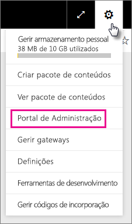

Há nove separadores no portal. O resto deste artigo disponibiliza informações sobre cada um destes separadores.

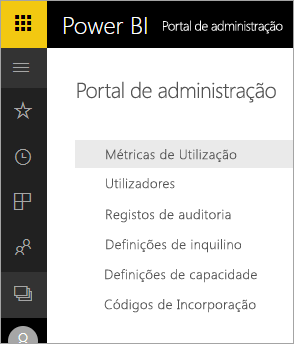

* [Métricas de utilização](#usage-metrics)
* [Utilizadores](#users)
* [Registos de auditoria](#audit-logs)
* [Definições de inquilino](#tenant-settings)
* [Definições de capacidade](#capacity-settings)
* [Códigos de incorporação](#embed-codes)
* [Elemento visuais da organização](#organization-visuals)
* [Fluxo de dados armazenamento (pré-visualização)](#dataflowStorage)
* [Áreas de trabalho](#workspaces)

## Métricas de utilização

As **Métricas de utilização** permitem-lhe monitorizar a utilização do Power BI da sua organização. Permite também ver quais os utilizadores e os grupos mais ativos no Power BI para a sua organização.

> [!NOTE]
> Quando aceder ao dashboard pela primeira vez ou depois de voltar após um período longo em que não visualizou o dashboard, provavelmente verá um ecrã de carregamento enquanto carregamos o dashboard.

Após o carregamento do dashboard, verá duas secções de mosaicos. A primeira secção inclui os dados de utilização dos utilizadores individuais e a segunda secção tem informações semelhantes dos grupos na sua organização.

Veja a seguir uma análise detalhada do que pode ver em cada mosaico:

* Contagem distinta de todos os dashboards, relatórios e conjuntos de dados na área de trabalho do utilizador
  
    

* O dashboard mais consumido pelo número de utilizadores que podem aceder ao mesmo. Por exemplo, se tiver um dashboard partilhado com três utilizadores e também o tiver adicionado a um pacote de conteúdos com dois utilizadores diferentes ligados, a contagem será 6 (1 + 3 + 2)
  
    

* Os utilizadores de conteúdo mais populares ligados ao mesmo. Isto será qualquer item a que os utilizadores possam aceder através do processo Obter Dados, como pacotes de conteúdos SaaS, pacotes de conteúdos Organizacionais, ficheiros ou bases de dados.
  
    

* Uma vista dos principais utilizadores com base no número de dashboards que têm, tanto os dashboards que criaram como os dashboards partilhados com eles.
  
    

* Uma vista dos principais utilizadores com base no número de relatórios que têm.
  
    

A segunda secção apresenta o mesmo tipo de informação, mas com base em grupos. Tal permite-lhe ver quais os grupos mais ativos na sua organização e o tipo de conteúdo que estão a consumir.

Com estas informações, pode obter informações reais relativamente à forma como as pessoas estão a utilizar o Power BI na sua organização e reconhecer os utilizadores e grupos que são muito ativos na sua organização.

## Utilizadores

Os utilizadores, grupos e administradores do Power BI são geridos no centro de administração do Microsoft 365. O separador **Utilizadores** disponibiliza uma ligação para o centro de administração do seu inquilino.

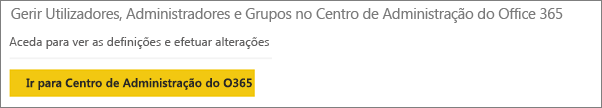

## Registos de auditoria

Os registos de auditoria do Power BI são geridos no centro de Segurança e Conformidade do Office 365. O separador **Registos de auditoria** proporciona uma ligação para o centro de Segurança e Conformidade do seu inquilino. [Saiba mais](service-admin-auditing.md)

Para utilizar os registos de auditoria, verifique se a definição [**Criar registos de auditoria para auditoria de atividade interna e de conformidade**](#create-audit-logs-for-internal-activity-auditing-and-compliance) está ativada.

## Definições de inquilino

O separador **Definições de inquilino** permite um controlo refinado sobre as funcionalidades que são disponibilizadas à sua organização. Se tiver problemas com dados confidenciais, algumas das nossas funcionalidades poderão não ser adequadas para a sua organização ou poderá querer apenas uma determinada funcionalidade disponível para um grupo específico.

A imagem seguinte mostra as duas primeiras secções do separador **Definições de inquilino**.

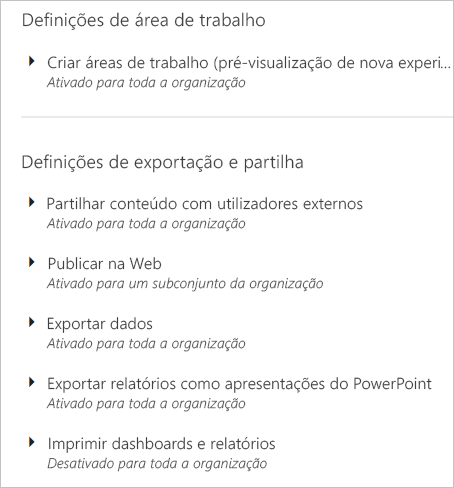

> [!NOTE]
> Pode demorar até 10 minutos para a alteração à definição ter efeito para todos os utilizadores no inquilino.

As definições podem ter três estados:

* **Desativado para toda a organização**: Ninguém na sua organização pode utilizar esta funcionalidade.

    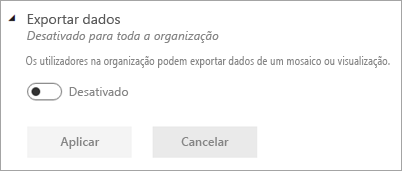

* **Ativado para toda a organização**: Todas as pessoas na sua organização podem utilizar esta funcionalidade.

    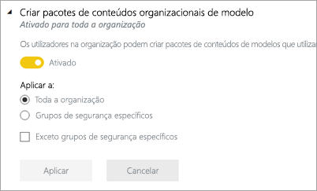

* **Ativado para um subconjunto da organização**: Um subconjunto específico de utilizadores ou grupos na sua organização pode utilizar esta funcionalidade.

    Pode ativar a funcionalidade para toda a organização, exceto para um grupo específico de utilizadores.

    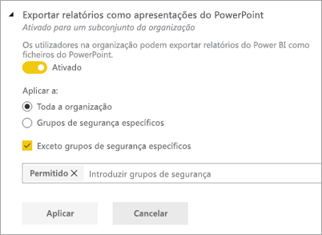

    Pode também ativar a funcionalidade apenas para um grupo específico de utilizadores ou desativá-la para um grupo de utilizadores. Utilizar esta abordagem assegura que determinados utilizadores não tenham acesso à funcionalidade mesmo que estejam no grupo permitido.

    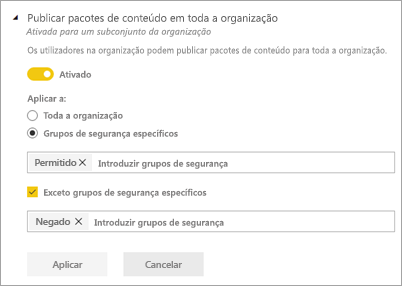

As próximas secções fornecem uma descrição geral dos diferentes tipos de definições de inquilino.

## Ajuda e suporte de definições

### Publicar informações "Obter ajuda"

Os utilizadores na organização podem ir para a ajuda interna recursos e suporte no menu de ajuda do Power BI. Especificamente, esses parâmetros alterar o comportamento dos itens de menu de ajuda saiba, Comunidade e Get.

Também é possível especificar um URL para direcionar os utilizadores para uma solução personalizada para pedidos de licenciamento. Este parâmetro personaliza o URL de destino do botão de atualização de conta que um utilizador sem uma licença do Power BI Pro pode encontrar na atualização para o Power BI Pro caixa de diálogo, bem como em página Gerir armazenamento pessoal.

## Definições de área de trabalho

### Criar áreas de trabalho

Os administradores utilizam o **criar áreas de trabalho** definição para indicar quais os utilizadores na organização podem criar áreas de trabalho de aplicação para colaborar em dashboards, relatórios e outros conteúdos. Saiba mais sobre [áreas de trabalho de aplicação](service-create-the-new-workspaces.md).

O portal de administração tem outra secção de definições sobre as áreas de trabalho no seu inquilino. Nesta secção, pode ordenar e filtrar a lista de áreas de trabalho e apresentar os detalhes para cada área de trabalho. Ver [áreas de trabalho](#workspaces) para obter detalhes.

No portal de administração, também controla quais usuários têm permissão para distribuir aplicações para a organização. Ver [publicar aplicações e pacotes de conteúdos para toda a organização](#publish-content-packs-and-apps-to-the-entire-organization) neste artigo para obter detalhes.

## Definições de exportação e partilha

### Partilhar conteúdo com utilizadores externos

Os utilizadores na organização podem partilhar dashboards com utilizadores fora da organização. [Saiba mais](service-share-dashboards.md#share-a-dashboard-or-report-with-people-outside-your-organization)

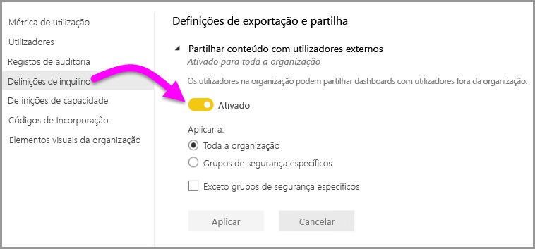

A imagem seguinte mostra a mensagem que aparece quando partilha com um utilizador externo.

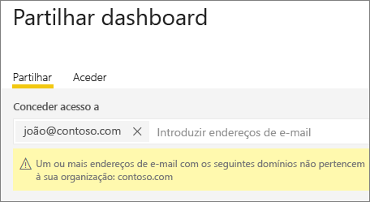  

### Publicar na Web

Os utilizadores na organização podem publicar os relatórios na Web. [Saiba mais](service-publish-to-web.md)

A imagem seguinte mostra o menu **Ficheiro** de um relatório quando a definição **Publicar na Web** está ativada.

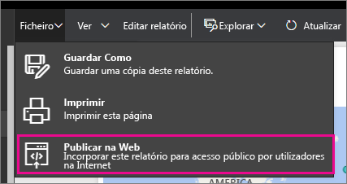

Os utilizadores veem opções diferentes na IU consoante a definição **Publicar na Web**.

|Feature |Ativada para toda a organização |Desativada para toda a organização |Grupos de segurança específicos   |
|---------|---------|---------|---------|
|**Publicar na Web**, no menu **Ficheiro** do relatório.|Ativada para todos|Não visível para todos|Visível apenas para utilizadores ou grupos autorizados.|
|**Gerir códigos de incorporação**, em **Definições**|Ativada para todos|Ativada para todos|Ativada para todos  * A opção **Eliminar** está ativada apenas para utilizadores e grupos autorizados. * A opção **Obter códigos** está ativada para todos.|
|**Incorporar códigos** no portal de administração|O estado é um dos seguintes: * Ativo * Não suportado * Bloqueado|O estado apresenta **Desativado**|O estado é um dos seguintes: * Ativo * Não suportado * Bloqueado  Se um utilizador não tiver autorizações com base na definição do inquilino, o estado apresentado será **Em violação**.|
|Relatórios publicados existentes|Todos ativados|Todos desativados|Os relatórios continuam a ser compostos para todos.|

### Exportar dados

Os utilizadores na organização podem exportar dados de um mosaico ou visualização. [Saiba mais](visuals/power-bi-visualization-export-data.md)

A imagem seguinte mostra a opção para exportar os dados de um mosaico.

> [!NOTE]
> Desativar a opção **Exportar Dados** também impede os utilizadores de usarem a funcionalidade **Analisar no Excel**, bem como a ligação em direto do serviço Power BI.

### Exportar relatórios como apresentações do PowerPoint ou documentos PDF

Os utilizadores na organização podem exportar relatórios do Power BI como ficheiros do PowerPoint ou documentos PDF. [Saiba mais](consumer/end-user-powerpoint.md)

A seguinte imagem mostra o menu **Ficheiro** de um relatório quando a definição **Exportar relatórios como apresentações do PowerPoint ou documentos PDF** está ativada.

### Imprimir dashboards e relatórios

Os utilizadores na organização podem imprimir dashboards e relatórios. [Saiba mais](consumer/end-user-print.md)

A imagem seguinte mostra a opção para imprimir um dashboard.

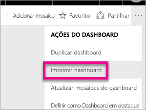

A imagem seguinte mostra o menu **Ficheiro** de um relatório quando a definição **Imprimir dashboards e relatórios** está ativada.

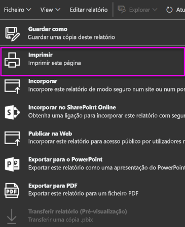

### Permitir aos utilizadores externos convidados editarem e gerirem conteúdo na organização
Os utilizadores convidados do Azure B2B podem editar e gerir o conteúdo na organização. [Saiba mais](service-admin-azure-ad-b2b.md)

A seguinte imagem mostra a opção Permitir aos utilizadores externos convidados editarem e gerirem conteúdo na organização.

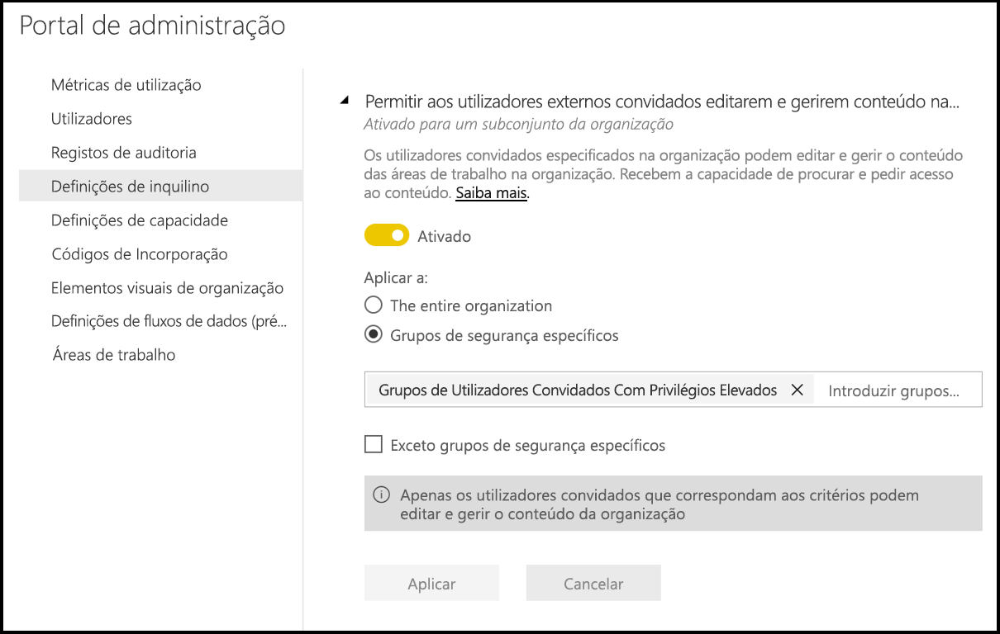

## Definições da aplicação e do pacote de conteúdos

### Publicar pacotes de conteúdo e aplicações em toda a organização

Os administradores utilizar esta definição para decidir quais os utilizadores podem publicar aplicações e pacotes de conteúdos de toda a organização, em vez de grupos específicos apenas. Saiba mais sobre [publicação de aplicações](service-create-distribute-apps.md).

A imagem seguinte mostra a opção **A minha organização inteira** durante a criação de um pacote de conteúdos.

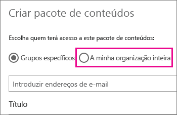

### Criar modelo de aplicações e pacotes de conteúdos organizacionais

Os utilizadores na organização podem criar aplicações de modelo e pacotes de conteúdos organizacionais que utilizam conjuntos de dados incorporados numa origem de dados no Power BI Desktop. Saiba mais sobre [aplicações de modelo](template-content-pack-authoring.md).

### Aplicações push para utilizadores finais

Os criadores de relatórios, podem partilhar aplicações diretamente com os utilizadores finais sem necessitar da instalação do [AppSource](https://appsource.microsoft.com). Saiba mais sobre [instalar automaticamente as aplicações para os utilizadores finais](service-create-distribute-apps.md#automatically-install-apps-for-end-users).

## Definições de integração

### Fazer perguntas sobre dados através do Cortana

Os utilizadores na organização podem fazer perguntas sobre os respetivos dados através do Cortana. [Saiba mais](service-cortana-enable.md)

> [!NOTE]
> Esta definição aplica-se a toda a organização e não pode estar limitada a grupos específicos.

### Utilizar a funcionalidade Analisar no Excel com conjuntos de dados no local

Os utilizadores na organização podem utilizar o Excel para ver e interagir com conjuntos de dados no local do Power BI. [Saiba mais](service-analyze-in-excel.md)

> [!NOTE]
> Desativar a opção **Exportar Dados** também impede os utilizadores de usarem a funcionalidade **Analisar no Excel**.

### Utilizar o ArcGIS Maps for Power BI

Os utilizadores na organização podem utilizar a visualização dos ArcGIS Maps for Power BI fornecida pela Esri. [Saiba mais](visuals/power-bi-visualization-arcgis.md)

### Utilizar a pesquisa global para o Power BI (Pré-visualização)

Os utilizadores na organização podem utilizar as funcionalidades de pesquisa externa que dependem do Azure Search. Por exemplo, os utilizadores podem utilizar a Cortana para obterem informações-chave diretamente dos dashboards e relatórios do Power BI. [Saiba mais](service-cortana-intro.md)

## Definições de elementos visuais personalizados

### Adicionar e utilizar elementos visuais personalizados

Os utilizadores na organização podem interagir e partilhar elementos visuais personalizados. [Saiba mais](power-bi-custom-visuals.md)

> [!NOTE]
> Esta definição pode ser aplicada a toda a organização ou pode ser limitada a grupos específicos.

O Power BI Desktop (a partir do lançamento de março de 2019) suporta a utilização da **Política de Grupo** para desativar a utilização de elementos visuais personalizados nos computadores implementados numa organização.

<table>
<tr><th>Attribute</th><th>Valor</th>
</tr>
<td>chave</td>
    <td>Software\Policies\Microsoft\Power BI Desktop\</td>
<tr>
<td>valueName</td>
<td>EnableCustomVisuals</td>
</tr>
</table>

Um valor de 1 (decimal) ativa a utilização de elementos visuais personalizados no Power BI (esta é a predefinição).

Um valor de 0 (decimal) desativa a utilização de elementos visuais personalizados no Power BI.

### Permitir apenas elementos visuais certificados

Os utilizadores na organização que receberam permissões para adicionar e utilizar elementos visuais personalizados, representado pela definição "Adicionar e utilizar elementos visuais personalizados", só poderão utilizar [elementos visuais personalizados certificados](https://go.microsoft.com/fwlink/?linkid=2002010) (os elementos visuais não certificados serão bloqueados e apresentarão uma mensagem de erro quando utilizados). 

O Power BI Desktop (a partir do lançamento de março de 2019) suporta a utilização da **Política de Grupo** para desativar a utilização de elementos visuais personalizados não certificados nos computadores implementados numa organização.

<table>
<tr><th>Attribute</th><th>Valor</th>
</tr>
<td>chave</td>
    <td>Software\Policies\Microsoft\Power BI Desktop\</td>
<tr>
<td>valueName</td>
<td>EnableUncertifiedVisuals</td>
</tr>
</table>

Um valor de 1 (decimal) ativa a utilização de elementos visuais personalizados não certificados no Power BI (esta é a predefinição).

Um valor de 0 (decimal) desativa a utilização de elementos visuais personalizados não certificados no Power BI (esta opção só ativa a utilização de [elementos visuais personalizados certificados](https://go.microsoft.com/fwlink/?linkid=2002010)).

## Definições de elementos visuais R

### Interagir e partilhar visuais R

Os utilizadores na organização podem interagir e partilhar elementos visuais criados com scripts R. [Saiba mais](visuals/service-r-visuals.md)

> [!NOTE]
> Esta definição aplica-se a toda a organização e não pode estar limitada a grupos específicos.

## Definições de utilização e auditoria

### Criar registos de auditoria para auditoria de atividade interna e de conformidade

Os utilizadores na organização podem utilizar a auditoria para monitorizar as ações executadas no Power BI por outros utilizadores na organização. [Saiba mais](service-admin-auditing.md)

Esta definição tem de estar ativada para as entradas de registo de auditoria serem registadas. Pode existir um intervalo de 48 horas entre a ativação da auditoria e a capacidade de ver os dados da mesma. Se não vir logo os seus dados, consulte os registos de auditoria mais tarde. Pode existir um intervalo de tempo semelhante entre obter a permissão para ver os registos de auditoria e ter acesso aos mesmos.

> [!NOTE]
> Esta definição aplica-se a toda a organização e não pode estar limitada a grupos específicos.

### Métricas de utilização para criadores de conteúdo

Os utilizadores na organização podem ver as métricas de utilização dos dashboards e os relatórios que criam. [Saiba mais](service-usage-metrics.md)

### Dados por utilizador em métricas de utilização para criadores de conteúdo

As métricas de utilização para os criadores de conteúdo irão expor nomes a apresentar e endereços de e-mail de utilizadores que estão a aceder ao conteúdo. [Saiba mais](service-usage-metrics.md)

Por predefinição, os dados por utilizador estão ativados para métricas de utilização e as informações da conta do criador de conteúdo estão incluídas no relatório de métricas. Se não quiser incluir estas informações para alguns ou para todos os utilizadores, desative a funcionalidade para grupos de segurança específicos ou para toda a organização. As informações da conta serão apresentadas no relatório como *Sem nome*.

## Definições do dashboard

### Classificação de dados para dashboards

Os utilizadores na organização podem identificar os dashboards com classificações que indicam os seus níveis de segurança. [Saiba mais](service-data-classification.md)

> [!NOTE]
> Esta definição aplica-se a toda a organização e não pode estar limitada a grupos específicos.

## Definições de programador

### Incorporar conteúdo em aplicações

Os utilizadores na organização podem incorporar dashboards e relatórios do Power BI em aplicações Software como Serviço (SaaS). Desativar esta definição impede os utilizadores de usarem as APIs REST para incorporar conteúdo do Power BI na respetiva aplicação. [Saiba mais](developer/embedding.md)

### Permitir que os principais de serviço utilizem as APIs do Power BI

Aplicações Web registadas no Azure Active Directory (Azure AD) irão utilizar um principal de serviço atribuído para aceder a APIs do Power BI sem um utilizador com sessão iniciada. Para permitir que uma aplicação para utilizar a autenticação do principal de serviço seu principal de serviço tem de ser incluído num grupo de segurança permitidas. [Saiba mais](developer/embed-service-principal.md)

> [!NOTE]
> Os principais de serviço herdam as permissões de todas as definições do inquilino do Power BI do respetivo grupo de segurança. Para restringir as permissões, crie um grupo de segurança dedicado para os principais de serviço e adicione-o à lista "Exceto grupos de segurança específicos" para as definições do Power BI relevantes ativadas.

## Definições de fluxos de dados

### Criar e utilizar fluxos de dados

Os utilizadores na organização podem criar e utilizar fluxos de dados. Para uma descrição geral dos fluxos de dados, consulte [de preparação de dados de Self-serviços no Power BI](service-dataflows-overview.md). Para ativar os fluxos de dados numa capacidade Premium, veja [Configurar cargas de trabalho](service-admin-premium-workloads.md).

> [!NOTE]
> Esta definição aplica-se a toda a organização e não pode estar limitada a grupos específicos.

## Definições de aplicações de modelo (pré-visualização)

Existem duas definições que controlam aplicações de modelo. 

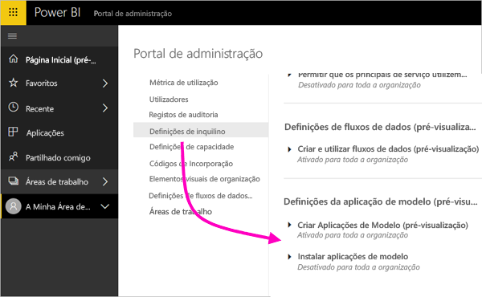

### Criar Aplicações de Modelo (pré-visualização)

Os utilizadores na organização podem criar aplicações de modelo. Os criadores de aplicações do modelo podem, em seguida, distribuí-los para os clientes fora da sua organização por meio de [AppSource](https://appsource.microsoft.com) ou outros métodos de distribuição.

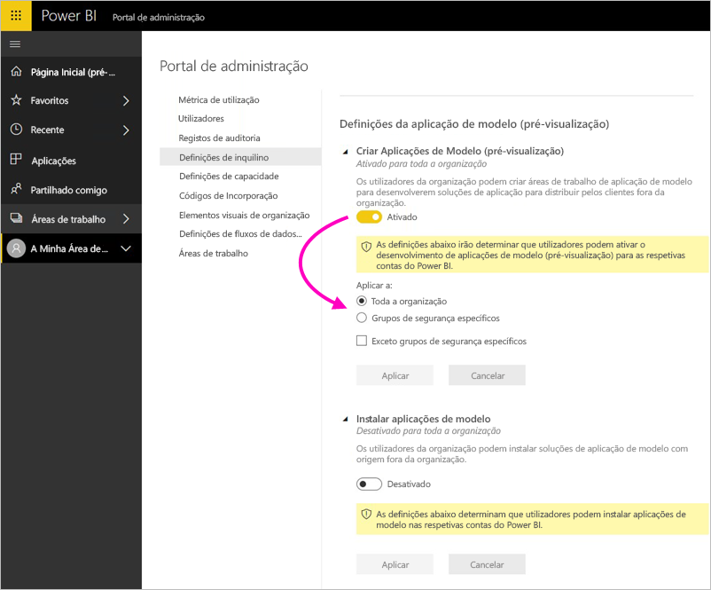

### Instalar aplicações de modelo (pré-visualização)

Os utilizadores na organização podem transferir e instalar aplicações a partir de modelo [AppSource](https://appsource.microsoft.com) ou de outra origem.

> [!NOTE]
> Esta definição determina quais os utilizadores podem instalar aplicações de modelo nas respetivas contas do Power BI.

## Definições de capacidade

### Power BI Premium

O separador **Power BI Premium** permite-lhe gerir todas as capacidades do Power BI Premium (SKU EM ou P) compradas para a sua organização. Todos os utilizadores na organização podem ver o separador **Power BI Premium**, mas apenas verão os conteúdos no mesmo se estiverem atribuídos como *Administrador de capacidade* ou como um utilizador com permissões de atribuição. Se um utilizador não tiver nenhuma permissão, será apresentada a mensagem seguinte.

### Power BI Incorporado

O separador **Power BI Embedded** permite-lhe ver as capacidades do Power BI Embedded (SKU A) que comprou para o seu cliente. Uma vez que só poderá comprar A SKUs do Azure, [gerir capacidades incorporadas no Azure](developer/azure-pbie-create-capacity.md) partir **portal do Azure**.

Para obter mais informações sobre como gerir as definições do Power BI Embedded (SKU A), veja [O que é o Power BI Embedded?](developer/azure-pbie-what-is-power-bi-embedded.md)

## Códigos de incorporação

Enquanto administrador, pode ver os códigos de incorporação gerados para o seu inquilino. Também pode revogar ou eliminar códigos. [Saiba mais](service-publish-to-web.md)

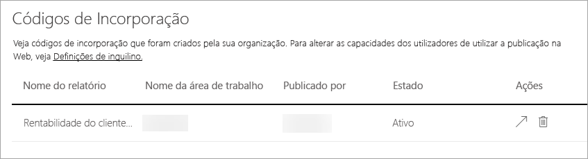

## <a name="organizational-visuals">Elemento visuais da organização</a>

O separador **Elementos visuais da organização** permite-lhe implementar e gerir os elementos visuais personalizados na sua organização. Com os elementos visuais organizacionais, pode facilmente implementar elementos visuais proprietários na sua organização, os quais os autores dos relatórios podem posteriormente detetar e importar para os seus relatórios do Power BI Desktop. [Saiba mais](power-bi-custom-visuals-organization.md)

> [!WARNING]
> Um elemento visual personalizado pode conter código com riscos de privacidade ou de segurança. Garanta que confia no autor e na origem do elemento visual personalizado antes de implementar no repositório da organização.

A página seguinte mostra todos os elementos visuais personalizados que estão atualmente implementados no repositório da organização.

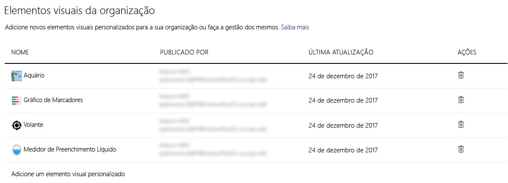

### Adicionar um novo elemento visual personalizado

Para adicionar um novo elemento visual personalizado à lista, siga estes passos. 

1. No painel direito, selecione **Adicionar um elemento visual personalizado**.

    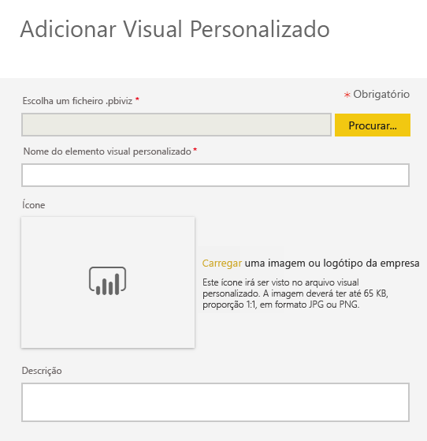

1. Preencha o formulário **Adicionar elemento visual personalizado**:

    * **Escolher um ficheiro .pbiviz** (obrigatório): selecione um ficheiro de elemento visual personalizado para carregar. Apenas são suportados os elementos visuais personalizados com a versão da API (leia aqui o que significa).

    Antes de carregar um elemento visual personalizado, deverá verificar a segurança e privacidade desse elemento visual para garantir que este cumpre os padrões da sua organização.

    * **Atribuir um nome ao elemento visual personalizado** (obrigatório): atribua um título curto ao elemento visual para que os utilizadores do Power BI Desktop compreendam facilmente o que faz

    * **Ícone**: O ficheiro de ícones que é mostrado na IU do Power BI Desktop.

    * **Descrição**: uma breve descrição do elemento visual para proporcionar mais contexto e informação ao utilizador

1. Selecione **Adicionar** para iniciar o pedido de carregamento. Se tiver êxito, poderá ver o novo item na lista. Se falhar, receberá uma mensagem de erro apropriada

### Eliminar um elemento visual personalizado da lista

Selecione o ícone de caixote do lixo para eliminar permanentemente um elemento visual no repositório.

> [!IMPORTANT]
> A eliminação é irreversível. Depois de eliminado, o elemento visual deixa imediatamente de ser composto nos relatórios existentes. Mesmo que carregue o mesmo elemento visual novamente, este não substitui o anterior que foi eliminado. No entanto, os utilizadores podem importar novamente o novo elemento visual e substituir a instância presente nos seus relatórios.

### Desativar um elemento visual personalizado na lista

Para desativar o elemento visual na loja organizacional, selecione o ícone de engrenagem. Na secção **Acesso**, desative o elemento visual personalizado.

Depois de desativar o elemento visual, este não será composto nos relatórios existentes e será apresentada a mensagem de erro abaixo.

*Este elemento visual personalizado já não está disponível. Contacte o seu administrador para obter detalhes.*

No entanto, os elementos visuais que são marcadores continuam a funcionar.

Após qualquer atualização ou alteração de administrador, os utilizadores do Power BI Desktop devem reiniciar a aplicação ou atualizar o browser no serviço Power BI para ver as atualizações.

### Atualizar um elemento visual

Para atualizar o elemento visual na loja organizacional, selecione o ícone de engrenagem. Procure e carregue uma nova versão do elemento visual.

Confirme que o ID de Elemento Visual permanece inalterado. O novo ficheiro substituirá o ficheiro anterior em todos os relatórios da organização. Contudo, se houver a possibilidade de a nova versão do elemento visual interromper qualquer utilização ou estrutura de dados da versão anterior do elemento visual, não substitua a versão anterior. Em vez disso, deve criar uma nova lista para a nova versão do elemento visual. Por exemplo, adicione um novo número de versão (versão X.X) ao título do novo elemento visual listado. Desta forma, torna-se claro que é o mesmo elemento visual apenas com um número de versão atualizado, assim, os relatórios existentes não vão interromper a sua funcionalidade. Novamente, verifique se o ID de Elemento Visual permanece inalterado. Da próxima vez que os utilizadores entrarem no repositório da organização a partir do Power BI Desktop, poderão importar a nova versão, que pedirá a substituição da versão atual que têm no relatório.

Para obter mais informações, visite [Perguntas frequentes sobre os elementos visuais personalizados organizacionais](https://docs.microsoft.com/power-bi/power-bi-custom-visuals-faq#organizational-custom-visuals)

## <a name="dataflowStorage">Fluxo de dados armazenamento (pré-visualização)</a>

Por predefinição, os dados utilizados com o Power BI são armazenados no armazenamento interno fornecido pelo Power BI. Com a integração dos fluxos de dados e do Azure Data Lake Storage Gen2 (ADLS Gen2), pode armazenar os seus fluxos de dados na conta do Azure Data Lake Storage Gen2 da sua organização. Para obter mais informações, veja [Fluxos de dados e integração do Azure Data Lake (Pré-visualização)](service-dataflows-azure-data-lake-integration.md).

## Áreas de trabalho

Enquanto administrador, pode ver as áreas de trabalho existentes no seu inquilino. Pode ordenar e filtrar a lista de áreas de trabalho e ver os detalhes de cada área de trabalho. As colunas da tabela correspondem para as propriedades retornadas pela [administrador do Power BI Rest API](/rest/api/power-bi/admin) para áreas de trabalho. Áreas de trabalho pessoais são do tipo **PersonalGroup**, áreas de trabalho clássicas são do tipo **grupo**, e as novas áreas de trabalho de experiência de área de trabalho são do tipo **área de trabalho**. Para obter mais informações, consulte [criar novas áreas de trabalho no Power BI](service-create-the-new-workspaces.md).

## Próximos passos

[Administrar o Power BI na sua Organização](service-admin-administering-power-bi-in-your-organization.md)  
[Compreender a função de administrador do Power BI](service-admin-role.md)  
[Fazer a auditoria do Power BI na sua organização](service-admin-auditing.md)  

Mais perguntas? [Experimente perguntar à Comunidade do Power BI](https://community.powerbi.com/)
