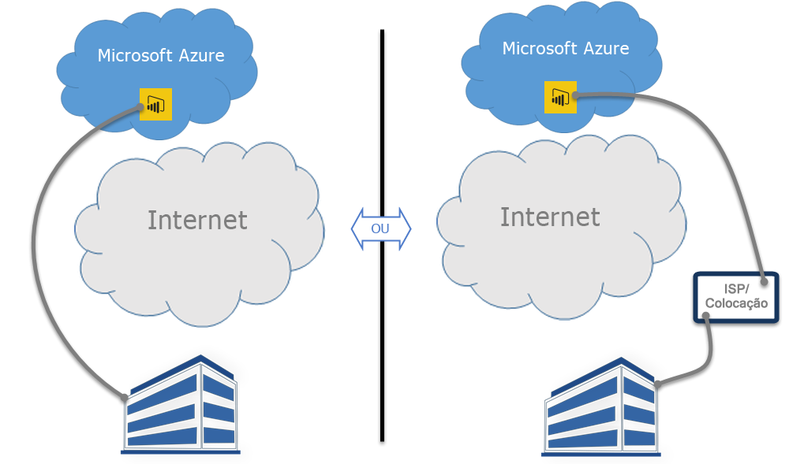

# Power BI e ExpressRoute
Com o **Power BI** e o **ExpressRoute**, pode criar uma ligação de rede privada entre a sua organização e o Power BI (ou através de um recurso de colocação de um ISP) ao ignorar a Internet para proteger melhor as ligações e os dados confidenciais do Power BI.

O **ExpressRoute** é um serviço do Azure que permite criar ligações privadas entre datacenters do Azure (nos quais o Power BI reside) e a sua infraestrutura no local ou entre datacenters do Azure e o seu ambiente de colocação.

Pode obter [mais informações sobre o ExpressRoute](https://azure.microsoft.com/services/expressroute/) ou sobre [como se inscrever](https://azure.microsoft.com/pricing/details/expressroute/).

> [!NOTE]
> O Power BI é suportado no modo de peering público, conforme descrito [nestas FAQ](https://docs.microsoft.com/azure/expressroute/expressroute-faqs).
> 
> 

## Exceções do ExpressRoute para o Power BI
O Power BI está em conformidade com o ExpressRoute, exceto nos casos em que o Power BI recebe ou envia dados pela Internet pública. Em geral, estas exceções específicas incluem dados estáticos, como ficheiros de configuração do browser que são transferidos a partir do nó mais próximo da **CDN (Rede de Entrega de Conteúdos)**. Existem algumas exceções gerais que se aplicam ao Power BI, em comparação com outras que são específicas do serviço ou da funcionalidade. Veja cada uma delas nas secções seguintes.

### Exceções Gerais ao Power BI e ao ExpressRoute
Uma exceção ao **Power BI** e ao **ExpressRoute** significa que os dados transmitidos para ou a partir do Power BI são enviados pela Internet pública, em vez de transmitidos pela ligação privada do ExpressRoute.

As duas exceções gerais ao Power BI que utilizam o ExpressRoute são:

* Ficheiros estáticos transferidos através da **Rede de Entrega de Conteúdos (CDN)** e de sites
* Dados **telemétricos** enviados pela Internet pública

O Power BI utiliza várias **Redes de Entrega de Conteúdos (CDNs)** ou sites para distribuir de modo eficiente o conteúdo e os ficheiros estáticos necessários para os utilizadores com base na região geográfica pela Internet pública. Estes ficheiros estáticos incluem transferências de produtos (como o **Power BI Desktop**, **Gateway de dados no local**, ou **Pacotes de Conteúdo do Power BI** de vários fornecedores de serviço independentes), ficheiros de configuração do browser que são utilizados para iniciar e estabelecer quaisquer ligações posteriores com o Power BI, bem como a página de início de sessão seguro inicial do Power BI – as credenciais reais são enviadas apenas pelo ExpressRoute.   

Alguns **dados telemétricos** também são enviados pela Internet pública e pelo ExpressRoute. Os dados telemétricos incluem estatísticas de utilização e dados semelhantes, que são transmitidos aos serviços utilizados para monitorizar a utilização e a atividade.

### Aplicação SaaS do Power BI e ExpressRoute
Quando um utilizador inicia uma ligação com o serviço Power BI (powerbi.com ou através do Cortana), a Página de Destino do Power BI, a página de início de sessão e os ficheiros estáticos que preparam o browser para ligar e interagir com o Power BI são obtidos a partir de uma CDN ou de sites, que se ligam pela Internet pública.

Assim que é estabelecido o início de sessão, as interações de dados do Power BI subsequentes ocorrem através do ExpressRoute, à exceção de determinadas funcionalidades e serviços que dependem de dados da Internet pública:

* O **mapeamento de elementos visuais** requer ligação e transmissão de dados para o serviço Bing Virtual Earth ou o serviço de geocodificação do Bing, cada um deles estabelecido pela Internet pública.
* A integração do Power BI com o **Cortana** requer acesso ao Bing pela Internet pública.
* Quando um utilizador adiciona **ligações personalizadas**, como um widget de imagem ou vídeo, o Power BI solicita os dados com base na ligação fornecida pelo utilizador, que pode ou não utilizar o ExpressRoute.
* Os utilizadores podem enviar **comentários para o Power BI** em texto (e, opcionalmente, em imagens) através do mecanismo de comentários do User Voice, que utiliza a Internet pública na transmissão.
* O **fornecedor de conteúdos do Bing Notícias** transfere o conteúdo do Bing através da Internet pública.
* Ao ligar a **aplicações** (por exemplo, pacotes de conteúdos), geralmente, os utilizadores têm de introduzir credenciais e definições através das páginas fornecidas pelo fornecedor SaaS. Essas páginas podem ou não utilizar o ExpressRoute.

| Atividade do Utilizador | Destino |
| --- | --- |
| Página de destino (antes do início de sessão) |`maxcdn.bootstrapcdn.com ; ajax.aspnetcdn.com ; netdna.bootstrapcdn.com ; cdn.optimizely.com; google-analytics.com ` |
| Início de sessão |`*.mktoresp.com ; *.aadcdn.microsoftonline-p.com ; *.msecnd.com ; *.localytics.com ; ajax.aspnetcdn.com` |
| Gestão de dashboards, relatórios e conjuntos de dados (incluindo mapas e geocodificação) |`*.localytics.com ; *.virtualearth.net ; platform.bing.com; powerbi.microsoft.com; c.microsoft.com; app.powerbi.com; *.powerbi.com; dc.services.visualstudio.com ` |
| Suporte |`support.powerbi.com ; powerbi.uservoice.com ; go.microsoft.com ` |

### Power BI Desktop e ExpressRoute
O Power BI Desktop também está em conformidade com o ExpressRoute, com algumas exceções descritas na seguinte lista:

* As **notificações de atualização**, utilizadas para detetar se os utilizadores têm a versão mais recente do Power BI Desktop, são enviadas pela Internet pública.
* Alguns **dados telemétricos** são enviados pela Internet pública.
* O **mapeamento de elementos visuais** requer ligação e transmissão de dados para o serviço do **Bing Virtual Earth** ou o serviço de **geocodificação do Bing**, cada um deles estabelecido pela Internet pública.
* A funcionalidade **Obter Dados** de várias origens de dados, como **Web** ou fornecedores SaaS de terceiros, utiliza a Internet pública.

### PaaS do Power BI e ExpressRoute
O Power BI oferece APIs e outras funcionalidades baseadas na plataforma que permitem aos programadores criar soluções e aplicações personalizadas do Power BI. Os serviços seguintes, além dos dados telemétricos e da CDN mencionados anteriormente neste tópico, são utilizados durante a transmissão de dados de PaaS do Power BI pela Internet pública:

| Atividade de PaaS | Destinos adicionais utilizados |
| --- | --- |
| Incorporação pública (telemetria) |`c1.microsoft.com` |
| Elementos visuais personalizados (CDN) |`*.azureedge.net` |

Alguns **elementos visuais personalizados** são criados por terceiros, enquanto outros são criados pela Microsoft. Estes podem ou não utilizar o ExpressRoute.

### Power BI Mobile e ExpressRoute
Este documento não aborda a utilização de aplicações móveis do Power BI.  

### Gateway de dadose ExpressRoute no local
Quando um **Gateway de dados no local** é utilizado com o Power BI, as transmissões estão em conformidade com o ExpressRoute, exceto as atividades do utilizador documentadas na secção **Aplicação SaaS do Power BI e ExpressRoute** encontrada anteriormente neste tópico.  

