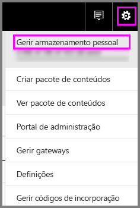
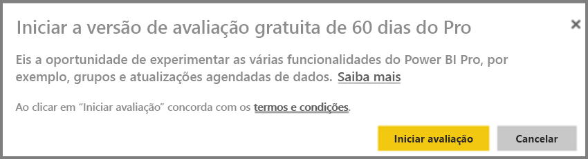
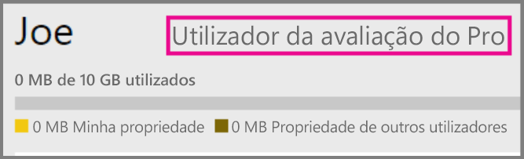
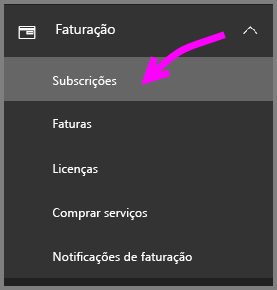
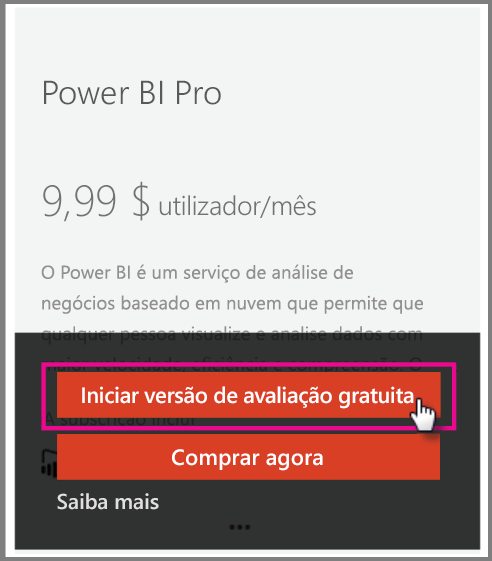

# O Power BI Pro na sua organização

O Power BI Pro é um conjunto de licenças pagas que dão acesso a mais funcionalidades. As licenças do Power BI Pro destinam-se a equipas que queiram partilhar e colaborar com outras pessoas para tomar decisões condicionadas por dados.  Cada membro da equipa que esteja a criar ou a visualizar conteúdo partilhado do Power BI precisa de uma licença Pro, a menos que o conteúdo esteja associado a uma capacidade dedicada que utilize o Power BI Premium.

As seguintes funcionalidades necessitam de uma licença do Power BI Pro:

* **Analisar dados no Excel ou Power BI Desktop** – utilize o Excel ou o Power BI Desktop para ver e interagir com um conjunto de dados publicado no Power BI. Para obter mais informações, veja [Analisar no Excel](service-analyze-in-excel.md).

* **Partilhar dashboards e colaborar com áreas de trabalho** – as áreas de trabalho do Power BI facilitam a colaboração com colegas em dashboards, relatórios e conjuntos de dados. Para obter mais informações, veja [Colaborar na sua área de trabalho de aplicação do Power BI](service-collaborate-power-bi-workspace.md).

* **Ver conteúdo partilhado** – os utilizadores do Pro podem ver e interagir com dashboards e relatórios que são partilhados com os mesmos, bem como voltar a partilhá-los (caso tenham permissão para tal). No entanto, um utilizador da versão Pro não pode editar estes dashboards ou relatórios. Para obter mais informações, veja [Partilhar os seus dashboards e relatórios do Power BI com colegas e outras pessoas](service-share-dashboards.md).

* **Integrar conteúdo no Microsoft Teams** – pode adicionar um separador do Power BI num canal do Microsoft (MS) Teams. O MS Teams deteta automaticamente todos os relatórios na área de trabalho. Para obter mais informações, veja [Power BI teams up with Microsoft Teams](https://powerbi.microsoft.com/en-us/blog/power-bi-teams-up-with-microsoft-teams/) (O Power BI alia-se ao Microsoft Teams). 

## Versão de avaliação de 60 dias do Power BI Pro no serviço para particulares

Depois de se inscrever na sua conta gratuita, pode optar por experimentar o Pro gratuitamente durante 60 dias. Terá acesso a todas as funcionalidades do Pro durante o período de avaliação. O Power BI Pro tem todas as funcionalidades da versão gratuita do Power BI, além de funcionalidades adicionais de partilha e colaboração. Para obter mais informações, consulte [Preços do Power BI](https://powerbi.microsoft.com/en-us/pricing/). Para experimentar uma avaliação gratuita de 60 dias do Power BI Pro, inicie sessão no Power BI e experimente uma destas funcionalidades do Power BI Pro.

* [Criar uma área de trabalho](service-create-distribute-apps.md)
* [Partilhar um dashboard](service-share-dashboards.md)

Ao experimentar uma destas funcionalidades, será solicitado para iniciar a sua avaliação gratuita. Também pode optar por utilizá-la ao aceder ao ícone de engrenagem e selecionar Gerir armazenamento pessoal. Em seguida, selecione Experimentar o Pro gratuitamente à direita.

   
    
   

Em seguida, pode selecionar Iniciar avaliação.

   

> [!NOTE]
> Os utilizadores que tiram partido desta versão de avaliação do Power BI Pro no produto não aparecem no portal de administração do Office 365 como utilizadores da versão deAvaliação do Power BI Pro (aparecem como utilizadores da versão gratuita do Power BI). No entanto, aparecerão como utilizadores da Versão de Avaliação do Power BI Pro na página Gerir armazenamento do Power BI.
>

> [!NOTE]
> Se for um Administrador de TI interessado em comprar e implementar licenças de avaliação do Power BI para vários utilizadores na sua organização sem que estes tenham de aceitar os termos da avaliação individualmente, pode inscrever-se para obter uma avaliação da subscrição do Power BI Pro. Terá de ser um Administrador Global ou de Faturação do Office 365 ou criar um novo inquilino para se inscrever numa avaliação de administrador. Para obter mais informações, veja [Purchasing Power BI Pro (Comprar o Power BI Pro)](service-admin-purchasing-power-bi-pro.md).
>

Quando estiver ligado ao serviço, poderá verificar se tem uma conta de avaliação do Pro ao aceder ao ícone de engrenagem e ao selecionar Gerir armazenamento pessoal.

   

## Subscrição de avaliação no Office 365

Pode obter o Power BI Pro como uma avaliação para a sua organização. Assim que tiver a subscrição, pode atribuir licenças do Power BI Pro aos seus utilizadores. Para obter mais informações sobre como atribuir licenças, veja [Atribuir licenças a utilizadores no Office 365](https://support.office.com/en-us/article/assign-licenses-to-users-in-office-365-for-business-997596b5-4173-4627-b915-36abac6786dc?ui=en-US&rs=en-US&ad=US).

> [!NOTE]
> Não existe um limite de uma versão de avaliação organizacional por inquilino. Isto significa que, se alguém já tiver aplicado a Versão de avaliação do Power BI Pro ao inquilino, não pode fazê-lo novamente. Se precisar de assistência, pode contactar o [suporte de Faturação do Office 365](https://support.office.microsoft.com/en-us/article/contact-support-for-business-products-admin-help-32a17ca7-6fa0-4870-8a8d-e25ba4ccfd4b?CorrelationId=552bbf37-214f-4202-80cb-b94240dcd671&ui=en-US&rs=en-US&ad=US).
>

Siga estes passos para obter uma subscrição de avaliação no Office 365:

1. Navegue até ao [Centro de administração do Office 365](https://portal.office.com/adminportal/home#/homepage).
2. No painel de navegação esquerdo, selecione Faturação e, em seguida, clique em Subscrições.

   

3. Selecione Adicionar subscrições no lado direito.

   

4. Em Outros Planos, paire sobre a elipse (...) do Power BI Pro e selecione Iniciar avaliação gratuita.

    

5. No ecrã de confirmação do seu pedido, selecione Experimentar agora.
6. Selecione Continuar no recibo do pedido.

## Comprar o Power BI Pro

Pode comprar o Power BI Pro através do Microsoft Office 365 ou de um parceiro Microsoft certificado. Para obter mais informações sobre como comprar o Power BI Pro, veja [Comprar o Power BI Pro](service-admin-purchasing-power-bi-pro.md).

## Próximos passos
[Inscrição self-service no Power BI](service-admin-signing-up-for-power-bi-with-a-new-office-365-trial.md)
 
[Power BI (gratuito) na sua organização](service-admin-service-free-in-your-organization.md)
 
[Comprar o Power BI Pro](service-admin-purchasing-power-bi-pro.md)
 
[Ativação da Versão de Avaliação Pro alargada](service-extended-pro-trial.md)
 
[Assigning Power BI Pro licenses](service-admin-assigning-power-bi-pro-licenses.md) (Atribuir licenças do Power BI Pro)
 
[Power BI Premium - what is it?](service-admin-premium-manage.md) (Power BI Premium – o que é?)
 
[Como comprar o Power BI Premium](service-admin-premium-purchase.md)
 
[Documento técnico do Power BI Premium](https://aka.ms/pbipremiumwhitepaper)

Mais perguntas? [Experimente perguntar à Comunidade do Power BI](https://community.powerbi.com/)