# Gerir as capacidades no Power BI Premium e no Power BI Embedded
Saiba como pode gerir o Power BI Premium e as capacidades do Power BI Embedded, que fornece recursos dedicados para o seu conteúdo.

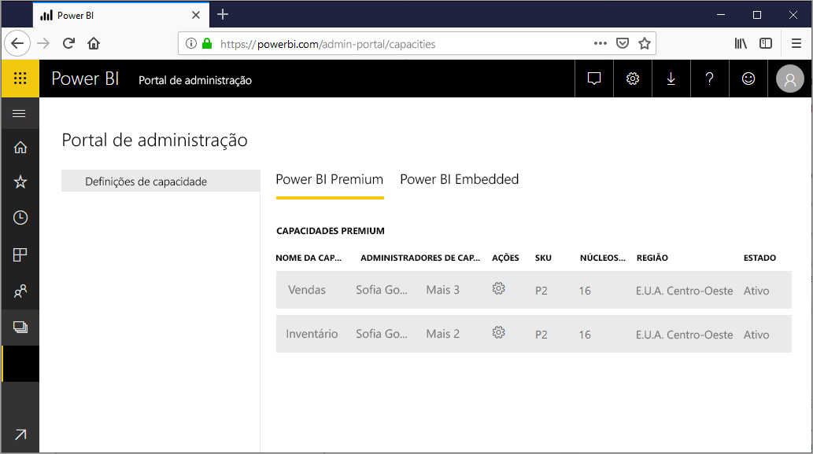

A capacidade é a parte principal das ofertas do Power BI Premium do Power BI e do Power BI Embedded.

## O que é a capacidade?
A capacidade é o conjunto de recursos reservados para utilização exclusiva por si. Ter capacidade permite-lhe publicar dashboards, relatórios e conjuntos de dados para os utilizadores em toda a organização sem ter de comprar licenças para os mesmos. Esta ação garante também um desempenho fiável e consistente do conteúdo alojado de capacidade.

A capacidade é totalmente transparente para os utilizadores finais. Vão continuar a utilizar o Power BI ou a aplicação como habitualmente. Não necessitam de saber que parte (ou a totalidade) do conteúdo está alojado na sua capacidade dedicada. Para os seus utilizadores, tudo funciona tal como antes.

[!INCLUDE [powerbi-premium-illustration](./includes/powerbi-premium-illustration.md)]

Para obter mais informações, consulte [O que é o Power BI Premium?](service-premium.md).

## Capacidade de compra
Para tirar partido da capacidade dedicada, terá de adquirir uma subscrição do Power BI Premium no Centro de administração do Office 365 ou criar um recurso do Power BI Embedded no portal do Microsoft Azure. Para obter mais informações, consulte o seguinte artigo:

* **Power BI Premium:** [como comprar o Power BI Premium](service-admin-premium-purchase.md)
* **Power BI Embedded:** vai estar disponível em breve.

Ao adquirir SKU do Power BI Premium, o seu inquilino vai receber o número correspondente de núcleos virtuais para utilização em capacidades de execução. Por exemplo, a compra de uma Power BI Premium P3 SKU fornece ao inquilino 32 núcleos virtuais.

## Administradores de capacidade
> [!NOTE]
> Os administradores de capacidade, para a capacidade do Power BI Embedded, são definidos no portal do Microsoft Azure.
> 
> 

Quando é atribuído ao utilizador a função de administrador de capacidade, este tem controlo total sobre a capacidade e as respetivas funcionalidades administrativas. Do portal de administração do Power BI, pode adicionar mais administrações de capacidade (apenas no Power BI Premium) ou conceder aos utilizadores permissões de atribuição de capacidade. Pode atribuir áreas de trabalho em massa a uma capacidade e visualizar a métrica de utilização uma capacidade.

Cada capacidade tem os seus próprios administradores. Definir um administrador de capacidade para uma capacidade não lhe concede acesso a todas as capacidades da sua organização. Por predefinição, os administradores de capacidade não têm acesso a todas as áreas de administração do Power BI, como a métrica de utilização, os registos de auditoria ou as definições de inquilino. Os administradores de capacidade também não dispõem de permissões para configurar novas capacidades ou alterar a SKU das capacidades existentes. Apenas os administradores globais ou os administradores de serviço Power BI têm acesso a essas opções.

Todos os administradores globais do Office 365 e administradores do Power BI são automaticamente administradores de capacidade das capacidades do Power BI Premium e do Power BI Embedded.

## Gerir capacidade
Depois de adquirir nós de capacidade do Office 365, em seguida, terá de configurar uma nova capacidade. Isto é efetuado através do [portal de administração do Power BI](service-admin-portal.md). No portal de administração, verá uma secção denominada **Definições de capacidade**. Este é o local a partir do qual irá gerir as capacidades do Power BI Premium da sua organização.

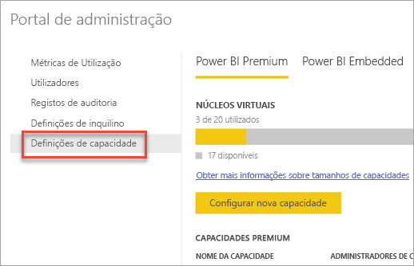

Ao selecionar **Definições de capacidade** terá acesso ao ecrã de gestão de capacidade que predefinem para o Power BI Premium.

### Configurar uma nova capacidade (Power BI Premium)
O número de núcleos virtuais reflete a quantidade utilizada e a quantidade disponível com as quais pode criar capacidades. A quantidade de núcleos virtuais disponíveis para a sua organização baseia-se nas SKU Premium que adquiriu. Por exemplo, a compra de uma P3 e de uma P2 resultaria em 48 núcleos disponíveis – 32 da P3 e 16 da P2.

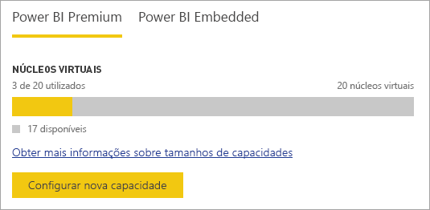

Se tiver núcleos virtuais disponíveis, configure a sua nova capacidade procedendo do seguinte modo.

1. Selecione **Configurar nova capacidade**.
2. Atribua um **nome** à sua capacidade.
3. Defina a que administrador pretende atribuir esta capacidade.
   
    Os administradores de capacidade não têm de ser administradores do Power BI ou um Administrador global do Office 365. Para obter mais informações, consulte [Administradores de capacidade do Power BI Premium](#capacity-admins)
4. Selecione o tamanho da capacidade. As opções disponíveis dependem do número de núcleos virtuais disponíveis. Não pode selecionar uma opção que seja superior à que está disponível.
   
    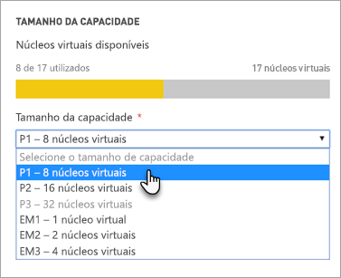
5. Selecione **Configurar**.

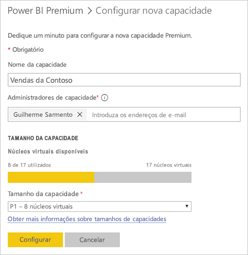

Os administradores de capacidade, bem como admins do Power BI e os administradores de globais do Office 365, irão ver a capacidade listada no portal de administração.

### Definições de capacidade
No ecrã de gestão de capacidade do Premium, pode selecionar o **ícone de engrenagem (definições)** em Ações. Isto permiti-lhe alterar o nome ou eliminar uma capacidade. Também indica quem são os administradores de serviço, a SKU/tamanho da capacidade e a região onde se encontra.

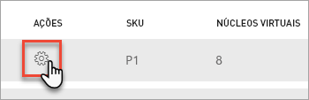

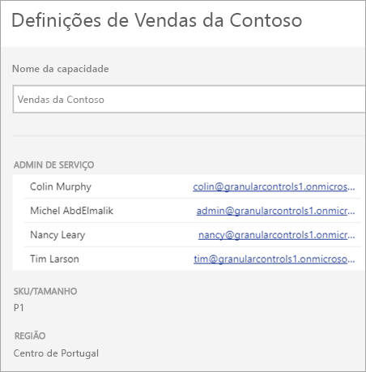

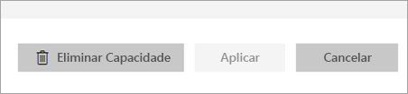

> [!NOTE]
> As definições de capacidade do Power BI Embedded são geridas a partir do portal do Microsoft Azure.
> 
> 

### Alterar o tamanho de capacidade (Power BI Premium)
Quando selecionam **Alterar tamanho da capacidade**, os administradores do Power BI e os administradores globais do Office 365 alteram o tamanho de capacidade do Power BI Premium. Os administradores de capacidade que não sejam administradores do Power BI ou administradores globais do Office 365 não terão esta opção.

O ecrã **Alterar tamanho da capacidade** permite-lhe aumentar ou diminuir o tamanho de capacidade se tiver os recursos disponíveis. Os administradores são livres de criar, redimensionar e eliminar nós, desde que tenham o número previsto de núcleos virtuais. 

As SKU P não podem ser mudadas para uma versão anterior, as SKU EM. Pode pairar o rato sobre as opções desativadas que fornecem uma explicação.

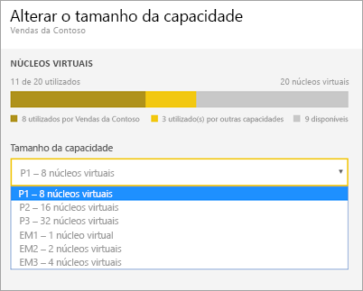

### Atribuição de capacidade
Pode selecionar o nome da capacidade para gerir uma capacidade. Isto permite-lhe ter acesso ao ecrã de gestão de capacidade.

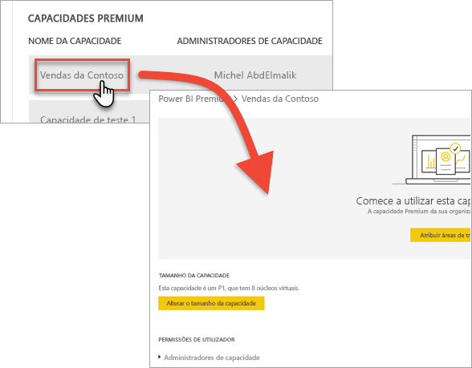

Se não tiverem sido atribuídas áreas de trabalho à capacidade, verá uma mensagem a permitir-lhe acesso a **Atribuir áreas de trabalho**.

#### Permissões de utilizador
Pode atribuir **administradores de capacidade** adicionais às capacidades do Power BI Premium. Pode também atribuir os utilizadores que terão **permissões de atribuição de capacidade**. Se forem administradores dessa área de trabalho, os utilizadores com permissões de atribuição podem atribuir uma área de trabalho de aplicação à capacidade. Podem também atribuir a respetiva *A minha área de trabalho* à capacidade. Os utilizadores com permissões de atribuição não terão acesso ao portal de administração.

> [!NOTE]
> No que respeita à capacidade do Power BI Embedded, os administradores de capacidade são atribuídos no portal do Microsoft Azure.
> 
> 

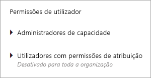

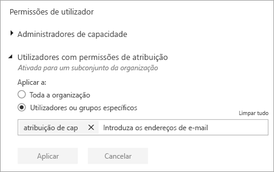

## Medidas de utilização (Power BI Premium)
Para cada capacidade, poderá utilizar as medidas de utilização de CPU, memória e de Consulta Direta. Cada KPI tem três indicações: **Bom (verde)**, **Marginal (amarelo)** e **Crítico (vermelho)**. Sugerimos que monitorize estas métricas para garantir que os seus utilizadores vejam um bom desempenho quando utilizam conteúdo Premium.

**A utilização da capacidade do Power BI Embedded é monitorizada no portal do Azure.**

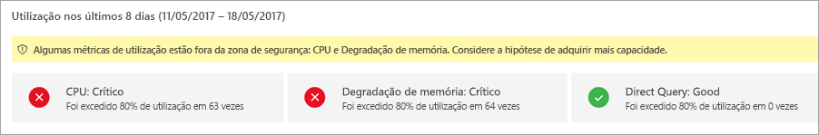

| Métrica | Descrição |
| --- | --- |
| CPU |Utilização da CPU dos seus núcleos. |
| Memória |Representa a pressão de memória dos seus núcleos de back-end. Especificamente, esta é uma métrica da frequência com que os modelos são expulsos da memória devido a pressão de memória resultante da utilização de vários modelos. |
| DQ/s |* Limitamos o número total de consultas de DirectQuery e ligação em direto por segundo. * Os limites são 30/s para P1, 60/s para P2 e 120/s para P3. * DirectQuery e as consultas de ligação em direto contam também para a limitação indicada acima. Por exemplo, se tiver 15 DirectQueries e 15 ligações em direto num segundo, atingiu a limitação. * Isto aplica-se igualmente às ligações no local e na nuvem. |

Quando estas métricas são marginais/críticas, os utilizadores podem verificar que existe degradação do desempenho de relatório e atualização, especialmente em situações de pico de carga.

As métricas refletem a utilização ao longo da semana anterior e são concebidas para a contagem de instâncias quando a capacidade está sobrecarregada e, por conseguinte, fornece um desempenho mais fraco aos utilizadores.

Cada ocorrência de *utilização superior a 80 %* deve ser considerada um caso potencial de degradação do desempenho. Se houver demasiados casos isso significa que há problemas de desempenho consideráveis para os utilizadores.

## Atribuir uma área de trabalho a uma capacidade
Há algumas formas de atribuir uma área de trabalho a uma capacidade.

### Gestão de capacidade no portal de administração
Os administradores de capacidade, em conjunto com os administradores do Power BI e os administradores globais do Office 365, podem atribuir áreas de trabalho em massa na secção de gestão de capacidade premium do portal de administração. Quando gere uma capacidade, verá a secção **Áreas de trabalho** que permite-lhe atribuir áreas de trabalho.

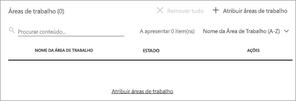

1. Selecione **Atribuir áreas de trabalho**. Isto está listado em vários locais e todas efetuam a mesma tarefa.
2. Selecione **Todas as áreas de trabalho da empresa** ou **Áreas de trabalho específicas por utilizador**.
   
   | Selection | Descrição |
   | --- | --- |
   | **Todas as áreas de trabalho da empresa** |A atribuição das áreas de trabalho de toda a organização à capacidade Premium vai atribuir todas as Áreas de Trabalho da Aplicação e As minhas Áreas de Trabalho, na sua organização a esta capacidade Premium. Além disso, todos os utilizadores atuais e futuros terão permissão para atribuir de novo áreas de trabalho individuais a esta capacidade. |
   | **Áreas de trabalho específicas por utilizador** |Quando atribui áreas de trabalho por utilizador ou grupo, todas as áreas de trabalho pertencentes a esses utilizadores são atribuídas à capacidade de Premium, incluindo a área de trabalho pessoal do utilizador. Os utilizadores referidos obtêm automaticamente permissões de atribuição de áreas de trabalho. Isto inclui áreas de trabalho já atribuídas a uma capacidade diferente. |
3. Selecione **Aplicar**.

Esta opção não permite-lhe atribuir áreas de trabalho específicas a uma capacidade.

### Definições da área de trabalho de aplicação
Também pode atribuir uma área de trabalho de aplicação a uma capacidade Premium a partir das definições dessa área de trabalho. Para atribuir uma área de trabalho de aplicação a uma capacidade Premium, efetue o seguinte.

Para mover uma área de trabalho para a capacidade, deve ter permissões de administração para essa área de trabalho, bem como permissões de atribuição de capacidade para essa capacidade. Tenha em atenção que os administradores de área de trabalho podem sempre remover uma área de trabalho da capacidade Premium.

1. Edite uma área de trabalho de aplicação, selecionando as **reticências (…)**  e selecionando **Editar área de trabalho**.
   
    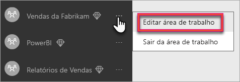
2. Em **Editar área de trabalho**, expanda **Avançadas**.
3. Se tiver recebido as permissões de atribuição de capacidade para qualquer capacidade, terá a opção de ativar **Premium** nesta área de trabalho.
4. Selecione a capacidade à qual pretende atribuir esta área de trabalho de aplicação.
   
    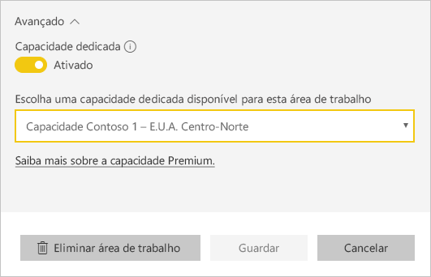
5. Selecione **Salvar**.

Depois de guardar, a área de trabalho e todo o conteúdo, serão movidos para a capacidade Premium sem qualquer interrupção experiência para os utilizadores finais.

## O que o Premium parece para os utilizadores
A maioria das vezes, os utilizadores não terão de saber que estão numa capacidade Premium. Os dashboards e relatórios são suficientes. Como uma sugestão visual, verá um ícone de diamante junto das áreas de trabalho que estejam numa capacidade Premium. 

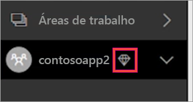

## Chave de produto do Power BI Report Server)
No separador **Definições de capacidade** do portal do administrador do Power BI, terá acesso à sua chave de produto do Power BI Report Server. Esta opção estará apenas disponível para administradores globais ou utilizadores com a função de administrador de serviço Power BI atribuída e se tiver adquirido uma SKI Power BI Premium.

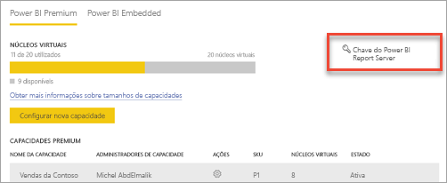

Ao selecionar **Chave do Power BI Report Server**, será apresentada uma caixa de diálogo com a sua chave de produto. Pode copiá-la e utilizá-la na instalação.

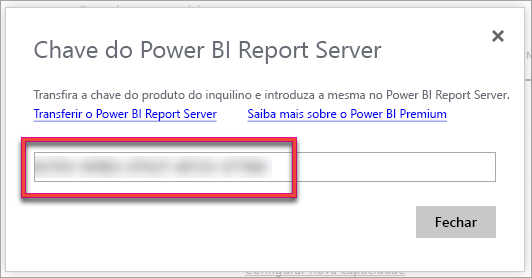

Para obter mais informações, consulte [Instalar o Power BI Report Server](report-server/install-report-server.md).

## Próximas etapas
Partilhe aplicações publicadas com utilizadores gratuitos quando atribuir a área de trabalho a uma capacidade Premium. Para obter mais informações, consulte [Criar e distribuir uma aplicação no Power BI](service-create-distribute-apps.md).

Mais perguntas? [Experimente perguntar à Comunidade do Power BI](http://community.powerbi.com/)

