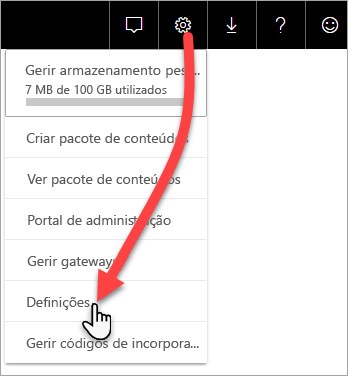

# Monitorizar as capacidades Premium com a aplicação

A monitorização das suas capacidades é essencial para tomar decisões informadas sobre a melhor forma de utilizar os seus recursos de capacidades Premium. Pode monitorizar as capacidades no Portal de administração ou com a aplicação **Power BI Premium Capacity Metrics**. Este artigo explica como utilizar a aplicação Premium Capacity Metrics. A aplicação fornece as informações mais detalhadas sobre o desempenho das suas capacidades. Para obter uma descrição mais geral da média de utilização nos últimos sete dias, pode utilizar o Portal de Administração. Para saber mais sobre a monitorização no portal, veja [Monitorizar capacidades Premium no Portal de Administração](service-admin-premium-monitor-portal.md).

A aplicação é atualizada regularmente com novas funcionalidades. Certifique-se de que está a executar a versão mais recente.
**A versão mais recente da aplicação é a 1.10.1.1 (5 de fevereiro de 2019)**.   
Se já tiver uma versão anterior da aplicação instalada, será melhor eliminá-la das suas aplicações e, em seguida, premir Ctrl+F5 para atualizar. 

## Instalar a aplicação

Pode ir diretamente para a [aplicação Premium Capacity Metrics](https://app.powerbi.com/groups/me/getapps/services/capacitymetrics) ou instalá-la tal como faz com as outras aplicações no Power BI.

1. No Power BI, clique em **Aplicações**.   
    

2. No lado direito, clique em **Obter aplicações**.
3. Na categoria **Aplicações**, procure **Aplicação Power BI Premium Capacity Metrics**.
4. Precisa de uma subscrição para instalar a aplicação.

Aguarde. A instalação e a atualização das métricas demoram alguns minutos. Se a aplicação mostrar métricas em branco, prima F5 para atualizar o seu browser.

## Obter o histórico de atualizações da aplicação

Para verificar quando foi a última atualização da sua aplicação Premium Capacity Metrics, clique em **Definições** > **Conjuntos de Dados** > **Power BI Premium Capacity Metrics** > **Histórico de Atualizações**. 

É apresentada a última atualização. Clique em **Histórico de atualizações** para ver as atualizações agendadas e a pedido.

## Monitorizar uma capacidade com a aplicação

Agora que instalou a aplicação, pode ver as métricas das capacidades na sua organização. Vamos dar analisar algumas das métricas principais disponíveis.

### Dashboard de métricas

Quando abre a aplicação, é apresentado um dashboard com um resumo de todas as capacidades para as quais tem direitos de administrador.

O dashboard inclui as seguintes métricas:

| **Secção Relatório** | **Métricas** |
| --- | --- |
| **Resumo do Sistema** |  Versão da aplicação   Número de capacidades que administra   Número de áreas de trabalho nas suas capacidades que estão a criar relatórios de métricas   Consumo médio da memória em GB nos últimos sete dias   Consumo máximo da memória em GB nos últimos sete dias   Hora local em que o consumo máximo da memória ocorreu   Número de vezes em que a CPU excedeu o valor de 80% dos limiares nos últimos sete dias, dividido em registos de três minutos   O número máximo de vezes em que a CPU excedeu o valor de 80% nos últimos sete dias, dividido em registos de uma hora   Hora local em que a CPU excedeu o valor de 80% mais vezes numa hora |
| **Resumo do Conjunto de Dados** |  Número total de conjuntos de dados em todas as áreas de trabalho nas suas capacidades   Número de vezes em que a Consulta direta/Ligações em direto excederam o valor de 80% dos limiares nos últimos sete dias, dividido em registos de três minutos   O número máximo de vezes em que a Consulta direta/Ligações em direto excederam o valor de 80% nos últimos sete dias, dividido em registos de uma hora   Hora local em que a Consulta direta/Ligações em direto excederam o valor de 80% mais vezes numa hora   O número total de atualizações nos últimos sete dias   O tempo médio de espera da atualização: o desfasamento médio entre a hora agendada e o início da atualização, em minutos   A duração média da atualização: o tempo necessário para concluir a atualização, em minutos   O número total de consultas executadas nos últimos sete dias   O tempo médio de espera da consulta: o tempo que uma consulta aguardou por recursos do sistema antes de iniciar a execução, em milissegundos   A duração média das consultas: o tempo necessário para concluir a consulta, em milissegundos   O número total de modelos expulsos devido à pressão de memória   Tamanho médio dos conjuntos de dados    Número médio de conjuntos de dados carregados para a memória |
| **Resumo do Fluxo de Dados** |  Número total de fluxos de dados em todas as áreas de trabalho nas suas capacidades   O número total de atualizações nos últimos sete dias   O tempo médio de espera da atualização: o desfasamento médio entre a hora agendada e o início da atualização, em minutos   A duração média da atualização: o tempo necessário para concluir a atualização, em minutos |
| **Resumo de Relatório Paginado** |  Número total de relatórios paginados em todas as áreas de trabalho nas suas capacidades   Número total de vezes em que todos os relatórios foram vistos pelos utilizadores   Número total de linhas de dados em todos os relatórios   Tempo total para a conclusão de todas as fases (obtenção, processamento e composição de dados) de todos os relatórios, em milissegundos |
|  |  |

### Relatório de métricas

Clique no dashboard para ir para o relatório subjacente. Na parte inferior do relatório, há cinco separadores:

* [**Conjuntos de Dados**](#datasets): métricas detalhadas sobre o estado de funcionamento dos conjuntos de dados do Power BI nas suas capacidades.

* [**Relatórios Paginados**](#paginated-reports): métricas detalhadas sobre o estado de funcionamento dos relatórios paginados nas suas capacidades.

* [**Fluxos de Dados**](#dataflows): métricas de atualização detalhadas para fluxos de dados nas suas capacidades.

* [**Consumo de Recursos**](#resource-consumption): métricas gerais de capacidades, incluindo a memória e a utilização elevada da CPU.

* [**IDs e Informações**](#ids-and-info): os nomes, IDs e proprietários das capacidades, áreas de trabalho e cargas de trabalho.

Em cada separador, pode filtrar as métricas por capacidade e intervalo de datas. Se não forem selecionados filtros, o relatório irá, por predefinição, mostrar as métricas da semana anterior de todas as capacidades que estão a criar relatórios de métricas. 

#### Conjuntos de Dados

Utilize os botões na parte superior do separador **Conjuntos de Dados** para navegar para diferentes áreas: **Atualizações**, **Durações das Consultas**, **Tempos de Espera das Consultas** e **Conjuntos de Dados**.

##### Área de atualizações

A área **Atualizações** contém as métricas seguintes.

| **Secção Relatório** | **Métricas** |
| --- | --- |
| **Fiabilidade das atualizações** |  Número Total: as atualizações totais de cada conjunto de dados   Fiabilidade: a percentagem de atualizações que foi concluída para cada conjunto de dados   Tempo Médio de Espera: o desfasamento médio entre a hora agendada e o início da atualização do conjunto de dados, em minutos   Tempo Máximo de Espera: o tempo máximo de espera do conjunto de dados, em minutos    Duração Média: a duração média da atualização do conjunto de dados, em minutos   Duração Máxima: a duração da atualização de execução mais longa do conjunto de dados, em minutos |
| **Primeiros Cinco Conjuntos de Dados por Média de Duração da Atualização** |  Os cinco conjuntos de dados com a duração média de atualização mais longa, em minutos |
| **Primeiros Cinco Conjuntos de Dados por Média de Tempo de Espera** |  Os cinco conjuntos de dados com o tempo médio de espera de atualização mais longo, em minutos |
| **Média dos Tempos de Espera das Atualizações por Hora** |  O tempo médio de espera de atualização, dividido em registos de uma hora, comunicado na hora local. Os vários picos com tempo de espera da atualização são indicativos da execução frequente da capacidade. |
| **Contagem de Atualizações e Consumo de Memória por Hora** |  Êxitos, falhas e consumo de memória, divididos em registos de uma hora, comunicados na hora local |
|  |  |

##### Área Durações de Consulta

A área **Durações das Consultas** contém as métricas seguintes.

| **Secção Relatório** | **Métricas** |
| --- | --- |
| **Durações das Consultas** |  Os dados nesta secção são segmentados por conjuntos de dados, área de trabalho e registos por hora nos últimos sete dias   Total: o número total de consultas executadas do conjunto de dados   Média: a duração média das consultas do conjunto de dados, em milissegundos   Máxima: a duração das consultas de execução mais longa no conjunto de dados, em milissegundos|
| **Distribuição da Duração das Consultas** |  O histograma da duração das consultas é registado pelas durações das consultas (em milissegundos) nas seguintes categorias: intervalos de <= 30 ms, 30-100 ms, 100-300 ms, 300 ms-1 s, 1-3 s, 3-10 s, 10-30 s e > 30 s. Durações de consulta longas e tempos de espera longos são indicativos da capacidade de executar acessos frequentes. Também pode significar que um único conjunto de dados está a causar problemas e ainda é necessário mais investigação. |
| **Primeiros Cinco Conjuntos de Dados por Duração Média** |  Os cinco conjuntos de dados com a duração média de consulta mais longa, em milissegundos |
| **Consulta Direta/Ligações em Direto (> 80% de Utilização)** |  As vezes em que uma consulta direta ou uma ligação em direto excedeu o valor de 80% de utilização da CPU, divididas em registos de uma hora, comunicadas na hora local |
| **Distribuições da Duração das Consultas por Hora** |  O número de consultas e a duração média (em milissegundos) em comparação com o consumo de memória em GB, divididos em registos de uma hora, comunicados na hora local |
|  |  |

##### Área Esperas de Consulta

A área **Esperas das Consultas** contém as métricas seguintes.

| **Secção Relatório** | **Métricas** |
| --- | --- |
| **Tempos de Espera das Consultas** |  Os dados nesta secção são segmentados por conjuntos de dados, área de trabalho e registos por hora nos últimos sete dias   Total: o número total de consultas executadas do conjunto de dados   Contagem do tempo de espera: o número de consultas no conjunto de dados que aguardou por recursos do sistema antes de iniciar a execução    Média: o tempo médio de espera da consulta para o conjunto de dados, em milissegundos   Máxima: a duração da consulta de espera mais longa no conjunto de dados, em milissegundos|
| **Distribuição do Tempo de Espera** |  O histograma das durações das consultas é registado pelas durações das consultas (em milissegundos) nas seguintes categorias: intervalos de <= 50 ms, 50-100 ms, 100-200 ms, 200-400 ms, 400 ms-1 s, 1-5 s e > 5 s |
| **Primeiros Cinco Conjuntos de Dados por Média de Tempo de Espera** |  Os cinco conjuntos de dados com o tempo médio de espera mais longo para iniciar a execução de uma consulta, em milissegundos |
| **Contagens e Tempos de Espera das Consultas por Hora** |  Os números de espera das consultas e o tempo médio de espera (em milissegundos) em comparação com o consumo de memória em GB, divididos em registos de uma hora e comunicados na hora local |
|  |  |

##### Área de conjuntos de dados

A área **Conjuntos de Dados** contém as métricas seguintes.

| **Secção Relatório** | **Métricas** |
| --- | --- |
| **Contagens da Expulsão de Conjuntos de Dados** |  Total: o número total de *expulsões* de conjunto de dados para cada capacidade. Quando uma capacidade sofre uma pressão de memória, o nó expulsa um ou mais conjuntos de dados da memória. Os conjuntos de dados que estiverem inativos (sem qualquer operação de consulta/atualização em execução) são os primeiros a serem expulsos. Em seguida, a ordem de expulsão é feita com base no critério "menos recentemente utilizado" (LRU).|
| **Expulsões de Conjuntos de Dados por Hora e Consumo de Memória** |  Expulsões de conjuntos de dados em comparação com o consumo de memória em GB, divididas em registos de uma hora, comunicadas na hora local |
| **Contagens de Conjuntos de Dados Carregados por Hora** |  Número de conjuntos de dados carregados para a memória em comparação com o consumo de memória em GB, dividido em registos de uma hora, comunicado na hora local |
| **Percentagens de Consumo de Memória** |  Número total de conjuntos de dados ativos na memória como uma percentagem da memória total. O delta entre todos os conjuntos de dados definidos e os conjuntos de dados definidos ativos que podem ser expulsos. É mostrado por hora, para os sete dias anteriores. |
| **Tamanhos dos Dados**  |  Tamanho máximo: o tamanho máximo do conjunto de dados em MB para o período apresentado |
|  |  |

#### Relatórios paginados

O separador **Relatórios paginados** mostra as métricas detalhadas sobre o estado de funcionamento dos relatórios paginados nas suas capacidades.

| **Secção Relatório** | **Métricas** |
| --- | --- |
| **Utilização global** |  Número Total de Visualizações: o número de vezes que o relatório foi visto pelos utilizadores   Número de Linhas: o número de linhas de dados no relatório   Obtenção (média): o tempo médio que demora a obter os dados para o relatório, em milissegundos. As durações longas podem indicar consultas lentas ou outros problemas na origem dos dados.    Processamento (média): o tempo médio que demora a processar os dados para um relatório, em milissegundos  Composição (média): o tempo médio que demora a compor um relatório no browser, em milissegundos   Tempo total: O tempo de demora para todas as fases do relatório, em milissegundos|
| **Primeiros Cinco Relatórios por Tempo Médio de Obtenção de Dados** |  Os cinco relatórios com o tempo médio de obtenção de dados mais longo, em milissegundos |
| **Primeiros Cinco Relatórios por Tempo Médio de Processamento dos Relatórios** |  Os cinco relatórios com o tempo médio de processamento de relatórios mais longo, em milissegundos |
| **Durações por Hora** |  O tempo de obtenção em comparação com o de processamento e de composição de dados, dividido em registos de uma hora, comunicado na hora local |
| **Resultados por Hora** |  Êxitos, falhas e consumo de memória, divididos em registos de uma hora, comunicados na hora local |
|  |  |

#### Fluxos de Dados

O separador **Fluxo de dados** mostra as métricas detalhadas das atualizações dos fluxos de dados nas suas capacidades.

| **Secção Relatório** | **Métricas** |
| --- | --- |
| **Atualização** |  Total: o número total de atualizações de cada fluxo de dados   Fiabilidade: a percentagem de atualizações que foi concluída para cada fluxo de dados   Tempo Médio de Espera: o desfasamento médio entre a hora agendada e o início da atualização do fluxo de dados, em minutos   Tempo Máximo de Espera: o tempo máximo de espera do fluxo de dados, em minutos    Duração Média: a duração média da atualização do fluxo de dados, em minutos   Duração Máxima: a duração da atualização de execução mais longa do fluxo de dados, em minutos |
| **Primeiros Cinco Fluxos de Dados por Média de Duração da Atualização** |  Os cinco fluxos de dados com a duração média de atualização mais longa, em minutos |
| **Principais 5 fluxos de dados por Tempo Médio de Espera** |  Os cinco fluxos de dados com o tempo médio de espera de atualização mais longo, em minutos |
| **Média dos Tempos de Espera das Atualizações por Hora** |  O tempo médio de espera de atualização, dividido em registos de uma hora, comunicado na hora local. Os vários picos com tempo de espera da atualização são indicativos da execução frequente da capacidade. |
| **Contagem de Atualizações e Consumo de Memória por Hora** |  Êxitos, falhas e consumo de memória, divididos em registos de uma hora, comunicados na hora local |
|  |  |

#### Consumo de Recursos

O separador **Consumo de Recursos** mostra o consumo de CPU e de memória em todas as capacidades e cargas de trabalho.

| **Secção Relatório** | **Métricas** |
| --- | --- |
| **Consumo de CPU** |  O consumo pela carga de trabalho como uma percentagem da capacidade total da CPU. É mostrado por hora, para os sete dias anteriores. |
| **Consumo de memória** |  Consumo de memória pela carga de trabalho em GB (linhas sólidas) sobreposta nos limites de carga de trabalho (linha pontilhada). É mostrado por hora, para os sete dias anteriores. |
|  |  |

#### IDs e Informações

O separador **IDs e Informações** contém os nomes, os IDs e os proprietários das capacidades, áreas de trabalho e cargas de trabalho.

## Monitorizar a capacidade do Power BI Embedded

Pode utilizar a aplicação Power BI Premium Capacity Metrics para monitorizar as capacidades *SKU A* no Power BI Embedded. Essas capacidades serão apresentadas no relatório, desde que seja administrador da capacidade. No entanto, a atualização do relatório falhará a menos que conceda determinadas permissões ao Power BI relativamente aos SKUs A:

1. Abra a capacidade no portal do Azure.

1. Clique em **Controlo de acesso (IAM)** e adicione a aplicação “Power BI Premium” à função de leitor. Se não conseguir encontrar a aplicação pelo nome, poderá também adicioná-la pelo seu ID de cliente: cb4dc29f-0bf4-402a-8b30-7511498ed654.

    

> [!NOTE]
> Pode monitorizar a utilização das capacidades do Power BI Embedded na aplicação ou no portal do Azure, mas não no portal de administração do Power BI.

## Próximos passos

> [!div class="nextstepaction"]
> [Gestão e otimização do recurso de capacidades do Power BI Premium](service-premium-understand-how-it-works.md)
