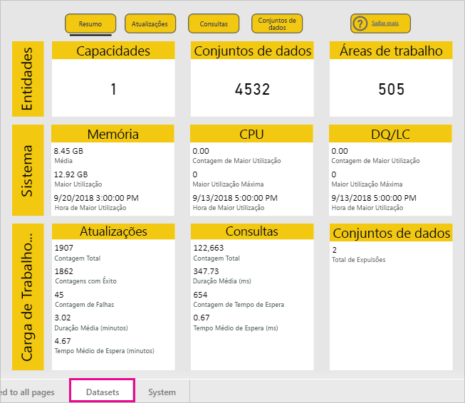
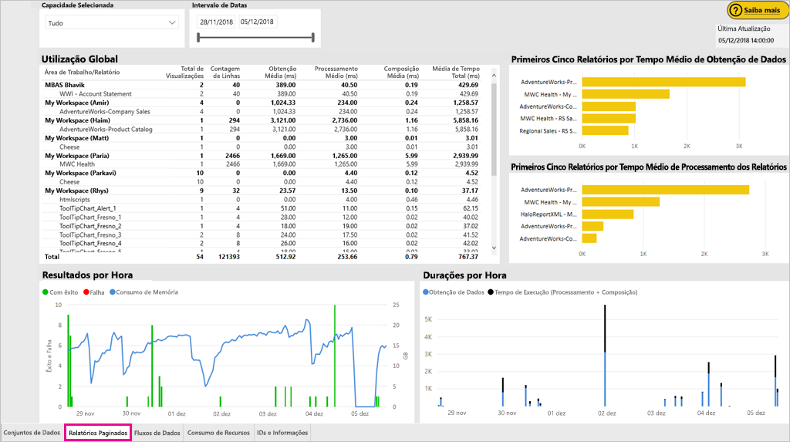
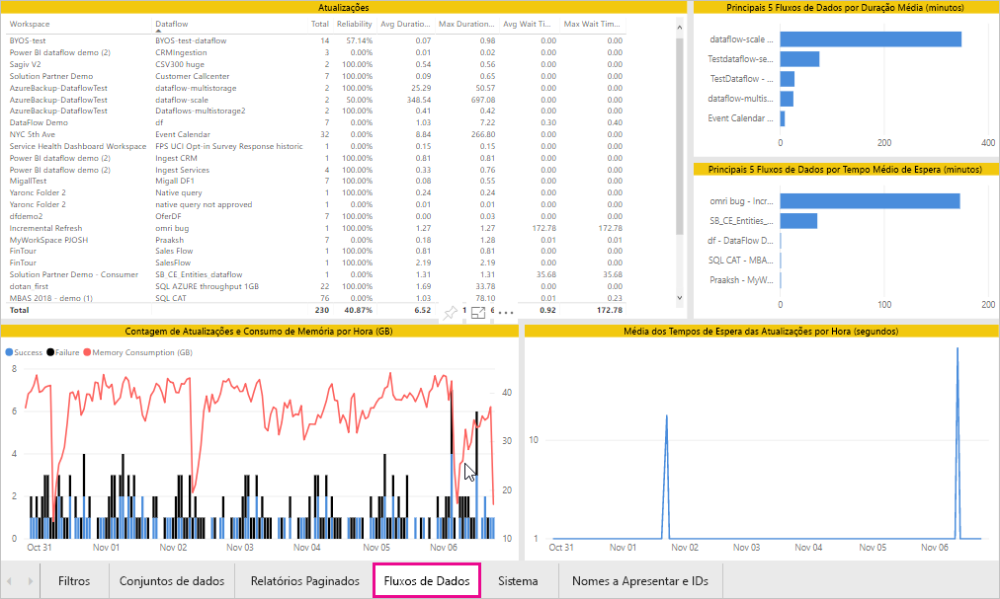
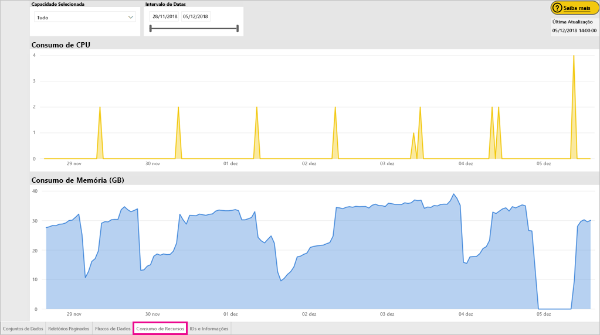
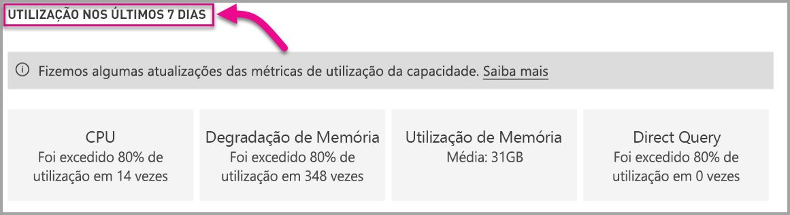

# Monitorizar as capacidades no Power BI Premium e no Power BI Embedded

Este artigo fornece uma descrição geral da monitorização das métricas das capacidades do Power BI Premium. Monitorizar a utilização das capacidades permite-lhe ter uma abordagem informada para gerir as suas capacidades.

Pode monitorizar a capacidade com a aplicação Métricas de Capacidade do Power BI Premium ou no portal de administração. Recomendamos a aplicação, porque fornece muitos mais detalhes, apesar de este artigo abordar as duas opções.

**A versão atual da aplicação é a 1.10 (lançada a 13 de dezembro de 2018).**

.

<iframe width="560" height="315" src="https://www.youtube.com/embed/UgsjMbhi_Bk?rel=0&amp;showinfo=0" frameborder="0" allowfullscreen></iframe>

## Instalar a aplicação Métricas de Capacidade Premium

Pode ir diretamente para a [aplicação Métricas de Capacidade Premium](https://app.powerbi.com/groups/me/getapps/services/capacitymetrics) ou instalá-la tal como faz com as outras aplicações no Power BI.

1. No Power BI, clique em **Aplicações**.

    

1. No lado direito, clique em **Obter aplicações**.

1. Na categoria **Aplicações**, procure **Aplicação Métricas de Capacidade do Power BI Premium**.

1. Precisa de uma subscrição para instalar a aplicação.

Agora que instalou a aplicação, pode ver as métricas sobre as capacidades na sua organização. Vamos dar analisar algumas das métricas principais disponíveis.

## Utilizar a aplicação de métricas

### Dashboard de métricas

Quando abre a aplicação, é apresentado um dashboard com um resumo de todas as capacidades para as quais tem direitos de administrador.

O dashboard inclui as seguintes métricas.

| **Secção Relatório** | **Métricas** |
| --- | --- |
| **Resumo do Sistema** | * Versão da aplicação  * Número de capacidades que administra  * Número de áreas de trabalho nas suas capacidades que estão a criar relatórios de métricas  * Consumo médio da memória em GB nos últimos sete dias  * Consumo máximo da memória em GB nos últimos sete dias  * Hora local em que o consumo máximo da memória ocorreu  * Número de vezes que a CPU excedeu o valor de 80% dos limiares nos últimos sete dias, dividido em registos de três minutos  * O máximo de vezes que a CPU excedeu o valor de 80% nos últimos sete dias, dividido em registos de uma hora  * Hora local em que a CPU excedeu o valor de 80% mais vezes numa hora |
| **Resumo do Conjunto de Dados** | * Número total de conjuntos de dados em todas as áreas de trabalho nas suas capacidades  * Número de vezes que a Consulta direta/Ligações em direto excederam o valor de 80% dos limiares nos últimos sete dias, dividido em registos de três minutos  * A maioria das vezes em que a Consulta direta/Ligações em direto excederam o valor de 80% nos últimos sete dias, dividido em registos de uma hora  * Hora local em que a Consulta direta/Ligações em direto excederam o valor de 80% mais vezes numa hora  * O número total de atualizações nos últimos sete dias  * O tempo médio de espera da atualização: desfasamento médio entre a hora agendada e o início da atualização, em minutos  * A duração média da atualização: o tempo necessário para concluir a atualização, em minutos  * O número total de consultas executadas nos últimos sete dias  * O tempo médio de espera da consulta: o tempo que uma consulta aguardou por recursos do sistema antes de iniciar a execução, em milissegundos  * A duração média das consultas: o tempo necessário para concluir a consulta, em milissegundos  * O número total de modelos expulsos devido à pressão de memória  * Tamanho médio dos conjuntos de dados   * Contagem média de conjuntos de dados carregados para a memória |
| **Resumo do Fluxo de Dados** | * Número total de fluxos de dados em todas as áreas de trabalho nas suas capacidades  * O número total de atualizações nos últimos sete dias  * O tempo médio de espera da atualização: desfasamento médio entre a hora agendada e o início da atualização, em minutos  * A duração média da atualização: o tempo necessário para concluir a atualização, em minutos |
| **Resumo de Relatório Paginado** | * Número total de relatórios paginados em todas as áreas de trabalho nas suas capacidades  * Número total de vezes que todos os relatórios foram vistos pelos utilizadores  * Número total de linhas de dados em todos os relatórios  * Tempo total de todas as fases (obtenção, processamento e composição de dados) de todos os relatórios, em milissegundos |
|  |  |

### Relatório de métricas

Clique no dashboard para ir para o relatório subjacente. O relatório tem cinco separadores, que descrevemos com mais detalhes nas secções a seguir.

* **Conjuntos de dados**: métricas detalhadas sobre o estado de funcionamento dos conjuntos de dados do Power BI nas suas capacidades.

* **Relatórios Paginados**: métricas detalhadas sobre o estado de funcionamento dos relatórios paginados nas suas capacidades.

* **Fluxos de dados**: métricas de atualização detalhadas dos fluxos de dados nas suas capacidades.

* **Consumo de Recursos**: métricas gerais de capacidades, incluindo a memória e a utilização elevada da CPU.

* **IDs e Informações**: nomes, IDs e proprietários das capacidades, áreas de trabalho e cargas de trabalho.

Em cada separador, pode filtrar as métricas por capacidade e intervalo de datas. Se não forem selecionados filtros, o relatório irá, por predefinição, mostrar as métricas da semana anterior de todas as capacidades que estão a criar relatórios de métricas.

#### Separador Conjuntos de Dados

Utilize os botões na parte superior do separador **Conjuntos de Dados** para navegar para diferentes áreas: **Resumo**, **Atualizações**, **Durações das Consultas**, **Tempos de Espera das Consultas** e **Conjuntos de Dados**.

##### Área de atualizações

A área **Atualizações** contém as métricas seguintes.

| **Secção Relatório** | **Métricas** |
| --- | --- |
| **Fiabilidade das atualizações** | * Contagem Total: as atualizações totais de cada conjunto de dados  * Fiabilidade: a percentagem de atualizações que foi concluída para cada conjunto de dados  * Tempo Médio de Espera: o desfasamento médio entre a hora agendada e o início da atualização do conjunto de dados, em minutos  * Tempo Máximo de Espera: o tempo máximo de espera do conjunto de dados, em minutos   * Duração Média: a duração média da atualização do conjunto de dados, em minutos  * Duração Máxima: a duração da atualização de execução mais longa do conjunto de dados, em minutos |
| **Primeiros Cinco Conjuntos de Dados por Média de Duração da Atualização** | * Os cinco conjuntos de dados com a duração média mais longa de atualização, em minutos |
| **Primeiros Cinco Conjuntos de Dados por Média de Tempo de Espera** | * Os cinco conjuntos de dados com o tempo médio de espera de atualização mais longo, em minutos |
| **Média dos Tempos de Espera das Atualizações por Hora** | * O tempo médio de espera de atualização, dividido em registos de uma hora, comunicado na hora local. Os vários picos com tempo de espera da atualização são indicativos da execução frequente da capacidade. |
| **Contagem de Atualizações e Consumo de Memória por Hora** | * Êxitos, falhas e consumo de memória, dividido em registos de uma hora, comunicado na hora local |
|  |  |

##### Área Durações de Consulta

A área **Durações das Consultas** contém as métricas seguintes.

| **Secção Relatório** | **Métricas** |
| --- | --- |
| **Durações das Consultas** | * Os dados nesta secção são segmentados por conjuntos de dados, área de trabalho e registos por hora dos últimos sete dias  * Total: o número total de consultas executadas do conjunto de dados  * Duração Média: a duração média das consultas do conjunto de dados, em milissegundos  * Duração Máxima: a duração das consultas de execução mais longa no conjunto de dados, em milissegundos|
| **Distribuição da Duração das Consultas** | * O histograma da duração das consultas é registado por durações das consultas (em milissegundos) nas seguintes categorias: intervalos de <= 30 ms, 30-100 ms, 100-300 ms, 300 ms-1 s, 1-3 s, 3-10 s, 10-30 s e > 30 s. Durações de consulta longas e tempos de espera longos são indicativos da capacidade de executar acessos frequentes. Também pode significar que um único conjunto de dados está a causar problemas e ainda é necessário mais investigação. |
| **Primeiros Cinco Conjuntos de Dados por Duração Média** | * Os cinco conjuntos de dados com a duração das consultas média mais longa, em milissegundos |
| **Consulta Direta/Ligações em Direto (> 80% de Utilização)** | * As vezes que uma consulta direta ou uma ligação em direto excedeu 80% de utilização da CPU, dividido em registos de uma hora, comunicadas na hora local |
| **Distribuições da Duração das Consultas por Hora** | * As contagens de consultas e a duração média (em milissegundos) em comparação com o consumo de memória em GB, dividido em registos de uma hora, comunicado na hora local |
|  |  |

##### Área Esperas de Consulta

A área **Esperas das Consultas** contém as métricas seguintes.

| **Secção Relatório** | **Métricas** |
| --- | --- |
| **Tempos de Espera das Consultas** | * Os dados nesta secção são segmentados por conjuntos de dados, área de trabalho e registos por hora dos últimos sete dias  * Total: o número total de consultas executadas do conjunto de dados  * Contagem do tempo de espera: o número de consultas no conjunto de dados que aguardou por recursos do sistema antes de iniciar a execução   * Duração Média: o tempo médio de espera da consulta para o conjunto de dados, em milissegundos  * Duração Máxima: a duração da consulta de espera mais longa no conjunto de dados, em milissegundos|
| **Distribuição do Tempo de Espera** | * O histograma das durações das consultas é registado por durações das consultas (em milissegundos) nas seguintes categorias: intervalos de <= 50 ms, 50-100 ms, 100-200 ms, 200-400 ms, 400 ms-1 s, 1-5 s e > 5 s |
| **Primeiros Cinco Conjuntos de Dados por Média de Tempo de Espera** | * Os cinco conjuntos de dados com o maior tempo de espera médio para iniciar a execução de uma consulta, em milissegundos |
| **Contagens e Tempos de Espera das Consultas por Hora** | * As contagens de esperas das consultas e o tempo médio de espera (em milissegundos) em comparação com o consumo de memória em GB, dividido em registos de uma hora comunicados na hora local |
|  |  |

##### Área de conjuntos de dados

A área **Conjuntos de Dados** contém as métricas seguintes.

| **Secção Relatório** | **Métricas** |
| --- | --- |
| **Contagens da Expulsão de Conjuntos de Dados** | * Total: o número total de *expulsões* de conjunto de dados para cada capacidade. Quando uma capacidade sofre uma pressão de memória, o nó expulsa um ou mais conjuntos de dados da memória. Os conjuntos de dados que estiverem inativos (sem qualquer operação de consulta/atualização em execução) são os primeiros a serem expulsos. Em seguida, a ordem de expulsão é feita com base no critério "menos recentemente utilizado" (LRU).|
| **Expulsões de Conjuntos de Dados por Hora e Consumo de Memória** | * Expulsões de conjuntos de dados em comparação com o consumo de memória em GB, dividido em registos de uma hora, comunicado na hora local |
| **Contagens de Conjuntos de Dados Carregados por Hora** | * Número de conjuntos de dados carregados para a memória em comparação com o consumo de memória em GB, dividido em registos de uma hora, comunicado na hora local |
| **Tamanhos dos Dados**  | * Tamanho máximo: o tamanho máximo do conjunto de dados em MB para o período apresentado |
|  |  |

#### Separador Relatórios paginados

O separador **Relatórios paginados** mostra as métricas detalhadas sobre o estado de funcionamento dos relatórios paginados nas suas capacidades.

O separador **Relatórios paginados** contém as métricas seguintes.

| **Secção Relatório** | **Métricas** |
| --- | --- |
| **Utilização global** | * Total de Visualizações: o número de vezes que o relatório foi visto pelos utilizadores  * Contagem de Linhas: o número de linhas de dados no relatório  * Obtenção (média): o tempo médio que demora a obter os dados para o relatório, em milissegundos. As durações longas podem indicar consultas lentas ou outros problemas na origem dos dados.   * Processamento (média): o tempo médio que demora a processar os dados para um relatório, em milissegundos * Composição (média): o tempo médio que demora a compor um relatório no browser, em milissegundos  * Tempo total: O tempo de demora para todas as fases do relatório, em milissegundos|
| **Primeiros Cinco Relatórios por Tempo Médio de Obtenção de Dados** | * Os cinco relatórios com o tempo médio de obtenção de dados mais longo, em milissegundos |
| **Primeiros Cinco Relatórios por Tempo Médio de Processamento dos Relatórios** | * Os cinco relatórios com o tempo médio de processamento de relatório mais longo, em milissegundos |
| **Durações por Hora** | * O tempo de obtenção em comparação com o de processamento e de composição de dados, dividido em registos de uma hora, comunicado na hora local |
| **Resultados por Hora** | * Êxitos, falhas e consumo de memória, dividido em registos de uma hora, comunicado na hora local |
|  |  |

#### Separador Fluxo de dados

O separador **Fluxo de dados** mostra as métricas detalhadas das atualizações dos fluxos de dados nas suas capacidades.

A área **Fluxos de dados** contém as métricas seguintes.

| **Secção Relatório** | **Métricas** |
| --- | --- |
| **Atualização** | * Total: o número total de atualizações de cada fluxo de dados  * Fiabilidade: a percentagem de atualizações que foi concluída para cada fluxo de dados  * Tempo Médio de Espera: o desfasamento médio entre a hora agendada e o início da atualização do fluxo de dados, em minutos  * Tempo Máximo de Espera: o tempo máximo de espera do fluxo de dados, em minutos   * Duração Média: a duração média da atualização do fluxo de dados, em minutos  * Duração Máxima: a duração da atualização de execução mais longa do fluxo de dados, em minutos |
| **Primeiros Cinco Fluxos de Dados por Média de Duração da Atualização** | * Os cinco fluxos de dados com a duração média mais longa de atualização, em minutos |
| **Principais 5 fluxos de dados por Tempo Médio de Espera** | * Os cinco fluxos de dados com o tempo médio de espera mais longo, em minutos |
| **Média dos Tempos de Espera das Atualizações por Hora** | * O tempo médio de espera de atualização, dividido em registos de uma hora, comunicado na hora local. Os vários picos com tempo de espera da atualização são indicativos da execução frequente da capacidade. |
| **Contagem de Atualizações e Consumo de Memória por Hora** | * Êxitos, falhas e consumo de memória, dividido em registos de uma hora, comunicado na hora local |
|  |  |

#### Separador Consumo de Recursos

O separador **Consumo de Recursos** mostra o consumo de CPU e de memória em todas as capacidades e cargas de trabalho.

O separador **Consumo de Recursos** contém as seguintes métricas.

| **Secção Relatório** | **Métricas** |
| --- | --- |
| **Consumo de CPU** | * O número de vezes que a CPU excedeu o valor de 80% dos limiares nos últimos sete dias, dividido em registos de três minutos |
| **Consumo de memória** | * O consumo de memória nos últimos sete dias, dividido em registos de três minutos |
|  |  |

#### Separador IDs e Informações

O separador **IDs e Informações** contém os nomes, os IDs e os proprietários das capacidades, áreas de trabalho e cargas de trabalho.

## Monitorizar a capacidade do Power BI Embedded

Também pode utilizar a aplicação Métricas de Capacidade do Power BI Premium para monitorizar as capacidades *SKU A* no Power BI Embedded. Essas capacidades serão apresentadas no relatório, desde que seja administrador da capacidade. No entanto, a atualização do relatório falhará a menos que conceda determinadas permissões ao Power BI relativamente aos SKUs A:

1. Abra a capacidade no portal do Azure.

1. Clique em **Controlo de acesso (IAM)** e adicione a aplicação “Power BI Premium” à função de leitor. Se não conseguir encontrar a aplicação pelo nome, poderá também adicioná-la pelo seu ID de cliente: cb4dc29f-0bf4-402a-8b30-7511498ed654.

    

> [!NOTE]
> Pode monitorizar a utilização das capacidades do Power BI Embedded na aplicação ou no portal do Azure, mas não no portal de administração do Power BI.

## Monitorização básica no portal de administração

A área **Definições de capacidade** do portal de administração fornece quatro medidores que indicam as cargas colocadas e os recursos utilizados pela sua capacidade nos últimos sete dias. Estes quatro mosaicos trabalham numa janela de tempo por hora, que indica quantas horas nos últimos sete dias a métrica correspondente foi superior a 80%. Esta métrica indica uma degradação potencial para a experiência do utilizador final.

| **Métrica** | **Descrição** |
| --- | --- |
| CPU |Número de vezes que a CPU excedeu os 80% de utilização. |
| Degradação de Memória |Representa a pressão de memória nos seus núcleos de back-end. Especificamente, esta é uma métrica da frequência com que os conjuntos de dados são limpos da memória devido à pressão de memória resultante da utilização de múltiplos conjuntos de dados. |
| Utilização de Memória |Utilização de memória média, representada em gigabytes (GB). |
| DQ/s | Número de vezes que a contagem de DirectQueries e Ligações em Direto excedeu os 80% de limite.   * Limitamos o número total de consultas DirectQuery e de ligações em direto por segundo.* Os limites são 30/s para P1, 60/s para P2 e 120/s para P3. * A contagem de DirectQueries e consultas de ligação em direto contam para a limitação indicada acima. Por exemplo, se tiver 15 DirectQueries e 15 ligações em direto num segundo, atingiu a limitação * Isto aplica-se igualmente às ligações no local e na nuvem. |
|  |  |

As métricas refletem a utilização ao longo da semana anterior.  Se quiser consultar uma vista mais detalhada das métricas, pode fazê-lo ao clicar num dos mosaicos de resumo.  Isto permite-lhe ter acesso a gráficos detalhados para cada uma das métricas da sua capacidade premium. O gráfico seguinte mostra os detalhes da métrica de CPU.

Estes gráficos são resumidos à hora para a semana anterior e podem ajudar a isolar alturas em que tenham ocorrido eventos especificamente relacionados com o desempenho na sua capacidade premium.

Também pode exportar os dados subjacentes a qualquer uma das métricas para um ficheiro .csv.  Esta exportação irá fornecer-lhe informações detalhadas em intervalos de três minutos para cada dia da semana anterior.

## Próximos passos

Agora que tem uma noção de como monitorizar as capacidades do Power BI Premium, saiba mais sobre as capacidades de otimização.

> [!div class="nextstepaction"]
> [Gestão e otimização do recurso de capacidades do Power BI Premium](service-premium-understand-how-it-works.md)
