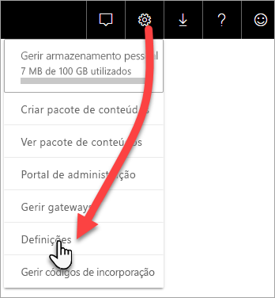
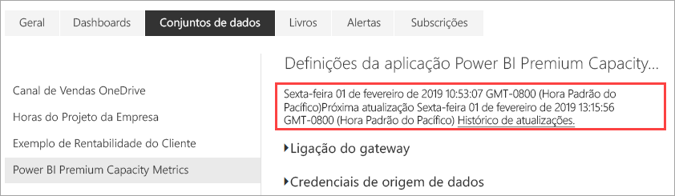
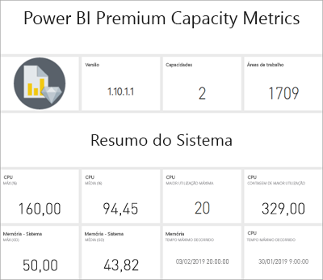
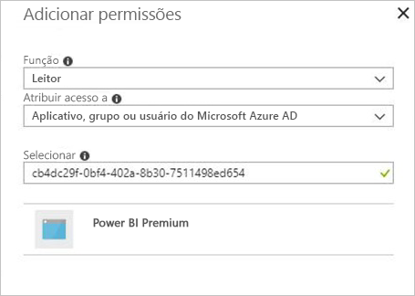

# Monitorizar as capacidades Premium com a aplicação

A monitorização das suas capacidades é essencial para tomar decisões informadas sobre a melhor forma de utilizar os seus recursos de capacidades Premium. Pode monitorizar as capacidades no Portal de administração ou com a aplicação **Power BI Premium Capacity Metrics**. Este artigo explica como utilizar a aplicação Premium Capacity Metrics. A aplicação fornece as informações mais detalhadas sobre o desempenho das suas capacidades. Para obter uma descrição mais geral da média de utilização nos últimos sete dias, pode utilizar o Portal de Administração. Para saber mais sobre a monitorização no portal, veja [Monitorizar capacidades Premium no Portal de Administração](service-admin-premium-monitor-portal.md).

A aplicação é atualizada regularmente com novas funcionalidades. Certifique-se de que está a executar a versão mais recente. Se já tiver uma versão anterior da aplicação instalada, será melhor eliminá-la das suas aplicações e, em seguida, premir Ctrl+F5 para atualizar.

## Instalar a aplicação

Pode ir diretamente para a [aplicação Premium Capacity Metrics](https://app.powerbi.com/groups/me/getapps/services/capacitymetrics) ou instalá-la tal como faz com as outras aplicações no Power BI.

1. No Power BI, clique em **Aplicações**.

    

2. No lado direito, clique em **Obter aplicações**.
3. Na categoria **Aplicações**, procure **Aplicação Métricas de Capacidade do Power BI Premium**.
4. Precisa de uma subscrição para instalar a aplicação.

Aguarde. A instalação e a atualização das métricas demoram alguns minutos. Se a aplicação mostrar métricas em branco, prima F5 para atualizar o seu browser.

## Obter o histórico de atualizações da aplicação

Para verificar quando foi a última atualização da sua aplicação Premium Capacity Metrics, clique em **Definições** > **Conjuntos de Dados** > **Power BI Premium Capacity Metrics** > **Histórico de Atualizações**. 

É apresentada a última atualização. Clique em **Histórico de atualizações** para ver as atualizações agendadas e a pedido.

## Monitorizar capacidades com a aplicação

Agora que instalou a aplicação, pode ver as métricas das capacidades na sua organização. A aplicação disponibiliza um Dashboard com resumos de métricas e Relatórios de métricas detalhadas.

### Dashboard

Para ver um dashboard que resume as principais métricas para as capacidades que administra, em **Dashboards**, clique em **Métricas de Capacidade do Power BI Premium**. É apresentado um dashboard.

O dashboard inclui as seguintes métricas:

#### Parte Superior

| Métrica | Descrição |
| --- | --- |
| Versão | Versão da aplicação. | 
| Capacidades | Número de capacidades que administra. | 
| Áreas de trabalho | Número de áreas de trabalho nas suas capacidades que estão a criar relatórios de métricas.|
|||

#### Resumo do Sistema

| Métrica | Descrição |
| --- | --- |
| Maior Capacidade de Utilização da CPU | A capacidade com o número máximo de vezes em que a CPU excedeu o valor de 80% dos limiares nos últimos sete dias. |
| Maior Contagem da Utilização da CPU | O número de vezes em que a capacidade nomeada da CPU excedeu o valor de 80% dos limiares nos últimos sete dias. | 
| Capacidade de Utilização Máxima da Memória | A capacidade com o número máximo de vezes em que o limite máximo da memória foi atingido nos últimos sete dias, dividido em registos de três minutos.  |
| Contagem de Utilização Máxima da Memória| Número de vezes em que a capacidade nomeada atingiu o limite de memória máximo nos últimos sete dias, dividido em registos de três minutos. |
|||

#### Resumo do Conjunto de Dados

| Métrica | Descrição |
| --- | --- |
| Conjuntos de Dados | Número total de conjuntos de dados em todas as áreas de trabalho nas suas capacidades.|
| Tamanho Médio dos Conjuntos de Dados (MB) | Tamanho médio dos conjuntos de dados em todas as áreas de trabalho nas suas capacidades.|  
| Contagem Carregada Média dos Conjuntos de Dados | Contagem média dos conjuntos de dados carregados para a memória. |  
| Conjuntos de Dados – Média do Conjunto de Dados Ativo (%)| A média de conjuntos de dados ativos nos últimos sete dias. Um conjunto de dados será definido como ativo se o utilizador tiver interagido com os elementos visuais nos últimos três minutos. |
| CPU – Máximo de Conjuntos de Dados (%)| O consumo máximo da CPU por carga de trabalho do conjunto de dados nos últimos sete dias. |
| CPU – Média de Conjuntos de Dados (%)| O consumo médio da CPU por carga de trabalho do conjunto de dados nos últimos sete dias. |
| Memória – Média de Conjuntos de Dados (%) | O consumo médio da memória por carga de trabalho do conjunto de dados nos últimos sete dias. |
| Memória – Máximo de Conjuntos de Dados (GB) | O consumo máximo da memória por carga de trabalho do conjunto de dados nos últimos sete dias.|
| Expulsões de Conjuntos de Dados | O número total de conjuntos de dados expulsos devido à pressão de memória. |
| Contagem da Utilização Elevada do DirectQuery/Ligações em Direto| Número de vezes em que o DirectQuery/Ligações em Direto excederam o valor de 80% dos limiares nos últimos sete dias, dividido em registos de três minutos. |
| Contagem da Utilização Máxima do DirectQuery/Ligações em direto| O número máximo de vezes em que o DirectQuery/Ligações em Direto excederam o valor de 80% nos últimos sete dias, dividido em registos de uma hora. |
| Utilização Elevada Máxima do DirectQuery/Ligações em Direto | Número máximo de vezes em que o DirectQuery/Ligações em Direto excederam o valor de 80% dos limiares nos últimos sete dias, dividido em registos de três minutos.|
| Máximo Ocorrido numa Hora do DirectQuery/Ligações em Direto | A hora em UTC em que o DirectQuery/Ligações em Direto excederam o valor de 80% mais vezes numa hora. |
| Total de Atualizações | Número total de atualizações nos últimos sete dias. |
| Fiabilidade das Atualizações (%) | O número de atualizações com êxito dividido pelo número total de atualizações nos últimos sete dias. |
| Duração Média das Atualizações (Minutos) | O período médio de tempo para concluir a atualização. |
| Tempo de Espera Médio das Atualizações (Minutos)| O período médio de tempo antes de iniciar a atualização. |
| Total de Consultas |  Número total de consultas executadas nos últimos sete dias. |
| Contagem do Total de Consultas em Espera | Número total de consultas que tiveram de esperar antes de serem executadas. |
| Duração Média das Consultas (MS) | O tempo médio necessário para concluir as consultas. |
| Tempo Médio de Espera das Consultas (MS) | O tempo médio que as consultas esperaram nos recursos do sistema antes de serem executadas. |
|||

#### Resumo do Fluxo de Dados

| Métrica | Descrição |
| --- | --- |
| Fluxos de Dados |  Número total de fluxos de dados em todas as áreas de trabalho nas suas capacidades.|
| Total de Atualizações | Número total de atualizações nos últimos sete dias.|  
| Duração Média das Atualizações (Minutos) | O tempo necessário para concluir a atualização. |
| Tempos de Espera Médios das Atualizações (Minutos) | O atraso entre a hora agendada e o início real da atualização.|
| CPU – Máximo de Fluxos de Dados (%) | O consumo máximo da CPU por carga de trabalho dos fluxos de dados nos últimos sete dias. |
| CPU – Média de Fluxos de Dados (%) | O consumo médio da CPU por carga de trabalho dos fluxos de dados nos últimos sete dias. |
| Memória – Máximo de Fluxos de Dados (GB) | O consumo máximo da memória por carga de trabalho dos fluxos de dados nos últimos sete dias. |
| Memória – Média de Fluxos de Dados (GB) | O consumo médio da memória por carga de trabalho dos fluxos de dados nos últimos sete dias. |
|||

#### Resumo de Relatório Paginado

| Métrica | Descrição |
| --- | --- |
| Relatórios Paginados |  Número total de relatórios paginados em todas as áreas de trabalho nas suas capacidades. |
| Total de Visualizações | Número total de vezes em que todos os relatórios foram vistos pelos utilizadores. | 
| Total de Linhas | Número total de linhas de dados em todos os relatórios.|
| Tempo Total | Tempo total para a conclusão de todas as fases (obtenção, processamento e composição de dados) de todos os relatórios, em milissegundos. |
| CPU – Máximo de Relatórios Paginados (%) | O consumo máximo da CPU por carga de trabalho dos relatórios paginados nos últimos sete dias. |
| CPU – Média de Relatórios Paginados (%) | O consumo médio da CPU por carga de trabalho dos relatórios paginados nos últimos sete dias. |
| Memória – Máximo de Relatórios Paginados (GB) | O consumo máximo da memória por carga de trabalho dos relatórios paginados nos últimos sete dias. |
| Memória – Média de Relatórios Paginados (GB) | O consumo médio da memória por carga de trabalho dos relatórios paginados nos últimos sete dias. |
|||

#### Resumo de IA

| Métrica | Descrição |
| --- | --- |
| Execução de Funções de IA | Número total de execuções nos últimos sete dias. |
| Fiabilidade da Execução de Funções de IA (%) | Número de execuções com êxito dividido pelo número total de execuções nos últimos sete dias. |
| Consumo Máximo de CPU (%)| O consumo máximo de CPU pela carga de trabalho de IA nos últimos sete dias. |
| Consumo Máximo de Memória (GB) | O consumo máximo de memória pela carga de trabalho de IA nos últimos sete dias.|
| Tempo Máximo de Espera da Execução de Funções de IA (MS) | O período máximo de tempo antes de iniciar a execução. |
| Tempo Médio de Espera da Execução de Funções de IA (MS)| O período médio de tempo antes de iniciar a execução. |
| Duração Máxima da Execução de Funções de IA (MS) | O período máximo de tempo para concluir a execução. |
| Duração Média da Execução de Funções de IA (MS)| O período médio de tempo para concluir a execução. |
| | |

### Relatórios

Os relatórios proporcionam mais métricas detalhadas. Para ver os relatórios para as capacidades que administra, em **Relatórios**, clique em **Métricas de Capacidade do Power BI Premium**. Em alternativa, no dashboard, clique na célula de uma métrica para ir para o relatório subjacente. 

Na parte inferior do relatório, há cinco *separadores*:

[**Conjuntos de Dados**](#datasets) – apresenta as métricas detalhadas sobre o estado de funcionamento dos conjuntos de dados do Power BI nas suas capacidades.
[**Relatórios Paginados**](#paginated-reports) – apresenta as métricas detalhadas sobre o estado de funcionamento dos relatórios paginados nas suas capacidades.
[**Fluxos de Dados**](#dataflows) – apresenta as métricas de atualização detalhadas dos fluxos de dados nas suas capacidades.
[**IA**](#ai) – fornece métricas detalhadas sobre o estado de funcionamento das funções de IA utilizadas nas suas capacidades.
[**Consumo de Recursos**](#resource-consumption) – apresenta as métricas detalhadas dos recursos, incluindo a utilização elevada da CPU e da memória.
[**IDs e Informações**](#ids-and-info): os nomes, IDs e proprietários das capacidades, áreas de trabalho e cargas de trabalho.

Cada separador abre uma página onde pode filtrar as métricas por capacidade e intervalo de datas. Se não forem selecionados filtros, o relatório irá, por predefinição, mostrar as métricas da semana anterior de todas as capacidades que estão a criar relatórios de métricas. 

### Conjuntos de Dados

A página Conjuntos de Dados tem diferentes *áreas*, que incluem **Atualizações**, **Durações de Consulta**, **Esperas de Consulta** e  **Conjuntos de Dados**. Utilize os botões na parte superior da página para navegar para diferentes áreas.

#### Área de atualizações

| Secção Relatório | Métricas |
| --- | --- |
| Atualizações |  Número Total: as atualizações totais de cada conjunto de dados.   Fiabilidade: a percentagem de atualizações que foi concluída para cada conjunto de dados.   Tempo Médio de Espera: o atraso médio entre a hora agendada e o início da atualização do conjunto de dados, em minutos.   Tempo Máximo de Espera: o tempo máximo de espera do conjunto de dados, em minutos.   Duração Média: a duração média da atualização do conjunto de dados, em minutos.   Duração Máxima: a duração da atualização de execução mais longa do conjunto de dados, em minutos. |
| Primeiros Cinco Conjuntos de Dados por Duração Média (minutos) |  Os cinco conjuntos de dados com a duração média de atualização mais longa, em minutos. |
| Primeiros Cinco Conjuntos de Dados por Média de Tempo de Espera (minutos) |  Os cinco conjuntos de dados com o tempo médio de espera de atualização mais longo, em minutos. |
| Contagem de Atualizações e Consumo de Memória por Hora (GB) |  Êxitos, falhas e consumo de memória, divididos em registos de uma hora, comunicados na hora UTC. |
| Média dos Tempos de Espera das Atualizações por Hora (minutos) |  O tempo médio de espera de atualização, dividido em registos de uma hora, comunicado na hora UTC. Os vários picos com tempo de espera da atualização são indicativos da execução frequente da capacidade. |
|  |  |

#### Área Durações de Consulta

| Secção Relatório | Métricas |
| --- | --- |
| Durações das Consultas |  Os dados nesta secção são segmentados por conjuntos de dados, área de trabalho e registos por hora nos últimos sete dias.   Total: o número total de consultas executadas do conjunto de dados.   Média: a duração média das consultas do conjunto de dados, em milissegundos   Máxima: a duração das consultas de execução mais longa no conjunto de dados, em milissegundos.|
| Distribuição da Duração das Consultas |  O histograma da duração das consultas é registado pelas durações das consultas (em milissegundos) nas seguintes categorias: intervalos de <= 30 ms, 30-100 ms, 100-300 ms, 300 ms-1 s, 1-3 s, 3-10 s, 10-30 s e > 30 s. Durações de consulta longas e tempos de espera longos são indicativos da capacidade de executar acessos frequentes. Também pode significar que um único conjunto de dados está a causar problemas e ainda é necessário mais investigação. |
| Primeiros Cinco Conjuntos de Dados por Duração Média |  Os cinco conjuntos de dados com a duração média de consulta mais longa, em milissegundos. |
| Distribuições da Duração das Consultas por Hora |  O número de consultas e a duração média (em milissegundos) em comparação com o consumo de memória em GB, divididos em registos de uma hora, comunicados na hora UTC. |
| DirectQuery/Ligações em Direto (> 80% de Utilização) |  As vezes em que um DirectQuery ou uma ligação em direto excedeu o valor de 80% de utilização da CPU, divididas em registos de uma hora, comunicadas na hora UTC. |
|  |  |

#### Área Esperas de Consulta

| Secção Relatório | Métricas |
| --- | --- |
| Tempos de Espera das Consultas |  Os dados nesta secção são segmentados por conjuntos de dados, área de trabalho e registos por hora nos últimos sete dias.   Total: o número total de consultas executadas do conjunto de dados.   Contagem do tempo de espera: o número de consultas no conjunto de dados que aguardou por recursos do sistema antes de iniciar a execução.   Média: o tempo médio de espera da consulta para o conjunto de dados, em milissegundos.   Máxima: a duração da consulta de espera mais longa no conjunto de dados, em milissegundos.|
| Primeiros Cinco Conjuntos de Dados por Média de Tempo de Espera |  Os cinco conjuntos de dados com o tempo médio de espera mais longo para iniciar a execução de uma consulta, em milissegundos. |
| Distribuições do Tempo de Espera |  O histograma das durações das consultas é registado pelas durações das consultas (em milissegundos) nas seguintes categorias: intervalos de <= 50 ms, 50-100 ms, 100-200 ms, 200-400 ms, 400 ms-1 s, 1-5 s e > 5 s. |
| Distribuições do Tempo de Espera das Consultas por Hora |  Os números de espera das consultas e o tempo médio de espera (em milissegundos) em comparação com o consumo de memória em GB, divididos em registos de uma hora e comunicados na hora UTC. |
|  |  |

#### Área de conjuntos de dados

| **Secção Relatório** | **Métricas** |
| --- | --- |
| Tamanhos dos Conjunto de Dados  |  Tamanho máximo: o tamanho máximo do conjunto de dados em MB para o período apresentado. |
| Contagens da Expulsão de Conjuntos de Dados |  Total: o número total de *expulsões* de conjunto de dados para cada capacidade. Quando uma capacidade sofre uma pressão de memória, o nó expulsa um ou mais conjuntos de dados da memória. Os conjuntos de dados que estiverem inativos (sem qualquer operação de consulta/atualização em execução) são os primeiros a serem expulsos. Em seguida, a ordem de expulsão é feita com base no critério "menos recentemente utilizado" (LRU).|
| Contagens de Conjuntos de Dados Carregados por Hora |  Número de conjuntos de dados carregados para a memória em comparação com o consumo de memória em GB, dividido em registos de uma hora, comunicado na hora UTC. |
| Expulsões de Conjuntos de Dados por Hora e Consumo de Memória |  Expulsões de conjuntos de dados em comparação com o consumo de memória em GB, divididas em registos de uma hora, comunicadas na hora UTC. |
| Percentagens de Consumo de Memória |  Número total de conjuntos de dados ativos na memória como uma percentagem da memória total. O delta entre todos os conjuntos de dados definidos e os conjuntos de dados definidos ativos que podem ser expulsos. É mostrado por hora, para os sete dias anteriores. |
|  |  |

### Relatórios Paginados

| **Secção Relatório** | **Métricas** |
| --- | --- |
| Utilização global |  Número Total de Visualizações: o número de vezes que o relatório foi visto pelos utilizadores.   Número de Linhas: o número de linhas de dados no relatório.   Obtenção (média): o tempo médio que demora a obter os dados para o relatório, em milissegundos. As durações longas podem indicar consultas lentas ou outros problemas na origem dos dados.    Processamento (média): o tempo médio que demora a processar os dados para um relatório, em milissegundos.  Composição (média): o tempo médio que demora a compor um relatório no browser, em milissegundos.   Tempo total: o tempo necessário para todas as fases do relatório, em milissegundos. |
| Primeiros Cinco Relatórios por Tempo Médio de Obtenção de Dados |  Os cinco relatórios com o tempo médio de obtenção de dados mais longo, em milissegundos. |
| Primeiros Cinco Relatórios por Tempo Médio de Processamento dos Relatórios |  Os cinco relatórios com o tempo médio de processamento de relatórios mais longo, em milissegundos. |
| Resultados por Hora |  Êxitos, falhas e consumo de memória, divididos em registos de uma hora, comunicados na hora UTC. |
| Durações por Hora |  O tempo de obtenção de dados em comparação com o de processamento e de composição de dados, dividido em registos de uma hora, comunicado na hora UTC. |
|  |  |

### Fluxos de Dados

| **Secção Relatório** | **Métricas** |
| --- | --- |
| Atualizações |  Total: o número total de atualizações de cada fluxo de dados.   Fiabilidade: a percentagem de atualizações que foi concluída para cada fluxo de dados.   Tempo Médio de Espera: o atraso médio entre a hora agendada e o início da atualização do fluxo de dados, em minutos.   Tempo Máximo de Espera: o tempo máximo de espera do fluxo de dados, em minutos.   Duração Média: a duração média da atualização do fluxo de dados, em minutos.   Duração Máxima: a duração da atualização de execução mais longa do fluxo de dados, em minutos. |
| Primeiros Cinco fluxos de dados por Média de Duração da Atualização |  Os cinco fluxos de dados com a duração média de atualização mais longa, em minutos. |
| Principais Cinco fluxos de dados por Tempo Médio de Espera |  Os cinco fluxos de dados com o tempo médio de espera de atualização mais longo, em minutos. |
| Média dos Tempos de Espera das Atualizações por Hora |  O tempo médio de espera de atualização, dividido em registos de uma hora, comunicado na hora UTC. Os vários picos com tempo de espera da atualização são indicativos da execução frequente da capacidade. |
| Contagem de Atualizações e Consumo de Memória por Hora |  Êxitos, falhas e consumo de memória, divididos em registos de uma hora, comunicados na hora UTC. |
|  |  |

### IA

| **Secção Relatório** | **Métricas** |
| --- | --- |
| Consumo de Memória da IA | O consumo de memória em GB, dividido em registos de uma hora e comunicado no fuso horário UTC. |
| Execução de Funções de IA por Hora e Tempo Médio de Espera | Execuções de IA e o tempo médio de espera, em milissegundos, divididos em registos de uma hora e comunicados na UTC. |
| Utilização Global | Número total: número de funções de IA numa área de trabalho ou num fluxo de dados.   Fiabilidade do Sistema: a percentagem de execuções concluídas.  Média Médio de Espera: o atraso médio entre a hora agendada e o início de uma execução, em milissegundos.  Tempo Máximo de Espera: o tempo máximo de espera, em milissegundos.  Média Média: a duração média de uma execução, em milissegundos.  Duração Máxima: a duração da execução mais longa, em milissegundos.  Tamanho Médio Total: o tamanho médio, em bytes, dos dados de entrada e saída da função de IA. |
| | |

### Consumo de Recursos

| **Secção Relatório** | **Métricas** |
| --- | --- |
| Consumo de CPU |  Consumo de CPU máximo por hora, pela carga de trabalho como uma percentagem da capacidade total da CPU. É mostrado por hora, para os sete dias anteriores. |
| Consumo de memória |  Consumo de memória máxima pela carga de trabalho em GB e por hora (linhas sólidas), sobreposto nos limites de carga de trabalho (linha pontilhada). É mostrado por hora, para os sete dias anteriores. |
|  |  |

### IDs e Informações

O separador **IDs e Informações** contém as áreas para **Capacidades**, **Áreas de Trabalho**, **Conjuntos de Dados**, **Relatórios Paginados** e **Fluxos de Dados**.

#### Área de capacidades

| Secção Relatório | Métricas |
| --- | --- |
| SKU e informações de Carga de Trabalho | Definições de SKU e de carga de trabalho para a capacidade. |
| Administradores | Nomes de administradores para a capacidade. |
|||

#### Área de trabalho

| Secção Relatório | Métricas |
| --- | --- |
| Áreas de trabalho | Os nomes e os IDs para todas as áreas de trabalho. |
|||

#### Área de conjuntos de dados

| Secção Relatório | Métricas |
| --- | --- |
| Conjuntos de Dados | Nomes das áreas de trabalho e IDs para todos os conjuntos de dados. |
|||

#### Separador Relatórios Paginados

| Secção Relatório | Métricas |
| --- | --- |
| Relatórios Paginados | Os nomes, os nomes das áreas de trabalho e os IDs de todos os relatórios paginados. |
|||

#### Área Fluxos de Dados

| Secção Relatório | Métricas |
| --- | --- |
| Fluxos de Dados | Os nomes dos fluxos de trabalho, os nomes das áreas de trabalho e os IDs de todos os fluxos de dados. |
|||

## Monitorizar a capacidade do Power BI Embedded

Pode utilizar a aplicação Power BI Premium Capacity Metrics para monitorizar as capacidades *SKU A* no Power BI Embedded. Essas capacidades serão apresentadas no relatório, desde que seja administrador da capacidade. No entanto, a atualização do relatório falhará a menos que conceda determinadas permissões ao Power BI relativamente aos SKUs A:

1. Abra a capacidade no portal do Azure.

1. Clique em **Controlo de acesso (IAM)** e adicione a aplicação **Power BI Premium** à função de leitor. Se não conseguir encontrar a aplicação pelo nome, poderá também adicioná-la pelo identificador de cliente: `cb4dc29f-0bf4-402a-8b30-7511498ed654`.

    

> [!NOTE]
> Pode monitorizar a utilização das capacidades do Power BI Embedded na aplicação ou no portal do Azure, mas não no portal de administração do Power BI.

## Próximos passos

> [!div class="nextstepaction"]
> [Otimizar as capacidades do Power BI Premium](service-premium-capacity-optimize.md)
