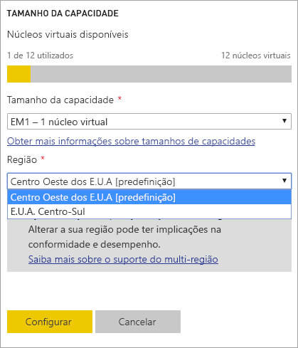
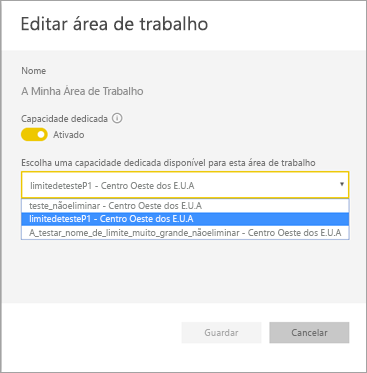
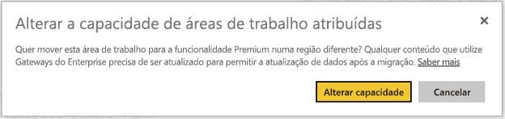
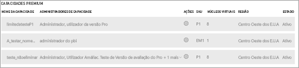

# Suporte Multi-Geo no Power BI Premium (Pré-visualização)
A Multi-Geo é uma funcionalidade do Power BI Premium que ajuda os clientes multinacionais a cumprir os requisitos regionais, específicos da indústria ou da residência dos dados organizacionais. Como cliente do Power BI Premium, pode implementar conteúdo em centros de dados em regiões diferentes da região base do inquilino do Power BI. Pode optar por implementar conteúdo em qualquer uma das seguintes áreas geográficas:

- United States 
- Canadá 
- Reino Unido 
- Brasil 
- Europa 
- Japão 
- Índia 
- Ásia-Pacífico 
- Austrália 

Uma área geográfica (geografia) pode conter mais do que uma região. Por exemplo, os Estados Unidos são uma área geográfica e EUA Centro-Oeste e EUA Centro-Sul são regiões nos Estados Unidos. 

A Multi-Geo não está disponível para o Power BI Alemanha, o Power BI China operado pela 21Vianet ou o Power BI para o Governo dos EUA.

## Utilizar a Multi-Geo

Para obter as novas capacidades, ative a Multi-Geo ao selecionar uma região diferente da região predefinida na lista pendente.  Cada capacidade disponível mostra a região onde está atualmente localizada, por exemplo, **EUA Centro-Oeste**.

  
Depois de criar a capacidade, esta permanecerá nessa região e os conteúdos das áreas de trabalho criadas serão armazenados nessa região. Pode migrar as áreas de trabalho de uma região para outra através da lista pendente no ecrã de definições da área de trabalho.

Verá esta mensagem para confirmar a alteração. 

Não precisa de repor as credenciais do gateway durante a migração neste momento.  Depois de serem armazenadas na região da capacidade Premium, terá de repô-las após a migração.
   
Durante a migração, algumas operações podem falhar, como a publicação de novos conjuntos de dados ou a atualização agendada de dados.  

Os seguintes itens são armazenados na região Premium quando a Multi-Geo está ativada:
 
- Modelos (ficheiros .ABF) dos conjuntos de dados de importação e de Consulta Direta
- Cache de consulta
- Imagens R

Estes itens permanecem na região base do inquilino:

- Conjuntos de dados push
- Livros do Excel
- Metadados de relatórios/dashboards: por exemplo, nomes de mosaicos, consultas de mosaicos
- Barramentos de serviços para consultas de gateway ou tarefas de atualização agendadas
- Permissões
- Credenciais dos conjuntos de dados
 
## Ver as Regiões das Capacidades

No Portal de Administração, pode ver todas as capacidades do seu inquilino do Power BI e as regiões onde atualmente se encontram.

 

## Alterar a região do conteúdo existente

Se precisar de alterar a região do conteúdo existente, tem duas opções.

- Criar uma segunda capacidade e mover as áreas de trabalho. Os utilizadores gratuitos não sofrerão qualquer período de indisponibilidade, desde que o inquilino tenha núcleos virtuais de reserva.
- Se não for possível criar uma segunda capacidade, poderá mover temporariamente o conteúdo para a capacidade partilhada a partir da capacidade Premium. Não precisa núcleos virtuais extras, mas os utilizadores gratuitos sofrerão alguns períodos de indisponibilidade.

## Mover o conteúdo para fora da Multi-Geo  

Pode retirar as áreas de trabalho da capacidade Multi-Geo de uma das seguintes formas:

- Eliminar a capacidade atual onde está localizada a área de trabalho.  Essa ação move a área de trabalho de novo para a capacidade partilhada na região base.
- Migrar as áreas de trabalho individuais de novo para a capacidade Premium localizada no inquilino principal.

## Limitações e considerações

Confirme que qualquer movimentação que efetuar entre regiões está conforme todos os requisitos de conformidade empresariais e governamentais antes de iniciar a transferência de dados.

Uma consulta em cache armazenada numa região remota permanece inativa nessa região. No entanto, os outros dados em trânsito podem ir e voltar entre várias localizações geográficas. 

Ao mover dados de uma região para outra num ambiente Multi-Geo, os dados de origem pode permanecer na região da qual foram movidos até um máximo de 30 dias. Durante esse período, os utilizadores finais não terão acesso aos dados. São removidos desta região e destruídos durante esse período de 30 dias.

A Multi-Geo não resulta num melhor desempenho em geral. O carregamento de relatórios e dashboards ainda envolve pedidos de metadados à região base.

## Próximos passos

[Power BI Premium – o que é?](service-premium.md)

Mais perguntas? [Experimente perguntar à Comunidade do Power BI](http://community.powerbi.com/)
