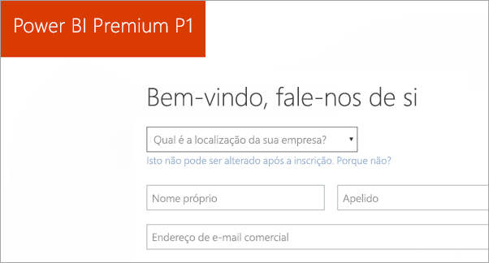
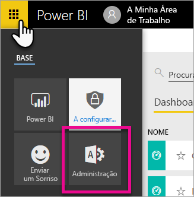
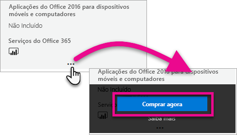
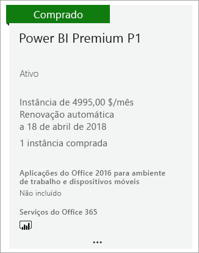
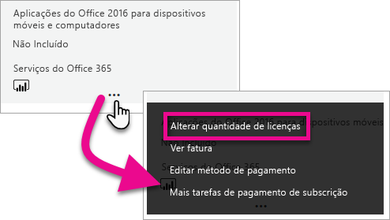
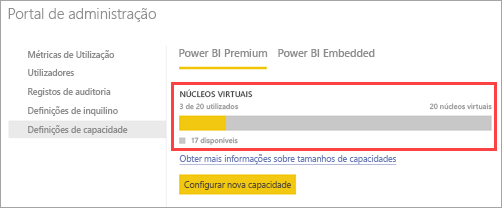
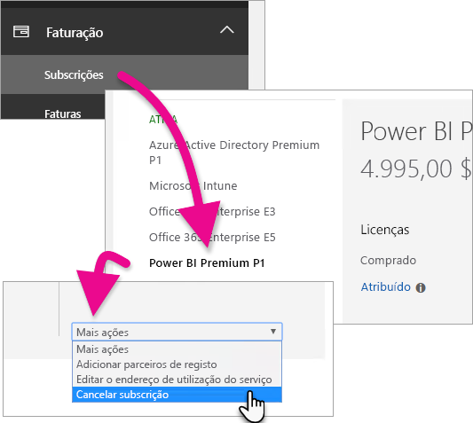
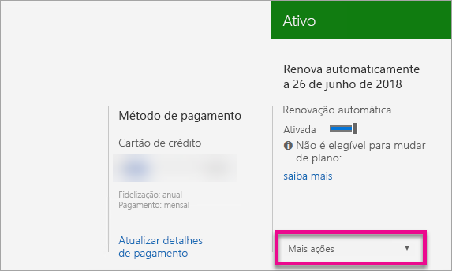

# Como comprar o Power BI Premium
Saiba como comprar capacidade do Power BI Premium para a sua organização.

<iframe width="640" height="360" src="https://www.youtube.com/embed/NkvYs5Qp4iA?rel=0&amp;showinfo=0" frameborder="0" allowfullscreen></iframe>

Pode comprar um nó de capacidade do Power BI Premium através do Centro de administração do Office 365. Também pode ter uma combinação de SKUs com capacidade Premium (P1 a P3) na sua organização. Estes produtos dão-lhe diferentes capacidades de recursos.

Para obter mais informações sobre o que é o Power BI Premium, consulte [Power BI Premium – o que é?](service-premium.md). Para ver os preços atuais do Power BI, consulte a [página de preços do Power BI](https://powerbi.microsoft.com/pricing/). Pode também planear os seus custos do Power BI Premium ao utilizar a [calculadora do Power BI Premium](https://powerbi.microsoft.com/calculator/).

> [!IMPORTANT]
> Os autores de conteúdo continuarão a precisar de uma licença do Power BI Pro, mesmo que compre o Power BI Premium.
> 
> 

## Criar um novo inquilino com o Power BI Premium P1
Se não tiver um inquilino existente e pretender criar um, pode comprar o Power BI Premium ao mesmo tempo. A seguinte ligação irá orientá-lo no processo de criação de um novo inquilino para utilização com o Office 365 e vai permitir que compre o Power BI Premium. Terá de comprar uma licença do Power BI Pro para um utilizador após o inquilino ser criado. Quando criar o inquilino, será automaticamente o Administrador Global desse mesmo inquilino.

Para efetuar esta compra, consulte a [Oferta Power BI Premium P1](https://signup.microsoft.com/Signup?OfferId=b3ec5615-cc11-48de-967d-8d79f7cb0af1).

## Comprar uma capacidade do Power BI Premium para uma organização existente
Se tiver uma organização existente, terá de ser um Administrador global ou Administrador de faturação para comprar subscrições e licenças. Para obter mais informações, consulte [Sobre as funções de administradores do Office 365](https://support.office.com/article/About-Office-365-admin-roles-da585eea-f576-4f55-a1e0-87090b6aaa9d).

Para comprar uma capacidade Premium, precisa de fazer o seguinte.

1. A partir do serviço Power BI, selecione o **selecionador de aplicações do Office 365** > **Administrador**. Em alternativa, pode navegar para o Centro de administração do Office 365. Para lá chegar, aceda a https://portal.office.com e selecione **Administrador**.
   
    
2. Selecione **Faturação** > **Comprar serviços**.
3. Em **Outros planos**, procure ofertas do Power BI Premium. Serão listadas como P1 a P3, EM3 e P1 (mês a mês).
4. Passe o cursor pelas **reticências (...)** e, em seguida, selecione **Comprar agora**.
   
    
5. Siga os passos para concluir a compra.

Pode também selecionar as seguintes ligações para entrar diretamente nas páginas de compra desses itens. Para obter mais informações sobre estes SKUs, consulte [Power BI Premium – o que é?](service-premium.md#premiumskus).

Para comprar um SKU do Power BI Premium, ***tem de ser um administrador Global ou de Faturação*** no seu inquilino. Se não for administrador, selecionar as ligações abaixo irá originar um erro.

| Ligações de compra direta |
| --- |
| [SKU EM3 (mês a mês)](https://portal.office.com/commerce/completeorder.aspx?OfferId=4004702D-749C-4F74-BF47-3048F1833780&adminportal=1) |
| [SKU P1](https://portal.office.com/commerce/completeorder.aspx?OfferId=b3ec5615-cc11-48de-967d-8d79f7cb0af1&adminportal=1) |
| [SKU P1 (mês a mês)](https://portal.office.com/commerce/completeorder.aspx?OfferId=E4C8EDD3-74A1-4D42-A738-C647972FBE81&adminportal=1) |
| [SKU P2](https://portal.office.com/commerce/completeorder.aspx?OfferId=062F2AA7-B4BC-4B0E-980F-2072102D8605&adminportal=1) |
| [SKU P3](https://portal.office.com/commerce/completeorder.aspx?OfferId=40c7d673-375c-42a1-84ca-f993a524fed0&adminportal=1) |

Depois de concluir a compra, o ecrã de Serviços de compra irá mostrar que o item foi comprado e está ativo.

Pode agora gerir esta capacidade no centro de administração do Power BI. Para obter mais informações, consulte [Gerir o Power BI Premium](service-admin-premium-manage.md).

## Comprar mais capacidades
Quando estiver na secção **Definições Premium** do Portal de administração do Power BI, se for administrador, irá ver um botão a indicar **Comprar mais**. Este botão irá direcioná-lo para o Portal do Office 365. Quando estiver no Centro de administração do Office 365, pode fazer o seguinte.

1. Selecione **Faturação** > **Comprar serviços**.
2. Procure o item do Power BI Premium do qual pretende comprar mais em **Outros planos**.
3. Passe o cursor pelas **reticências (...)** e, em seguida, selecione **Alterar quantidade de licenças**.
   
    
4. Altere o número de instâncias que pretende ter para este item. Em seguida, selecione **Submeter** após concluir.
   
   > [!IMPORTANT]
   > Selecionar **Submeter** fará com que o cartão de crédito registado seja debitado.
   > 
   > 

A página **Comprar serviços** irá depois indicar o número de instâncias que tem. No portal de administração do Power BI, em **Definições de capacidades**, os núcleos virtuais disponíveis refletem a nova capacidade comprada.

Pode agora gerir esta capacidade no centro de administração do Power BI. Para obter mais informações, consulte [Gerir o Power BI Premium](service-admin-premium-manage.md).

## Cancelar a sua subscrição
Pode cancelar a sua subscrição no centro de administração do Office 365. Para cancelar a sua subscrição Premium, faça o seguinte.

1. Navegue para o Centro de administração do Office 365.
2. Selecione **Faturação** > **Subscrições**.
3. Selecione a sua subscrição do Power BI Premium na lista.
4. No menu pendente **Mais ações**, selecione **Cancelar subscrição**.
   
    
5. A página **Cancelar subscrição** irá indicar se é responsável por uma [taxa de cessação antecipada](https://support.office.com/article/early-termination-fees-6487d4de-401a-466f-8bc3-c0beb5cc40d3). Esta página também indica quando os dados da subscrição serão eliminados.
6. Leia as informações e, se pretender avançar, selecione **Cancelar subscrição**.

## Próximos passos
[Página de preços do Power BI](https://powerbi.microsoft.com/pricing/)  
[Calculadora Power BI Premium](https://powerbi.microsoft.com/calculator/)  
[Power BI Premium – o que é?](service-premium.md)  
[Gerir o Power BI Premium](service-admin-premium-manage.md)  
[Perguntas Frequentes do Power BI Premium](service-premium-faq.md)  
[Notas de versão do Power BI Premium](service-premium-release-notes.md)  
[Documento técnico do Microsoft Power BI Premium](https://aka.ms/pbipremiumwhitepaper)  
[Documento técnico sobre Planear uma Implementação Empresarial do Power BI](https://aka.ms/pbienterprisedeploy)  
[Portal de administração do Power BI](service-admin-portal.md)  
[Administrar o Power BI na sua Organização](service-admin-administering-power-bi-in-your-organization.md)  

Mais perguntas? [Experimente perguntar à Comunidade do Power BI](http://community.powerbi.com/)

