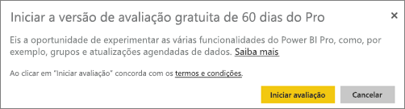
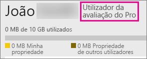

# Comprar o Power BI Pro
O Power BI Pro serve para os utilizadores publicarem relatórios, partilharem dashboards, colaborarem com colegas em áreas de trabalho e participarem noutras atividades relacionadas – como a capacidade de:

* Analisar dados no Excel ou Power BI Desktop
* Partilhar com suporte para o Excel Web App
* Partilhar dashboards e colaborar com áreas de trabalho de aplicações
* Ver conteúdo partilhado
* Integrar conteúdo no Microsoft Teams

Os administradores de TI têm algumas opções para utilizar o Power BI Pro na sua organização. Pode comprar o Power BI Pro diretamente no centro de administração do Office 365 ou através do seu representante ou parceiro Microsoft. Este artigo examinará as duas opções de avaliação disponíveis para o Power BI Pro e, em seguida, como comprar o como uma organização.

Para obter mais informações sobre o Power BI Premium e como o Power BI Pro se adapta à oferta Premium, veja [Power BI Premium – o que é?](service-premium.md)

## Preços
Para obter as informações de preços mais recentes do Power BI Pro e uma tabela das funcionalidades incluídas, veja [Preços do Power BI](https://powerbi.microsoft.com/pricing/).

## Versão de avaliação de 60 dias do Power BI Pro no serviço para particulares
Depois de se inscrever na sua conta gratuita, pode optar por experimentar o Pro gratuitamente durante 60 dias. Terá acesso a todas as funcionalidades do Pro durante o período de avaliação. O Power BI Pro tem todas as funcionalidades da versão gratuita do Power BI, além de funcionalidades adicionais de partilha e colaboração. Para obter mais informações, consulte [Preços do Power BI](https://powerbi.microsoft.com/pricing). Para experimentar uma avaliação gratuita de 60 dias do Power BI Pro, entre no Power BI e experimente uma destas funcionalidades do Power BI Pro:

* [Criar uma área de trabalho de aplicação](service-create-distribute-apps.md)
* [Partilhar um dashboard](service-share-dashboards.md)

Ao experimentar uma destas funcionalidades, será solicitado para iniciar a sua avaliação gratuita. Também pode optar por usá-la indo até ao ícone de engrenagem e selecionando **Gerir armazenamento pessoal**. Em seguida, selecione **Experimentar o Pro gratuitamente** à direita.

Em seguida, é possível selecionar **Iniciar avaliação**.

> [!NOTE]
> Os utilizadores que tiram partido desta versão de avaliação do Power BI Pro no produto não aparecem no portal de administração do Office 365 como utilizadores da versão deAvaliação do Power BI Pro (aparecem como utilizadores da versão gratuita do Power BI). No entanto, aparecerão como utilizadores da versão de Avaliação do Power BI Pro na página **gerir armazenamento** do Power BI.

> [!NOTE]
> Se for um Administrador de TI que deseja adquirir e implementar licenças de avaliação do Power BI para vários utilizadores na sua organização sem que os utilizadores individuais aceitem os termos da avaliação individualmente, é possível inscrever-se numa [avaliação de subscrição do Power BI Pro](https://portal.office.com/Signup/MainSignup15.aspx?OfferId=d59682f3-3e3b-4686-9c00-7c7c1c736085&dl=POWER_BI_PRO). Terá de ser um Administrador Global ou de Faturação do Office 365 ou criar um novo inquilino para se inscrever numa avaliação de administrador. Para obter mais informações, veja [Purchasing Power BI Pro (Comprar o Power BI Pro)](service-admin-purchasing-power-bi-pro.md).

> [!NOTE]
> Com a disponibilidade do Power BI Premium e as alterações à oferta do Power BI Gratuito a 1 de junho de 2017, pode ser elegível para uma Avaliação Pro Expandida. Para obter mais informações, veja [Extended Pro Trial activation (Ativação da Avaliação Pro Expandida)](service-extended-pro-trial.md).

### Aparência dentro do serviço
Quando está ligado ao serviço, pode verificar se tem uma conta de avaliação do Pro através do ícone de **ferramentas*, ao selecionar **Gerir armazenamento pessoal**.

## Subscrição de avaliação no Office 365
Pode obter o Power BI Pro como uma avaliação para a sua organização. Assim que tiver a subscrição, pode atribuir licenças do Power BI Pro aos seus utilizadores. Para obter mais informações sobre como atribuir licenças, veja [Atribuir licenças aos utilizadores no Office 365](https://support.office.com/article/Assign-or-unassign-licenses-for-Office-365-for-business-997596b5-4173-4627-b915-36abac6786dc).

> [!NOTE]
> Não existe um limite de uma versão de avaliação organizacional por inquilino. Isto significa que, se alguém já tiver aplicado a Versão de avaliação do Power BI Pro ao inquilino, não pode fazê-lo novamente. Se precisar de assistência, pode contactar o [suporte de Faturação do Office 365](https://support.office.microsoft.com/article/Contact-Office-365-for-business-support-Admin-Help-32a17ca7-6fa0-4870-8a8d-e25ba4ccfd4b?CorrelationId=552bbf37-214f-4202-80cb-b94240dcd671&ui=en-US&rs=en-US&ad=US#BKMK_call_support).
> 

1. Navegue até ao [Centro de administração do Office 365](https://portal.office.com/admin/default.aspx).
2. No painel de navegação esquerdo, selecione Faturação > Subscrições.
3. Selecione Adicionar subscrições + no lado direito.
4. Em Outros Planos, paire sobre a elipse (...) do Power BI Pro e selecione Iniciar avaliação gratuita.
   
    
5. No ecrã de confirmação do seu pedido, selecione Experimentar agora.
6. Selecione Continuar no recibo do pedido.

Em **Faturação** > **Subscrições**, verá **Versão de avaliação do Power BI Pro** listada com 25 licenças disponíveis. Esta é uma avaliação de um mês.

### Aparência dentro do serviço
Quando está no serviço, pode verificar se tem uma conta do Pro através do ícone de **ferramentas**, ao selecionar **Gerir armazenamento pessoal**. Não haverá nenhuma indicação de que se trata de um utilizador de avaliação.

## Comprar a subscrição no Office 365
Pode comprar o Power BI Pro para a sua organização através do Centro de administração do Office 365. Assim que tiver a subscrição, pode atribuir licenças do Power BI Pro aos seus utilizadores. Para obter mais informações sobre como atribuir licenças, veja [Atribuir licenças aos utilizadores no Office 365](https://support.office.com/article/Assign-or-unassign-licenses-for-Office-365-for-business-997596b5-4173-4627-b915-36abac6786dc).

1. Navegue até ao [Centro de administração do Office 365](https://portal.office.com/admin/default.aspx).
2. No painel de navegação esquerdo, selecione Faturação > Subscrições.
3. Selecione Adicionar subscrições + no lado direito.
4. Em Outros Planos, paire sobre a elipse (...) para o Power BI Pro e selecione Comprar agora.
   
    
5. Insira o número de licenças que pretende adicionar e selecione Finalizar compra agora ou Adicionar ao carrinho.
   
   > [!NOTE]
   > Pode adicionar mais posteriormente, se for necessário.
   > 
   > 
6. Insira as informações necessárias no fluxo de finalização de compra.

> [!NOTE]
> Se já tiver a Versão de avaliação do Power BI Pro, acederá diretamente ao ecrã de finalização da compra onde deve introduzir o número de licenças pretendido.
> 
> 

Em **Faturação** > **Subscrições**, verá **Power BI Pro** listado. Se decidir posteriormente que pretende adicionar mais licenças, pode voltar para **Adicionar subscrições** e selecionar **Alterar a quantidade de licenças**.

### Aparência dentro do serviço
Quando está no serviço, pode verificar se tem uma conta do Pro através do ícone de **ferramentas**, ao selecionar **Gerir armazenamento pessoal**.

## Período de tolerância
Após a licença do Power BI Pro expirar, existe um período de tolerância de 30 dias. 

O Power BI Pro tem o mesmo ciclo de vida de subscrição que o Office 365. Para obter mais informações, veja [O que acontece aos meus dados e acesso quando a minha subscrição do Office 365 para empresas termina?](https://support.office.com/en-us/article/What-happens-to-my-data-and-access-when-my-Office-365-for-business-subscription-ends-4436582f-211a-45ec-b72e-33647f97d8a3)

## Próximas etapas
[Inscrição self-service no Power BI](service-self-service-signup-for-power-bi.md)  
[Power BI (gratuito) na sua organização](service-admin-service-free-in-your-organization.md)  
[Ativação da Avaliação Pro Expandida](service-extended-pro-trial.md)  
[Power BI Premium – o que é?](service-premium.md)  
[Como comprar o Power BI Premium](service-admin-premium-purchase.md)  
[Documento técnico do Power BI Premium](https://aka.ms/pbipremiumwhitepaper)  

Mais perguntas? [Experimente perguntar à Comunidade do Power BI](http://community.powerbi.com/)

