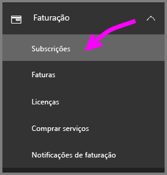
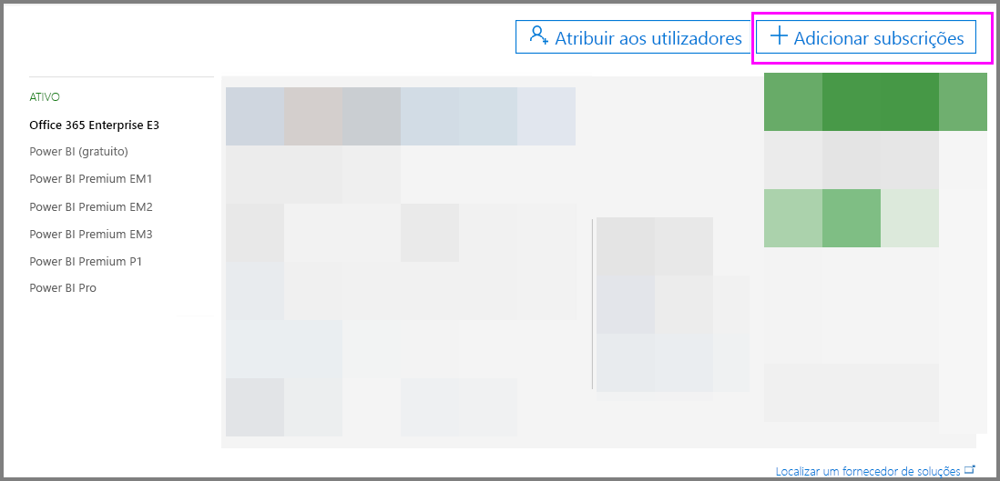
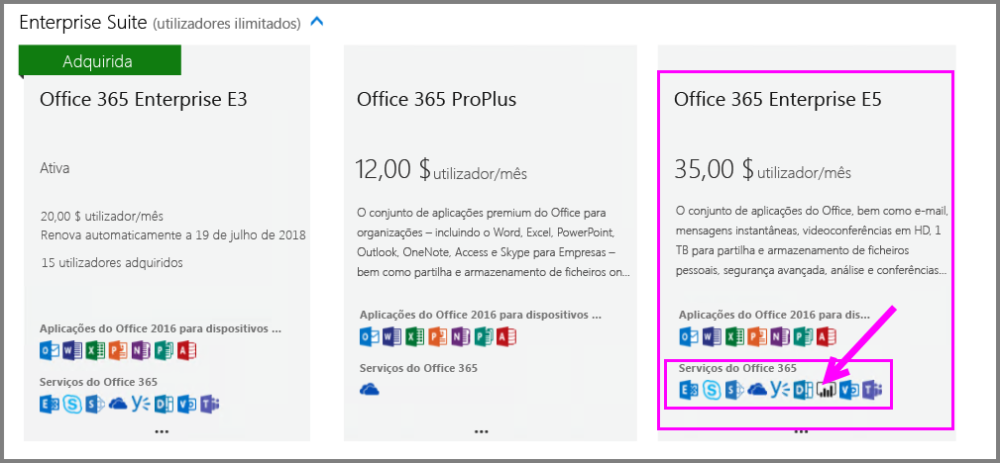
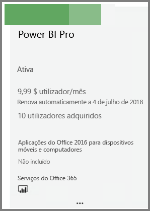
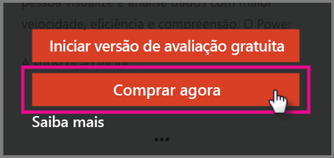
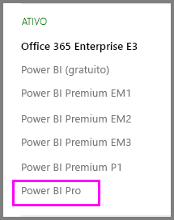

# Comprar o Power BI Pro

Com o Power BI Pro pode publicar relatórios, partilhar dashboards, colaborar com colegas em áreas de trabalho e participar noutras atividades relacionadas. Para obter mais informações sobre a forma como o Power BI Pro pode beneficiar a sua empresa, veja [Power BI Pro in your organization](service-admin-power-bi-pro-in-your-organization.md) (Power BI Pro na sua organização).

## Comprar o Power BI Pro através do Centro de Administração do Office 365

Os Administradores de TI do Office podem comprar o Power BI Pro como parte da subscrição do Office 365 Enterprise E5 ou como uma subscrição individual do Power BI Pro. Em seguida, pode atribuir licenças do Power BI Pro aos utilizadores adequados. Para obter mais informações sobre como atribuir licenças, veja [Atribuir licenças a utilizadores no Office 365](https://support.office.com/en-us/article/assign-licenses-to-users-in-office-365-for-business-997596b5-4173-4627-b915-36abac6786dc?ui=en-US&rs=en-US&ad=US).

Siga estes passos para comprar o Power BI Pro se for um Administrador de TI do Office:

1. Navegue até ao [Centro de administração do Office 365](https://portal.office.com/adminportal/home#/homepage).
2. No painel de navegação esquerdo, selecione Faturação e, em seguida, clique em Subscrições.

    

3. Clique em Adicionar subscrições no canto superior direito da página Subscrições.

    

4. Localize a oferta de subscrição pretendida:

    Em Enterprise Suite, selecione Office 365 Enterprise E5

    

    Em Outros Planos, selecione Power BI Pro

    

5. Paire o rato sobre as reticências (…) na subscrição pretendida e selecione Comprar agora.

    

6. Selecione Pagar mensalmente ou Pagar o ano completo consoante a sua preferência de faturação.
7. Em Quantos utilizadores pretende?, introduza o número pretendido de licenças e, em seguida, clique em Finalizar a compra agora ou Adicionar ao carrinho e conclua a transação.
8. Certifique-se de que a subscrição obtida se encontra agora listada na página Subscrições.

   

> [!NOTE]
> Pode adicionar mais licenças após a compra inicial. Selecione a subscrição do Power BI Pro a partir da página Subscrições e, em seguida, clique em Adicionar/Remover licenças.
>

## Preços

Para obter as informações mais recentes sobre preços, consulte [Power BI Pricing](https://powerbi.microsoft.com/en-us/pricing/) (Preços do Power BI).

> [!NOTE]
> Os utilizadores com licenças Pro atribuídas terão 30 dias de acesso total após o final da subscrição. Quando isto acontecer, a sua subscrição aparecerá como “expirada” no portal de administração.
>

## Próximos passos
[Inscrição self-service no Power BI](service-admin-signing-up-for-power-bi-with-a-new-office-365-trial.md)
 
[Power BI (gratuito) na sua organização](service-admin-service-free-in-your-organization.md)
 
[Power BI Pro in your organization](service-admin-power-bi-pro-in-your-organization.md) (Power BI Pro na sua organização)
 
[Ativação da Versão de Avaliação Pro alargada](service-extended-pro-trial.md)
 
[Assigning Power BI Pro licenses](service-admin-assigning-power-bi-pro-licenses.md) (Atribuir licenças do Power BI Pro)
 
[Power BI Premium - what is it?](service-admin-premium-manage.md) (Power BI Premium – o que é?)
 
[Como comprar o Power BI Premium](service-admin-premium-purchase.md)
 
[Documento técnico do Power BI Premium](https://aka.ms/pbipremiumwhitepaper)

Mais perguntas? [Experimente perguntar à Comunidade do Power BI](https://community.powerbi.com/)
