# Comprar e atribuir licenças Power BI Pro

O Power BI Pro é uma licença individual que permite o acesso a todos os conteúdos e capacidades no serviço Power BI, incluindo a capacidade de partilhar conteúdo e colaborar com outros utilizadores Pro. Apenas os utilizadores Pro podem publicar e consumir conteúdo a partir de áreas de trabalho de aplicações, partilhar dashboards e subscrever dashboards e relatórios. Para obter mais informações, veja [Funcionalidades do Power BI por tipo de licença](service-features-license-type.md).

Este artigo explica como comprar licenças do Power BI Pro no Office 365. O artigo explica, em seguida, as duas opções para atribuir essas licenças a utilizadores individuais: Office 365 e Azure (escolha uma opção).

## Pré-requisitos

Tem de ser um membro da função de [**Administrador global** ou **Administrador de faturação**](https://support.office.com/article/about-office-365-admin-roles-da585eea-f576-4f55-a1e0-87090b6aaa9d) no Office 365.

Para atribuir licenças no Azure, tem de ser um proprietário da subscrição do Azure que o Power BI utiliza para pesquisas do Active Directory.

## Comprar licenças no Office 365

Siga estes passos para comprar licenças do Power BI Pro:

1. Abra o [Centro de Administração do Office 365](https://portal.office.com/adminportal/home#/homepage).

2. No painel de navegação esquerdo, selecione **Faturação** > **Subscrições**.

    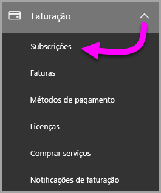

3. No canto superior direito da página **Subscrições**, selecione **Adicionar subscrições**.

    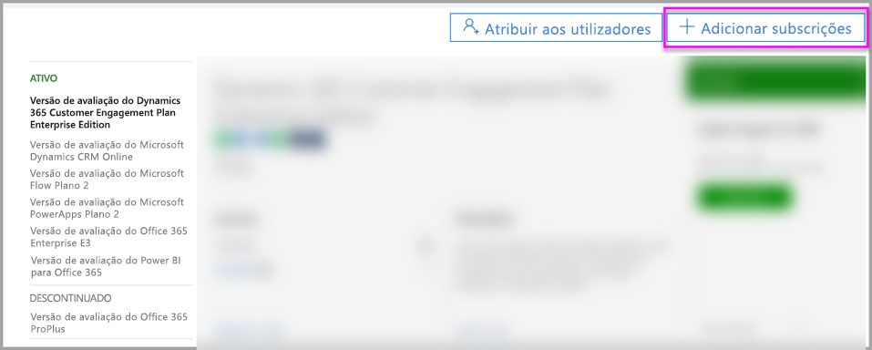

4. Localize a oferta de subscrição pretendida:

    Em **Enterprise Suite**, selecione **Office 365 Enterprise E5**.

    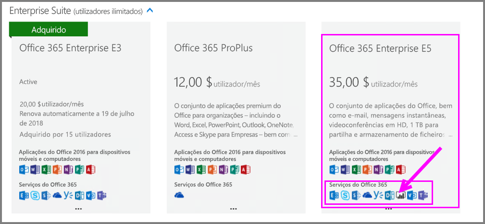

    Em **Outros Planos**, selecione **Power BI Pro**.

    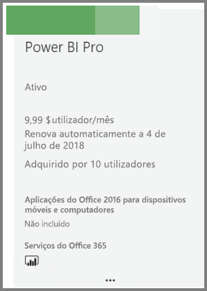

5. Paire o rato sobre as reticências (**. . .**) na subscrição pretendida e selecione **Comprar agora**.

    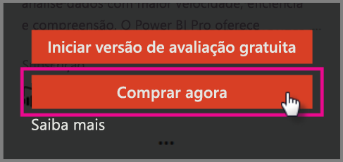

6. Selecione **Pagar mensalmente** ou **Pagar o ano completo** consoante a sua preferência de faturação.

7. Em **Quantos utilizadores pretende?**, introduza o número pretendido de licenças e, em seguida, selecione **Finalizar a compra agora** e conclua a transação.

8. Verifique se a subscrição obtida se encontra agora listada na página **Subscrições**.

   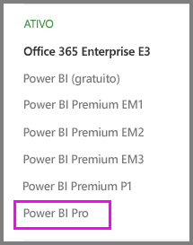

9. Para adicionar mais licenças após a compra inicial, selecione **Power BI Pro** da página **Subscrições** e, em seguida, selecione **Adicionar/Remover licenças**.

## Atribuir licenças no Office 365

Siga estes passos para atribuir licenças do Power BI Pro a contas de utilizador individuais:

1. Abra o [Centro de Administração do Office 365](https://portal.office.com/adminportal/home#/homepage).

2. No painel de navegação à esquerda, expanda **Utilizadores** e, em seguida, selecione **Utilizadores ativos**.

    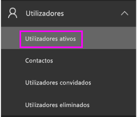

3. Selecione um utilizador e, em seguida, em **Licenças de produtos**, selecione **Editar**.

    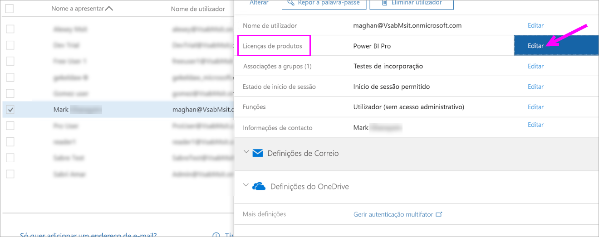

4. Em **Power BI Pro**, altere a definição para **Ativado** e selecione **Guardar**.

    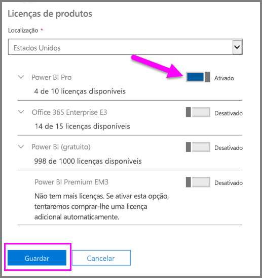

5. Para a conta selecionada, verifique em **Estado** se a licença do Power BI Pro foi atribuída com êxito.

    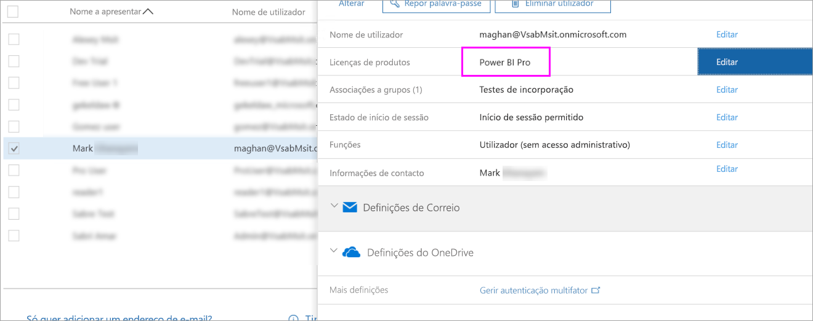

## Atribuir licenças no Azure

Siga estes passos para atribuir licenças do Power BI Pro a contas de utilizador individuais:

1. Abra o [portal do Azure](https://ms.portal.azure.com/#@microsoft.onmicrosoft.com/dashboard/private/39bc3cf7-31a4-43f6-954c-f2d69ca2f0).

2. Na barra de navegação esquerda, selecione **Azure Active Directory**.

    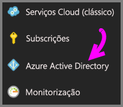

3. Em **Azure Active Directory**, selecione **Licenças**.

    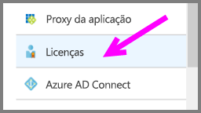

4. Em **Licenças**, clique em **Todos os produtos** e, em seguida, selecione **Power BI Pro** para apresentar a lista de utilizadores com licenças.

    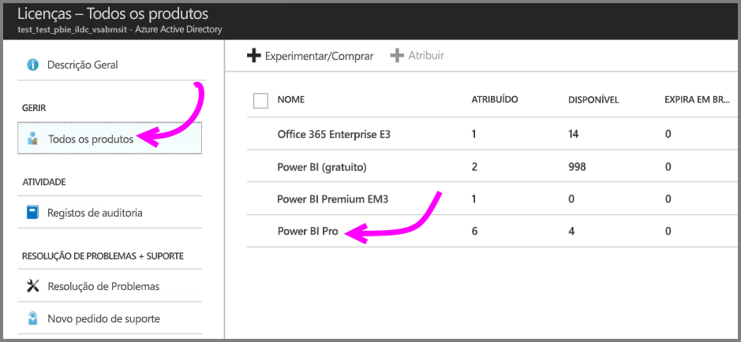

5. Selecione **Atribuir** para adicionar uma licença do Power BI Pro a uma conta de utilizador adicional.

    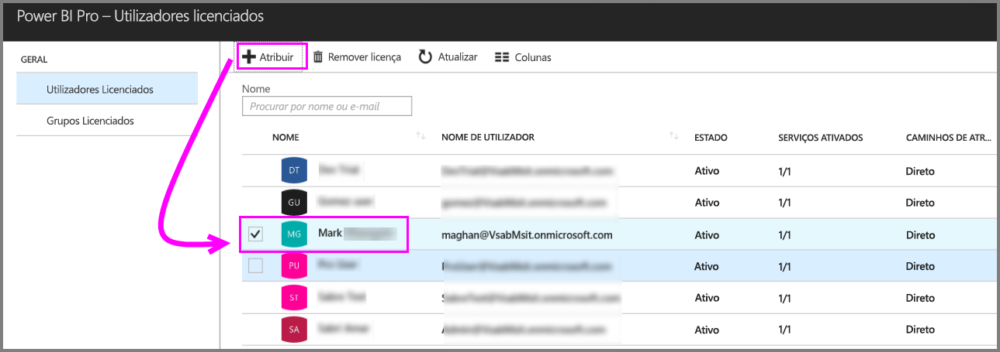

## Próximos passos

Agora que já atribuiu licenças, saiba mais sobre o Power BI Pro.

[Licenciamento do Power BI na sua organização](service-admin-licensing-organization.md)

[Encontrar utilizadores do Power BI que iniciaram sessão](service-admin-access-usage.md)

Mais perguntas? [Experimente perguntar à Comunidade do Power BI](https://community.powerbi.com/)
