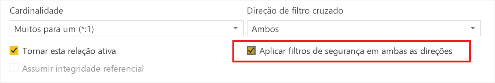
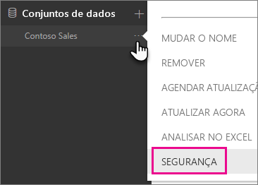
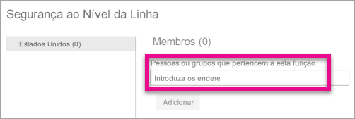
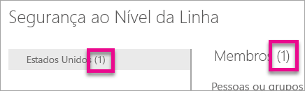
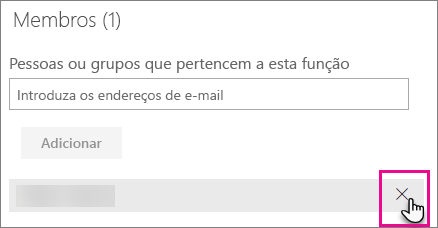
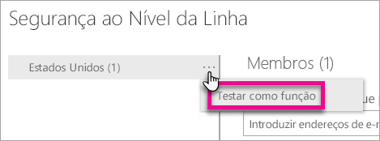
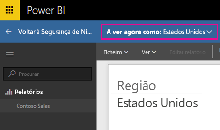
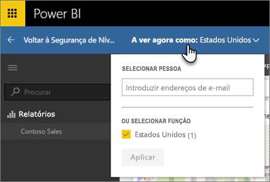
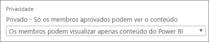

# Segurança ao nível da linha (RLS) com o Power BI
<iframe width="560" height="315" src="https://www.youtube.com/embed/67fK0GoVQ80?showinfo=0" frameborder="0" allowfullscreen></iframe>

A segurança ao nível da linha (RLS) com o Power BI pode ser utilizada para restringir o acesso a dados para determinados utilizadores. Os filtros restringem os dados ao nível da linha. Pode definir filtros em funções.

Pode configurar a RLS para modelos de dados importados para o Power BI com o Power BI Desktop. Também pode configurar a RLS em conjuntos de dados que utilizem o DirectQuery, como o SQL Server. Anteriormente, só era possível implementar a RLS em modelos dos Analysis Services no local fora do Power BI. Para as ligações em direto dos Analysis Services, configure a segurança ao nível da linha no modelo no local. A opção de segurança não vai ser apresentada para conjuntos de dados de ligação em direto.

[!INCLUDE [include-short-name](./includes/rls-desktop-define-roles.md)]

Por predefinição, a filtragem de segurança ao nível da linha utiliza filtros unidirecionais, independentemente de as relações estarem definidas como unidirecionais ou bidirecionais. Pode ativar manualmente o filtro cruzado bidirecional com segurança ao nível da linha ao selecionar a relação e ao marcar a caixa de verificação**Aplicar filtros de segurança em ambas as direções**. Deve marcar esta caixa ao implementar a [segurança dinâmica ao nível da linha](https://docs.microsoft.com/sql/analysis-services/supplemental-lesson-implement-dynamic-security-by-using-row-filters), com a qual obtém segurança ao nível da linha com base no nome de utilizador ou no ID de início de sessão. 

Para obter mais informações, veja [Bidirectional cross-filtering using DirectQuery in Power BI Desktop (Filtragem cruzada bidirecional com o DirectQuery no Power BI Desktop)](desktop-bidirectional-filtering.md) e o artigo técnico [Securing the Tabular BI Semantic Model (Proteger o Modelo Semântico Tabular do BI)](http://download.microsoft.com/download/D/2/0/D20E1C5F-72EA-4505-9F26-FEF9550EFD44/Securing the Tabular BI Semantic Model.docx).

[!INCLUDE [include-short-name](./includes/rls-desktop-view-as-roles.md)]

## Gerir a segurança no modelo
Para gerir a segurança no modelo de dados, é necessário fazer o seguinte.

1. Selecione as **reticências (...)** para um conjunto de dados.
2. Selecione **Segurança**.
   
   

Esta ação leva-o para a página RLS para adicionar membros a uma função que criou no Power BI Desktop. Apenas os proprietários do conjunto de dados verão a opção Segurança disponível. Se o conjunto de dados estiver num Grupo, apenas os Administradores do grupo verão a opção de segurança. 

Só poderá criar ou modificar funções dentro do Power BI Desktop.

## Trabalhar com membros
### Adicionar membros
Pode adicionar um membro à função ao introduzir o endereço de e-mail ou o nome do utilizador, grupo de segurança ou lista de distribuição que pretende adicionar. Este membro tem de estar na sua organização. Não é possível adicionar Grupos criados no Power BI.

Também pode ver quantos membros fazem parte da função pelo número entre parênteses ao lado do nome da função ou ao lado de Membros.

### Remover membros
É possível remover membros selecionando o X ao lado do nome. 

## Validar a função no serviço Power BI
Pode validar que a função que definiu está a funcionar corretamente ao testar a função. 

1. Selecione as **reticências (...)** junto à função.
2. Selecione **Testar dados como função**

Em seguida, irá ver os relatórios que estão disponíveis para esta função. Os dashboards não são apresentados nesta vista. Na barra azul acima, verá o que está a ser aplicado.

Pode testar outras funções ou combinação de funções, selecionando **A ver agora como**.

Pode optar por ver os dados como uma pessoa específica ou pode selecionar uma combinação de funções disponíveis para validar que estão a funcionar. 

Para voltar à visualização normal, selecione **Voltar à Segurança de Nível de Linha**.

[!INCLUDE [include-short-name](./includes/rls-usernames.md)]

## Utilizar a RLS com áreas de trabalho de aplicação no Power BI
Se publicar o relatório do Power BI Desktop numa área de trabalho de aplicação no serviço Power BI, as funções serão aplicadas aos membros só de leitura. Terá de indicar que os membros só podem ver o conteúdo do Power BI nas definições de área de trabalho da aplicação.

> [!WARNING]
> Se tiver configurado a área de trabalho de aplicação para que os membros tenham permissões de edição, as funções de RLS não serão aplicadas às mesmas. Os utilizadores poderão ver todos os dados.
> 
> 

[!INCLUDE [include-short-name](./includes/rls-limitations.md)]

[!INCLUDE [include-short-name](./includes/rls-faq.md)]

## Próximos passos
[Segurança ao nível da linha (RLS) com o Power BI Desktop](desktop-rls.md)  

Mais perguntas? [Experimente perguntar à Comunidade do Power BI](http://community.powerbi.com/)

