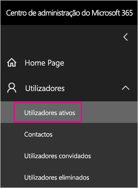
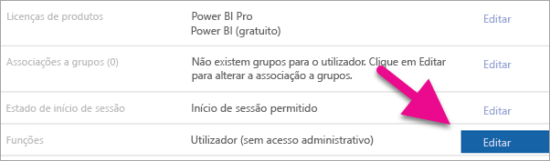
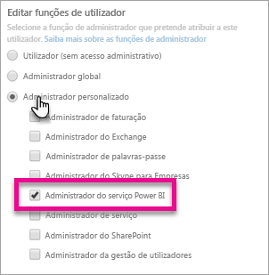
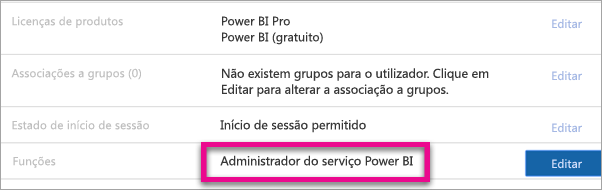

# <a name="understanding-the-power-bi-service-administrator-role"></a>Compreender a função de administrador do serviço Power BI

Saiba como pode utilizar a função de administrador do serviço Power BI na sua organização. Os utilizadores nesta função têm controlo total sobre um inquilino do Power BI e sobre as suas funcionalidades administrativas, à exceção do licenciamento.

<iframe width="640" height="360" src="https://www.youtube.com/embed/PQRbdJgEm3k?showinfo=0" frameborder="0" allowfullscreen></iframe>

A função de administrador do serviço Power BI pode ser atribuída a utilizadores que precisam de ter acesso ao Portal de administração do Power BI sem conceder também a esses utilizadores acesso administrativo completo ao Office 365.

Os administradores de gestão de utilizadores do Office 365 atribuem utilizadores à função de administrador de serviço do Power BI no centro de administração do Microsoft 365 ou através de um script do PowerShell. Depois de serem atribuídos, os utilizadores poderão aceder ao [portal de administração do Power BI](service-admin-portal.md). No portal, têm acesso a métricas de utilização a nível do inquilino e podem controlar a utilização a nível do inquilino das funcionalidades do Power BI.

## <a name="limitations-and-considerations"></a>Limitações e considerações

A função de administrador do serviço Power BI não fornece as seguintes capacidades:

* Capacidade de modificar utilizadores e licenças no centro de administração do Microsoft 365.

* Acesso aos registos de auditoria. Para obter mais informações, veja [Utilizar a auditoria na sua organização](service-admin-auditing.md).

## <a name="assign-users-to-the-admin-role-in-office-365"></a>Atribuir utilizadores à função de administrador no Office 365

Para atribuir utilizadores à função de administrador do Power BI no centro de administração do Microsoft 365, siga estes passos.

1. Na [Centro de administração do Microsoft 365](https://portal.office.com/adminportal/home#/homepage), selecione **utilizadores** > **utilizadores ativos**.

    

1. Selecione o utilizador ao qual pretende atribuir a função.

1. Em **Funções**, selecione **Editar**.

    

1. Selecione **Administrador personalizado** > **Administrador do serviço Power BI**.

    

1. Selecione **Guardar** e **Fechar**.

Deverá ver **Administrador do serviço Power BI** listado para a função desse utilizador.



## <a name="assign-users-to-the-admin-role-with-powershell"></a>Atribuir utilizadores à função de administrador no PowerShell

Também pode atribuir utilizadores às funções com o PowerShell. Os utilizadores são geridos no Azure Active Directory (Azure AD). Se ainda não tiver o módulo Azure AD PowerShell, [transfira e instale a versão mais recente](https://www.powershellgallery.com/packages/AzureAD/).

1. Em primeiro lugar, liga ao Azure AD:
   ```
   PS C:\Windows\system32> Connect-AzureAD
   ```

1. Em segundo lugar, obtenha os **ObjectId** para o **administrador de serviço do Power BI** função. Pode executar [Get-AzureADDirectoryRole](/powershell/module/azuread/get-azureaddirectoryrole) para obter o **ObjectId**

    ```
    PS C:\Windows\system32> Get-AzureADDirectoryRole

    ObjectId                             DisplayName                        Description
    --------                             -----------                        -----------
    00f79122-c45d-436d-8d4a-2c0c6ca246bf Power BI Service Administrator     Full access in the Power BI Service.
    250d1222-4bc0-4b4b-8466-5d5765d14af9 Helpdesk Administrator             Helpdesk Administrator has access to perform..
    3ddec257-efdc-423d-9d24-b7cf29e0c86b Directory Synchronization Accounts Directory Synchronization Accounts
    50daa576-896c-4bf3-a84e-1d9d1875c7a7 Company Administrator              Company Administrator role has full access t..
    6a452384-6eb9-4793-8782-f4e7313b4dfd Device Administrators              Device Administrators
    9900b7db-35d9-4e56-a8e3-c5026cac3a11 AdHoc License Administrator        Allows access manage AdHoc license.
    a3631cce-16ce-47a3-bbe1-79b9774a0570 Directory Readers                  Allows access to various read only tasks in ..
    f727e2f3-0829-41a7-8c5c-5af83c37f57b Email Verified User Creator        Allows creation of new email verified users.
    ```

    Neste caso, o **ObjectId** da função é 00f79122-c45d-436d-8d4a-2c0c6ca246bf.

1. Em seguida, obtenha o **ObjectId** do utilizador. Para encontrá-lo, execute [Get-AzureADUser](/powershell/module/azuread/get-azureaduser).

    ```
    PS C:\Windows\system32> Get-AzureADUser -ObjectId 'tim@contoso.com'

    ObjectId                             DisplayName UserPrincipalName      UserType
    --------                             ----------- -----------------      --------
    6a2bfca2-98ba-413a-be61-6e4bbb8b8a4c Tim         tim@contoso.com        Member
    ```

1. Para adicionar o membro à função, execute [Add-AzureADDirectoryRoleMember](/powershell/module/azuread/add-azureaddirectoryrolemember).

    | Parâmetro | Descrição |
    | --- | --- |
    | ObjectId |O ObjectId da Função. |
    | RefObjectId |O ObjectId dos membros. |

    ```powershell
    Add-AzureADDirectoryRoleMember -ObjectId 00f79122-c45d-436d-8d4a-2c0c6ca246bf -RefObjectId 6a2bfca2-98ba-413a-be61-6e4bbb8b8a4c
    ```

## <a name="next-steps"></a>Próximos passos

[Administrar o Power BI na sua Organização](service-admin-administering-power-bi-in-your-organization.md)  
[Portal de administração do Power BI](service-admin-portal.md)  

Mais perguntas? [Experimente perguntar à Comunidade do Power BI](http://community.powerbi.com/)