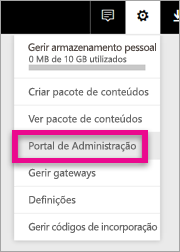

# <a name="understanding-the-power-bi-admin-role"></a>Compreender a função de administrador do Power BI
Saiba como pode utilizar a função de administrador do Power BI na sua organização.

<iframe width="640" height="360" src="https://www.youtube.com/embed/PQRbdJgEm3k?showinfo=0" frameborder="0" allowfullscreen></iframe>

A função de Administrador do Serviço Power BI pode ser atribuída a utilizadores que devem ter acesso ao Portal de Administração do Power BI sem lhes conceder também outro acesso administrativo do Office 365. Por exemplo, a função de Administrador Global. Destina-se aos utilizadores cuja tarefa é administrar o Power BI na respetiva organização.

Os administradores de utilizadores do Office 365 podem nomear utilizadores para serem administradores do Power BI no Centro de Administração do Office 365 ou através do script do PowerShell. Depois de um utilizador ser nomeado, poderá aceder ao [portal de administração do Power BI](service-admin-portal.md). No portal, terão acesso a métricas de utilização a nível de inquilino e poderão controlar a utilização a nível de inquilino das funcionalidades do Power BI.



## <a name="using-the-office-365-admin-center-to-assign-a-role"></a>Utilizar o Centro de Administração do Office 365 para atribuir uma função
Para atribuir a função de Administrador do Power BI aos utilizadores no Centro de Administração do Office 365, pode fazer o seguinte.

1. Navegue até ao Centro de Administração do Office 365 e selecione **Utilizadores** > **Utilizadores Ativos**.
   
    
2. Selecione o utilizador ao qual pretende atribuir a função.
3. Selecione **Editar** para funções.
   
    
4. Selecione **Administrador personalizado** > **Administrador do serviço Power BI**
   
    
5. Selecione **Guardar**.

Deverá ver **Administrador do serviço Power BI** listado para a função desse utilizador. Esse utilizador terá agora acesso ao [portal de administração do Power BI](service-admin-portal.md).


## <a name="using-powershell-to-assign-a-role"></a>Utilizar o PowerShell para atribuir uma função
Para executar o comando do PowerShell, tem de ter o Módulo PowerShell do Azure Active Directory instalado.

### <a name="download-azure-ad-powershell-module"></a>Transferir o módulo PowerShell do Azure AD
[Transferir o Azure Active Directory PowerShell Versão 2](https://github.com/Azure/azure-docs-powershell-azuread/blob/master/Azure%20AD%20Cmdlets/AzureAD/index.md)

[Transferir o Azure Active Directory PowerShell Versão 1.1.166.0 GA](http://connect.microsoft.com/site1164/Downloads/DownloadDetails.aspx?DownloadID=59185)

### <a name="command-to-add-role-to-member"></a>Comando para adicionar a função ao membro
**Comando do Azure AD PowerShell v2**

Terá de obter o **ObjectId** para a função **Administrador do Serviço Power BI**. Pode executar [Get-AzureADDirectoryRole](https://docs.microsoft.com/powershell/azuread/v2/get-azureaddirectoryrole) para obter o **ObjectId**

```
PS C:\Windows\system32> Get-AzureADDirectoryRole

ObjectId                             DisplayName                        Description
--------                             -----------                        -----------
00f79122-c45d-436d-8d4a-2c0c6ca246bf Power BI Service Administrator     Full access in the Power BI Service.
250d1222-4bc0-4b4b-8466-5d5765d14af9 Helpdesk Administrator             Helpdesk Administrator has access to perform..
3ddec257-efdc-423d-9d24-b7cf29e0c86b Directory Synchronization Accounts Directory Synchronization Accounts
50daa576-896c-4bf3-a84e-1d9d1875c7a7 Company Administrator              Company Administrator role has full access t..
6a452384-6eb9-4793-8782-f4e7313b4dfd Device Administrators              Device Administrators
9900b7db-35d9-4e56-a8e3-c5026cac3a11 AdHoc License Administrator        Allows access manage AdHoc license.
a3631cce-16ce-47a3-bbe1-79b9774a0570 Directory Readers                  Allows access to various read only tasks in ..
f727e2f3-0829-41a7-8c5c-5af83c37f57b Email Verified User Creator        Allows creation of new email verified users.
```

Neste caso, o objectid da função é 00f79122-c45d-436d-8d4a-2c0c6ca246bf.

Também terá de saber o **ObjectID** dos utilizadores. Para encontrá-lo, execute [Get-AzureADUser](https://docs.microsoft.com/powershell/azuread/v2/get-azureaduser).

```
PS C:\Windows\system32> Get-AzureADUser -SearchString 'tim@contoso.com'

ObjectId                             DisplayName UserPrincipalName      UserType
--------                             ----------- -----------------      --------
6a2bfca2-98ba-413a-be61-6e4bbb8b8a4c Tim         tim@contoso.com        Member
```

Para adicionar o membro à função, execute [Add-AzureADDirectoryRoleMember](https://docs.microsoft.com/powershell/azuread/v2/add-azureaddirectoryrolemember).

| Parâmetro | Descrição |
| --- | --- |
| ObjectId |O ObjectId da Função. |
| RefObjectId |O ObjectId dos membros. |

```
Add-AzureADDirectoryRoleMember -ObjectId 00f79122-c45d-436d-8d4a-2c0c6ca246bf -RefObjectId 6a2bfca2-98ba-413a-be61-6e4bbb8b8a4c
```

**Comando do Azure AD PowerShell v1**

Para adicionar um membro a uma função com os cmdlets do Azure AD v1, terá de executar o comando [Add-MsolRoleMember](https://docs.microsoft.com/powershell/msonline/v1/add-msolrolemember).

```
Add-MsolRoleMember -RoleMemberEmailAddress "tim@contoso.com" -RoleName "Power BI Service Administrator"
```

## <a name="limitations-and-considerations"></a>Limitações e considerações
A função de administrador do serviço Power BI não fornece acesso ao seguinte.

* Capacidade de modificar utilizadores e licenças no Centro de Administração do Office 365
* Acesso aos registos de auditoria. Para obter mais informações, veja [Utilizar a auditoria na sua organização](service-admin-auditing.md).

## <a name="next-steps"></a>Próximos passos
[Portal de administração do Power BI](service-admin-portal.md)  
[Add-AzureADDirectoryRoleMember](https://docs.microsoft.com/powershell/azuread/v2/add-azureaddirectoryrolemember)  
[Add-MsolRoleMember](https://docs.microsoft.com/powershell/msonline/v1/add-msolrolemember)  
[Fazer a auditoria do Power BI na sua organização](service-admin-auditing.md)  
[Administrar o Power BI na sua organização](service-admin-administering-power-bi-in-your-organization.md)  

Mais perguntas? [Experimente perguntar à Comunidade do Power BI](http://community.powerbi.com/)

