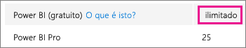
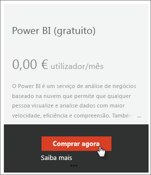
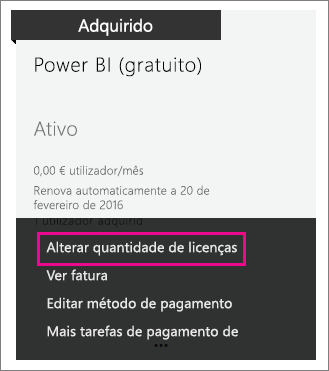

# Power BI (gratuito) na sua organização
Este descreve como a oferta do Power BI (gratuito) pode ser usada na sua organização. Uma organização significa que tem um inquilino e pode gerir utilizadores e serviços dentro desse inquilino. Como administrador, pode controlar a atribuição de licença ou permitir que os utilizadores se inscrevam como um indivíduo. Vamos analisar a licença do Power BI (gratuito) e a forma como pode controlar a inscrição individual.

## Inscrição individual versus atribuição de licença
Os utilizadores da sua organização podem obter acesso ao Power BI de duas maneiras diferentes. Podem inscrever-se individualmente no Power BI ou pode atribuir-lhes uma licença do Power BI no portal de administração do Office 365.

Permitir a inscrição individual reduz a carga, dos administradores da organização, permitindo que os utilizadores que estejam interessados no Power BI se inscrevam gratuitamente.

Para maior controlo, pode bloquear a inscrição individual e atribuir licenças do Power BI no Centro de administração do Office 365. Isto permite-lhe ser específico quanto a quem acede a que serviços na sua organização. Esta também é uma ótima opção se tiver de lidar com a auditoria e precisar de saber exatamente quem pode usar o quê.

## Como obter o bloco de licenças ilimitadas
No Centro de administração do Office 365, em **Faturação** > **Licenças**, pode ou não ver o Power BI (gratuito) com licenças ilimitadas.

Este bloco de licenças é exibido na primeira vez que alguém se inscreve no Power BI como um indivíduo. Durante esse processo, este bloco de licenças é associado à sua organização e é atribuída uma licença ao utilizador que está a inscrever-se.

Se estiver a bloquear inscrições de utilizador individuais e ninguém tiver se inscrito, não verá este bloco de licenças. Pode permitir inscrições de utilizador individuais e ter uma inscrição de utilizador ou pode obter licenças gratuitas através do processo do Office 365 de adição de subscrição, que será comentado a seguir.

Quando o bloco de licenças do Power BI (gratuito) estiver disponível, pode atribuir essas licenças aos seus utilizadores. Para obter mais informações sobre como atribuir licenças, veja [Atribuir licenças aos utilizadores no Office 365](https://support.office.com/article/Assign-or-unassign-licenses-for-Office-365-for-business-997596b5-4173-4627-b915-36abac6786dc).

## Obter licenças gratuitas através da adição de subscrição no Office 365
1. Navegue até ao [Centro de administração do Office 365](https://portal.office.com/admin/default.aspx).
2. No painel de navegação esquerdo, selecione **Faturação** > **Subscrições**.
3. Selecione **Adicionar subscrições +** no lado direito.
4. Em Outros Planos, passe o rato sobre a **elipse (...)** para o Power BI (gratuito) e selecione **Comprar agora**.
   
    
5. Insira o número de licenças que deseja adicionar e selecione **Fazer check-out agora** ou em **Adicionar ao carrinho**.
   
   > [!NOTE]
   > Se for necessário, posteriormente, pode adicionar mais.
   > 
   > 
6. Insira as informações necessárias no processo de check-out.

Não há qualquer compra nesta abordagem, embora tenha de inserir os seus dados do cartão de crédito para efeitos de faturação ou para optar por faturação.

Se decidir que, posteriormente, deseja adicionar mais licenças, pode voltar para **Adicionar subscrições** e selecionar **Alterar a quantidade de licenças** para o Power BI (gratuito).

Agora pode atribuir essas licenças aos seus utilizadores. Para obter mais informações sobre como atribuir licenças, veja [Atribuir licenças aos utilizadores no Office 365](https://support.office.com/article/Assign-or-unassign-licenses-for-Office-365-for-business-997596b5-4173-4627-b915-36abac6786dc).

## Ativar ou desativar a inscrição de utilizador individual no Azure Active Directory
Como administrador, pode optar por ativar ou desativar as inscrições de utilizador individuais como parte do AAD (Azure Active Directory). Se souber como usar os comandos do PowerShell do AAD, pode ativar ou desativar, subscrições ad hoc. [Saiba mais](https://technet.microsoft.com/library/jj151815.aspx)

A definição do AAD que controla isto é **AllowAdHocSubscriptions**. A maioria dos inquilinos terá essa definição como true, o que significa que está ativada. Se adquiriu o Power BI através de um parceiro, pode estar predefinida como false, o que significa que está desativada.

1. Tem de entrar primeiro no Azure Active Directory com as suas credenciais do Office 365. Na primeira linha serão solicitadas as suas credenciais. Na segunda linha, será ligado ao Azure Active Directory.
   
     $msolcred = get-credential   connect-msolservice -credential $msolcred
   
   
2. Uma vez ligado, pode emitir o comando a seguir de modo a ver para que é que o seu inquilino está atualmente configurado.
   
     Get-MsolCompanyInformation | fl AllowAdHocSubscriptions
3. Pode usar este comando para ativar ($true) ou desativar ($false) o AllowAdHocSubscriptions.
   
     Set-MsolCompanySettings -AllowAdHocSubscriptions $true

> [!NOTE]
> Este bloqueio impede os novos utilizadores na organização de se inscreverem no Power BI. Os utilizadores que se inscreverem no Power BI antes da desativação de novas inscrições para a organização manterão as respetivas licenças.
> 
> 

## Próximos passos
[Inscrição personalizada no Power BI](service-self-service-signup-for-power-bi.md)  
[Comprar o Power BI Pro](service-admin-purchasing-power-bi-pro.md)  
[Inscrever-se no Power BI (gratuito) com um inquilino do Azure Active Directory personalizado](developer/create-an-azure-active-directory-tenant.md)  
[Power BI Premium – o que é?](service-premium.md)  
[Documento técnico do Power BI Premium](https://aka.ms/pbipremiumwhitepaper)  

Mais perguntas? [Experimente perguntar à Comunidade do Power BI](http://community.powerbi.com/)

