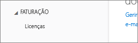
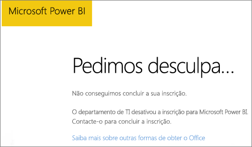
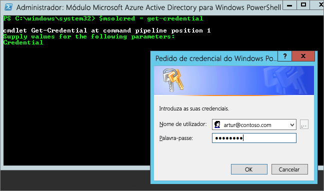

# Não é possível adicionar o Power BI a uma subscrição de parceiro do Office 365
O Office 365 permite que as empresas o revendam acompanhado e integrado com as suas próprias soluções, fornecendo aos clientes finais um único ponto de contacto para compra, faturação e suporte.

Se estiver interessado em adquirir o Power BI, juntamente com a sua subscrição do Office 365, recomendamos que contacte o seu parceiro. Se o seu parceiro não oferecer o Power BI, existem opções diferentes que pode considerar.

1. Pode comprar o serviço a partir de outro canal, diretamente à Microsoft ou a outro parceiro. Esta opção não está disponível para todos os clientes, consoante a relação com o parceiro. É possível verificar isto através do **Portal de Administração do Office 365** > **Faturação** > **Subscrições**. Se vir **Subscrições**, é possível adquirir o serviço da Microsoft diretamente ou também pode entrar em contacto com um parceiro que ofereça o Power BI.
   
    
2. Se não vir a opção **Subscrições** listada em **Faturação**, não é possível comprar diretamente através da Microsoft ou de outro parceiro. 
   
   

Se não conseguir comprar o Power BI diretamente, ainda terá algumas opções, consoante o tipo de subscrição do Power BI em que esteja interessado.

[Power BI (gratuito)](#power-bi-free)

[Power BI Pro e Premium](#power-bi-pro)

## Power BI (gratuito)
Se estiver satisfeito com a oferta gratuita do Power BI, pode inscrever-se para obter o serviço gratuito. Por predefinição, as inscrições individuais, também conhecidas como subscrições ad-hoc, estão desativadas. Quando tentar inscrever-se no Power BI, verá uma mensagem a indicar que o departamento de TI desativou a inscrição do Microsoft Power BI.

    Your IT department has turned off signup for Microsoft Power BI.

Para ativar as subscrições ad-hoc, contacte o seu parceiro e peça-lhe que as ative. Se for um Administrador do seu inquilino e souber utilizar comandos do PowerShell no Azure Active Directory, pode ativar as subscrições ad-hoc. [Saiba mais](https://technet.microsoft.com/library/jj151815.aspx)

1. Primeiro, tem de iniciar sessão no Azure Active Directory com a sua credencial do Office 365. Na primeira linha serão solicitadas as suas credenciais. Na segunda linha, é ligado ao Azure Active Directory.
   
        $msolcred = get-credential
        connect-msolservice -credential $msolcred
   
    
2. Quando tiver sessão iniciada, pode emitir o comando seguinte para ativar as subscrições gratuitas.
   
        Set-MsolCompanySettings -AllowAdHocSubscriptions $true

## Power BI Pro e Premium
Se quiser comprar uma subscrição do Power BI Pro ou Power BI Premium, será necessário trabalhar com o seu parceiro para considerar as opções que estão disponíveis.

* O seu parceiro concorda em adicionar o Power BI ao respetivo portefólio para que possa fazer compras através dele.
* O seu parceiro consegue fazer a sua transição para um modelo a partir do qual pode comprar o Power BI diretamente à Microsoft ou a outro parceiro que ofereça o Power BI.

Este vídeo aborda a distribuição do Office 365 e a compra do Power BI:

<iframe width="560" height="315" src="https://www.youtube.com/embed/C357phT94A8" frameborder="0" allowfullscreen></iframe>

## Próximos passos
[Gerir o Azure AD através do Windows PowerShell](https://technet.microsoft.com/library/jj151815.aspx)  
[Power BI Premium – o que é?](service-premium.md)

Mais perguntas? [Experimente perguntar à Comunidade do Power BI](http://community.powerbi.com/)

