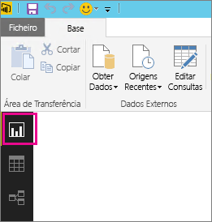
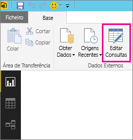
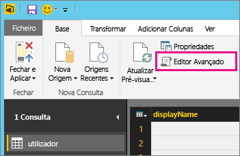
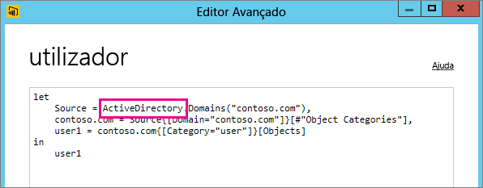

# Resolver problemas de origem de dados sem suporte para atualização
Vai ver um erro ao tentar configurar um conjunto de dados para atualização agendada.

        You cannot schedule refresh for this dataset because it gets data from sources that currently don’t support refresh.

Isso acontece quando a origem de dados usada no Power BI Desktop não tem suporte para atualização. Vai precisar de encontrar a origem de dados que está a utilizar e compará-la com a lista de origens de dados com suporte em [Atualizar dados no Power BI](refresh-data.md). 

## Encontrar a origem de dados
Se não tiver a certeza de que origem de dados foi utilizara, pode encontrar ao seguir os seguintes passos no Power BI Desktop.  

1. No Power BI Desktop, tenha certeza de que está no painel **Relatório**.  
   
2. Selecione **Editar Consultas** na barra da faixa de opções.  
   
3. Selecione **Editor Avançado**.  
   
4. Anote o fornecedor listado para a origem.  Neste exemplo, o fornecedor é Active Directory.  
   
5. Compare o provedor com a lista de origens de dados com suporte encontrada em [Atualizar dados no Power BI](refresh-data.md).  Pode ver que o Active Directory não é uma origem de dados com suporte para a atualização.  

## Próximos passos
[Atualização de Dados](refresh-data.md)  
[Power BI Gateway - Personal](service-gateway-personal-mode.md)  
[On-premises data gateway (Gateway de dados no local)](service-gateway-onprem.md)  
[Resolução de problemas do Gateway de dados no local](service-gateway-onprem-tshoot.md)  
[Resolver problemas do Power BI Gateway - Personal](service-admin-troubleshooting-power-bi-personal-gateway.md)  

Mais perguntas? [Experimente perguntar à Comunidade do Power BI](https://community.powerbi.com/)

