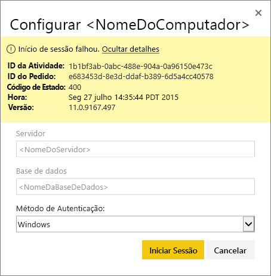
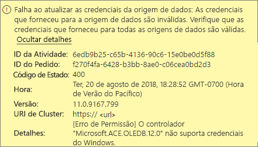
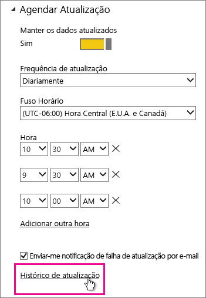
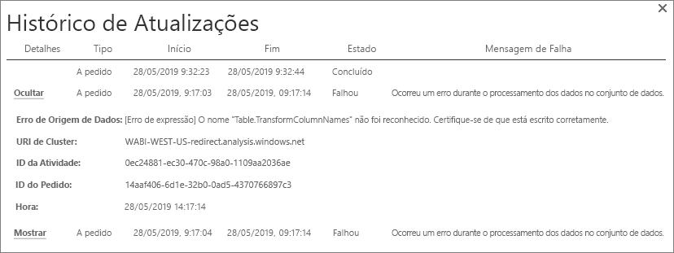
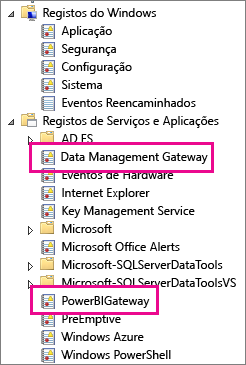
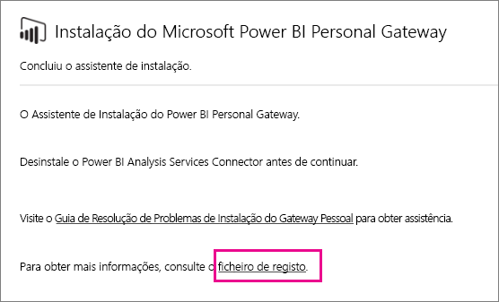
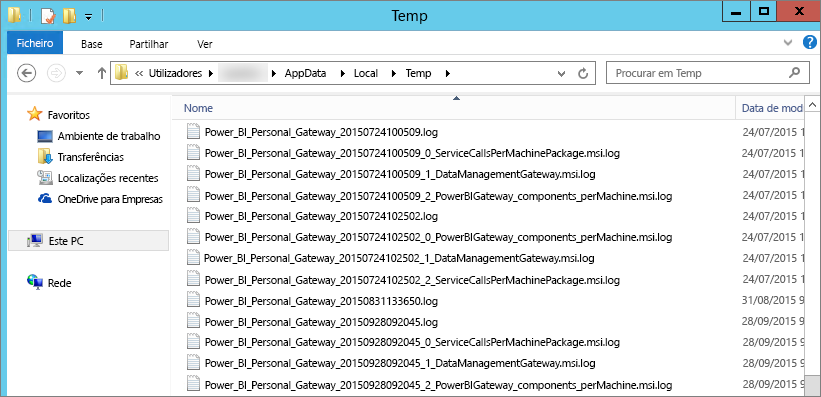

# Resolver problemas do gateway do Power BI (modo pessoal)

[!INCLUDE [gateway-rewrite](includes/gateway-rewrite.md)]

As secções seguintes abordam alguns problemas comuns que pode ter ao utilizar o gateway de dados no local (modo pessoal) do Power BI.

## Atualize para a versão mais recente

A versão atual do gateway para utilização pessoal é o gateway de dados no local (modo pessoal). Atualize a instalação para utilizar esta versão.

Muitos problemas podem surgir quando a versão do gateway está desatualizada. É uma boa prática geral ter a certeza de que está a utilizar a versão mais recente. Se não atualizar o gateway há um mês ou mais, pondere instalar a versão mais recente do gateway. Em seguida, verifique se consegue reproduzir o problema.

## Instalação
O **Gateway (modo pessoal) funciona em versões de 64 bits:** se o seu computador tiver uma versão de 32 bits, não pode instalar o gateway (modo pessoal). A versão do seu sistema operativo tem de ser a de 64 bits. Instale uma versão de 64 bits do Windows ou instale o gateway (modo pessoal) num computador de 64 bits.

Não consegue instalar o **gateway (modo pessoal) como um serviço, embora seja um administrador local do computador:** a instalação pode falhar se o utilizador estiver no grupo de Administração local do computador, mas a Política de Grupo não permitir que o utilizador inicie sessão como um serviço. Certifique-se de que a Política de Grupo permite que um utilizador inicie sessão como um serviço. Estamos a trabalhar para encontrar uma correção para este problema. Para obter mais informações, veja [Adicionar a opção Iniciar sessão como um serviço a uma conta](https://technet.microsoft.com/library/cc739424.aspx).

**A operação excedeu o limite de tempo:** esta mensagem é comum quando o computador (computador físico ou VM) em que o gateway (modo pessoal) é instalado tem um processador de um só núcleo. Feche todas as aplicações, desative todos os processos não essenciais e tente instalar novamente.

**Não é possível instalar o gateway de gestão de dados ou o conector do Analysis Services no mesmo computador que o gateway (modo pessoal):** se já tiver um conector do Analysis Services ou um gateway de gestão de dados instalado, tem de desinstalar o conector ou o gateway primeiro. Em seguida, tente instalar o gateway (modo pessoal).

> [!NOTE]
> Se tiver algum problema durante a instalação, os registos de configuração podem fornecer informações para o ajudar a resolver o problema. Para obter mais informações, veja [Registos de configuração](#SetupLogs).
> 
> 

 **Configuração do proxy:** pode ter problemas ao configurar o gateway (modo pessoal) se o seu ambiente tiver de utilizar um proxy. Para obter mais informações sobre como configurar as informações de proxy, veja [Configurar definições de proxy para o gateway de dados no local](/data-integration/gateway/service-gateway-proxy).

## Agendar atualização
**Erro: As credenciais armazenadas na cloud estão ausentes.**

Pode ser apresentada esta mensagem de erro nas definições do \<conjunto de dados\> se tiver uma atualização agendada e tiver desinstalado e reinstalado o gateway (modo pessoal). Ao desinstalar um gateway (modo pessoal), as credenciais de origem de dados de um conjunto de dados que foi configurado para atualização são removidas do serviço Power BI.

**Solução:** No Power BI, aceda às configurações de atualização de um conjunto de dados. Em **Gerir Origens de Dados**, para qualquer origem de dados com um erro, selecione **Editar credenciais**. Em seguida, inicie sessão na origem de dados novamente.

**Erro: As credenciais fornecidas para o conjunto de dados são inválidas. Atualize as credenciais através de uma atualização ou no diálogo Configurações de Origens de Dados para continuar.**

**Solução:** Se receber uma mensagem de credenciais, isso pode significar:

* Os nomes de utilizador e palavras-passe que utilizava para iniciar sessão em origens de dados não estão atualizados. No Power BI, vá a configurações de atualização do conjunto de dados. Em **Gerir Origens de Dados**, selecione **Editar credenciais** para atualizar as credenciais da origem de dados.
* Os mashups entre uma origem na cloud e uma origem no local, numa única consulta, não conseguem ser atualizados no gateway (modo pessoal) se uma das origens estiver a utilizar o OAuth para autenticação. Um exemplo deste problema é um mashup entre o CRM Online e uma instância local do SQL Server. O mashup falha porque o CRM Online exige o OAuth.
  
  Este é um erro conhecido que está a ser analisado. Para resolver o problema, separe a consulta da origem na cloud da consulta da origem no local. Em seguida, utilize uma consulta de intercalação ou acréscimo para as combinar.

**Erro: Origem de dados não suportada.**

**Solução:** Se for apresentada uma mensagem a informar que não existe suporte para a origem de dados nas definições de **Agendar Atualização**, pode significar que: 

* Atualmente, não há suporte para a atualização da origem de dados no Power BI. 
* O livro do Excel não contém um modelo de dados; só contém dados da folha do cálculo. O Power BI atualmente apenas suporta à atualização se o livro do Excel carregado contiver um modelo de dados. Quando importar dados através do Power Query no Excel, selecione a opção **Carregar** para carregar dados para um modelo de dados. Esta opção garante que os dados são importados para um modelo de dados. 

**Erro: [não é possível combinar dados] &lt;parte da consulta&gt;/&lt;…&gt;/&lt;…&gt; está a aceder a origens de dados com níveis de privacidade que não podem ser utilizados em conjunto. Recompile esta combinação de dados.**

**Solução:** Este erro ocorre devido a restrições associadas aos níveis de privacidade e aos tipos de origens de dados que está a utilizar.

**Erro: Erro de origem de dados: Não conseguimos converter o valor “\[Table\]” para o tipo Tabela.**

**Solução:** Este erro ocorre devido a restrições associadas aos níveis de privacidade e aos tipos de origens de dados que está a utilizar.

**Erro: Não existe espaço suficiente para esta linha.**

**Solução:** Este erro ocorre se tiver uma única linha com um tamanho superior a 4 MB. Localize a linha que pertence à sua origem de dados e tente filtrá-la ou reduzir o tamanho dessa linha.

## Origens de dados
**Fornecedor de dados em falta:** o gateway (modo pessoal) funciona apenas em versões de 64 bits. Este exige a instalação de uma versão de 64 bits dos fornecedores de dados no mesmo computador em que o gateway (modo pessoal) está instalado. Por exemplo, se a origem de dados no conjunto de dados for o Microsoft Access, será necessário instalar o fornecedor ACE de 64 bits no mesmo computador em que o gateway (modo pessoal) está instalado. 

>[!NOTE]
>Se tiver a versão de 32 bits do Excel, não pode instalar uma versão de 64 bits do fornecedor ACE no mesmo computador.

A **autenticação do Windows não é suportada na base de dados do Access:** Atualmente, o Power BI apenas suporta a Autenticação anónima na base de dados do Access.

**Erro: erro de início de sessão quando introduz as credenciais de uma origem de dados:** Se for apresentada uma mensagem de erro como esta ao introduzir as credenciais do Windows de uma origem de dados: 

  

Pode ainda estar a utilizar uma versão antiga do gateway (modo pessoal). 

**Solução:** Para obter mais informações, veja [Instalar a versão mais recente do gateway (modo pessoal) do Power BI](https://powerbi.microsoft.com/gateway/).

**Erro: erro de início de sessão ao selecionar a autenticação do Windows para uma origem de dados com o OLEDB ACE:** se for apresentada a seguinte mensagem de erro ao introduzir as credenciais de uma origem de dados com um fornecedor de OLEDB ACE:

Atualmente, o Power BI não suporta a autenticação do Windows para uma origem de dados com recurso a um fornecedor de OLEDB ACE.

**Solução:** Para resolver este erro, selecione **Autenticação anónima**. Para o fornecedor de OLEDB ACE herdado, as credenciais anónimas são iguais às credenciais do Windows.

## Atualização de mosaico
Se for apresentada uma mensagem de erro ao atualizar os mosaicos do dashboard, veja [Resolver problemas de erros de mosaicos](refresh-troubleshooting-tile-errors.md).

## Ferramentas para resolução de problemas
### Histórico de atualizações
Com o **Histórico de atualizações**, pode ver os erros que ocorreram e encontrar dados úteis, caso precise de criar um pedido de suporte. Pode ver as atualizações agendadas e a pedido. Eis como pode aceder ao **Histórico de atualizações**.

1. No painel de navegação do Power BI, em **Conjuntos de Dados**, selecione um conjunto de dados. Abra o menu e selecione **Agendar Atualização**.

   
1. Em **Definições para...** , selecione **Histórico de atualizações**. 

   
   
   

### Registos de eventos
Existem vários registos de eventos que podem fornecer informações. Os dois primeiros, **Gateway de Gestão de Dados** e **PowerBIGateway**, estão presentes se for administrador no computador. Se não for um administrador e estiver a utilizar o gateway de dados (modo pessoal), verá as entradas de registo no registo da **Aplicação**.

O **Data Management Gateway** e os registos do **PowerBIGateway** estão presentes nos **registos de aplicações e serviços**.

### Rastreio do Fiddler
O [Fiddler](https://www.telerik.com/fiddler) é uma ferramenta gratuita da Telerik que monitoriza o tráfego HTTP. Pode ver as comunicações com o serviço Power BI a partir do computador cliente. Estas comunicações podem mostrar erros e outras informações relacionadas.

### Registos de configuração
Em caso de falha na instalação do gateway (modo pessoal), verá uma ligação para apresentar o registo de configuração. O registo de configuração pode mostrar detalhes sobre a falha. Estes registos são Registos de Instalação do Windows, também conhecidos como Registos do MSI. Estes podem ser bastante complexos e de difícil leitura. Normalmente, o erro resultante é mostrado na parte inferior, mas não é comum determinar a causa do erro. Esta situação pode dever-se a erros num registo diferente. Também pode ser causada por um erro numa posição superior no registo.

Em alternativa, pode aceder à pasta Temp (%temp%) e procurar os ficheiros começados por *Power\_BI\_* .

> [!NOTE]
> Aceder a %temp% poderá levá-lo a uma subpasta de Temp. Os ficheiros *Power\_BI\_* estão na raiz do diretório Temp. Talvez seja necessário subir um nível ou dois.
> 
> 

## Próximos passos
- [Configurar as definições de proxy do gateway de dados no local](/data-integration/gateway/service-gateway-proxy)- [Atualização de dados](refresh-data.md)  
- [Gateway do Power BI – Pessoal](service-gateway-personal-mode.md)  
- [Resolução de problemas de erros de mosaico](refresh-troubleshooting-tile-errors.md)  
- [Resolução de problemas do gateway de dados no local](service-gateway-onprem-tshoot.md) 
 
Mais perguntas? Experimente perguntar à [Comunidade do Power BI](https://community.powerbi.com/).

