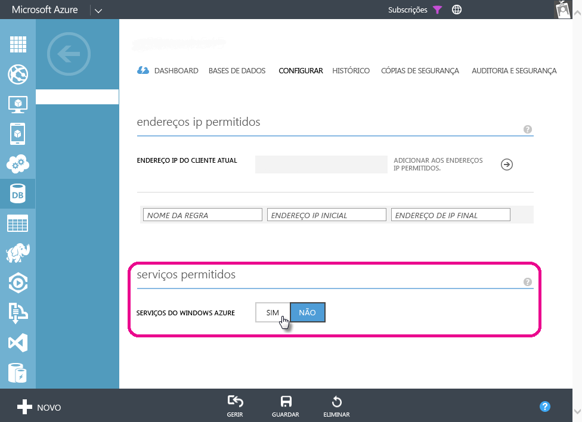

# A resolução de problemas em atualização agendada para a base de dados SQL Azure no Power BI
Para obter etapas detalhadas sobre como configurar a atualização agendada, certifique-se de ver [Atualizar dados no Power BI](refresh-data.md).

Ao configurar a atualização agendada para a base de dados SQL Azure, se receber um erro com o código de erro 400 durante a edição de credenciais, tente o seguinte para configurar a regra de firewall apropriada:

1. Entre no Portal de Gestão do Azure
2. Vá para o servidor SQL Azure no qual está a configurar a atualização
3. Ative os “Serviços do Microsoft Azure” na secção de serviços permitidos

  

Mais perguntas? [Pergunte à Comunidade do Power BI](http://community.powerbi.com/)

