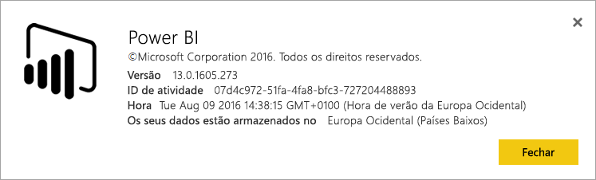
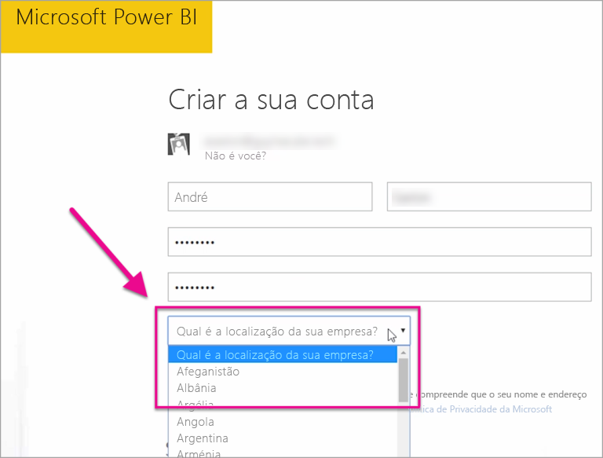

# Onde está localizado o meu inquilino do Power BI?
<iframe width="560" height="315" src="https://www.youtube.com/embed/0fOxaHJPvdM?showinfo=0" frameborder="0" allowfullscreen></iframe>

Saiba onde está localizado o seu inquilino do Power BI e como essa localização é selecionada. Isto é importante para compreender como pode afetar as interações com o serviço.

## Como determinar onde está localizado o inquilino do Power BI
Para localizar a região do seu inquilino, pode fazer o seguinte.

1. Selecione o **?** no serviço Power BI.
2. Selecione **Acerca do Power BI**.
3. Procure o valor junto a **Os dados estão armazenados em**. Esta é a região onde está localizado.

## Como é selecionada a região de dados
A região de dados baseia-se no país selecionado quando o inquilino foi criado pela primeira vez. Isto aplica-se à inscrição no Office 365 além do Power BI, uma vez que esta informação é partilhada. Se se tratar de um novo inquilino, quando se inscrever, verá uma lista pendente de países.

Isto seleciona a localização de armazenamento dos dados. O Power BI irá escolher a região de dados mais próxima desta seleção.

> [!WARNING]
> Não é possível alterar esta seleção!
> 
> 

Mais perguntas? [Pergunte à Comunidade do Power BI](http://community.powerbi.com/)

