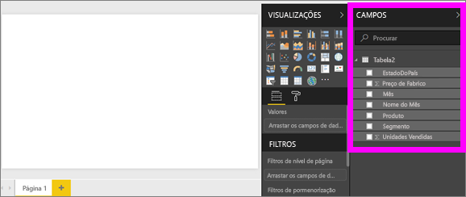
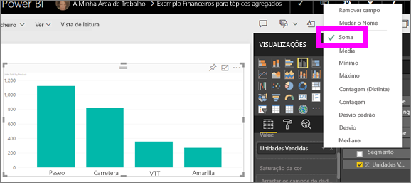
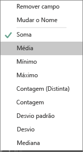
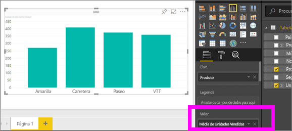
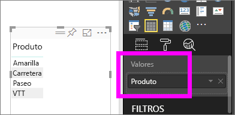
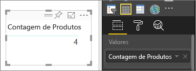
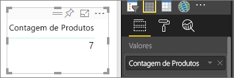
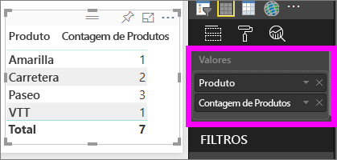

# Agregados em visualizações do Power BI
## O que é um agregado?
Por vezes, pode querer combinar matematicamente valores nos seus dados. A operação matemática pode ser uma soma, média, máximo, contagem, etc. O processo de combinar valores nos seus dados denomina-se *agregação*. O resultado dessa operação matemática é um *agregado*. 

Quando o serviço Power BI e o Power BI Desktop criam visualizações, podem agregar os seus dados. Muitas vezes, a agregação é exatamente aquilo de que precisa, mas outras vezes poderá querer agregar os valores de outra forma.  Por exemplo, uma soma versus uma média. Existem várias formas diferentes de gerir e alterar a agregação utilizada numa visualização.

Primeiro, vamos observar os *tipos* de dados, pois são estes que determinam como (e se) os dados podem ser agregados.

## Tipos de dados
A maioria das bases de dados tem mais do que um tipo de dados. No nível mais básico, os dados são numéricos ou não numéricos. Os dados numéricos podem ser agregados através de uma soma, média, contagem, mínimo, desvio, entre muitas outras formas. Até os dados textuais, frequentemente denominados dados *categóricos*, podem ser agregados. Se tentar agregar campos categóricos (ao colocá-los num registo exclusivamente numérico como **Valores** ou **Descrições**), o Power BI pode contar as ocorrências de cada categoria ou contar as ocorrências diferentes de cada categoria. Os tipos de dados especiais, como as datas, têm algumas opções de agregação exclusivas: mais antiga, mais recente, primeiro e último. 

No exemplo abaixo:
- **Unidades Vendidas** e **Preço de Fabrico** são colunas que contêm dados numéricos
-  **Segmento**, **País**, **Produto**, **Mês** e **Nome do Mês** contêm dados categóricos

   

Quando é criada uma visualização no Power BI,a agregação dos campos numéricos (a predefinição é *soma*) precede a agregação dos campos categóricos.  Por exemplo, "Unidades Vendidas ***por Produto***", "Unidades Vendidas ***por Mês***" e "Preço de Fabrico ***por Segmento***". Alguns campos numéricos são denominados **medidas**. É fácil identificar medidas no editor de relatórios do Power BI. As medidas são mostradas juntamente com o símbolo ∑ na lista Campos. Para obter mais informações, veja [O editor de relatórios... faça uma visita](service-the-report-editor-take-a-tour.md).

## Por que é que os agregados não funcionam da forma que pretendo?
Trabalhar com agregados no serviço Power BI pode ser confuso; poderá ter um campo numérico e o Power BI não permitirá que altere a agregação. Pode também ter um campo, como um ano, que não pretenda agregar, mas apenas contar o número de ocorrências.

Na maioria das vezes, a origem do problema é a forma como o campo foi definido no conjunto de dados. Talvez o campo esteja definido como texto, o que explica não ser possível calcular a soma ou a média. Infelizmente, [apenas o proprietário do conjunto de dados pode alterar a forma como um campo é categorizado](desktop-measures.md). Por isso, se tiver permissões de proprietário no conjunto de dados, pode utilizar o Power BI Desktop ou o programa que foi utilizado para criar o conjunto de dados (por exemplo, o Excel) para corrigir este problema. Caso contrário, precisará de contactar o proprietário do conjunto de dados para obter ajuda.  

Para o ajudar a navegar nestes aspetos mais confusos, temos uma secção especial no final deste artigo, intitulada **Considerações e resolução de problemas**.  Se não encontrar resposta aqui, publique a sua pergunta no [fórum de Comunidade do Power BI](http://community.powerbi.com) para obter uma resposta rápida diretamente da equipa do Power BI.

## Mudar a forma como um campo numérico é agregado
Suponhamos que tem um gráfico que soma as unidades vendidas de produtos diferentes, mas prefere ter a média. 

1. Crie um gráfico que utilize uma categoria e uma medida. Neste exemplo, estamos a utilizar Unidades Vendidas por Produto.  Por predefinição, o Power BI cria um gráfico que soma as unidades vendidas (medida no conjunto de campos Valor) de cada produto (categoria no conjunto de campos Eixo).

   

2. No painel Visualizações, clique com o botão direito do rato na medida e selecione o tipo de agregação de que necessita. Neste caso, selecionamos Média. Se não conseguir ver a agregação de que precisa, veja a secção "Considerações e resolução de problemas" abaixo.  
   
   
   
   > [!NOTE]
   > As opções disponíveis no menu pendente variam de acordo com 1) o campo selecionado e 2) a forma como esse campo foi categorizado pelo mesmo proprietário do conjunto de dados.
   > 
3. Agora, a sua visualização está a utilizar a agregação por média.

   

##    Formas de agregar os seus dados

Algumas das opções que podem estar disponíveis para a agregação de um campo:

* **Não resumir**. Com esta opção escolhida, cada valor nesse campo é tratado separadamente e não resumido. Isto geralmente é usado se tiver uma coluna de ID numérica que não deve ser somada.
* **Soma**. Adiciona todos os valores nesse campo para cima.
* **Média**. Usa uma média aritmética dos valores.
* **Mínimo**. Mostra o menor valor.
* **Máximo**. Mostra o maior valor.
* **Contagem (Não em Branco).** Conta o número de valores nesse campo não em branco.
* **Contagem (Distinta).** Conta o número de valores diferentes nesse campo.
* **Desvio-padrão.**
* **Desvio**.
* **Mediana**.  Mostra o valor mediano (meio). Este é o valor que tem o mesmo número de itens acima e abaixo.  Se existirem duas medianas, o Power BI obtém a média respetiva.

Por exemplo, estes dados:

| País | Quantidade |
|:--- |:--- |
| EUA |100 |
| REINO UNIDO |150 |
| Canadá |100 |
| Alemanha |125 |
| França | |
| Japão |125 |
| Austrália |150 |

Daria os seguintes resultados:

* **Não resumir**: cada valor é exibido separadamente
* **Soma**: 750
* **Média**: 125
* **Máximo**: 150
* **Mínimo**: 100
* **Contagem (não em branco):** 6
* **Contagem (distinta):** 4
* **Desvio padrão:** 20.4124145...
* **Desvio:** 416.666...
* **Mediana:** 125

## Criar uma agregação com um campo categórico (de texto)
Também pode agregar um campo não numérico. Por exemplo, se tiver um campo com o nome do produto, poderá adicioná-lo como um valor e defini-lo como **Contagem**, **Contagem distinta**, **Primeiro** ou **Último**. 

1. Neste exemplo, arrastámos o campo **Produto** para o conjunto de campos Valores. O conjunto de campos Valores costuma ser utilizado para campos numéricos. O Power BI reconhece que é um campo de texto, define o agregado para **Não resumir** e apresenta-nos uma tabela de coluna única.
   
   
2. Se alterarmos a agregação da predefinição **Não resumir** para **Contagem (Distinta)**, o Power BI contará o número de produtos diferentes. Neste caso, existem 4.
   
   
3. Se alterarmos a agregação para **Contagem**, o Power BI contará o número total. Neste caso, existem 7 entradas para **Produto**. 
   
   

4. Ao arrastarmos o mesmo campo (neste caso, **Produto**) para o conjunto de campos Valores e deixarmos a agregação predefinida como **Não resumir**, o Power BI divide a contagem por produto.

   

## Considerações e Resolução de Problemas
P:  Por que não tenho uma opção de **Não resumir**?

R: É possível que o campo que selecionou seja uma medida calculada ou uma medida avançada criada no Excel ou no [Power BI Desktop](desktop-measures.md). Cada medida calculada tem a sua própria fórmula codificada. Não pode alterar a agregação utilizada.  Por exemplo, se for uma soma, só poderá ser uma soma. Na lista de Campos, as *medidas calculadas* são mostradas com o símbolo de calculadora.

P:  O meu campo **é** numérico, por que é que só tenho as opções de **Contagem** e **Contagem distinta**?

R1: Provavelmente, tal acontece porque o proprietário do conjunto de dados, acidental ou intencionalmente, *não* classificou o campo como um número. Por exemplo, se um conjunto de dados for um campo de **ano**, o proprietário do conjunto de dados poderá categorizá-lo como texto porque é mais provável que o campo **ano** seja contabilizado (por exemplo, número de pessoas nascidas em 1974) e que não seja calculada a sua soma ou média. Se for proprietário, pode abrir o conjunto de dados no Power BI Desktop e utilizar o separador **Modelação** para alterar o tipo de dados.  

R2: Se o campo tiver um ícone de calculadora, significa que é uma *medida calculada* e cada medida calculada tem a sua própria fórmula codificada que só pode ser alterada por um proprietário do conjunto de dados. O cálculo utilizado pode ser uma agregação simples, como uma soma ou uma média, mas pode também ser algo mais complexo, como uma "percentagem de contributo para categoria principal" ou um "total desde início do ano". O Power BI não vai calcular a soma ou a média dos resultados; vai recalcular (com a fórmula codificada) para cada ponto de dados.

R3: Também é possível que tenha deixado o campo num *registo* que apenas permite valores categóricos.  Nesse caso, as suas únicas opções serão a contagem e a contagem distinta.

R4: A terceira hipótese é estar a utilizar o campo para um eixo. No eixo de um gráfico de barras, por exemplo, o Power BI mostra uma barra para cada valor distinto; não agrega os valores dos campos. 

>[!NOTE]
>A exceção a esta regra são os gráficos de dispersão, que *requerem* valores agregados para os eixos X e Y.

P: Tenho um gráfico de dispersão e quero que o meu campo *não* agregue.  Como o posso fazer?

R: Adicione o campo ao registo **Detalhes** e não aos registos dos eixos X e Y.

P: Quando adiciono campos numéricos a uma visualização, a maioria dos mesmos ficam predefinidos como soma, mas outros ficam predefinidos como média, contagem ou outra agregação.  Por que é que a agregação predefinida não é sempre a mesma?

R: Os proprietários de conjuntos de dados têm a opção de predefinir o resumo para cada campo. Se for um proprietário de conjunto de dados, altere o resumo predefinido no separador **Modelação** do Power BI Desktop.

P: Sou um proprietário de conjunto de dados e quero garantir que um campo nunca é agregado.

R: No Power BI Desktop, no separador **Modelação**, defina **Tipo de dados** como **Texto**.

P: Não vejo a opção **Não resumir** no meu menu pendente.

R: Experimente remover o campo e voltar a adicioná-lo.

Mais perguntas? [Pergunte à Comunidade do Power BI](http://community.powerbi.com/)

