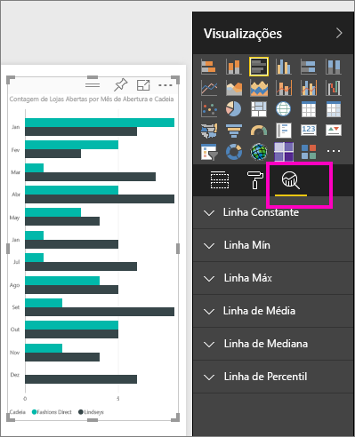
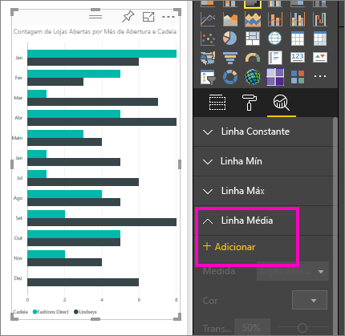
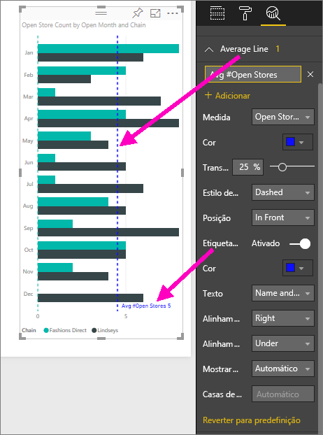
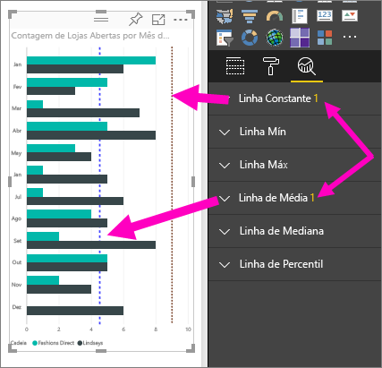
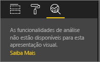

# Criar linhas de referência dinâmicas para elementos visuais no serviço Power BI

Com o painel **Análise** no **serviço Power BI**, pode adicionar *linhas de referência* dinâmicas a visualizações e dar foco a tendências ou informações importantes.

> [!NOTE]
> O painel **Análise** aparece apenas quando seleciona um visual na tela de relatório.
> 
> 

## Utilizar o painel Análise
Com o painel **Análise**, pode criar os seguintes tipos de linhas de referência dinâmica (nem todas as linhas estão disponíveis para todos os tipos de visuais):

* Linha constante do Eixo X
* Linha constante do Eixo Y
* Linha Mín
* Linha Máx
* Linha Média
* Linha Mediana
* Linha de Percentil

Para ver as linhas de referência dinâmicas disponíveis para um visual, siga estes passos:

1. Selecione ou crie um visual e, em seguida, selecione o ícone **Análise** no painel **Visualizações**.

2. Selecione a seta para baixo do tipo de linha que pretende criar para expandir as respetivas opções. Neste caso, vamos selecionar **Linha Média**.
   
   

3. Para criar uma nova linha, selecione **+ Adicionar** e decida qual a medida que será utilizada para criar a linha.  A lista pendente **Medida** é automaticamente preenchida com os dados disponíveis da visualização selecionada. Vamos utilizar **Contagem de arquivos abertos**.

5. Tem diversos tipos de opções para a linha, como a cor, a transparência, o estilo e a posição (relativamente aos elementos de dados do elemento visual). Se quiser uma etiqueta na linha, atribua-lhe um título e, em seguida, mova o controlo de deslize **Etiqueta de dados** para **Ativo**.  Neste caso, vamos atribuir-lhe a etiqueta *N.º Médio de Arquivos Abertos* e personalizar algumas das outras opções, conforme mostrado abaixo.
   
   

1. Repare no número apresentado junto ao item **Linha média** no painel **Análise**. Isto indica-lhe quantas linhas dinâmicas, e de que tipo, tem atualmente no seu visual. Se adicionarmos uma **Linha constante** como um objetivo de 9 para contagem de lojas, pode ver que o painel **Análise** demonstra que temos também uma linha de referência **Linha constante** aplicada a este visual.
   
   
   

Existem diversas informações interessantes que pode destacar ao criar linhas de referência dinâmicas com o painel **Análise**.

## Considerações e resolução de problemas

Se o visual que selecionou não pode ter linhas de referência dinâmicas aplicadas (neste caso, um visual de **Mapa**), irá ver o seguinte quando selecionar o painel **Análise**.
   

A capacidade de utilizar linhas de referência dinâmicas baseia-se no tipo de visual utilizado. A lista seguinte mostra quais as linhas dinâmicas que estão atualmente disponíveis para cada visual:

Utilização integral de linhas dinâmicas disponível nos seguintes visuais:

* Gráfico de área
* Gráfico de linhas
* Gráfico de dispersão
* Gráfico de Colunas agrupadas
* Gráfico de barras agrupadas

Os seguintes visuais só podem utilizar uma *linha constante* no painel **Análise**:

* Áreas Empilhadas
* Barras Empilhadas
* Colunas Empilhadas
* Barras Empilhadas a 100%
* Colunas Empilhadas a 100%

Para os seguintes visuais, a única opção atualmente disponível é uma *linha de tendência*:

* Linhas Não Empilhadas
* Gráfico de Colunas agrupadas

Finalmente, os visuais não Cartesianos não podem atualmente aplicar linhas dinâmicas do painel **Análise**, nomeadamente:

* Matriz
* Gráfico circular
* Anel
* Tabela

## Próximos passos
[Painel Análise no Power BI Desktop](desktop-analytics-pane.md)

Mais perguntas? [Pergunte à Comunidade do Power BI](http://community.powerbi.com/)

