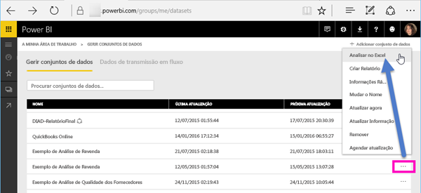
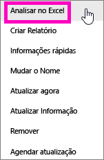
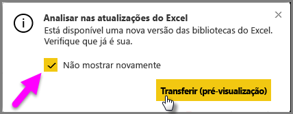
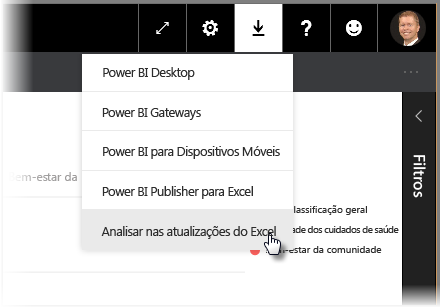
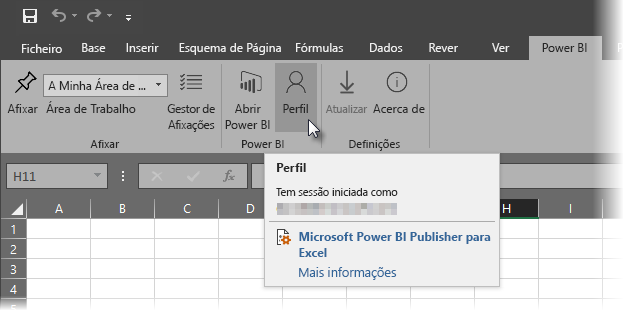
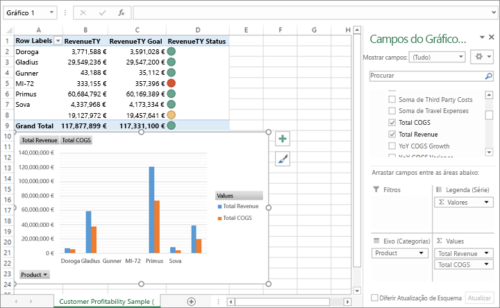

# Analisar no Excel
Por vezes, pode querer utilizar o Excel para ver e interagir com um conjunto de dados que tenha no Power BI. Com a opção **Analisar no Excel**, pode fazê-lo e aceder às funcionalidades Tabela Dinâmica, gráfico e segmentação de dados no Excel com base no conjunto de dados que existe no Power BI.

## Requirements
Existem alguns requisitos para utilizar a opção **Analisar no Excel**:

* A opção **Analisar no Excel** é suportada no Microsoft Excel 2010 SP1 e posterior.

* As Tabelas Dinâmicas do Excel não suportam a agregação do tipo "arrastar e largar" dos campos numéricos. O seu conjunto de dados no Power BI *tem de ter medidas predefinidas*.
* Algumas empresas podem ter regras de Política de Grupo que impedem a instalação das atualizações necessárias da funcionalidade **Analisar no Excel** no Excel. Se não conseguir instalar as atualizações, consulte o seu administrador.
* A funcionalidade **Analisar no Excel** necessita que o conjunto de dados esteja no Power BI Premium ou que o utilizador tenha uma licença do Power BI Pro. Para saber mais acerca das diferenças de funcionalidade entre os tipos de licença, veja a secção _Comparação das funcionalidades do Power BI_ na página [Preços do Power BI](https://powerbi.microsoft.com/pricing/).
* Os utilizadores podem ligar a conjuntos de dados através da funcionalidade Analisar no Excel, caso tenham permissão de leitura para o conjunto de dados subjacente.  Existem várias formas de um utilizador ter esta permissão, como ser membro da área de trabalho que contém o conjunto de dados, ter um relatório ou dashboard partilhado que utilize o conjunto de dados ou ter permissão para uma aplicação que contém o conjunto de dados.
* O **Analisar no Excel** é uma funcionalidade do serviço Power BI e não está disponível no Microsoft Power BI Report Server ou no Power BI Embedded. 
* A funcionalidade **Analisar no Excel** só é suportada em computadores com o Microsoft Windows.

## Como funciona?
Quando seleciona **Analisar no Excel** no menu de reticências (...) associado a um conjunto de dados ou relatório no **Power BI**, o Power BI cria um ficheiro .ODC e transfere-o a partir do browser para o seu computador.

Ao abrir o ficheiro no Excel, é apresentada uma lista vazia de **Tabelas Dinâmicas** e **Campos** com as tabelas, campos e medidas do conjunto de dados do Power BI. Pode criar Tabelas Dinâmicas, gráficos e analisar esse conjunto de dados tal como faria com um conjunto de dados local no Excel.

O ficheiro .ODC tem uma cadeia de ligação MSOLAP que liga ao seu conjunto de dados no Power BI. Ao analisar ou trabalhar com os dados, o Excel consulta esse conjunto de dados no Power BI e devolve os resultados no Excel. Se esse conjunto de dados ligar a uma origem de dados dinâmicos com o DirectQuery, o Power BI consulta a origem de dados e devolve o resultado no Excel.

A opção **Analisar no Excel** é muito útil para conjuntos de dados e relatórios que ligam a base de dados de *Tabela do Analysis Services* ou *Multidimensionais*, ou de ficheiros do Power BI Desktop ou de livros do Excel com modelos de dados que têm medidas modelo criadas com DAX (Data Analysis Expressions).

## Introdução a Analisar no Excel
No Power BI, selecione o menu de reticências junto a um relatório ou conjunto de dados (... junto ao nome do relatório ou conjunto de dados) e no menu apresentado, selecione **Analisar no Excel**.

### Instalar atualizações do Excel
Quando utilizar a opção **Analisar no Excel** pela primeira vez, tem de instalar as atualizações às bibliotecas do Excel. Ser-lhe-á pedido que transfira e execute as atualizações do Excel (esta ação inicia a instalação do pacote do Windows Installer *SQL_AS_OLEDDB.msi*). Este pacote instala o **Fornecedor OLE DB do Microsoft AS para SQL Server 2016 RC0 (Pré-visualização)**.

> [!NOTE]
> Certifique-se de que marca **Não voltar a mostrar** na caixa de diálogo **Instalar atualizações do Excel**. Só precisa de instalar a atualização uma vez.
> 
> 

Se precisar de instalar novamente as atualizações do Excel para **Analisar no Excel**, pode transferir a atualização a partir do ícone **Transferir** no Power BI, conforme mostra a imagem seguinte.

### Iniciar sessão no Power BI
Embora tenha sessão iniciada no Power BI no seu browser, a primeira vez que abre um novo ficheiro .ODC no Excel pode ser-lhe pedido que inicie sessão no Power BI com a sua conta do Power BI. Esta ação autentica a ligação do Excel ao Power BI.

### Utilizadores com várias contas do Power BI
Alguns utilizadores têm várias contas do Power BI e esses utilizadores podem deparar-se com uma situação em que têm sessão iniciada no Power BI com uma conta, mas a conta que tem acesso ao conjunto de dados que está a ser utilizado em Analisar no Excel é uma conta diferente. Nessas situações, poderá receber o erro **Proibido** ou uma falha no início de sessão quando tentar aceder a um conjunto de dados que está a ser utilizado num livro Analisar no Excel.

Terá a oportunidade de iniciar sessão novamente e, nesta altura, pode iniciar sessão com a conta do Power BI que tem acesso ao conjunto de dados que está a ser acedido pela funcionalidade Analisar no Excel. Também pode selecionar **Perfil** no separador do friso **Power BI** no Excel, que identifica a conta com a qual tem sessão iniciada e fornece uma ligação que lhe permite terminar sessão (e, posteriormente, iniciar sessão com uma conta diferente). Pode [transferir o Power BI Publisher para Excel](https://www.microsoft.com/download/details.aspx?id=50729) se ainda não o tiver instalado, pois é assim que o friso do Power BI no Excel é instalado.

### Ativar ligações de dados
Para analisar os dados do Power BI no Excel, é-lhe pedido que verifique o nome de ficheiro e o caminho para o ficheiro .odc e, em seguida, selecione **Ativar**.

> [!NOTE]
> Os administradores de inquilinos do Power BI podem utilizar o *Portal de Administração do Power BI* para desativar a utilização de **Analisar no Excel** com conjuntos de dados no local alojados em bases de dados dos Analysis Services (AS). Quando esta opção está desativada, a funcionalidade **Analisar no Excel** está desativada para bases de dados AS, mas continua a estar disponível para utilização com outros conjuntos de dados.
> 
> 

## Analisar
Agora que o Excel abriu e tem uma Tabela Dinâmica em branco, está pronto para fazer todos os tipos de análise com o conjunto de dados do Power BI. Tal como acontece com outros livros locais, com o livro Analisar no Excel pode criar Tabelas Dinâmicas, gráficos, adicionar dados de outras origens, etc. E, como é óbvio, pode criar folhas de cálculo diferentes com todos os tipos de vistas para os seus dados.

> [!NOTE]
> É importante saber que utilizar o livro **Analisar no Excel** expõe todos os dados de nível de detalhe a todos os utilizadores que tenham permissão para o conjunto de dados.
> 
> 

## Guardar
Pode guardar este livro ligado ao conjunto de dados do Power BI como qualquer outro livro. No entanto, não é possível publicar ou importar o livro novamente para o Power BI porque só pode publicar ou importar livros para o Power BI que tenham dados em tabelas ou que tenham um modelo de dados. Uma vez que o novo livro tem apenas uma ligação para o conjunto de dados no Power BI, a publicação ou importação do mesmo para o Power BI entraria em círculo!

## Partilhar
Quando o livro for guardado, pode partilhá-lo com outros utilizadores do Power BI na sua organização.

Quando um utilizador com quem partilhou o seu livro abrir o livro, verá as suas Tabelas Dinâmicas e dados tal como apareceram quando o livro foi guardado pela última vez, que pode não ser a versão mais recente dos dados. Para obterem os dados mais recentes, os utilizadores terão de utilizar o botão **Atualizar** no friso de **Dados**. E, uma vez que o livro está a ligar a um conjunto de dados no Power BI, os utilizadores que tentarem atualizar o livro têm de iniciar sessão no Power BI e instalar as atualizações do Excel da primeira vez que tentarem atualizar com este método.

Como os utilizadores precisarão de atualizar o conjunto de dados, e a atualização para ligações externas não é suportada no Excel Online, é recomendado que os utilizadores abram o livro na versão de ambiente de trabalho do Excel no computador.

## Resolução de problemas
Por vezes, quando utiliza a funcionalidade Analyze in Excel, esta poderá não funcionar conforme esperado ou pode devolver resultados inesperados. [Esta página apresenta soluções para problemas comuns quando utiliza Analisar no Excel](desktop-troubleshooting-analyze-in-excel.md)

## Próximos passos

Poderá também estar interessado nos seguintes artigos:

* [Utilizar a pormenorização de relatório cruzado no Power BI Desktop](desktop-cross-report-drill-through.md)
* [Utilizar a segmentação de dados no Power BI Desktop](visuals/power-bi-visualization-slicers.md)

