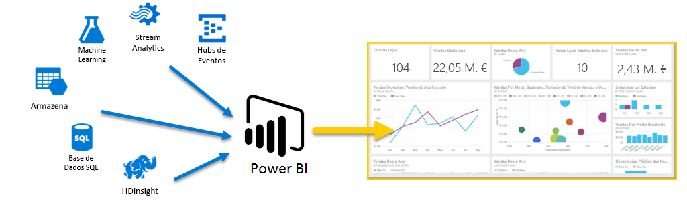
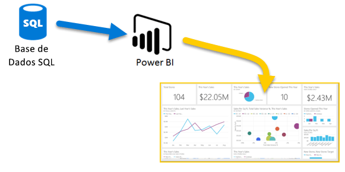
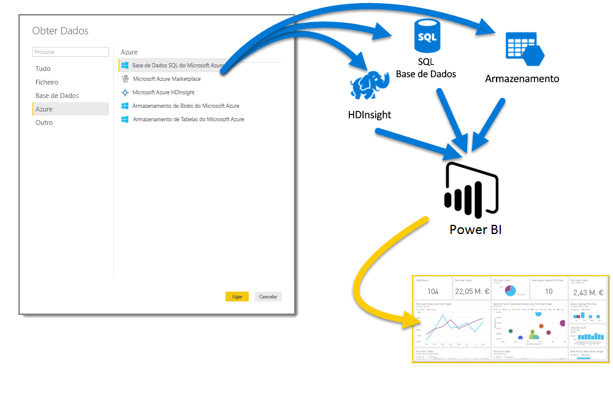
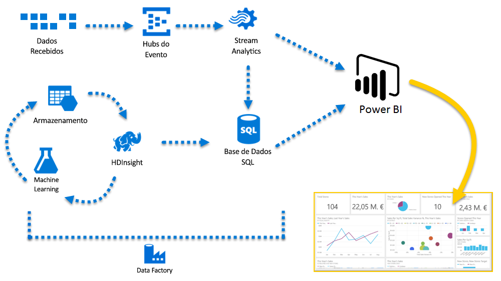

# Azure e Power BI

Com os serviços do **Azure** e o **Power BI**, pode transformar os seus esforços de processamento de dados em análises e relatórios que fornecem informações em tempo real sobre a sua empresa. Se o processamento de dados for baseado na cloud ou no local, simples ou complexo, de origem única ou altamente dimensionado, armazenado ou em tempo real, o Azure e o Power BI têm a conectividade interna e a integração para concretizar os seus esforços de business intelligence.

O Power BI tem uma grande quantidade de ligações do Azure disponíveis e as soluções de business intelligence que pode criar com esses serviços são tão exclusivas quanto a sua empresa. Pode ligar apenas uma ou várias origens de dados do Azure e formatar e refinar os dados para criar relatórios personalizados.

## Base de Dados SQL do Azure e Power BI

Pode iniciar uma ligação simples com uma Base de Dados SQL do Azure e criar relatórios para monitorizar o progresso da sua empresa. Com o [Power BI Desktop](desktop-getting-started.md), é possível criar relatórios que identificam tendências e indicadores chave de desempenho que promovem a sua empresa.

Existe bastante informação para descobrir sobre a [Base de Dados SQL do Azure](https://azure.microsoft.com/services/sql-database/).

## Transformar, formatar e intercalar os dados na cloud

Tem dados mais complexos e todos os tipos de origens? Não há problema. Com o **Power BI Desktop** e os serviços do Azure, as ligações podem ser acedidas no diálogo **Obter Dados** com apenas um toque. Na mesma Consulta, pode ligar-se à **Base de Dados SQL do Azure**, às origens de dados do **Azure HDInsight** e ao **Armazenamento de Blobs do Azure** (ou **Armazenamento de Tabelas do Azure**) e selecionar apenas os subconjuntos dentro de cada um dos que necessita e otimizá-los a partir desse local.

Pode criar relatórios diferentes para públicos-alvo diferentes com as mesmas ligações de dados e até a mesma Consulta. Basta criar uma nova página de relatório, refinar as visualizações para cada público-alvo e acompanhar tudo para que a sua empresa fique bem informada.

Para obter mais informações, veja os seguintes recursos:

* [Base de Dados SQL do Azure](https://azure.microsoft.com/services/sql-database/)
* [Azure HDInsight](https://azure.microsoft.com/services/hdinsight/)
* [Armazenamento do Azure](https://azure.microsoft.com/services/storage/) (Armazenamento de blobs e Armazenamento de tabelas)

## Aprofundar (e ficar à frente) com os Serviços do Azure e o Power BI

Pode expandir conforme as suas necessidades com o Azure e o Power BI. Aproveite o processamento de dados de várias origens, utilize grandes sistemas em tempo real, utilize o [Stream Analytics](https://azure.microsoft.com/services/stream-analytics/)e os [Hubs de Eventos](https://azure.microsoft.com/services/event-hubs/) e reúna os diversos serviços de SaaS em relatórios de business intelligence que oferecem vantagens ao seu negócio.

## Informações de contexto com a análise do Power BI Embedded

Incorpore fantásticas visualizações de dados interativas em aplicações, sites, portais e muito mais para tirar partido dos seus dados empresariais. Com o [Power BI Embedded como recurso no Azure](https://azure.microsoft.com/services/power-bi-embedded/), pode incorporar facilmente dashboards e relatórios interativos, para que os seus utilizadores possam desfrutar de experiências consistentes de elevada fidelidade em todos os dispositivos.  O Power BI utilizado com a análise incorporada serve para o ajudar ao longo do seu percurso, desde os Dados -> Conhecimento -> Informações -> Ações.  Além disso, pode obter mais valor do Power BI e do Azure através da incorporação de análise nos [portais e aplicações internas da sua organização](https://powerbi.microsoft.com/developers/embedded-analytics/organization/).

Existem várias informações sobre as APIs do Power BI no [Portal do Programador do Power BI](https://dev.powerbi.com).

Para obter mais informações, veja [O que podem os programadores fazer com o Power BI?](developer/what-can-you-do.md).

## Incorporar os dados do Power BI na aplicação

Incorpore fantásticas visualizações de dados interativas em aplicações, sites, portais e muito mais para apresentar os seus dados empresariais em contexto. Com o [Power BI Embedded no Azure](https://azure.microsoft.com/services/power-bi-embedded/), pode incorporar facilmente dashboards e relatórios interativos, para que os seus utilizadores possam desfrutar de experiências consistentes de elevada fidelidade em todos os dispositivos.

## O que pode fazer com o Azure e o Power BI?

Existem todos os tipos de cenários onde o **Azure** e o **Power BI** podem ser combinados. As possibilidades e oportunidades são tão exclusivas quanto a sua empresa. Para obter mais informações sobre os **serviços do Azure**, consulte esta [página de descrição geral](https://docs.microsoft.com/azure/machine-learning/team-data-science-process/plan-your-environment), que descreve os **Cenários de Análise de Dados através do Azure**, e saiba como transformar as origens de dados em informações que levam a sua empresa ao sucesso.