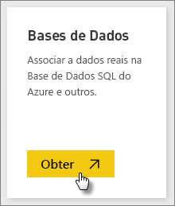
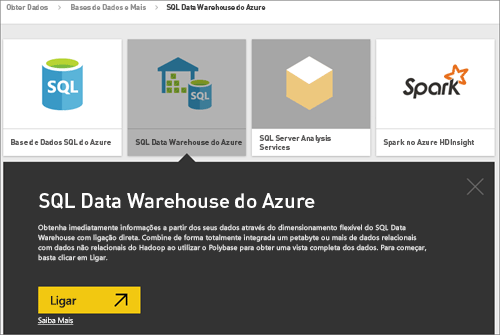
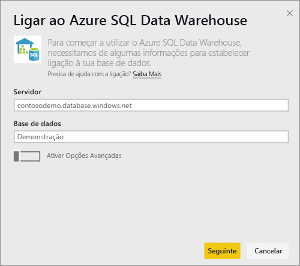
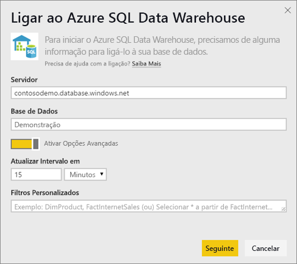
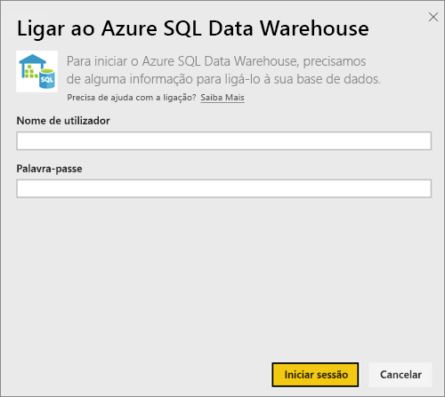
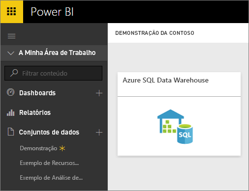
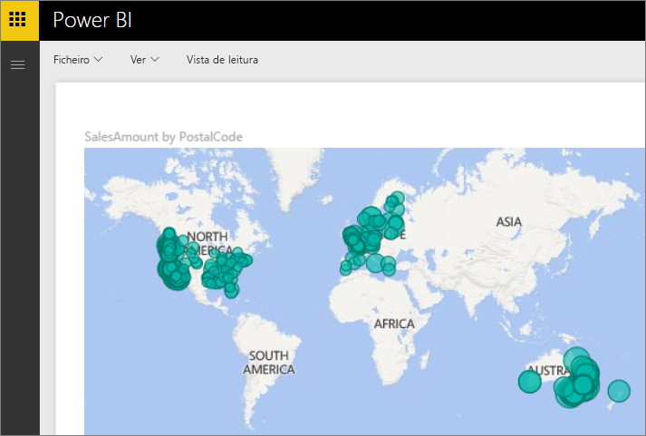
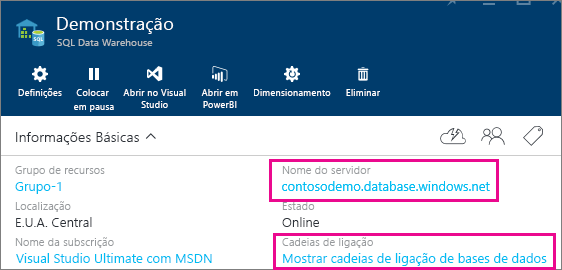

# Azure SQL Data Warehouse com DirectQuery
O Azure SQL Data Warehouse com DirectQuery permite criar relatórios dinâmicos com base nos dados e nas métricas já existentes no Azure SQL Data Warehouse. Com o DirectQuery, as consultas são enviadas de volta para o Azure SQL Data Warehouse em tempo real à medida que explora os dados. Isto, combinado com a escala do SQL Data Warehouse, permite aos utilizadores criar, em minutos, relatórios dinâmicos referentes a terabytes de dados. Além disso, a introdução do botão **Abrir no Power BI** permite que os utilizadores liguem diretamente o Power BI ao SQL Data Warehouse sem precisar de especificar manualmente as informações.

Ao usar o conector do SQL Data Warehouse:

* Especifique o nome de servidor completamente qualificado quando ligar (veja abaixo para obter mais detalhes)
* Certifique-se de que as regras de firewall para o servidor estão configuradas para "Permitir acesso aos serviços do Azure"
* Cada ação, como selecionar uma coluna ou adicionar um filtro, consultará diretamente o armazém de dados
* Os mosaicos são definidos para serem atualizados aproximadamente a cada 15 minutos e a atualização não tem de ser agendada.  Isto pode ser ajustado nas Definições avançadas quando ligar.
* As Perguntas e Respostas não estão disponíveis para conjuntos de dados do DirectQuery
* As alterações de esquema não são aplicadas automaticamente

Estas restrições e notas podem mudar à medida que continuamos a melhorar as experiências. Os passos para ligar são detalhados abaixo.

## Através do botão "Abrir no Power BI"
A maneira mais fácil de se mover entre o SQL Data Warehouse e o Power BI é com o botão **Abrir no Power BI** no Portal de Pré-Visualização do Azure. Este botão permite-lhe começar a criar novos dashboards no Power BI.

1. Para começar, navegue até à instância do SQL Data Warehouse no Portal de Pré-visualização do Azure. Tenha em atenção que o SQL Data Warehouse tem apenas uma presença no portal de Pré-visualização do Azure neste momento.
2. Clique no botão **Abrir no Power BI**
   
    
3. Se não for possível iniciar a sua sessão diretamente ou se não tiver uma conta do Power BI, terá de iniciar sessão.
4. Será direcionado para a página de ligação do SQL Data Warehouse, com as informações do SQL Data Warehouse pré-preenchidas. Introduza as credenciais e selecione Ligar para criar uma ligação.

## Ligar através do Power BI
O SQL Data Warehouse também está listado na página Obter Dados do Power BI. 

1. Selecione **Obter Dados** na parte inferior do painel de navegação esquerdo.  
   
    
2. Em **Bases de dados**, selecione **Obter**.
   
    
3. Selecione **SQL Data Warehouse** \> **Ligar**.
   
    
4. Introduza as informações necessárias para ligar. A secção **A localizar Parâmetros** a seguir mostra onde estes dados podem estar localizados no Portal do Azure.
   
    
   
    
   
    
   
   > [!NOTE]
   > O nome de utilizador é um utilizador que está definido na instância do Azure SQL Data Warehouse.
   > 
   > 
5. Analise o conjunto de dados ao selecionar o novo mosaico ou o conjunto de dados recém-criado, indicado pelo asterisco. Este conjunto de dados terá o mesmo nome da base de dados.
   
    
6. Pode explorar todas as tabelas e colunas. Selecionar uma coluna resultará no envio de uma consulta de volta para a origem, o que cria dinamicamente o elemento visual. Os filtros também serão convertidos em consultas de volta para o armazém de dados. Estes elementos visuais podem ser guardados num novo relatório e afixados ao dashboard.
   
    

## Localizar Valores de Parâmetro
O nome de servidor completamente qualificado e o nome da base de dados podem ser encontrados no Portal de Pré-visualização do Azure. Tenha em atenção que o SQL Data Warehouse tem apenas uma presença no portal de Pré-visualização do Azure neste momento.

## Próximos passos
[Introdução ao Power BI](service-get-started.md)  
[Obter Dados para o Power BI](service-get-data.md)  
[Azure SQL Data Warehouse](https://azure.microsoft.com/en-us/documentation/services/sql-data-warehouse/)  
Mais perguntas? [Pergunte à Comunidade do Power BI](http://community.powerbi.com/)

