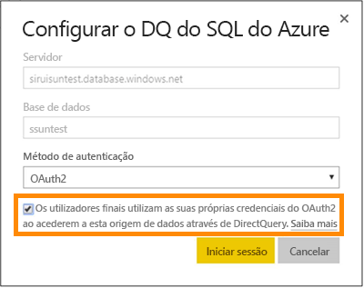
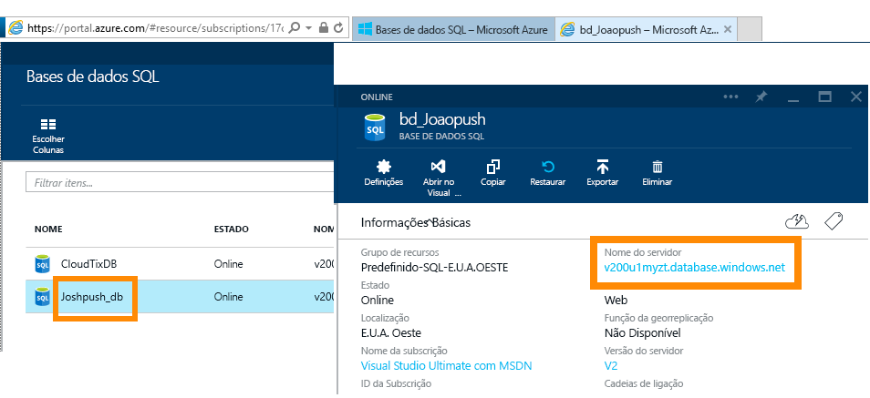
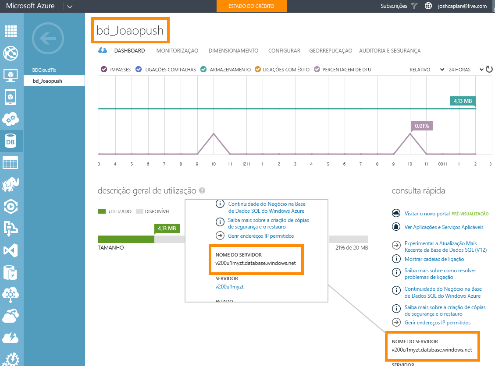

# Base de Dados SQL do Azure com DirectQuery
Obtenha informações sobre como pode ligar diretamente à Base de Dados SQL do Azure e criar relatórios que utilizam dados dinâmicos. Pode manter os seus dados na origem e não no Power BI.

Com o DirectQuery, as consultas são enviadas de volta para a Base de Dados SQL do Azure à medida que explora os dados na vista de relatório. Esta experiência é sugerida para utilizadores familiarizados com as bases de dados e as entidades às quais se ligam.

**Notas:**

* Especifique o nome de servidor completamente qualificado ao ligar (veja abaixo para obter mais detalhes)
* Verifique se as regras de firewall da base de dados estão configuradas como “[Permitir acesso aos serviços do Azure](https://msdn.microsoft.com/library/azure/ee621782.aspx)”
* Cada ação, como selecionar uma coluna ou adicionar um filtro, enviará uma consulta de volta à base de dados
* Os mosaicos são atualizados todas as horas (a atualização não tem de ser agendada). Isto pode ser ajustado nas Definições avançadas quando ligar.
* As Perguntas e Respostas não estão disponíveis para conjuntos de dados do DirectQuery
* As alterações do esquema não são selecionadas automaticamente

Estas restrições e notas podem mudar à medida que continuamos a melhorar as experiências. Os passos para ligar são detalhados abaixo. 

## Power BI Desktop e DirectQuery
Para ligar à Base de Dados SQL do Azure com o DirectQuery, terá de utilizar o Power BI Desktop. Esta abordagem fornece mais flexibilidade e capacidades. Os relatórios criados com o Power BI Desktop podem ser publicados no serviço Power BI. Pode obter mais informações sobre como ligar à [Base de Dados SQL do Azure com o DirectQuery](desktop-use-directquery.md) no Power BI Desktop. 

## Início de sessão único

Depois de publicar um conjunto de dados DirectQuery do SQL do Azure no serviço, pode ativar o início de sessão único (SSO) através do OAuth2 do Azure Active Directory (Azure AD) para os utilizadores finais. 

Para ativar o SSO, aceda às definições do conjunto de dados, abra o separador **Origens de Dados** e selecione a caixa SSO.

Quando a opção SSO está ativada e os utilizadores acedem aos relatórios compilados por cima da origem de dados, o Power BI envia as suas credenciais autenticadas do Azure AD nas consultas para a base de dados SQL do Azure. Esta operação permite que o Power BI respeite as definições de segurança que estão configuradas ao nível da origem de dados.

A opção SSO tem efeito em todos os conjuntos de dados que utilizam esta origem de dados. Não afeta o método de autenticação utilizado para os cenários de importação.

## Localizar Valores de Parâmetro
O nome de servidor completamente qualificado e o nome da base de dados podem ser encontrados no Portal do Azure.

## Próximos passos
[Utilização do DirectQuery no Power BI Desktop](desktop-use-directquery.md)  
[Introdução ao Power BI](service-get-started.md)  
[Obter dados para o Power BI](service-get-data.md)  
Mais perguntas? [Experimente a Comunidade do Power BI](http://community.powerbi.com/)
