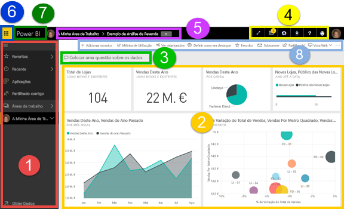
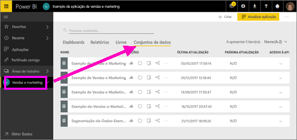
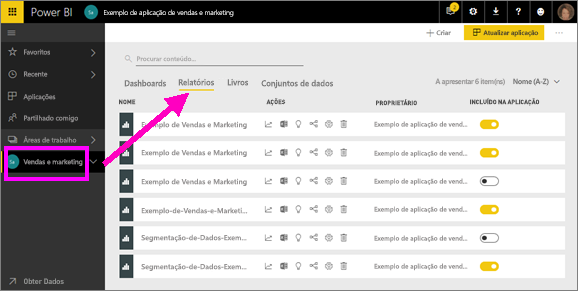
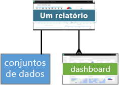
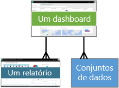
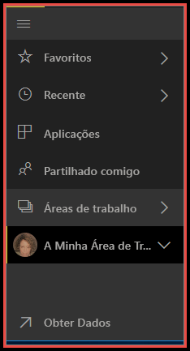
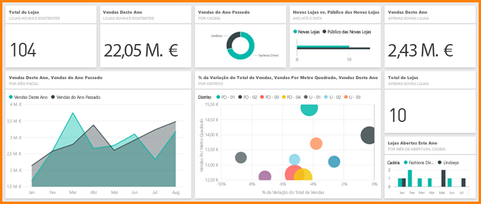
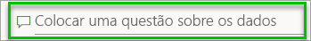
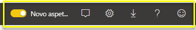

# Power BI - conceitos básicos para o serviço Power BI

Este artigo pressupõe que já se [inscreveu no serviço Power BI](service-self-service-signup-for-power-bi.md) e [adicionou dados](service-get-data.md).

Quando abrir o serviço Power BI, irá ver um ***dashboard*** apresentado. Os dashboards são um elemento que distingue o serviço Power BI do Power BI Desktop.

As principais funcionalidades da IU do serviço Power BI são as seguintes:

1. painel de navegação (navegação à esquerda)
2. tela (neste caso, dashboard com mosaicos)
3. caixa de perguntas das Perguntas e Respostas
4. botões de ícone, incluindo a ajuda e os comentários
5. título do dashboard (caminho de navegação, também conhecido como trilhos)
6. Iniciador da aplicações do Office 365
7. botão Início do Power BI
8. botões de ícone etiquetados

Aprofundaremos estes itens mais tarde, mas primeiro vamos examinar alguns conceitos do Power BI.

Pode também ver este vídeo antes de ler o resto do artigo.  No vídeo, o Will revê os conceitos básicos e faz uma apresentação do serviço Power BI.

<iframe width="560" height="315" src="https://www.youtube.com/embed/B2vd4MQrz4M" frameborder="0" allowfullscreen></iframe>

## Conceitos do Power BI
Os quatro principais blocos modulares do Power BI são: ***dashboards***, ***relatórios***, ***livros*** e ***conjuntos de dados***. E estão todos organizados em ***áreas de trabalho***. É importante compreender as áreas de trabalho antes de examinarmos os quatro blocos modulares. Por isso, vamos começar por aí. 

## Áreas de trabalho
As áreas de trabalho são os contentores para dashboards, relatórios, livros e conjuntos de dados no Power BI. Existem dois tipos de áreas de trabalho: **A minha área de trabalho* e as áreas de trabalho da aplicação. Assim, o que é uma *aplicação*? Uma *aplicação* Power BI é uma coleção de dashboards e relatórios criados para fornecer métricas importantes à sua organização. As aplicações são interativas, mas não podem ser editadas 

- *A minha área de trabalho* é a área de trabalho pessoal para qualquer cliente do Power BI trabalhar com o seu conteúdo. Só o utilizador tem acesso à Minha área de trabalho. Se pretender partilhar algum conteúdo, terá várias opções: crie uma área de trabalho da aplicação para agrupar conteúdo numa *aplicação* e disponibilizá-la para outras pessoas na organização ou crie uma área de trabalho da aplicação e conceda acesso a essa área de trabalho aos seus colegas, de modo a permitir a partilha e a colaboração.     
-  As *áreas de trabalho da aplicação* são utilizadas para permitir a colaboração e a partilha de conteúdo com os seus colegas. Também são os locais onde cria, publica e faz a gestão das aplicações da organização. Considere esses locais como áreas de transição e contentores para o conteúdo que irá formar a aplicação Power BI. Pode adicionar os seus colegas a áreas de trabalho da aplicação e colaborar em dashboards, relatórios, livros e conjuntos de dados. Todos os membros da área de trabalho da aplicação têm licenças Power BI Pro, mas os consumidores da aplicação (os colegas que têm acesso às aplicações) não precisam necessariamente de licenças Pro.  

Para obter mais informações, veja [How should I collaborate and share dashboards and reports (Como devo fazer para colaborar e partilhar dashboards e relatórios)](service-how-to-collaborate-distribute-dashboards-reports.md) na secção **Share your work (Partilhar o trabalho)** do Índice.

Voltemos agora aos blocos modulares do Power BI. Não pode ter dashboards ou relatórios sem dados (aliás, pode ter dashboards vazios e relatórios vazios, mas não são muito úteis até que tenham dados), por isso vamos começar pelos **conjuntos de dados**.

## Conjuntos de dados
Um *conjunto de dados* é uma coleção de dados que *importa* ou à qual se *liga*. O Power BI permite ligar-se e importar todos os tipos de conjuntos de dados e reuni-los num único lugar.  

Os conjuntos de dados estão associados às *áreas de trabalho* e um único conjunto de dados pode fazer parte de várias áreas de trabalho. Quando abre uma área de trabalho, os conjuntos de dados associados são apresentados no separador **Conjuntos de dados**. Cada conjunto de dados listado representa uma origem de dados única, por exemplo, um livro do Excel no OneDrive, um conjunto de dados tabular SSAS local ou um conjunto de dados do Salesforce. São suportadas muitas origens de dados diferentes e estamos sempre a adicionar novas. [Consulte a lista de tipos de conjuntos de dados que podem ser utilizados com o Power BI](service-get-data.md).

No exemplo abaixo, selecionei a área de trabalho da aplicação “Vendas e marketing” e cliquei no separador de **Conjuntos de dados**.

**UM** conjunto de dados...

* pode ser utilizado várias vezes numa área de trabalho ou em várias.
* pode ser usado em vários relatórios diferentes.
* Visualizações desse conjunto de dados único podem ser exibidas em vários dashboards diferentes.
  
  

Para se [ligar ou importar um conjunto de dados](service-get-data.md), selecione **Obter Dados** (na parte inferior da barra de navegação esquerda) ou selecione **+ Criar > Conjunto de Dados**  (no canto superior direito). Siga as instruções para se ligar ou importar uma origem específica e adicionar o conjunto de dados à área de trabalho. Os novos conjuntos de dados são marcados com um asterisco amarelo. O trabalho que realiza no Power BI não altera o conjunto de dados subjacente.

Se fizer [parte de uma ***área de trabalho de aplicação***](service-collaborate-power-bi-workspace.md), os conjuntos de dados adicionados por um membro da área de trabalho serão disponibilizados para os restantes membros da área de trabalho.

Os conjuntos de dados podem ser atualizados, renomeados, explorados e removidos. Utilize um conjunto de dados para criar um relatório a partir do zero ou ao executar as [informações rápidas](service-insights.md).  Para ver quais os relatórios e dashboards que já utilizam um conjunto de dados, selecione **Ver relacionados**. Para explorar um conjunto de dados, selecione-o. O que está realmente a fazer é abrir o conjunto de dados no editor de relatórios, onde pode de facto começar a explorar os dados e a criar visualizações. Vamos então passar para o próximo tópico – relatórios.

### Explorar mais
* [Power BI Premium - what is it?](service-premium.md) (Power BI Premium – o que é?)
* [Obter dados para o Power BI](service-get-data.md)
* [Conjuntos de dados de exemplo do Power BI](sample-datasets.md)

## Relatórios
Um relatório do Power BI é uma ou mais páginas de visualizações (gráficos como gráficos de linhas, gráficos circulares, treemaps, entre outros). As visualizações chamam-se também ***visuais***. Todas as visualizações num relatório vêm de um único conjunto de dados. Os relatórios podem ser criados do zero no Power BI, podem ser importados com dashboards que os seus colegas partilham consigo ou podem ser criados quando se liga a conjuntos de dados do Excel, do Power BI Desktop, das bases de dados, das aplicações SaaS e das [aplicações](service-get-data.md).  Por exemplo, quando se liga a um livro do Excel que contém folhas do Power View, o Power BI cria um relatório baseado nessas folhas. E quando se liga a uma aplicação SaaS, o Power BI importa um relatório previamente criado.

Existem duas formas de ver e interagir com os relatórios: [Vista de leitura e Vista de edição](service-reading-view-and-editing-view.md).  Apenas a pessoa que criou o relatório, os coproprietários e as pessoas com permissão concedida têm acesso a todas as capacidades de exploração, estruturação, criação e partilha da ***Vista de Edição*** desse relatório. As pessoas com quem partilharem o relatório podem explorar e interagir com o relatório ao utilizar a ***Vista de Leitura***.   

Quando abre uma área de trabalho, os relatórios associados estão listados no separador **Relatórios**. Cada relatório listado representa uma ou mais páginas de visualizações, com base apenas num dos conjuntos de dados subjacentes. Para abrir um relatório, basta selecioná-lo. 

Quando abre uma aplicação, será apresentado um dashboard.  Para aceder a um relatório subjacente, selecione um mosaico do dashboard (aprofundaremos este tópico posteriormente) que foi afixado a partir de um relatório. Tenha em atenção que nem todos os mosaicos são afixados a partir dos relatórios, pelo que poderá ter de clicar em alguns mosaicos para localizar um relatório. 

Por predefinição, o relatório é aberto primeiro na Vista de leitura.  Basta selecionar **Editar relatório** para o abrir na Vista de edição (se tiver as permissões necessárias). 

No exemplo abaixo, selecionei a área de trabalho da aplicação “Vendas e marketing” e cliquei no separador de **Relatórios**.

**UM** relatório...

* está contido numa única área de trabalho
* pode ser associado a vários dashboards nessa área de trabalho (os mosaicos afixados a partir desse relatório único podem aparecer em vários dashboards).
* pode ser criado utilizando dados de um conjunto de dados. (a pequena exceção é que o Power BI Desktop pode combinar mais de um conjunto de dados num único relatório que pode, por sua vez, ser importado para o Power BI)
  
  

### Explorar mais
* [Reports in Power BI service and Power BI Desktop (Relatórios no serviço Power BI e no Power BI Desktop)](service-reports.md)
* [Reports in the Power BI mobile apps (Relatórios nas aplicações móveis do Power BI)](mobile-reports-in-the-mobile-apps.md)

## Dashboards
Um *dashboard* é algo que cria **no serviço Power BI** ou algo que um colega cria **no serviço Power BI** e partilha consigo. Trata-se de uma única tela, que contém zero ou mais mosaicos e widgets. Cada mosaico afixado a partir de um relatório ou a partir de [Perguntas e Respostas](power-bi-q-and-a.md) mostra uma única [visualização](power-bi-report-visualizations.md), que foi criada a partir de um conjunto de dados e afixada ao dashboard. Pode também afixar páginas de relatórios inteiras a um dashboard como um mosaico único. Há várias formas de adicionar mosaicos ao seu dashboard; demasiadas para serem abordadas neste tópico de descrição geral. Para saber mais, consulte [Mosaicos de dashboard no Power BI](service-dashboard-tiles.md). 

Por que é que as pessoas criam dashboards?  Eis apenas alguns dos motivos:

* para ver rapidamente todas as informações necessárias para tomar decisões
* para monitorizar as informações mais importantes sobre o seu negócio
* para garantir que todos os colegas estão em sintonia, visualizando e usando a mesma informação
* para monitorizar a solidez de uma empresa, produto, unidade de negócio, campanha de marketing, etc.
* para criar uma vista personalizada de um dashboard maior – todas as métricas importantes para si

Quando abre uma área de trabalho, os conjuntos de dados associados são apresentados no separador **Dashboards**. Para abrir um dashboard, basta selecioná-lo. Quando abre uma aplicação, será apresentado um dashboard.  Cada dashboard representa uma vista personalizada de algum subconjunto do(s) conjunto(s) de dados subjacente(s).  Se for o proprietário do dashboard, também terá acesso à edição dos relatórios e dos conjuntos de dados subjacentes.  Se o dashboard tiver sido partilhado consigo, poderá interagir com o dashboard e com quaisquer relatórios subjacentes, mas não conseguirá guardar as alterações feitas.

Existem muitas formas diferentes de você ou de um colega poder [partilhar um dashboard](service-share-dashboards.md). O Power BI Pro é necessário para partilhar um dashboard e pode ser necessário para visualizar um dashboard partilhado.

> [!NOTE]
> A afixação e os mosaicos são abordados mais detalhadamente sob o cabeçalho "Dashboard com mosaicos".
> 

**UM** dashboard...

* está associado a uma única área de trabalho
* pode exibir visualizações de vários conjuntos de dados diferentes
* pode exibir visualizações de vários relatórios diferentes
* pode mostrar visualizações afixadas de outras ferramentas (por exemplo, Excel)
  
  

### Explorar mais
* [Criar um novo dashboard em branco e obter alguns dados](service-dashboard-create.md)
* [Duplicar um dashboard](service-dashboard-copy.md) 
* [Criar uma vista do telefone de um dashboard](service-create-dashboard-mobile-phone-view.md)

## Livros
Os livros são um tipo de conjunto de dados especial. Se já leu a secção **Conjuntos de dados** acima, já deve saber praticamente tudo sobre os livros. Mas poderá perguntar-se por que motivo, por vezes, o Power BI classifica um livro do Excel como um **Conjunto de dados** e outras como um **Livro**. 

Quando utiliza **Obter dados** com ficheiros do Excel, tem a opção de *Importar* ou de se *Ligar* ao ficheiro. Ao escolher Ligar, o livro será apresentado no Power BI, exatamente como apareceria no Excel Online. Mas, ao contrário do Excel Online, terá algumas excelentes funcionalidades para ajudá-lo a afixar elementos das suas folhas de cálculo diretamente nos dashboards.

Não é possível editar o livro no Power BI. No entanto, se precisar de fazer alterações, clique em Editar e escolha a opção para editar o livro no Excel Online ou abri-lo no Excel no seu computador. Todas as alterações efetuadas são guardadas no livro no OneDrive.

### Explorar mais
* [Get data from Excel workbook files (Obter dados de ficheiros de livro do Excel)](service-excel-workbook-files.md)
* [Publish to Power BI from Excel (Publicar no Power BI a partir do Excel)](service-publish-from-excel.md)

## A minha área de trabalho
Já abordamos as áreas de trabalho e os blocos modulares. Vamos examinar novamente a interface do Power BI e analisar os elementos que constituem a pasta de destino do serviço Power BI.

### 1. **Painel de navegação** (barra de navegação esquerda)
Utilize o painel de navegação para localizar e alternar entre as áreas de trabalho e os blocos modulares do Power BI: dashboards, relatórios, livros e conjuntos de dados.  

  

* Selecione **Obter Dados** para [adicionar conjuntos de dados, relatórios e dashboards ao Power BI](service-get-data.md).
* Expanda e recolha a barra de navegação com este ícone .
* Abra ou faça a gestão do seu conteúdo favorito ao selecionar **Favoritos**.
* Veja e abra o conteúdo visitado mais recentemente ao selecionar **Recentes**
* Veja, abra ou elimine uma aplicação ao selecionar **Aplicações**.
* Um colega partilhou conteúdo consigo? Selecione **Partilhado comigo** para pesquisar e ordenar o conteúdo para localizar o que precisa.
* Apresente e abra as áreas de trabalho ao selecionar **Áreas de trabalho**.

Clique uma vez em

* num ícone ou cabeçalho para abrir a vista de conteúdo
* numa seta para a direita (>) para abrir um menu de lista de opções para Favoritos, Recentes e Áreas de trabalho. 
* num ícone de divisa () para apresentar a lista deslocável **A Minha Área de Trabalho** dos dashboards, relatórios, livros e conjuntos de dados.
* um conjunto de dados para explorá-lo

### 2. **Tela** 
Como abrimos um dashboard, a área da tela apresenta mosaicos de visualização. Se tivéssemos aberto por exemplo, o editor de relatório, a área da tela apresentaria uma página de relatório. 

Os dashboards são compostos por [mosaicos](service-dashboard-tiles.md).  Os mosaicos são criados na Vista de edição dos relatórios, nas Perguntas e Respostas, noutros dashboards e podem ser afixados a partir do Excel, do SSRS, entre outros. Um tipo especial de mosaico, intitulado [widget](service-dashboard-add-widget.md), é adicionado diretamente ao dashboard. Os mosaicos que aparecem num dashboard foram especificamente inseridos no sítio pelo criador/proprietário de um relatório.  O ato de adicionar um mosaico a um dashboard denomina-se *afixar*.

Para obter mais informações, consulte **Dashboards** (acima).

### 3. **Caixa de perguntas das Perguntas e Respostas**
Uma maneira de explorar seus dados é fazer uma pergunta e deixar que as Perguntas e Respostas do Power BI lhe forneçam uma resposta, na forma de uma visualização. As Perguntas e Respostas podem ser utilizadas paro adicionar conteúdo a um dashboard ou a um relatório.

As Perguntas e Respostas procuram uma resposta no conjunto(s) de dados ligado ao dashboard.  Um conjunto de dados ligado é aquele que tem pelo menos um mosaico afixado a esse dashboard.

Assim que começa a escrever a sua pergunta, as Perguntas e Respostas levam-no até a página de Perguntas e Respostas. À medida que digita, as Perguntas e Respostas ajudam-no a fazer a pergunta certa e a encontrar a melhor resposta com reformulações frásicas, preenchimento automático, sugestões e muito mais. Quando encontrar uma visualização (resposta) de que gosta, afixe-a no seu dashboard. Para obter mais informações, consulte [Perguntas e Respostas no Power BI](power-bi-q-and-a.md).

### 4. **Botões de ícone** 
Os ícones no canto superior direito são recursos para as definições, as notificações, as transferências, obter ajuda e fornecer comentários à equipa do Power BI. Selecione a seta dupla para abrir o dashboard no modo de **Ecrã inteiro**.  

### 5. **Título do dashboard** (caminho de navegação, também conhecido como trilhos)
Como nem sempre é fácil descobrir quais as áreas de trabalho e os dashboards que estão ativos, o Power BI cria um caminho de navegação para si.  Neste exemplo, vemos a área de trabalho (A minha área de trabalho) e o título do dashboard (Exemplo de Análise de Revenda).  Se abrirmos um relatório, o nome do relatório será acrescentado ao fim do caminho de navegação.  Cada secção do caminho é uma hiperligação ativa.  

Repare no ícone “C” após o título do dashboard. Este dashboard tem uma [etiqueta de classificação de dados](service-data-classification.md) “confidencial”. A etiqueta identifica a confidencialidade e o nível de segurança dos dados. Se o Administrador tiver ativado a classificação de dados, cada dashboard terá um conjunto de etiquetas predefinidas. Os proprietários do dashboard devem alterar a etiqueta para corresponder ao nível de segurança adequado do dashboard deles.

### 6. **Iniciador de aplicações do Office 365**
Com o iniciador de aplicações, todas as aplicações do Office 365 estão facilmente disponíveis com um clique. Aqui, pode iniciar rapidamente o e-mail, os documentos, o calendário, entre outros. 

### 7. **Página inicial do Power BI**
Se selecionar esta opção, abrirá o [ dashboard em destaque](service-dashboard-featured.md) (se tiver definido um). Caso contrário,será aberto o último dashboard visualizado.

   

### 8. **Botões de ícone etiquetados**
Esta área do ecrã contém opções adicionais para interagir com o conteúdo (neste caso, com o dashboard).  Além dos ícones etiquetados que pode ver, se selecionar as reticências, poderá ver as opções para duplicar, imprimir e atualizar o dashboard, entre outras.

   

## Próximos passos
[Introdução ao Power BI](service-get-started.md)  
[Navegação: Introdução ao serviço Power BI](service-the-new-power-bi-experience.md)
[Vídeos do Power BI](videos.md)  
[Editor de relatórios – faça uma visita](service-the-report-editor-take-a-tour.md)

Mais perguntas? [Experimente perguntar à Comunidade do Power BI](http://community.powerbi.com/)

