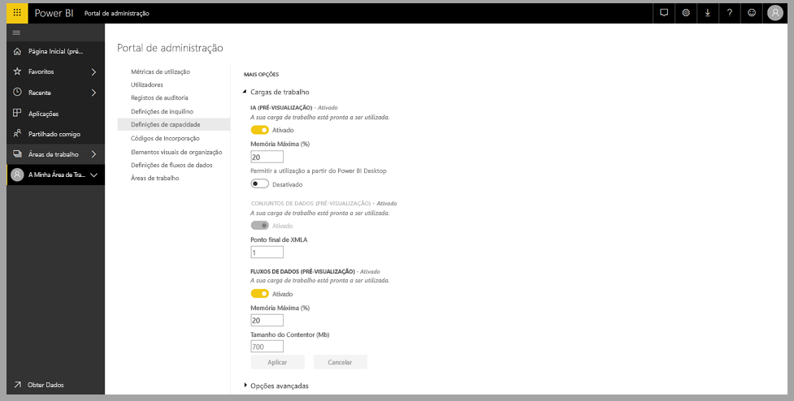
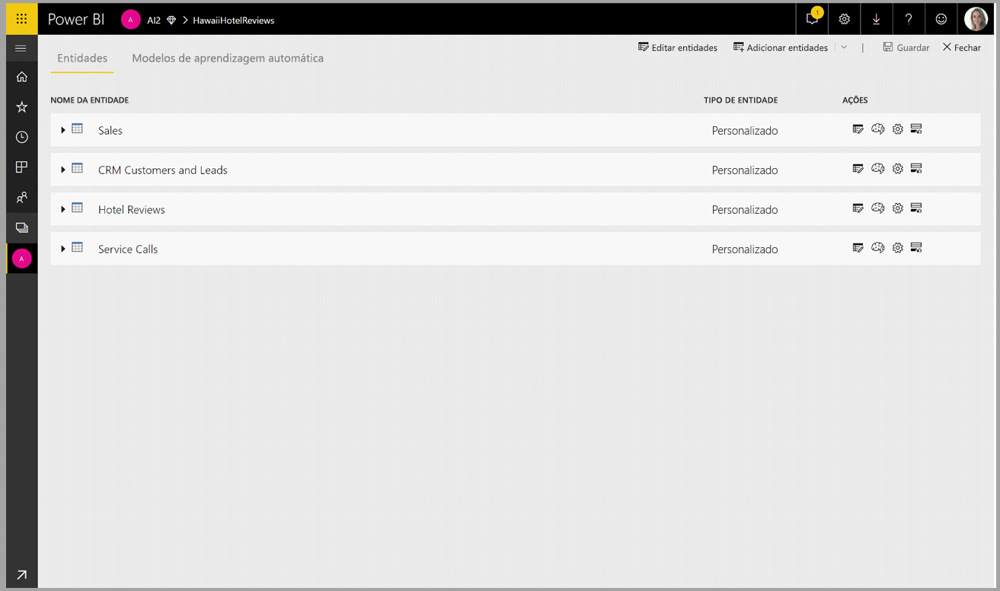
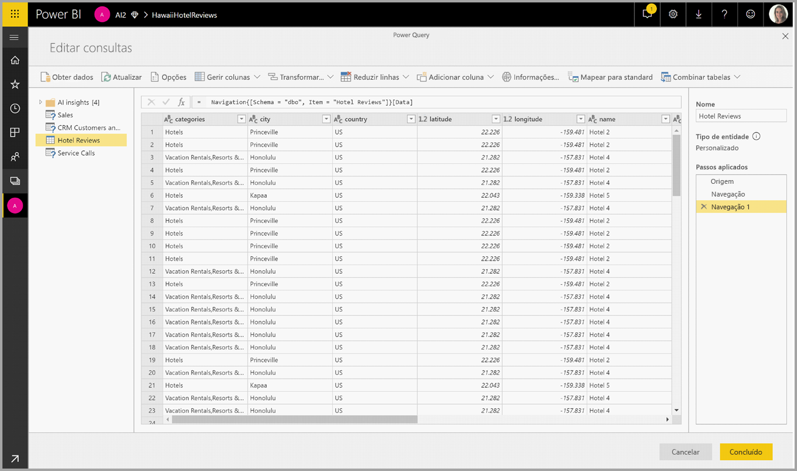
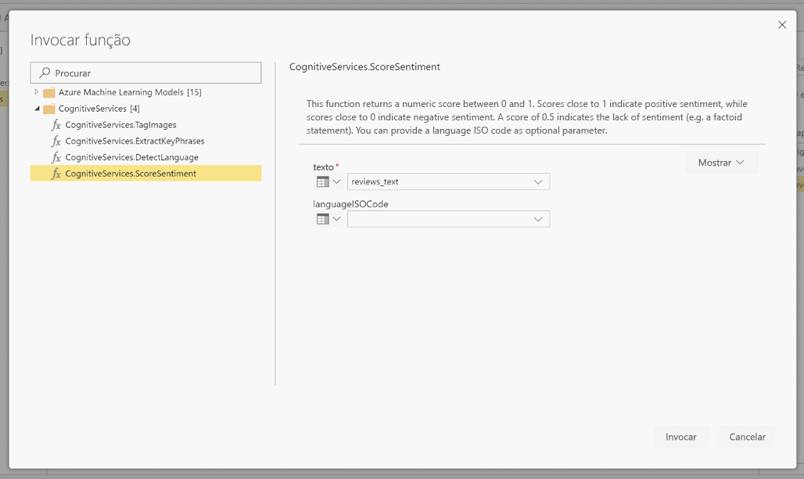
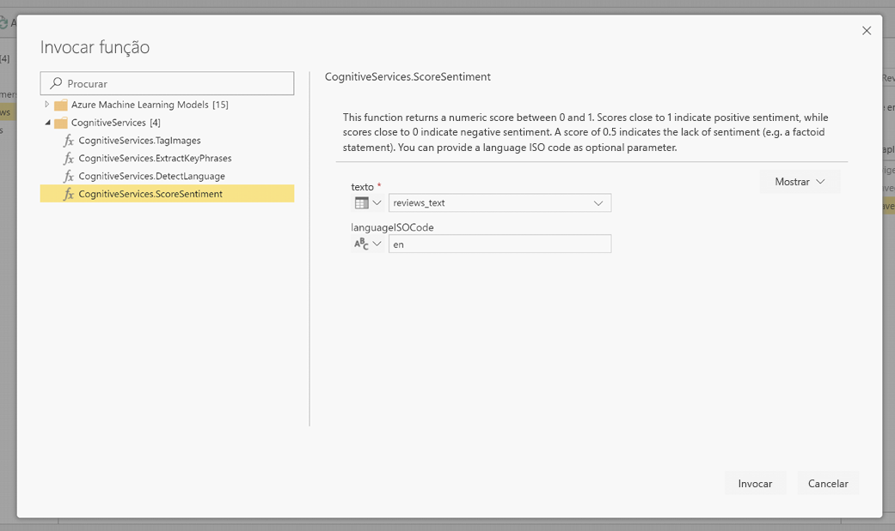
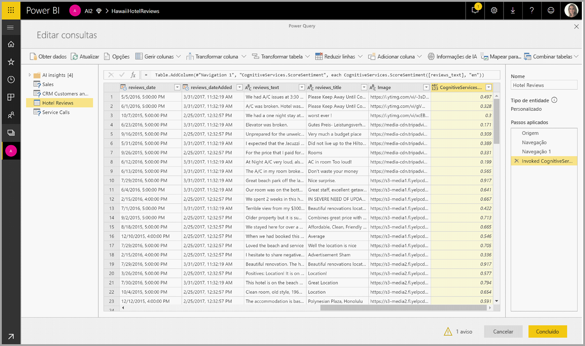
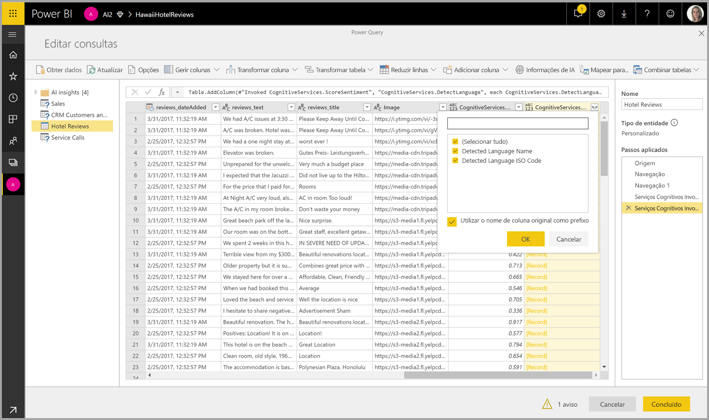

# Serviços Cognitivos no Power BI (Pré-visualização)

Com os Serviços Cognitivos no Power BI, pode aplicar diferentes algoritmos dos [Serviços Cognitivos do Azure](https://azure.microsoft.com/services/cognitive-services/) para enriquecer os seus dados na preparação personalizada de dados para Fluxos de Dados.

Seguem-se os serviços suportados atualmente: [Análise de Sentimentos](https://docs.microsoft.com/azure/cognitive-services/text-analytics/how-tos/text-analytics-how-to-sentiment-analysis), [Extração de Expressões-Chave](https://docs.microsoft.com/azure/cognitive-services/text-analytics/how-tos/text-analytics-how-to-keyword-extraction), [Deteção de Idioma](https://docs.microsoft.com/azure/cognitive-services/text-analytics/how-tos/text-analytics-how-to-language-detection) e [Etiquetagem de Imagens](https://docs.microsoft.com/azure/cognitive-services/computer-vision/concept-tagging-images). As transformações são executadas no Serviço Power BI e não precisam de uma subscrição dos Serviços Cognitivos do Azure. Esta funcionalidade precisa do Power BI Premium.

## **Ativar funcionalidades de IA**

Os serviços cognitivos são suportados para nós de capacidade Premium EM2, A2 ou P1 e superiores. É utilizada uma carga de trabalho de IA separada na capacidade para executar os serviços cognitivos. Durante a pré-visualização pública, esta carga de trabalho está desativada por predefinição. Antes de utilizar os serviços cognitivos no Power BI, a carga de trabalho de IA tem de ser ativada nas definições de capacidade do portal de administração. Pode ativar a carga de trabalho de IA na secção de cargas de trabalho e definir a quantidade máxima de memória que gostaria que fosse consumida por esta carga de trabalho. O limite de memória recomendado é de 20%. Exceder este limite torna o processo de consulta mais lento.

## **Introdução aos Serviços Cognitivos no Power BI**

As transformações dos Serviços Cognitivos fazem parte da [Preparação Personalizada de Dados para fluxos de dados](https://powerbi.microsoft.com/blog/introducing-power-bi-data-prep-wtih-dataflows/). Para enriquecer os seus dados com os Serviços Cognitivos, comece por editar um fluxo de dados.

Selecione o botão **Informações de IA** no friso superior do Editor do Power Query.

Na janela de pop-up, selecione a função que quer utilizar e os dados que quer transformar. Neste exemplo, estamos a classificar o sentimento de uma coluna que contém texto de críticas.

**CultureInfo** (Informações de Cultura) é uma entrada opcional para especificar o idioma do texto. Este campo espera um código ISO. Pode utilizar uma coluna como entrada para Cultureinfo ou um campo estático. Neste exemplo, o idioma é especificado como inglês (en) para a coluna inteira. Se deixar este campo em branco, o Power BI deteta automaticamente o idioma antes de aplicar a função. Em seguida, selecione **Invocar**.

Depois de invocar a função, o resultado é adicionado como uma nova coluna à tabela. A transformação também é adicionada como um passo aplicado na consulta.

Se a função devolver vários campos de saída, invocar a função adiciona uma nova coluna com um registo dos vários campos de saída.

Utilize a opção de expansão para adicionar um ou ambos os valores como colunas aos seus dados.

## **Funções disponíveis**

Esta secção descreve as funções disponíveis nos Serviços Cognitivos no Power BI.

### **Detetar Idioma**

A função de deteção de idioma avalia a entrada de texto e, para cada campo, devolve o nome do idioma e o identificador ISO. Esta função é útil para colunas de dados que recolhem texto arbitrário, cujo idioma é desconhecido. A função espera dados em formato de texto como entrada.

A Análise de Texto reconhece até 120 idiomas. Para obter mais informações, veja os [idiomas suportados](https://docs.microsoft.com/azure/cognitive-services/text-analytics/text-analytics-supported-languages).

### **Extrair Expressões-Chave**

A função **Extração de Expressões-Chave** avalia texto não estruturado e, para cada campo de texto, devolve uma lista de expressões-chave. A função precisa de um campo de texto como entrada e aceita uma entrada opcional para **Cultureinfo**. (Veja a secção **Introdução** mais atrás neste artigo).

A extração de expressões-chave funciona melhor quando são disponibilizados segmentos de texto maiores para processamento. Isto é o oposto da análise de sentimentos, que oferece um desempenho melhor em blocos de texto mais pequenos. Para obter os melhores resultados em ambas as operações, considere reestruturar as entradas em conformidade.

### **Classificar Sentimento**

A função **Classificar Sentimento** avalia a entrada de texto e devolve uma classificação de sentimento para cada documento, de 0 (negativo) a 1 (positivo). Esta função é útil para detetar os sentimentos positivo e negativo nas redes sociais, críticas de clientes e fóruns de debate.

A Análise de Texto utiliza um algoritmo de classificação de aprendizagem automática para gerar uma classificação de sentimento entre 0 e 1. As classificações mais próximas de 1 indicam um sentimento positivo, as classificações mais próximas de 0 indicam um sentimento negativo. O modelo é previamente preparado com um extenso corpo de texto com associações de sentimentos. Atualmente, não é possível fornecer os seus próprios dados de preparação. O modelo utiliza uma combinação de técnicas durante a análise de texto, incluindo o processamento de texto, a análise de categorias gramaticais, a disposição das palavras e associações de palavras. Para obter mais informações sobre o algoritmo, veja [Introducing Text Analytics](https://blogs.technet.microsoft.com/machinelearning/2015/04/08/introducing-text-analytics-in-the-azure-ml-marketplace/) (Introdução à Análise de Texto).

A análise de sentimentos é realizada no campo de entrada inteiro, em vez de extrair sentimentos de uma entidade específica no texto. Na prática, há a tendência de melhorar a precisão da classificação quando os documentos contêm uma ou duas frases, em vez de um grande bloco de texto. Durante a fase de avaliação da objetividade, o modelo determina se um campo de entrada como um todo é objetivo ou se contém sentimento. Um campo de entrada maioritariamente objetivo não avança para a fase de deteção de sentimento, resultando numa classificação de 0,5, sem qualquer processamento adicional. Para os campos de entrada que continuam no pipeline, a fase seguinte gera uma classificação acima ou abaixo de 0,5, consoante o grau de sentimento detetado no campo de entrada.

Atualmente, o serviço Análise de Sentimentos suporta os idiomas inglês, alemão, espanhol e francês. Existem outros idiomas disponíveis em modo de pré-visualização. Para obter mais informações, veja os [Idiomas suportados](https://docs.microsoft.com/azure/cognitive-services/text-analytics/text-analytics-supported-languages).

### **Etiquetar Imagens**

A função **Etiquetar Imagens** devolve etiquetas com base em mais de 2000 objetos, seres vivos, paisagens e ações reconhecíveis. Quando as etiquetas são ambíguas ou não são do conhecimento geral, a saída fornece "sugestões" para clarificar o significado da etiqueta no contexto de um cenário conhecido. As etiquetas não são organizadas como uma taxonomia e não existem hierarquias de herança. Uma coleção de etiquetas de conteúdo é a base de uma "descrição" de imagem apresentada como linguagem legível por humanos sob a forma de frases completas.

Depois de carregar uma imagem ou especificar um URL de imagem, os algoritmos de Imagem Digitalizada produzem etiquetas com base nos objetos, seres vivos e ações identificados na imagem. A etiquetagem não se limita ao tema principal, por exemplo, uma pessoa em primeiro plano, incluindo também o cenário (dentro ou fora de portas), mobiliário, ferramentas, plantas, animais, acessórios, aparelhos e assim por diante.

Essa função precisa de um URL de imagem ou de um campo base 64 como entrada. Neste momento, a etiquetagem de imagens suporta os idiomas inglês, espanhol, japonês, português e chinês simplificado. Para obter mais informações, veja os [Idiomas suportados](https://docs.microsoft.com/rest/api/cognitiveservices/computervision/tagimage/tagimage#uri-parameters).

## Próximos Passos

Este artigo forneceu uma descrição geral de como utilizar os Serviços Cognitivos com o serviço Power BI. Os artigos que se seguem também podem ser úteis e interessantes. 

* [Tutorial: Invocar um modelo do Machine Learning Studio no Power BI (Pré-visualização)](service-tutorial-invoke-machine-learning-model.md)
* [Integração do Azure Machine Learning no Power BI (Pré-visualização)](service-machine-learning-integration.md)
* [Tutorial: Utilizar os Serviços Cognitivos no Power BI](service-tutorial-use-cognitive-services.md)

Para obter mais informações sobre fluxos de dados, leia estes artigos:
* [Criar e utilizar fluxos de dados no Power BI](service-dataflows-create-use.md)
* [Utilizar entidades calculadas no Power BI Premium (Pré-visualização)](service-dataflows-computed-entities-premium.md)
* [Utilizar fluxos de dados com origens de dados no local (Pré-visualização)](service-dataflows-on-premises-gateways.md)
* [Recursos para programadores para fluxos de dados do Power BI (Pré-visualização)](service-dataflows-developer-resources.md)
* [Fluxos de dados e integração do Azure Data Lake (Pré-visualização)](service-dataflows-azure-data-lake-integration.md)