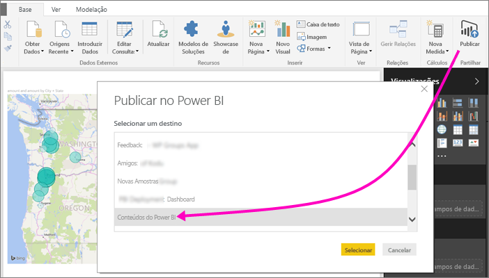
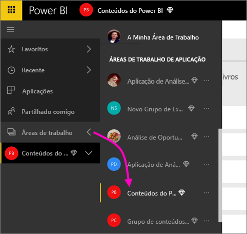
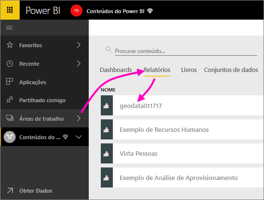
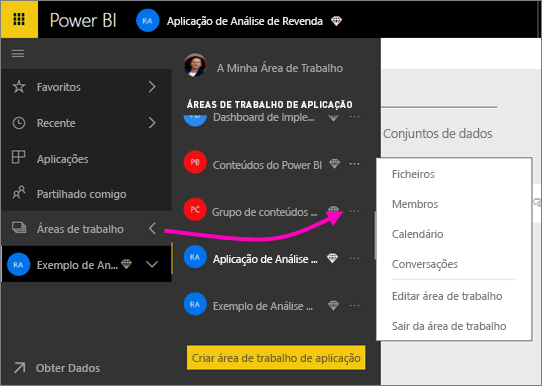
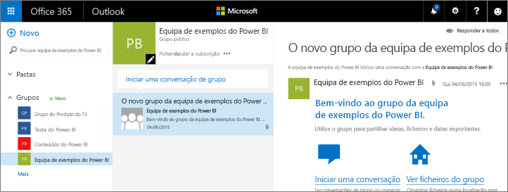
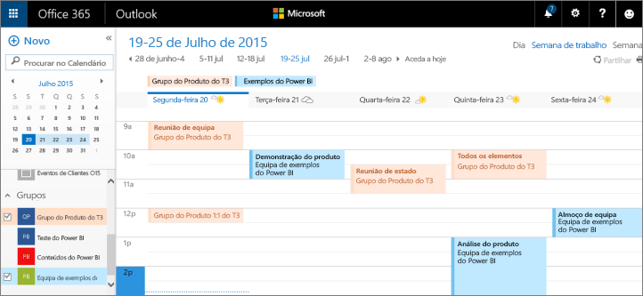

# Colaborar na sua área de trabalho de aplicação do Power BI
As áreas de trabalho de aplicações do Power BI são locais excelentes para colaborar com os seus colegas em dashboards, relatórios e conjuntos de dados para criar *aplicações*. É para isso que as áreas de trabalho foram concebidas: colaboração. Após concluir a colaboração nos seus dashboards e relatórios com colegas, pode empacotá-los numa aplicação e distribuí-la. Saiba mais sobre [criar aplicações e áreas de trabalho de aplicação no Power BI](service-create-distribute-apps.md). 

A colaboração não termina com as áreas de trabalho no Power BI. O Office 365 fornece serviços de grupo como a partilha de ficheiros no OneDrive para Empresas, conversações no Exchange, tarefas e calendário partilhados, entre outros. Saiba mais sobre os [grupos no Office 365](https://support.office.com/article/Create-a-group-in-Office-365-7124dc4c-1de9-40d4-b096-e8add19209e9).

As áreas de trabalho de aplicação estão disponíveis apenas no [Power BI Pro](service-free-vs-pro.md).

## Colaborar em ficheiros do Power BI Desktop na sua área de trabalho de aplicação
Após criar um ficheiro do Power BI Desktop, se o publicar na sua área de trabalho de aplicação do Power BI, todas as pessoas na área de trabalho poderão colaborar na mesma.

1. No Power BI Desktop, selecione **Publicar** no friso **Base** e, na caixa **Selecionar um destino**, selecione a sua área de trabalho de aplicação.
   
    
2. No serviço Power BI, selecione a seta junto a Áreas de trabalho > selecione a sua área de trabalho de aplicação.
   
    
3. Selecione o separador Relatórios e, em seguida, selecione o seu relatório.
   
    
   
    A partir daqui, funciona como qualquer outro relatório no Power BI. O utilizador e outras pessoas na sua área de trabalho de aplicação podem [modificar o relatório](service-reports.md) e guardar mosaicos num dashboard à sua escolha.

## Colaborar no Office 365
Colaborar no Office 365 começa a partir da área de trabalho de aplicação no Power BI.

1. No serviço Power BI, selecione a seta junto a Áreas de trabalho > selecione as reticências (**…**) junto ao nome da sua área de trabalho. 
   
   
2. Neste menu, pode colaborar com o seu grupo de diversas formas: 
   
   * Tenha uma [conversação em grupo no Office 365](service-collaborate-power-bi-workspace.md#have-a-group-conversation-in-office-365).
   * [Agende um evento](service-collaborate-power-bi-workspace.md#schedule-an-event-on-the-group-workspace-calendar) no calendário de área de trabalho de grupo da aplicação.
   
   Da primeira vez que aceder à área de trabalho de grupo da sua aplicação no Office 365, poderá ser necessário algum tempo. Aguarde entre 15 a 30 minutos e, em seguida, atualize o browser.

## Ter uma conversação em grupo no Office 365
1. Selecione as reticências (…) junto ao nome da área de trabalho da sua aplicação \> **Conversações**. 
   
    
   
   É aberto o site de conversações e e-mails da área de trabalho de grupo da sua aplicação no Outlook para Office 365.
   
   
2. Saiba mais sobre as [conversações de grupo no Outlook para Office 365](https://support.office.com/Article/Have-a-group-conversation-a0482e24-a769-4e39-a5ba-a7c56e828b22).

## Agendar um evento no calendário de área de trabalho de grupo da aplicação
1. Selecione as reticências (**…**) junto ao nome da área de trabalho da sua aplicação \> **Calendário**. 
   
   
   
   É aberto o calendário da área de trabalho de grupo da aplicação no Outlook para Office 365.
   
   
2. Leia mais sobre os [calendários de grupo no Outlook no Office 365](https://support.office.com/Article/Add-edit-and-subscribe-to-group-events-0cf1ad68-1034-4306-b367-d75e9818376a).

## Gerir uma área de trabalho de aplicação
Se for o proprietário ou administrador de uma área de trabalho de aplicação, também pode adicionar ou remover membros de áreas de trabalho. Saiba mais sobre [gerir a sua área de trabalho de aplicação do Power BI](service-manage-app-workspace-in-power-bi-and-office-365.md).

## Próximos passos
* [Criar aplicações e áreas de trabalho de aplicação no Power BI](service-create-distribute-apps.md)
* Mais perguntas? [Experimente a Comunidade do Power BI](http://community.powerbi.com/)
* Comentários? Visite [Ideias para o Power BI](https://ideas.powerbi.com/forums/265200-power-bi)

