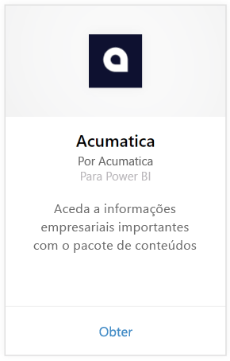
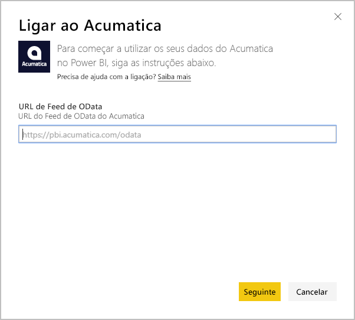
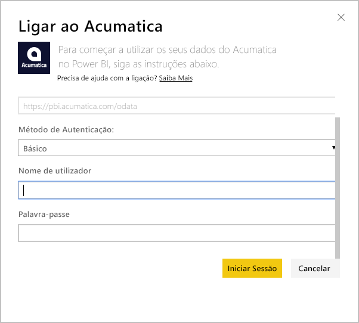
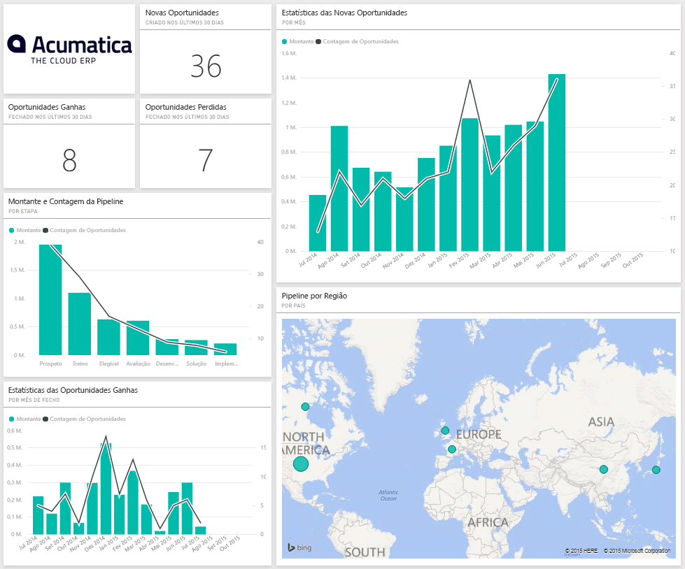
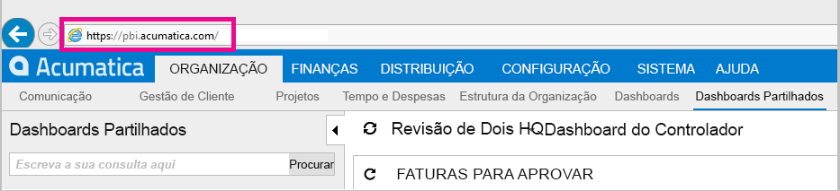
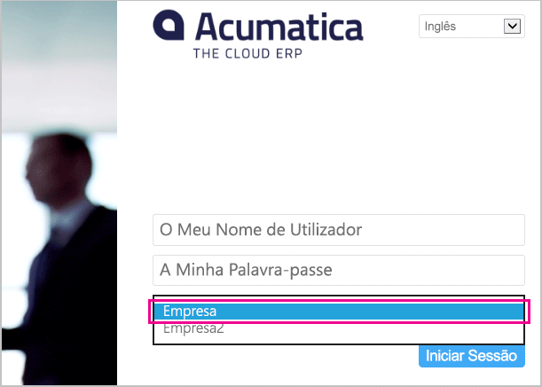

# Ligar ao Acumatica com o Power BI
O pacote de conteúdos do Acumatica para o BI Power permite que obtenha informações rapidamente sobre os seus dados de oportunidade. O Power BI recupera os seus dados, incluindo oportunidades, contas e clientes, e cria um dashboard predefinido e relatórios relacionados com base nesses dados.

Ligue-se ao [pacote de conteúdo do Acumatica](https://app.powerbi.com/getdata/services/acumatica) ou leia mais sobre a [Integração do Acumatica](https://powerbi.microsoft.com/integrations/acumatica) com o Power BI.

>[!NOTE]
>Este pacote de conteúdo exige o Acumatica v5.2 ou superior.

## Como se ligar
1. Selecione **Obter Dados** na parte inferior do painel de navegação esquerdo.
   
   
2. Na caixa **Serviços**, selecione **Obter**.
   
   
3. Selecione **Acumatica** \> **Obter**.
   
   
4. Insira o ponto final de OData do Acumatica. Um ponto final de OData permite que um sistema externo solicite dados do Acumatica. O ponto final OData do Acumatica é formatado da seguinte forma e deve utilizar HTTPS:
   
     `https://[sitedomain]/odata/[companyname]`
   
   O Nome da Empresa só é necessário se tiver uma implementação de várias empresas. Mais informações sobre como encontrar esse parâmetro na sua conta do Acumatica estão incluídas abaixo.
   
   
5. Como Método de Autenticação, selecione **Básico**. Introduza o nome de utilizador e a palavra-passe da conta do Acumatica e clique em **Iniciar Sessão**.
   
    
6. Após o Power BI importar os dados, verá novos elementos (dashboard, relatório e conjunto de dados) no painel de navegação esquerdo. Os novos itens são marcados com um asterisco amarelo \* que desaparece quando é selecionado; escolher o dashboard mostrará um modelo semelhante ao seguinte:
   
    

**E agora?**

* Experimente [fazer uma pergunta na caixa de Perguntas e Respostas](consumer/end-user-q-and-a.md) na parte superior do dashboard
* [Altere os mosaicos](service-dashboard-edit-tile.md) no dashboard.
* [Selecione um mosaico](consumer/end-user-tiles.md) para abrir o relatório subjacente.
* Embora o seu conjunto de dados seja agendado para atualizações diárias, pode alterar o agendamento das atualizações ou tentar atualizá-lo a pedido através da opção **Atualizar Agora**

## Requisitos de sistema
Este pacote de conteúdos exige o Acumatica v5.2 ou superior; confirme a versão com o administrador do Acumatica.

## A localizar parâmetros
**Ponto de Final OData do Acumatica**

O ponto final OData do Acumatica é formatado da seguinte forma e deve utilizar HTTPS:

    https://[sitedomain]/odata/[companyname]

O Domínio do Site do Aplicativo pode ser encontrado na barra de endereços do browser depois de entrar no Acumatica. No exemplo abaixo, o domínio do site é `https://pbi.acumatica.com`, pelo que o ponto final OData a fornecer seria `https://pbi.acumatica.com/odata`.

 

O Nome da Empresa só é necessário se tiver uma implementação de várias empresas. Pode encontrar essas informações na página de início de sessão do Acumatica.

## Resolução de problemas
Se não conseguir iniciar a sessão, verifique se o ponto de extremidade OData do Acumatica fornecido está formatado corretamente.

    https://<application site domain>/odata/<company name>

Se tiver problemas para se ligar, confirme com o administrador a sua versão do Acumatica. Este pacote de conteúdos requer a versão 5.2 ou posterior.

## Próximos passos
[Introdução ao Power BI](service-get-started.md)

[Obter dados no Power BI](service-get-data.md)

