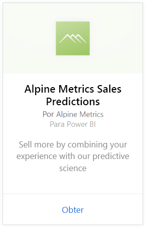
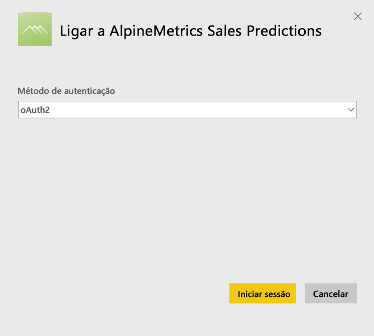
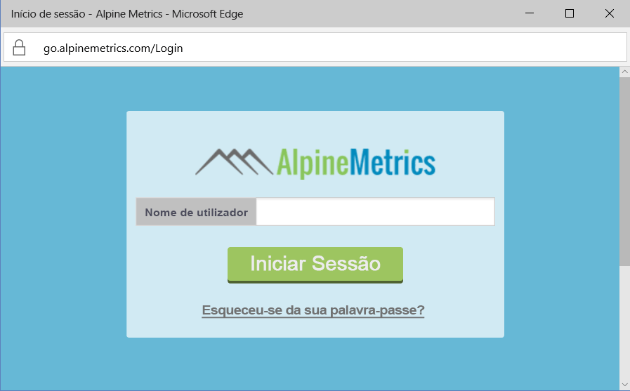
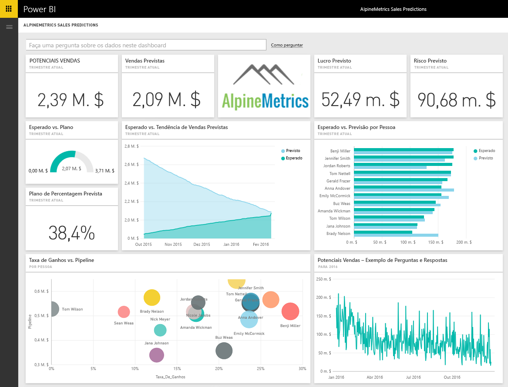

# Ligue-se às Previsões de Vendas da Alpine Metrics com o Power BI
A Alpine Metrics fornece Otimização do Processo de Previsão de Vendas de última geração, na nuvem e a pedido, para organizações de vendas de grande e pequena dimensão. O pacote de conteúdos de Previsão de Vendas para o Power BI da Alpine Metrics inclui métricas como potenciais vendas e vendas previstas e respetivos riscos, permitindo-lhe o acesso a informações mais aprofundadas sobre o futuro da sua empresa. 

Ligue-se ao [pacote de conteúdos de Previsão de Vendas para o Power BI ](https://app.powerbi.com/getdata/services/alpine-metrics) da Alpine Metrics.

## Como ligar
1. Selecione Obter Dados na parte inferior do painel de navegação esquerdo.  
   
    
2. Na caixa **Serviços**, selecione **Obter**.  
   
    
3. Selecione **Previsões de Vendas da AlpineMetrics** e, em seguida, selecione **Obter**.  
   
    
4. Selecione **OAuth 2** e **Iniciar Sessão**. Quando solicitado, forneça as credenciais da AlpineMetrics.
   
    
   
    
5. Depois de estar ligado, são carregados automaticamente um dashboard, um relatório e um conjunto de dados. Quando a operação estiver concluída, os mosaicos serão atualizados com os dados da sua conta.
   
    

**O que vem em seguida?**

* Experimente [fazer uma pergunta na caixa de Perguntas e Respostas](consumer/end-user-q-and-a.md) na parte superior do dashboard
* [Altere os mosaicos](service-dashboard-edit-tile.md) no dashboard.
* [Selecione um mosaico](consumer/end-user-tiles.md) para abrir o relatório subjacente.
* Embora o seu conjunto de dados seja agendado para atualizações diárias, pode alterar o agendamento das atualizações ou tentar atualizá-lo a pedido através da opção **Atualizar Agora**

## O que está incluído
O pacote de conteúdos inclui dados das seguintes tabelas:  

    - Conta    
    - Empresa    
    - País    
    - Setor    
    - Oportunidade  
    - Pessoa  
    - Previsão    
    - Histórico de previsões    
    - Produto  
    - Região    

## Requisitos de sistema
É necessária uma conta Alpine Metrics com permissões para as tabelas acima, de forma a instanciar este pacote de conteúdos.

## Próximos passos
[O que é o Power BI?](power-bi-overview.md)

[Conceitos básicos para designers no serviço Power BI](service-basic-concepts.md)

