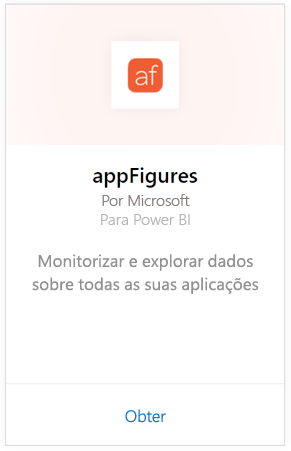
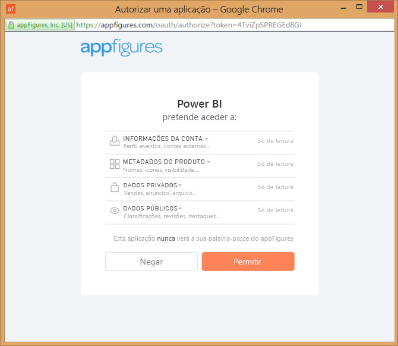
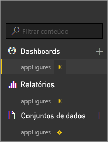
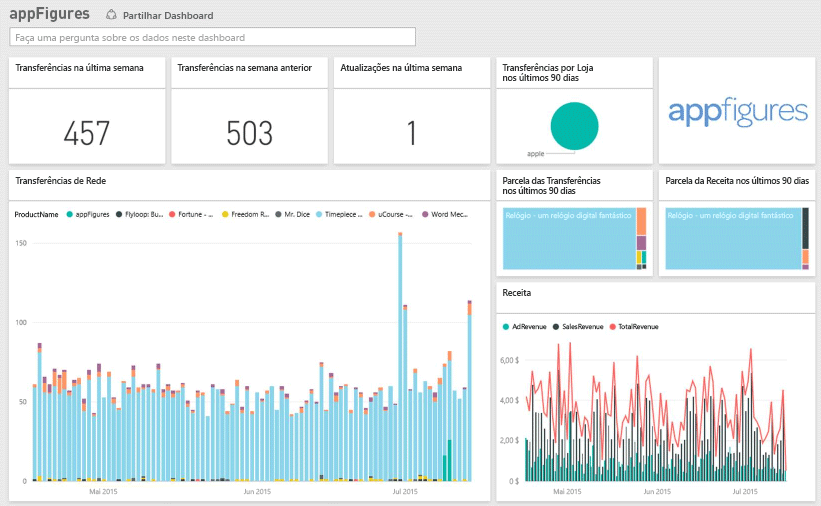
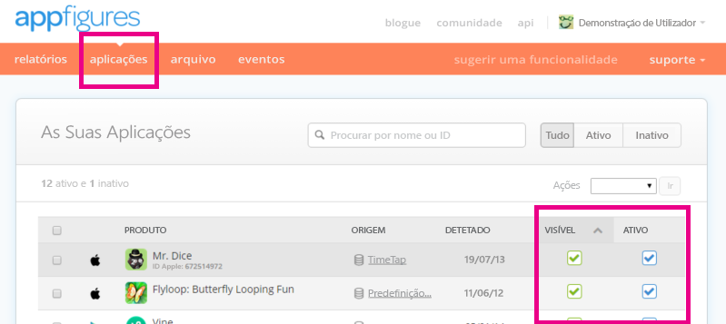

# Ligue-se a appFigures com o Power BI
É fácil acompanhar as estatísticas importantes sobre as suas aplicações com o Power BI e com o pacote de conteúdos do appFigures. O Power BI recupera os seus dados, incluindo vendas de aplicações, downloads e estatísticas de anúncios, e cria um dashboard predefinido e relatórios relacionados com base nesses dados.

Ligue-se ao [pacote de conteúdo do appFigures](https://app.powerbi.com/getdata/services/appfigures) ou leia mais sobre a [integração do appFigures](https://powerbi.microsoft.com/integrations/appfigures) com o Power BI.

## Como se ligar
1. Selecione **Obter Dados** na parte inferior do painel de navegação esquerdo.
   
   
2. Na caixa **Serviços**, selecione **Obter**.
   
   
3. Selecione **appFigures** \> **Obter**.
   
   
4. Como **Método de Autenticação**, selecione **oAuth2** \> **Iniciar Sessão**. Quando solicitado, insira as suas credenciais do appFigures e siga o processo de autenticação correspondente.
   
   Na primeira vez que se ligar, o Power BI solicita o acesso de apenas leitura à sua conta. Selecione **Permitir** para iniciar o processo de importação. Isso pode levar alguns minutos, dependendo do volume de dados na sua conta.
   
   
5. Após o Power BI importar os dados, verá novos elementos (dashboard, relatório e conjunto de dados) no painel de navegação esquerdo. Os itens novos são marcados com um asterisco amarelo \*:
   
    
6. Selecione o dashboard appFigures. Esse é o dashboard predefinido criado pelo Power BI para exibir seus dados. Pode alterar este dashboard para apresentar os dados da forma que quiser.
   
    

**E agora?**

* Experimente [fazer uma pergunta na caixa de Perguntas e Respostas](power-bi-q-and-a.md) na parte superior do dashboard
* [Altere os mosaicos](service-dashboard-edit-tile.md) no dashboard.
* [Selecione um mosaico](service-dashboard-tiles.md) para abrir o relatório subjacente.
* Embora o seu conjunto de dados seja agendado para atualizações diárias, pode alterar o agendamento de atualização ou tentar atualizá-lo a pedido através de **Atualizar Agora**

## O que está incluído
Os dados a seguir estão disponíveis no appFigures no Power BI.

| **Nome da Tabela** | **Descrição** |
| --- | --- |
| Países |Esta tabela fornece informações de nome de país. |
| Datas |Esta tabela contém datas desde hoje até a mais antiga PublishDate (data de publicação) das aplicações que estão Ativas e Visíveis na sua conta do appFigures. |
| Eventos |Esta tabela contém informações de download, vendas e anúncios para cada aplicação, por país, que são fornecidas diariamente. Note que tanto as informações de compras na aplicação quanto as da própria aplicação estão todas nesta única tabela - pode utilizar a coluna <strong>Tipo</strong> para diferenciá-las. |
| Na aplicação |Esta tabela contém dados sobre os diferentes tipos de compras na aplicação que estão associadas com as aplicações Ativas e Visíveis na sua conta do appFigures. |
| Produtos |Esta tabela contém dados sobre as diferentes aplicações que estão Ativas e Visíveis na sua conta do appFigures. |

## Resolução de problemas
Se os dados de algumas das aplicações não estão a aparecer no Power BI, certifique-se de que essas aplicações estão Visíveis e Ativas no separador **aplicações** do site do appFigures.

## Próximos passos
* [Introdução ao Power BI](service-get-started.md)
* [Obter dados no Power BI](service-get-data.md)

