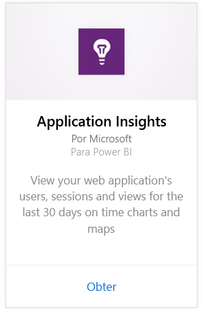
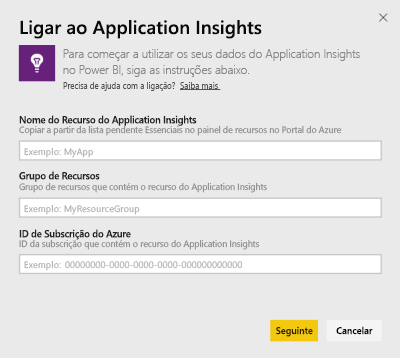
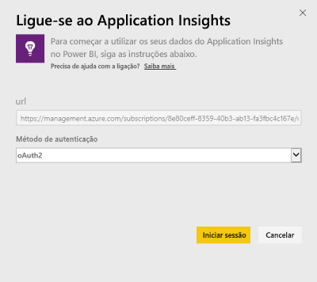
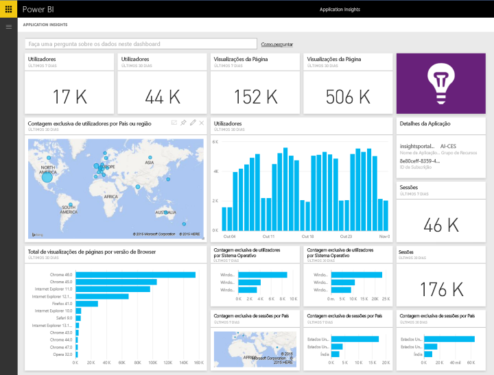
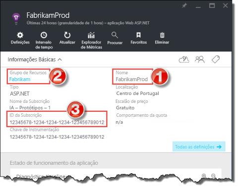
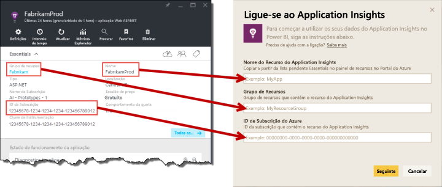

# Ligue-se ao Application Insights com o Power BI
Use o Power BI para criar dashboards personalizados eficientes através da telemetria do [Application Insights](https://azure.microsoft.com/documentation/articles/app-insights-overview/). Veja a telemetria da sua aplicação de novas maneiras. Combine métricas de várias aplicações ou serviços componentes num único dashboard. Esta primeira versão do pacote de conteúdos do Power BI para o Application Insights inclui widgets de métricas comuns relacionadas com a utilização, como utilizadores ativos, exibição de página, sessões, versão do browser e do SO e distribuição geográfica de utilizadores num mapa.

Ligue-se ao [pacote de conteúdos do Application Insights para o Power BI](https://app.powerbi.com/getdata/services/application-insights).

>[!NOTE]
>É necessário aceder ao painel de visão geral do Application Insights da aplicação no Portal de Pré-Visualização do Azure para ligar-se. Mais detalhes sobre os requisitos abaixo.

## Como se ligar
1. Selecione **Obter Dados** na parte inferior do painel de navegação esquerdo.
   
    
2. Na caixa **Serviços**, selecione **Obter**.
   
    
3. Selecione **Application Insights**  >  **Obter**.
   
    
4. Forneça os detalhes da aplicação à qual pretende ligar-se, incluindo **Nome de Recurso do Application Insights**, **Grupo de Recursos** e **ID da Subscrição**. Veja [Encontrar os parâmetros do Application Insights](#FindingAppInsightsParams) abaixo para obter mais detalhes.
   
        
5. Selecione **Iniciar Sessão** e siga os ecrãs para ligar-se.
   
    
6. O processo de importação é iniciado automaticamente. Quando concluído, é mostrada uma notificação e um novo dashboard, relatório e conjunto de dados aparecerão no Painel de Navegação marcados com um asterisco.  Selecione o dashboard para ver os seus dados importados.
   
    

**E agora?**

* Experimente [fazer uma pergunta na caixa de Perguntas e Respostas](power-bi-q-and-a.md) na parte superior do dashboard
* [Altere os mosaicos](service-dashboard-edit-tile.md) no dashboard.
* [Selecione um mosaico](service-dashboard-tiles.md) para abrir o relatório subjacente.
* Embora o seu conjunto de dados seja agendado para atualizações diárias, pode alterar o agendamento de atualização ou tentar atualizá-lo a pedido através de **Atualizar Agora**

## O que está incluído
O pacote de conteúdos do Application Insights inclui as tabelas e as métricas seguintes:  

    ´´´
    - ApplicationDetails  
    - UniqueUsersLast7Days   
    - UniqueUsersLast30Days   
    - UniqueUsersDailyLast30Days  
    - UniqueUsersByCountryLast7Days  
    - UniqueUsersByCountryLast30Days   
    - PageViewsDailyLast30Days   
    - SessionsLast7Days   
    - SessionsLast30Days  
    - PageViewsByBrowserVersionDailyLast30Days   
    - UniqueUsersByOperatingSystemLast7Days   
    - UniqueUsersByOperatingSystemLast30Days    
    - SessionsDailyLast30Days   
    - SessionsByCountryLast7Days   
    - SessionsByCountryLast30Days   
    - PageViewsByCountryDailyLast30Days  
    ´´´ 

## Parâmetros de localização
O Nome do Recurso, Grupo de Recursos e o ID da Subscrição podem ser encontrados no Portal do Azure. A seleção do Nome abrirá uma vista detalhada, e poderá usar o menu pendente Essenciais para encontrar todos os valores necessários.

Copie e cole-os nos campos no Power BI:

## Próximos passos
[Introdução ao Power BI](service-get-started.md)

[Obter dados no Power BI](service-get-data.md)

