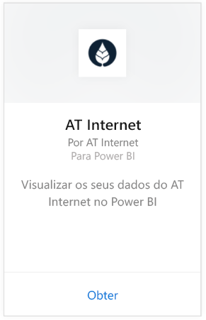
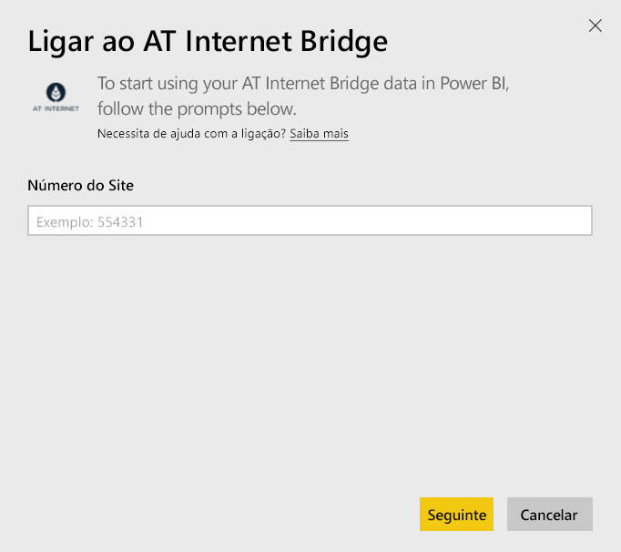
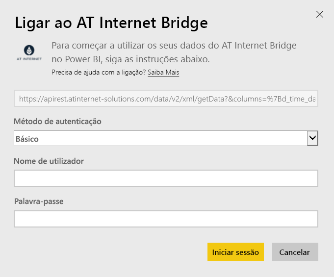

# Ligue-se ao AT Internet Bridge com o Power BI
O AT Internet ajuda-o extrair o valor imediato de seus dados com a sua plataforma analítica digital unificada, o Analytics Suite. O pacote de conteúdos do AT Internet Bridge para o Power BI inclui dados sobre visitas, origens, localização e dispositivos para seu site.

Ligue-se ao [pacote de conteúdo do AT Internet Bridge](https://app.powerbi.com/getdata/services/at-internet-bridge) para o Power BI.

## Como se ligar
1. Selecione **Obter Dados** na parte inferior do painel de navegação esquerdo.
   
    
2. Na caixa **Serviços**, selecione **Obter**.
   
    
3. Selecione **AT Internet Bridge** \> **Obter**.
   
   
4. Especifique o número do site do AT Internet ao qual se quer ligar.
   
   
5. Selecione **Básico** como Mecanismo de Autenticação, forneça nome de utilizador e palavra-passe do AT Internet e clique em **Iniciar Sessão**.
   
   
6. Clique em **Conectar** para iniciar o processo de importação. Quando concluído, um novo dashboard, relatório e modelo aparecem no Painel de Navegação. Selecione o dashboard para ver os seus dados importados.
   
    

**O que se segue?**

* Experimente [fazer uma pergunta na caixa de Perguntas e Respostas](power-bi-q-and-a.md) na parte superior do dashboard
* [Altere os mosaicos](service-dashboard-edit-tile.md) no dashboard.
* [Selecione um mosaico](service-dashboard-tiles.md) para abrir o relatório subjacente.
* Embora o seu conjunto de dados seja agendado para atualizações diárias, pode alterar o agendamento de atualização ou tentar atualizá-lo a pedido através de **Atualizar Agora**

## O que está incluído
Este pacote de conteúdos contém dados dos últimos 45 dias nas tabelas seguintes:  

    - Conversão  
    - Dispositivos  
    - Localização  
    - Origens  
    - Visitas global  

## Próximos passos
[Introdução ao Power BI](service-get-started.md)

[Power BI - Conceitos Básicos](service-basic-concepts.md)

